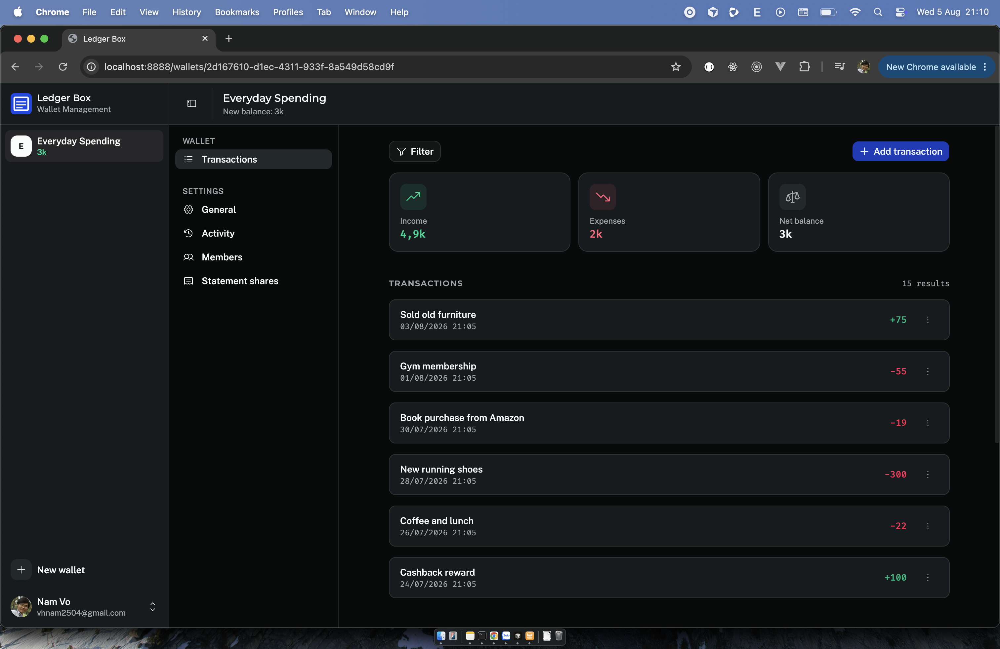
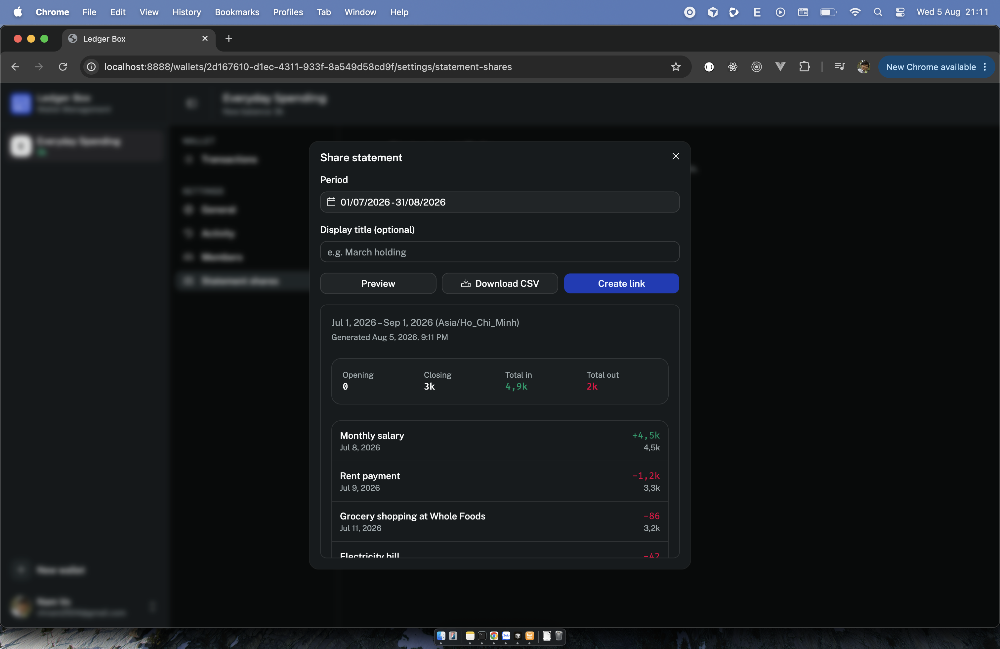

# Ledger Box

A ledger for money you hold on behalf of other people.

Most personal finance apps answer "what did I spend it on". Ledger Box answers a
different question: **how much is in this wallet right now, and can I account for every
change to it?** It's built for the person in the middle — someone holding a shared pot of
money and answerable to the people who put it there.

## The situation it's built for

Someone funds a wallet. You hold the money and spend it on their behalf. A third person
receives some of it. Everyone eventually wants the same thing: a clear account of what
came in, what went out, and what's left.

Ledger Box gives you three ways to answer that:

- **You** record income, expenses, and transfers, and attach receipts to any of them.
- **The recipient** gets a viewer account and checks the wallet themselves, so they don't
  have to ask you every time.
- **The funder** gets a statement link — a read-only web page, no account needed, showing
  opening balance, every transaction with a running balance, and closing balance. The
  numbers are frozen at the moment you generate it, so what they see today is what they'll
  see next month.

## Features

**Wallets** — multiple wallets, each with its own balance, timezone, and members.

**Transactions** — income and expenses with a user-set date, editable and soft-deleted,
filtered by period and sorted, with file attachments stored in Cloudflare R2.

**Transfers** — move money between two wallets as a linked expense/income pair.

**Statements** — opening balance, running balance per row, closing balance, and period
totals, computed in the wallet's timezone. Exportable as CSV.

**Statement links** — share a statement publicly without requiring an account. Links are
scoped to one wallet and one period, expire by default, can be revoked at any time, and
record when they were last opened.

**Members** — invite people by email as `viewer` (read-only) or `manager` (read/write).
Invites are sent by email and activate when the invited person signs in.

**Activity log** — an owner-only record of who changed what, so a balance never moves
without a trace.

## Design decisions

Some things are deliberately absent. If you're evaluating this against other finance
apps, these are the trade-offs:

**No spending categories or tags.** The transaction description is free text and carries
that information. Categories add friction at entry time and a taxonomy to maintain, and
this project cares about balances and accountability rather than spending analysis.

**Statements are snapshots, not live views.** A statement is a document you hand to
someone, so its numbers are frozen when it's generated and labelled with that timestamp.
Correcting something means issuing a new statement, not silently changing an old one.

**Soft deletes everywhere.** Wallets, transactions, and members are never hard-deleted,
so a balance can always be reconciled against its history. Attachments are the one
exception — deleting one removes the file from object storage permanently.

**Timezone lives on the wallet.** Period boundaries are computed server-side from the
wallet's timezone rather than the viewer's clock, so "this month" means the same thing to
everyone looking at the same wallet.

## Status

Ledger Box is built and maintained for the author's own use, and shared here as a
showcase. It is not currently open to issues or pull requests. The source is published
for reference only, all rights reserved.

---

## Structure

- [`apps/ledger-box`](apps/ledger-box/README.md) — the app (TanStack Router, better-auth, Postgres via Kysely, Netlify Functions)
- [`apps/storybook`](apps/storybook/README.md) — component stories for `@vhnam/ui`
- [`packages/ui`](packages/ui/README.md) — shared UI components (shadcn-style, base-ui + Tailwind)
- [`packages/utils`](packages/utils/README.md) — shared currency/date formatting utilities (date-fns)

## Documentation

- [Getting started tutorial](docs/tutorials/getting-started-with-ledger-box.md) — walkthrough for end users
- [Development guideline](docs/guides/development.md) — setup, running the app, and coding conventions
