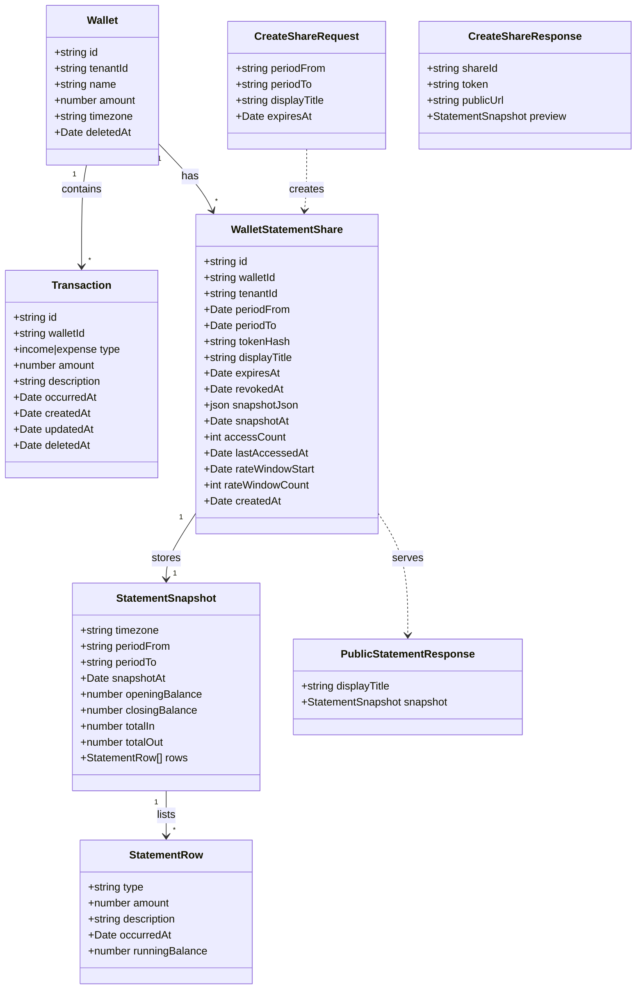

# Transaction Event Dates, Wallet Timezone, and Shareable Statement Links

## Requirements

1. Establish correct per-period transaction semantics so wallet owners can trust filtered totals and future statements — introduce a user-editable event date (`occurred_at`) and an authoritative wallet timezone for all period boundaries.
2. Fix existing filter/summary incorrectness for UTC+7 users by computing period bounds server-side only, using `occurred_at` instead of `updated_at`.
3. Fix existing summary-card money-correctness bug: `useWalletSummary` computes totals by paginating the transaction list at `pageSize: 100` and reducing over only the returned page, silently truncating totals for any period with more than 100 transactions. This must compute totals server-side (or from the full unpaginated period) so summary cards, filters, and statements agree for the same wallet and period.
4. Enable wallet owners to generate revocable, optionally expiring, read-only statement links for a single wallet and date range — without sign-in — so beneficiaries can view a stable account of money held on their behalf.
5. Preserve all-time wallet balances, tenancy scoping on authenticated APIs, soft-delete rules, and money-handling invariants; do not depend on `wallet_member` read access.

**Delivery order:** Phase 1 (`0004`) must ship and deploy before Phase 2 (`0005`). Share-link snapshots must use `occurred_at` + `wallet.timezone` from day one. The summary-cards truncation fix (Requirement 3) ships in Phase 1 alongside the timezone/`occurred_at` fixes — it is a pre-existing money-correctness bug surfaced by Safeguard "period filters, summary cards, and statements use identical bounds," not share-link scope.

---

## Entities

---

## Approach

1. **Data model (Phase 1 — migration `0004`):**
   - Add `transaction.occurred_at timestamptz not null`, backfill `occurred_at = created_at`.
   - Add `wallet.timezone text not null default 'Asia/Ho_Chi_Minh'`.
   - Partial index on `(wallet_id, occurred_at)` where `deleted_at is null`.
   - Extend Kysely `schema.ts` only; do not alter existing migration files.

2. **Period resolution (Phase 1):**
   - Replace `netlify/functions/lib/date-ranges.ts` with a timezone-aware resolver in `#/lib/period-bounds.ts` (or equivalent under `src/lib/`), callable from Netlify functions via `#/`.
   - Input: `wallet.timezone`, filter preset enum OR `from`/`to` as `yyyy-MM-dd` calendar strings.
   - Output: `{ start: Date, endExclusive: Date }` as UTC instants for SQL `WHERE occurred_at >= start AND occurred_at < endExclusive` (half-open interval). An inclusive upper bound on a `timestamptz` column silently drops rows falling in the sub-second gap between one period's inclusive end and the next period's start; half-open bounds close that gap and make adjacent periods partition the timeline exactly.
   - For a calendar-day/month preset or custom range ending on day `D`, `endExclusive` is the start of day `D+1` in `wallet.timezone` — never `D` at 23:59:59.999.
   - Client stops converting custom ranges to ISO instants before API calls; sends calendar dates only.

3. **Statement computation (shared — Phase 1 lib, Phase 2 consumer):**
   - New `#/lib/statement.ts` (name as needed): given `walletId`, period bounds, timezone — compute opening balance (sum of non-deleted transactions with `occurred_at < periodStart`), period rows ordered `occurred_at ASC, id ASC`, running balance per row, closing balance, total in/out.
   - Exclude `deleted_at IS NOT NULL` transactions.
   - Do not use paginated `GET /transactions` for statements.

4. **Share links (Phase 2 — migration `0005`):**
   - Table `wallet_statement_share` per `docs/decisions/share-link.md` Decisions 1–8.
   - Token: `crypto.getRandomValues(32)` → base64url; store SHA-256 hash only.
   - Snapshot JSON persisted at link creation after mandatory owner preview.
   - Public `GET /api/public/statements/:token` — separate handler, no `getTenantId`; authorize via token hash lookup only.
   - Owner APIs under `/api/wallets/:walletId/statement-shares` with `requireOwnedWallet`.
   - Public frontend route `/statement/$token` outside `/_app` (sibling to `/auth`).

5. **Security and abuse:**
   - Authenticated routes unchanged — always `requireOwnedWallet` / `requireOwnedTransaction`.
   - Public route never calls tenant-scoped wallet/transaction list APIs.
   - HTTP responses: 404 invalid token; 410 revoked / expired / wallet deleted; 429 rate limit exceeded.
   - Do not log raw tokens. Set `Referrer-Policy: no-referrer` on public statement page.

6. **UX and communication:**
   - Default sort `occurredAt` desc; list displays `occurredAt` formatted in wallet timezone.
   - Dismissible one-time banner on wallet page after `0004` deploy explaining period semantics change.
   - Create-link flow: preview → confirm → show copyable URL once.

---

## Structure

### Layering (ledger-box conventions)

1. **Migrations** — `apps/ledger-box/src/lib/db/migrations/0004_*.ts`, `0005_*.ts`
2. **Schema / types** — `apps/ledger-box/src/lib/db/schema.ts`
3. **Domain libs** — `#/lib/period-bounds.ts`, `#/lib/statement.ts`, `#/lib/share-token.ts` (hash/generate)
4. **Netlify functions** — `apps/ledger-box/netlify/functions/` (existing wallet handlers updated; new `public-statement.mts`, `wallet-statement-shares.mts`, `wallet-statement-share.mts`)
5. **Valibot schemas** — `apps/ledger-box/src/schemas/*.schema.ts`
6. **React Query** — `apps/ledger-box/src/queries/statement-shares/`
7. **Feature modules** — `apps/ledger-box/src/modules/wallets/statement-shares/`, `apps/ledger-box/src/modules/statement/`
8. **Routes** — `routes/statement/$token.tsx` (public); wallet settings or actions entry for link management

### Dependencies

1. `wallet-transactions.mts` → `period-bounds` + `wallet.timezone` + filter on `occurred_at`
2. `wallet-transaction.mts` (PATCH) → accept optional `occurredAt` date; do not change `occurred_at` when omitted
3. `wallet-transactions.mts` (POST) → accept `occurredAt`; default today in wallet TZ
4. `wallet-transfer.mts` → set both legs' `occurred_at` from request date (default today in wallet TZ)
5. `statement-shares` create handler → `statement.ts` compute → persist snapshot → return raw token once
6. `public-statement.mts` → hash token → load share → validate active + wallet not deleted → rate limit → return `snapshot_json`
7. Public `StatementPage` → fetch public API only

### Inheritance / extension

- Extend existing `TransactionDto` with `occurredAt`; keep `createdAt`/`updatedAt` for audit.
- Extend `WalletDto` with `timezone` (optional in list responses if not needed client-side for v1 — wallet detail or embed in transaction meta).
- Do not wrap `List<Transaction>` in new entity types; extend existing DTOs.

---

## Operations

### Phase 1 — Migration `0004_add_transaction_occurred_at_and_wallet_timezone`

1. **Responsibility:** Add columns and index; backfill data.
2. **Up:**
   - `ALTER TABLE wallet ADD COLUMN timezone text NOT NULL DEFAULT 'Asia/Ho_Chi_Minh'`
   - `ALTER TABLE transaction ADD COLUMN occurred_at timestamptz`
   - `UPDATE transaction SET occurred_at = created_at WHERE occurred_at IS NULL`
   - `ALTER TABLE transaction ALTER COLUMN occurred_at SET NOT NULL`
   - Create partial index `transaction_wallet_id_occurred_at_index ON transaction (wallet_id, occurred_at) WHERE deleted_at IS NULL`
3. **Down:** Drop index, drop columns in reverse order.
4. **Constraints:** No change to `wallet.amount` or transaction rows beyond new column values.

---

### Phase 1 — Update Kysely schema

1. **File:** `apps/ledger-box/src/lib/db/schema.ts`
2. Add `timezone: string` to `WalletTable`.
3. Add `occurredAt` to `TransactionTable`.

---

### Phase 1 — Create `period-bounds` library

1. **File:** `apps/ledger-box/src/lib/period-bounds.ts`
2. **Exports:**
   - `resolvePeriodBounds(timezone: string, filter: FilterOptionValue, from?: string, to?: string, referenceNow?: Date): { start: Date; endExclusive: Date } | null`
   - `calendarDateToOccurredAtStart(timezone: string, yyyyMmDd: string): Date` — start of that calendar day in zone as UTC instant
   - `formatDateInTimezone(date: Date, timezone: string, pattern?: string): string` — for display helpers
3. **Logic:**
   - Use `@date-fns/tz` (`TZDate`, `fromZonedTime`) — add to catalog if not present.
   - Presets: today / this-month / last-month computed in `timezone`, not server UTC.
   - Custom range: interpret `from`/`to` as calendar dates in `timezone`; `to` is inclusive from the caller's perspective but resolved internally to `endExclusive = startOfDay(to + 1 day)`.
   - Return `null` for `all-time` filter (no date predicate).
   - Every consumer of the returned bounds object (transaction list filter, `useWalletSummary` fix, `buildStatement`) must read `.endExclusive` and use `<`, never `<=`. There is no remaining inclusive-upper-bound code path after this change.
4. **Delete or thin** `netlify/functions/lib/date-ranges.ts`; re-export from `#/lib/period-bounds` if needed for gradual migration.

---

### Phase 1 — Create `statement` computation library

1. **File:** `apps/ledger-box/src/lib/statement.ts`
2. **Export:** `buildStatement(db, walletId: string, bounds: { start: Date; endExclusive: Date } | null, timezone: string): Promise<StatementSnapshot>` — `bounds === null` means all-time (no period predicate; opening balance is 0 and every non-deleted transaction is a period row).
3. **Logic:**
   - Load wallet; fail if soft-deleted.
   - Opening: sum `income - expense` for transactions where `wallet_id = ? AND deleted_at IS NULL AND occurred_at < bounds.start` (0 when `bounds` is null).
   - Period rows: `WHERE deleted_at IS NULL AND (bounds IS NULL OR (occurred_at >= start AND occurred_at < endExclusive)) ORDER BY occurred_at ASC, id ASC` — no pagination limit; always the full period, never a paginated fetch (this is the same class of bug as the summary-card truncation fixed in Requirement 3 — `buildStatement` must not reuse the paginated transaction-list query).
   - Running balance: start at opening; each income `+amount`, expense `-amount`.
   - Closing = opening + totalIn - totalOut; assert equals last running balance.
   - **Reconciliation check (all-time period only):** when `bounds === null`, closing balance must equal `wallet.amount`. On mismatch, log a structured warning with `walletId`, `computedClosingBalance`, and `wallet.amount` — do not throw, do not block statement generation or link creation. This belongs in `buildStatement` itself (not the caller) so both the owner preview path and the persisted-snapshot path get the check for free, and so it fires the moment the two numbers diverge rather than only when someone happens to compare them. A mismatch indicates a bug elsewhere (e.g. a balance-mutation path that didn't go through the transaction insert/edit/delete flow) and is a signal for investigation, not a reason to fail the user-facing request.
   - Snapshot includes `timezone`, ISO date strings for period labels, `snapshotAt: new Date()`.
4. **Row fields exposed:** `type`, `amount`, `description`, `occurredAt` (ISO), `runningBalance` — no transaction id on public snapshot (optional: include id for owner preview only).

---

### Phase 1 — Update transaction list API

1. **File:** `netlify/functions/wallet-transactions.mts`
2. **GET changes:**
   - Load wallet (via `requireOwnedWallet`) including `timezone`.
   - Replace `updated_at` filter with `occurred_at` using `resolvePeriodBounds`.
   - Allow `sortBy=occurredAt` (add to validation); default sort `occurredAt desc`.
   - Select `occurredAt` in response.
3. **POST changes:**
   - Accept `occurredAt` as optional `yyyy-MM-dd` in body. When provided, convert to start-of-day instant in wallet timezone (the user picked a calendar date, not a time — start-of-day is the only defensible instant for an explicit date). When **omitted**, default `occurred_at` to the **current instant** (`now()`), not start-of-day: the backfill sets `occurred_at = created_at` for existing rows, which preserves real intraday times; defaulting new rows to 00:00 would make old and new same-day transactions sort inconsistently (new rows always first or always last within a day, depending on tiebreak) even though both represent "today." Using `now()` for the default keeps new and backfilled rows on a consistent same-day ordering basis.
   - Set `created_at`/`updated_at` to now; set `occurred_at` per the rule above.
   - Balance update unchanged.

---

### Phase 1 — Update transaction edit API

1. **File:** `netlify/functions/wallet-transaction.mts`
2. **PATCH:**
   - Accept optional `occurredAt` (`yyyy-MM-dd`) in body.
   - If omitted: update amount/description only; bump `updated_at`; **do not** change `occurred_at`.
   - If provided: convert via wallet timezone; update `occurred_at`; bump `updated_at`.
   - Amount change logic unchanged (reverse old contribution, apply new).

---

### Phase 1 — Update transfer API

1. **File:** `netlify/functions/wallet-transfer.mts`
2. Accept optional `occurredAt` date; apply same instant to both inserted transactions.
3. Default: current instant (`now()`), matching the POST-transaction default rule — not start-of-day. Explicit `occurredAt` still resolves to start-of-day in the source wallet's timezone.

---

### Phase 1 — Valibot schemas

1. **`add-transaction.schema.ts`:** add optional `occurredAt: iso date string`.
2. **`edit-transaction.schema.ts`:** add optional `occurredAt`.
3. **`transfer-money.schema.ts`:** add optional `occurredAt`.
4. **`sort-options.ts`:** add `OCCURRED_AT: 'occurredAt'`; set `DEFAULT_SORT_BY` to `occurredAt`.
5. **`wallet-transaction-search.schema.ts`:** no enum change for filter; defaults pick up new sort.

---

### Phase 1 — Frontend: wallet actions and forms

1. **`wallet-actions.actions.tsx`:** Remove `startOfDay`/`endOfDay` ISO conversion in `toTransactionQuery`; pass `from`/`to` as `yyyy-MM-dd` only.
2. **Add-transaction dialog:** Date picker (calendar date); field starts **empty/unset** so the server applies the `now()` default described above; only send `occurredAt` in the POST body when the user explicitly picks a date (which the form treats as a deliberate backdate/forward-date and resolves to start-of-day).
3. **Edit-transaction form:** Date picker pre-filled from `transaction.occurredAt`; send only when changed.
4. **Transfer dialog:** Optional date field; same default.
5. **`wallet-transaction.tsx` / detail sheet:** Display `occurredAt` instead of `createdAt` (show `createdAt` only in audit detail if desired — v1: occurred only).
6. **`transaction.dto.ts`:** Add `occurredAt: string`.
7. **One-time banner:** localStorage key `ledger-box-period-semantics-v1`; dismissible message on wallet page.

---

### Phase 1 — Fix wallet summary totals truncation

1. **Files:** `apps/ledger-box/src/modules/wallets/wallet-summary/wallet-summary.actions.tsx`
2. **Problem:** `useWalletSummary` fetches page 1 of `useTransactions` at `pageSize: SUMMARY_PAGE_SIZE` (100) and reduces income/expense/net balance over only `data.items`, ignoring `data.total`. Any period with more than 100 transactions silently under-reports summary totals, and those totals disagree with the period-filtered list total and with a statement built over the same wallet and period.
3. **Fix:** Compute summary totals from a full-period aggregate, not a paginated page. Either (a) add a lightweight server aggregate (sum income, sum expense, count) scoped by `wallet_id`, `occurred_at` bounds via `resolvePeriodBounds`, and `deleted_at IS NULL`, returned from a small endpoint or an existing endpoint's response envelope, or (b) reuse `buildStatement`'s row-scanning logic (Phase 1 statement library) against the full period and take `totalIn`/`totalOut`/`closingBalance - openingBalance` instead of paginating. Prefer (a) for the list/summary path to avoid computing per-row running balances the summary UI doesn't need; `buildStatement` remains the source of truth for the statement feature specifically.
4. Delete `SUMMARY_PAGE_SIZE` and the client-side reduce-over-`items` once the aggregate is wired in.
5. **Verification:** seed a wallet with >100 transactions in one period; confirm summary cards, the filtered list total, and a statement over the same bounds report identical totals.

---

### Phase 1 — CSV import scripts

1. **`scripts/import-bank-csv.ts`:** set `occurredAt: transaction.date` on insert/update.
2. **`scripts/import-csv.ts`:** `occurredAt: transaction.occurred_at ?? transaction.created_at`.
3. Wallets: rely on DB default `timezone` or set explicitly.

---

### Phase 2 — Migration `0005_create_wallet_statement_share`

1. **Table `wallet_statement_share`:**
   - `id` text PK default `gen_random_uuid()`
   - `wallet_id` FK → wallet
   - `tenant_id` text not null
   - `period_from` date not null (calendar dates in wallet TZ at creation)
   - `period_to` date not null
   - `token_hash` text not null unique
   - `display_title` text nullable (max 80 enforced in app)
   - `expires_at` timestamptz nullable (default now + 90 days when not provided)
   - `revoked_at` timestamptz nullable
   - `snapshot_json` jsonb not null
   - `snapshot_at` timestamptz not null
   - `access_count` int not null default 0
   - `last_accessed_at` timestamptz nullable
   - `rate_window_start` timestamptz nullable
   - `rate_window_count` int not null default 0
   - `created_at` timestamptz not null default now()
2. Index on `wallet_id` where `revoked_at IS NULL` for owner list.

---

### Phase 2 — Share token helpers

1. **File:** `apps/ledger-box/src/lib/share-token.ts`
2. **`generateShareToken(): { raw: string; hash: string }`**
   - 32 bytes `crypto.getRandomValues` → base64url encode raw
   - `hash = SHA-256(raw)` hex or base64 stored in DB
3. **`hashShareToken(raw: string): string`**
4. **`verifyTokenConstantTime(raw, storedHash): boolean`**

---

### Phase 2 — Owner statement-share APIs

1. **`GET /api/wallets/:walletId/statement-shares`** — `wallet-statement-shares.mts`
   - Auth + `requireOwnedWallet`
   - Return list: id, periodFrom, periodTo, displayTitle, expiresAt, revokedAt, snapshotAt, accessCount, lastAccessedAt, isActive (computed), publicUrl path suffix only **without** token (or no URL — token shown once at create)

2. **`POST /api/wallets/:walletId/statement-shares`** — same file or `wallet-statement-share.mts`
   - Body: `periodFrom`, `periodTo`, optional `displayTitle`, optional `expiresAt` (null = explicit no expiry only if owner opts in; default 90 days)
   - Resolve bounds via `period-bounds` + wallet timezone
   - Call `buildStatement` for preview payload if `?preview=true` query — return snapshot without persisting
   - On confirm: generate token, insert row with `snapshot_json`, return `{ shareId, token, publicUrl }` once

3. **`DELETE /api/wallets/:walletId/statement-shares/:shareId`** — set `revoked_at = now()`

---

### Phase 2 — Public statement API

1. **`GET /api/public/statements/:token`** — `public-statement.mts`
2. **Logic:**
   - Hash incoming token; lookup by `token_hash`
   - 404 if not found
   - 410 if `revoked_at` set → "This link has been revoked."
   - 410 if `expires_at` past → "This link has expired."
   - Join wallet; 410 if `wallet.deleted_at` set → "This statement is no longer available."
   - Rate limit: if `rate_window_start` within 60s and `rate_window_count >= 60` → 429; else increment/window reset
   - On success: increment `access_count`, set `last_accessed_at`
   - Response: `{ displayTitle, snapshot }` from stored JSON — **no recompute**
   - Never return wallet name, tenant id, wallet id, user info, attachment urls

---

### Phase 2 — Frontend: public statement page

1. **Route:** `apps/ledger-box/src/routes/statement/$token.tsx` — **not** under `_app`
2. **Module:** `modules/statement/statement-public-page.tsx`
3. Fetch `GET /api/public/statements/:token` on load
4. Render: title (`displayTitle` or "Account statement"), period + timezone label, opening/closing, total in/out, table with running balance
5. Use `@vhnam/utils` currency formatters; date format in snapshot timezone
6. Error states map to 404/410 messages from API body
7. No auth client, no sidebar, no links to other wallets

---

### Phase 2 — Frontend: owner link management

1. **Entry point:** Wallet settings section or wallet actions — "Share statement"
2. **Flow:**
   - Pick period (reuse date range picker; calendar dates)
   - Optional display title, optional expiry override
   - **Preview** button → POST preview → render read-only statement
   - **Create link** → POST confirm → show copyable URL + warning "shown once"
   - List active/expired/revoked links with revoke action and last accessed
3. **React Query:** `useStatementShares`, `usePreviewStatementShare`, `useCreateStatementShare`, `useRevokeStatementShare`

---

### Phase 2 — Changelog and docs

1. Per-merge changelog files + root `CHANGELOG.md` entries (two merges or one if shipped together — prefer **two MRs**: mr-08 transaction dates + timezone + summary-totals truncation fix, mr-09 statement share). The summary-totals fix ships in mr-08 alongside `occurred_at`/timezone — it's part of making Safeguard 1 ("identical bounds") actually true, not a separate cleanup MR.
2. Update `AGENTS.md` API table with new routes.

---

## Norms

1. **Imports:** `#/` in app and UI; `#/lib/...` from Netlify functions; `./lib/...` only for co-located function helpers.
2. **Forms:** Formisch + Valibot; schemas in `src/schemas/`.
3. **Toasts:** `toast.add({ title, type })` on owner mutations.
4. **Tenancy:** `requireOwnedWallet` on every owner share endpoint; never add optional auth to existing wallet handlers.
5. **Money:** Statement computation read-only; no balance mutations in share flow.
6. **Migrations:** `0004` then `0005`; never edit merged migrations.
7. **Currency:** `formatCurrency` / `formatSignedCurrency` from `@vhnam/utils`.
8. **Modules:** `*.tsx` + `*.actions.tsx` split for dialogs and pages.
9. **Queries:** TanStack Query in `src/queries/`; invalidate `['wallets', walletId, 'statement-shares']` on create/revoke.
10. **Errors:** Netlify functions return plain text or JSON `{ message }` consistent with existing handlers; map HTTP status explicitly on public endpoint.

---

## Safeguards

1. **Functional**
   - All-time `wallet.amount` unchanged by `0004`/`0005`.
   - Period filters, summary cards, and statements use identical `occurred_at` + timezone bounds, computed as half-open intervals (`>= start AND < endExclusive`) with no remaining inclusive-upper-bound code path, and none of the three truncates results at a fixed page size — this is what makes "identical bounds" actually produce identical totals (see Requirement 3 / Phase 1 summary-totals fix).
   - Soft-deleted transactions excluded from statements and period queries.
   - Snapshot frozen at link creation; public GET never recomputes.
   - `wallet.name` never on public page; optional `display_title` only.
   - Mandatory preview before link creation.
   - Revocation effective on next request; expired and revoked return distinct 410 messages.
   - `buildStatement` reconciliation check: for an all-time period, closing balance must equal `wallet.amount`; mismatch is logged (wallet id + both values) but never blocks statement generation or link creation.

2. **Security**
   - 256-bit token entropy; only hash stored.
   - Public handler isolated; no `getTenantId` bypass on existing routes.
   - 404 for invalid token; no timing oracle on hash compare.
   - No raw tokens in logs.
   - `Referrer-Policy: no-referrer` on public page.

3. **Abuse**
   - 60 requests per 60 seconds per share row → 429.
   - `access_count` / `last_accessed_at` for owner visibility.

4. **Compatibility**
   - URL `sortBy=createdAt|updatedAt` still accepted.
   - Filter enum values unchanged in URL.
   - Custom `from`/`to` remain `yyyy-MM-dd`.

5. **Data**
   - Backfill `occurred_at = created_at` only; document that edited rows may shift periods vs old `updated_at` filter.
   - New transactions/transfers default `occurred_at` to the current instant when the user does not pick a date; explicit date picks resolve to start-of-day in wallet timezone. This keeps intraday ordering consistent between backfilled rows (real `created_at` times) and new rows.
   - Default link expiry 90 days when owner does not set one.
   - CSV imports populate `occurred_at` per decision record.

6. **Out of scope (v1)**
   - Per-wallet timezone settings UI (default `Asia/Ho_Chi_Minh`).
   - `wallet_member` read access.
   - Hiding descriptions on shared statements.
   - Wallet restoration behavior beyond 410 on deleted wallet.

7. **Verification**
   - `vp check && vp test` before complete.
   - Manual: preset filter near ICT midnight; edit transaction amount without date change — period unchanged; create/revoke link; public view without session; 410 after revoke; seed >100 transactions in a period and confirm summary cards, filtered list, and statement totals match; confirm no transaction lands in the sub-second gap between two adjacent periods (half-open bounds); confirm an all-time statement's closing balance matches `wallet.amount` and that a deliberately induced mismatch logs without failing the request.
