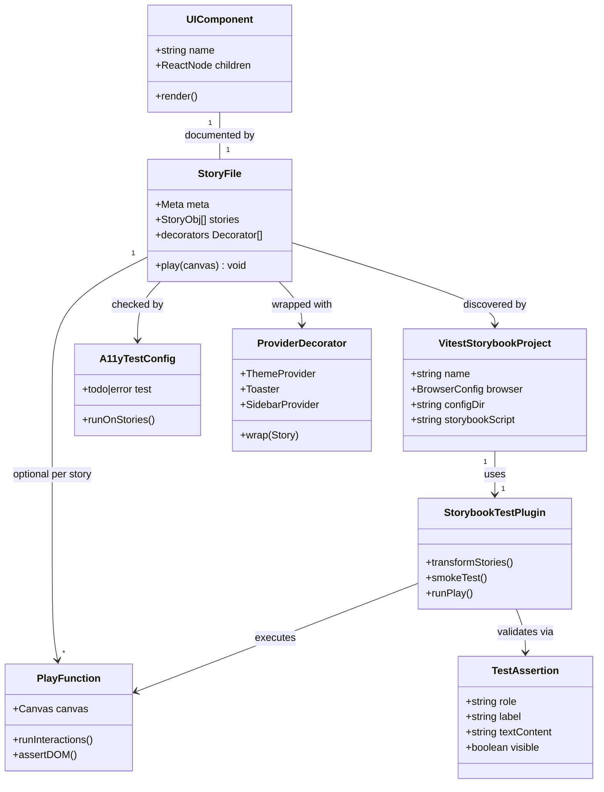

# UI Component Tests via Storybook

## Requirements

1. Establish automated, headless test coverage for `@vhnam/ui` so component regressions are caught before merge — without duplicating render setup outside Storybook.
2. Wire tests into the existing Vite+ CI gate (`vp test`) so `vp check && vp test` validates UI components alongside lint and typecheck.
3. Cover all 33 story-backed components with at minimum render smoke tests; add interaction tests for components with non-trivial user behavior.
4. Enforce accessibility as a test gate via the already-installed `@storybook/addon-a11y`, replacing the current non-blocking `todo` mode.
5. Preserve the presentation-only boundary — no `apps/ledger-box` imports, no wallet/tenant/auth context in UI tests.
6. Extend the existing "component + story" convention so new UI work includes test coverage in the same change.

---

## Entities

---

## Approach

1. **Test infrastructure (Storybook Vitest addon):**
   - Install `@storybook/addon-vitest`, `@vitest/browser-playwright`, and `playwright` as dev dependencies in `apps/storybook` (catalog-pinned in `pnpm-workspace.yaml`).
   - Register `@storybook/addon-vitest` in `.storybook/main.ts` alongside existing `addon-a11y` and `addon-docs`.
   - Create `apps/storybook/vitest.config.ts` using Vitest 4 `test.projects` with `storybookTest()` plugin from `@storybook/addon-vitest/vitest-plugin`, browser mode via `playwright({})`, headless Chromium.
   - Reuse the same Vite plugins as Storybook (`@vhnam/ui/vite`, `@tailwindcss/vite`, `@vitejs/plugin-react`) in the Vitest merge config so `#/` aliases and Tailwind classes resolve identically to dev Storybook.
   - Add `apps/storybook/.storybook/vitest.setup.ts` applying `@storybook/addon-vitest/internal/setup-file` (per Storybook docs) and any project-specific globals.
   - Add `"test": "vitest run --project=storybook"` script to `apps/storybook/package.json` so `vp run -r test` from root executes story tests.

2. **Coverage strategy (tiered):**
   - **Tier 1 — Smoke:** `@storybook/addon-vitest` automatically renders every story as a component test. No hand-written play function required for static components (`badge`, `separator`, `skeleton`, `spinner`, etc.).
   - **Tier 2 — Interaction:** Add `play` functions to stories for components with stateful or imperative behavior, using `expect`, `userEvent`, `within`, `waitFor` from `storybook/test`.
   - **Tier 3 — Accessibility:** Promote `parameters.a11y.test` from `'todo'` to `'error'` in `.storybook/preview.tsx` so a11y violations fail the Vitest run globally.

3. **Interaction test targets (priority components):**
   - `button` — click fires handler, disabled state prevents interaction.
   - `currency-input` — typing updates displayed formatted value; `onValueChange` receives raw numeric string.
   - `toast` — `toast.add` shows notification with title; variant stories show correct type indicator.
   - `dialog` / `sheet` — trigger opens overlay; content visible in document (portal); close button dismisses.
   - `select` — trigger opens listbox; item selection updates displayed value.
   - `date-picker` / `date-picker-range` — calendar opens; date selection updates trigger label (pin dates in play assertions).
   - `attachment` — state variants render expected title/description text.
   - `theme-provider` — theme toggle updates displayed current theme.
   - `sidebar` — trigger toggles sidebar visibility (assert at fixed desktop viewport).

4. **Test environment stability:**
   - Set consistent viewport in `preview.tsx` or `vitest.setup.ts` (e.g. 1280×720) to stabilize `useIsMobile` / sidebar behavior.
   - Wrap `ThemeProvider` with `defaultTheme="light"` and `enableSystem={false}` in global preview decorator to reduce a11y color-contrast variance.
   - Replace external `github.com/shadcn.png` URLs in `attachment.stories.tsx` with a local static fixture or data URI to eliminate network dependency in CI.
   - For `toast.promise` plays, use `waitFor` with reasonable timeout; do not test the full 2s delay story — test a shorter resolved promise or mock timer only if needed.
   - Portal components (dialog, popover, dropdown, sheet, toast): query with `within(document.body)` or screen-level `getByRole`, not canvas element only.

5. **Documentation and workflow:**
   - Update `apps/storybook/README.md` with test authoring guide (smoke vs play, running `pnpm --filter @vhnam/storybook test` and root `vp test`).
   - Update `packages/ui/README.md` "Adding a component" section: story + play function (or confirm smoke-only for static components).
   - Add brief note to root `AGENTS.md` Review Checklist that Storybook play functions are the UI test surface.

---

## Structure

### Package Boundaries

1. `packages/ui` — component source only; no test files added here.
2. `apps/storybook` — owns all test configuration, play functions, vitest config, and Storybook addons.
3. `packages/utils` — currency/date logic tested indirectly through `currency-input` plays; no direct test scope in this task.

### Configuration Chain

1. `pnpm-workspace.yaml` catalog — pins `@storybook/addon-vitest`, `@vitest/browser-playwright`, `playwright` versions aligned with Storybook 10.5.0.
2. `apps/storybook/.storybook/main.ts` — Storybook framework config; registers vitest, a11y, docs addons; `viteFinal` applies UI + Tailwind + React plugins.
3. `apps/storybook/.storybook/preview.tsx` — global decorators, a11y `test: 'error'`, viewport, theme defaults.
4. `apps/storybook/.storybook/vitest.setup.ts` — Vitest browser setup file referenced by vitest config.
5. `apps/storybook/vitest.config.ts` — Vitest project `storybook` with `storybookTest` plugin.
6. Root `vp test` — discovers and runs `@vhnam/storybook` test script via `vp run -r test`.

### Story File Pattern

1. `meta` block — unchanged (`title`, `component`, `layout`, `tags: ['autodocs']`).
2. `decorators` — component-specific providers (e.g. `Toaster` for toast stories); promote shared providers to preview when used by multiple stories.
3. `play` function — optional async function on `Story` export; receives `canvas` (and `step` if using step API).
4. Imports — `storybook/test` for assertions and user events; `@vhnam/ui/components/*` for components under test.

### Test Execution Flow

1. Developer runs `vp test` or `pnpm --filter @vhnam/storybook test`.
2. Vitest loads `apps/storybook/vitest.config.ts` project `storybook`.
3. `storybookTest` plugin transforms `src/stories/*.stories.tsx` into Vitest tests.
4. Each story: render smoke → run `play` if defined → run a11y audit (error mode).
5. Browser (headless Chromium via Playwright) executes tests; failures report story name and assertion.

---

## Operations

### Update Catalog — `pnpm-workspace.yaml`

1. Responsibility: Pin new test dependencies at workspace catalog level.
2. Add catalog entries:
   - `@storybook/addon-vitest`: version aligned with `storybook` catalog (`^10.5.0`)
   - `@vitest/browser-playwright`: version compatible with Vitest 4 (bundled via Vite+)
   - `playwright`: `^1.49.0` or latest stable compatible with `@vitest/browser-playwright`
3. Constraints: Match Storybook 10.5.x peer dependency ranges; do not downgrade existing catalog entries.

### Update Package — `apps/storybook/package.json`

1. Responsibility: Declare test dependencies and expose test script for recursive `vp run -r test`.
2. devDependencies: `@storybook/addon-vitest`, `@vitest/browser-playwright`, `playwright`, `vitest` (all `catalog:`).
3. scripts:
   - `"test": "vitest run"`
   - `"test:watch": "vitest"` (optional, for local dev)
4. Constraints: Keep existing `dev` and `build` scripts unchanged. Root `vite.config.ts` `test.projects` points at this package's vitest config.

### Create Vitest Config — `apps/storybook/vitest.config.ts`

1. Responsibility: Define the `storybook` Vitest project with browser mode and story discovery.
2. Logic:
   - Import `path`, `fileURLToPath` from Node; `defineConfig` from `vite-plus`; `playwright` from `vite-plus/test/browser-playwright` (Vite+ browser provider — preferred over importing `@vitest/browser-playwright` directly).
   - Import `storybookTest` from `@storybook/addon-vitest/vitest-plugin`.
   - Build Vite config with `tailwindcss()`, `ui()` from `@vhnam/ui/vite`, `react()`, and `storybookTest({ configDir, storybookScript: 'pnpm dev -- --no-open' })` — mirror `.storybook/main.ts` `viteFinal`.
   - Export a single project (`test.name: 'storybook'`) with browser mode (`enabled: true`, `provider: playwright()`, `headless: true`, Chromium instance) and `setupFiles: ['./.storybook/vitest.setup.ts']`.
   - Wire into root `vite.config.ts` via `test.projects: ['apps/storybook/vitest.config.ts']` so `vp test` discovers it.
3. Constraints: `storybookScript` must match the package's Storybook dev command; use `--no-open` to avoid browser popup in watch/debug mode. Package script is `"test": "vitest run"` (project identity comes from this config + root `projects`, not `--project=storybook`).

### Create Vitest Setup — `apps/storybook/.storybook/vitest.setup.ts`

1. Responsibility: Apply Storybook Vitest addon setup and project test globals.
2. Logic:
   - Import and apply `@storybook/addon-vitest/internal/setup-file` (per Storybook 10 docs).
   - Optionally set `globalThis` viewport or other browser globals if not handled in preview decorators.
3. Constraints: Keep file minimal; prefer preview decorators for React-specific setup.

### Update Storybook Main — `apps/storybook/.storybook/main.ts`

1. Responsibility: Register Vitest addon in Storybook.
2. Change `addons` array from `['@storybook/addon-a11y', '@storybook/addon-docs']` to `['@storybook/addon-a11y', '@storybook/addon-docs', '@storybook/addon-vitest']`.
3. Constraints: Do not remove existing `viteFinal` plugin chain.

### Update Storybook Preview — `apps/storybook/.storybook/preview.tsx`

1. Responsibility: Global test parameters, stable theme/viewport, shared decorators.
2. Changes:
   - Set `parameters.a11y.test` to `'error'` (was `'todo'`).
   - Disable axe rule `aria-hidden-focus` globally (Base UI focus-trap / portal pattern trips it falsely when overlays open).
   - Add `parameters.viewport.defaultViewport` to `'desktop'` (or explicit 1280×720).
   - Add global `decorators` wrapping stories in `ThemeProvider` with `attribute="class"`, `defaultTheme="light"`, `enableSystem={false}` from `@vhnam/ui/components/theme-provider`.
3. Constraints: Decorator must not break stories that already wrap their own `ThemeProvider` (e.g. `theme-provider.stories.tsx` — remove inner provider and rely on preview decorator).

### Stabilize Attachment Stories — `apps/storybook/src/stories/attachment.stories.tsx`

1. Responsibility: Remove external network dependency from test runs.
2. Logic:
   - Replace `https://github.com/shadcn.png` image `src` values with a local fixture at `apps/storybook/src/fixtures/sample-avatar.png` (small PNG committed to repo) or an inline data URI.
   - Update `alt` text to remain descriptive.
3. Constraints: Do not change component API; story visual appearance should remain similar.

### Add Play Function — `apps/storybook/src/stories/button.stories.tsx`

1. Responsibility: Reference interaction test pattern for simple clickable component.
2. Add to `Default` story:
   - `play: async ({ canvas, userEvent }) => { const button = canvas.getByRole('button', { name: 'Button' }); await userEvent.click(button); await expect(button).toBeInTheDocument(); }`
3. Add `Disabled` story if not present with play asserting button is `disabled`.
4. Imports: `import { expect } from 'storybook/test';` (userEvent available on play context in SB 10).
5. Constraints: Use accessible role queries; no `data-testid` unless component already exposes one.

### Add Play Functions — `apps/storybook/src/stories/currency-input.stories.tsx`

1. Responsibility: Verify formatted display and value change on user input.
2. `Default` story play:
   - Find textbox by role or placeholder `"Enter amount"`.
   - `userEvent.clear` then `userEvent.type` with `"1234567"`.
   - Assert input displays VND-formatted value (contains grouping separators per `formatCurrencyInput` defaults).
3. `Disabled` story play:
   - Assert input has `disabled` attribute.
4. Constraints: Assert user-visible formatted output, not internal `onValueChange` callback (unless story uses a wrapper that exposes value in DOM — add a `<output data-testid="raw-value">` only in the demo wrapper, not in the component).

### Add Play Functions — `apps/storybook/src/stories/toast.stories.tsx`

1. Responsibility: Verify imperative toast API renders notification.
2. `Default` story play:
   - Click `"Show toast"` button.
   - `await waitFor(() => expect(within(document.body).getByText('Wallet created')).toBeVisible())`.
3. `Variants` story play (optional, or split per variant):
   - Click Success button; assert toast region contains `"Wallet created"`.
4. Constraints: Do not test `WithPromise` 2-second delay in CI — skip play on that story or use `parameters: { vitest: { disable: true } }` if addon supports per-story opt-out; document why.

### Add Play Functions — `apps/storybook/src/stories/dialog.stories.tsx`

1. Responsibility: Verify open/close interaction through portal.
2. `Default` story play:
   - Click `"Edit profile"` trigger button.
   - `await waitFor` for dialog with `getByRole('dialog')`.
   - Assert `"Edit profile"` title visible within dialog.
   - Click `"Cancel"` button; assert dialog no longer in document.
3. Constraints: Query `document.body` for portal content; use `getByRole('dialog')` and `getByRole('button', { name: 'Cancel' })`.

### Add Play Functions — `apps/storybook/src/stories/sheet.stories.tsx`

1. Responsibility: Same portal open/close pattern as dialog.
2. `Default` story play:
   - Click `"Open sheet"` trigger.
   - Assert sheet dialog/title content appears.
   - Close via cancel or close control.
3. Constraints: Base UI sheet may expose `role="dialog"` — verify actual role in browser before finalizing selectors.

### Add Play Functions — `apps/storybook/src/stories/select.stories.tsx`

1. Responsibility: Verify dropdown selection updates trigger label.
2. `Default` story play:
   - Click combobox/trigger (`getByRole('combobox')` or button with placeholder text).
   - Click option `"Apple"`.
   - Assert trigger shows `"Apple"`.
3. Constraints: Base UI select may use custom roles — adjust to `getByRole('listbox')` / `getByRole('option')` as rendered.

### Add Play Functions — `apps/storybook/src/stories/date-picker.stories.tsx`

1. Responsibility: Verify pinned default date renders and calendar opens/closes through the portal.
2. `WithDefaultValue` story play (`defaultValue: new Date(2026, 6, 15)`):
   - Assert trigger shows formatted date `15/07/2026`.
   - Open picker; `waitFor` calendar `role="grid"`; dismiss with Escape; assert dialog gone.
3. Constraints: Pin dates; avoid `new Date()` without args. Day-click selection is intentionally omitted — calendar grid/portal timing is flaky across Base UI + react-day-picker; open/assert/close covers the interactive surface for this gate.

### Add Play Functions — `apps/storybook/src/stories/date-picker-range.stories.tsx`

1. Responsibility: Verify pinned default range renders and calendar opens/closes.
2. `WithDefaultValue` story with `from: new Date(2026, 6, 1)`, `to: new Date(2026, 6, 15)`:
   - Assert trigger shows `01/07/2026 - 15/07/2026`.
   - Open picker; assert grid visible; Escape to close.
3. Constraints: Same date-pinning and open/close strategy as single date-picker.

### Add Play Functions — `apps/storybook/src/stories/attachment.stories.tsx`

1. Responsibility: Verify state-specific content renders.
2. `Default` story play: assert `"receipt.pdf"` and `"245 KB"` visible.
3. `Uploading` story play: assert `"Uploading..."` visible.
4. `Error` story play: assert `"Upload failed"` visible.
5. Constraints: Smoke-only for `Group` story if interaction is redundant.

### Add Play Functions — `apps/storybook/src/stories/theme-provider.stories.tsx`

1. Responsibility: Verify theme toggle changes displayed theme label.
2. `Default` story play:
   - Assert initial text contains `"light"` (given preview decorator default).
   - Click `"Dark"` button; assert text updates to `"dark"`.
3. Constraints: If global preview decorator conflicts, remove inner `ThemeProvider` from story and rely on preview decorator.

### Add Play Functions — `apps/storybook/src/stories/sidebar.stories.tsx`

1. Responsibility: Verify sidebar trigger toggles visibility.
2. `Default` story play at desktop viewport:
   - Assert `"Dashboard"` content visible.
   - Click sidebar trigger; assert navigation group hides or sidebar collapses (assert `data-state` attribute or absence of `"Navigation"` label per actual DOM).
3. Constraints: Set `parameters.viewport.defaultViewport: 'desktop'` on this story if global viewport insufficient.

### Triage A11y Violations — all story files

1. Responsibility: Fix or exempt accessibility failures surfaced when `a11y.test: 'error'` is enabled.
2. Logic:
   - Run `pnpm --filter @vhnam/storybook test` and collect a11y failures.
   - Fix root causes: missing `aria-label` on icon-only buttons, missing form labels, insufficient color contrast.
   - For unfixable third-party issues, use story-level `parameters.a11y.disable: true` with a comment explaining why — last resort only.
3. Constraints: Do not globally disable a11y; prefer fixing components in `packages/ui` when the violation is in the component itself.

### Update Documentation — `apps/storybook/README.md`, `packages/ui/README.md`, `AGENTS.md`

1. Responsibility: Document test workflow for contributors.
2. `apps/storybook/README.md`:
   - Add `## Tests` section: run via `pnpm test` in storybook or `vp test` from root.
   - Document play function pattern with `button.stories.tsx` as reference.
   - Note: static components need only a story (smoke auto-generated); interactive components need `play`.
3. `packages/ui/README.md`:
   - Extend "Adding a component" bullet: add story + play function for interactive components.
4. `AGENTS.md`:
   - Under Review Checklist or Workflow, note Storybook tests are required for UI changes.
5. Constraints: Keep documentation concise; no changelog unless user requests merge completion.

### Verify CI Gate — root `vp test` and `vp check`

1. Responsibility: Confirm full toolchain passes.
2. Steps:
   - `pnpm install` (install Playwright browsers: `pnpm exec playwright install chromium` if not auto-installed).
   - `vp check` — no new lint/type errors.
   - `vp test run` or `pnpm --filter @vhnam/storybook test` — all story smoke + play + a11y tests pass.
   - `vp run -r test` — storybook package test script is picked up.
3. Completion criteria: Zero test failures; `vp test` no longer exits with "No test files found".

---

## Norms

1. **Test location:** All UI tests live as `play` functions in `apps/storybook/src/stories/*.stories.tsx`. Do not create `*.test.tsx` in `packages/ui`.
2. **Imports:** Use `storybook/test` for `expect`, `userEvent`, `within`, `waitFor`, `fn`. Use `@vhnam/ui/components/*` for components. Do not use `@/` — project uses `#/` in UI source only; stories import from package subpaths.
3. **Query priority:** Prefer `getByRole` > `getByLabelText` > `getByText`. Avoid CSS selectors and `data-testid` unless no accessible alternative exists.
4. **Portal components:** Always query portal content from `document.body` or use `within(document.body)` after opening overlays.
5. **Story structure:** Preserve existing `Meta`/`StoryObj`/`satisfies Meta<typeof Component>` pattern. Add `play` to individual story exports, not to `meta` default (unless testing all variants).
6. **Determinism:** Pin dates, viewport, and theme in preview or story parameters. No `Date.now()` in play assertions. No external network URLs in stories under test.
7. **Async patterns:** Use `await waitFor(() => expect(...))` for portal mounts and toast appearance. Do not use arbitrary `setTimeout` in plays.
8. **Component changes:** If a play test reveals an a11y bug in `packages/ui`, fix the component there — do not work around in the story.
9. **Scope boundary:** Stories and plays must not import from `apps/ledger-box` or `#/queries/*`. Currency formatting behavior is validated through `currency-input` display, not by unit-testing `@vhnam/utils` here.
10. **Dependency management:** New packages go through `pnpm-workspace.yaml` catalog with `catalog:` reference in package.json — match existing monorepo convention.

---

## Safeguards

1. **Functional constraints:**
   - All 33 `packages/ui/src/components/` files must have a corresponding story executed as a smoke test.
   - Minimum 9 story files must have explicit `play` functions: `button`, `currency-input`, `toast`, `dialog`, `sheet`, `select`, `date-picker`, `date-picker-range`, `attachment`, `theme-provider`, `sidebar` (11 files; `toast.promise` story exempt from play).
   - `vp test run` from repo root must execute story tests without starting Storybook dev server manually.
   - No visual regression / Chromatic integration in this scope.

2. **Performance constraints:**
   - Full storybook test suite should complete in under 3 minutes on CI hardware (headless Chromium, parallel instances as Vitest defaults allow).
   - Individual play functions must not include waits longer than 5 seconds except where `waitFor` default applies.
   - `WithPromise` toast story must not run a 2-second real delay in automated tests.

3. **Security constraints:**
   - No real credentials, API keys, or tenant data in stories or test fixtures.
   - No fetching external URLs during test runs.

4. **Integration constraints:**
   - Must work with Vite+ (`vp test`, Vitest 4 via `@voidzero-dev/vite-plus-core`).
   - Must not break `vp check` (oxlint, oxfmt, typecheck).
   - Storybook version stays at catalog `^10.5.0`; addon versions must match Storybook major.
   - `@vhnam/ui/vite` plugin must remain in both Storybook and Vitest Vite configs.

5. **Business rule constraints:**
   - UI components remain presentation-only; plays assert rendering and interaction, not ledger business rules.
   - `toast.add` imperative API (not `toast.success`) must be used in toast stories/plays per project convention.
   - New UI components continue to require a Storybook story in the same PR.

6. **Accessibility constraints:**
   - `parameters.a11y.test: 'error'` globally in preview.
   - Story-level `a11y.disable` only with documented justification.
   - Icon-only buttons in stories must have `aria-label` (already present in attachment stories — maintain pattern).

7. **Technical constraints:**
   - Browser mode only (Playwright Chromium); no JSDOM/happy-dom substitution for component tests.
   - Playwright browser binary must be installable in CI (`playwright install chromium`).
   - TypeScript strict: plays must type-check under `apps/storybook/tsconfig.json`.
   - Do not add test files to `packages/ui` or `apps/ledger-box`.

8. **Data constraints:**
   - Date-picker plays use pinned dates (`new Date(2026, 6, 15)` or story `args`), not runtime clock.
   - Currency-input plays use numeric strings without locale-specific assumptions beyond VND default formatting.

9. **API constraints (component, not HTTP):**
   - Plays validate public component props and user-visible outcomes only.
   - Do not assert on Base UI internal `data-*` attributes unless no accessible alternative exists and document the coupling.
