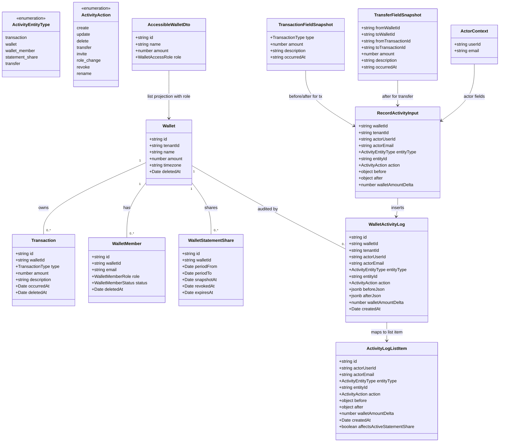

# Wallet Activity Log (Append-Only Audit Trail)

## Requirements

Give the wallet owner an attributable, append-only record of every in-scope mutation
on a wallet after multi-writer access (MR 11), so that when money is held on behalf of
others the owner can answer "who changed this, and what changed" without relying on
UI history or mutable ledger rows. Log at the Netlify handler / shared mutation layer
— never only from the client. Entries survive soft-delete of the entities they
describe, are never edited or soft-deleted themselves, and are readable by the owner
only while the wallet remains non-deleted. Surface the feed on wallet settings.

**In scope:** transaction create/edit/delete; transfer; wallet rename/delete; member
invite/role change/removal; statement-share create/revoke.

**Out of scope for v1:** attachment upload/delete; wallet create; invite auto-activation
inside `requireWalletAccess`; historical backfill of pre-deploy mutations; rewriting
statement snapshots; partitioning/TTL; reading activity for soft-deleted wallets via
API (rows remain in DB for support; `requireOwnedWallet` still filters `deleted_at`).

## Entities

## Approach

1. **Audit data model**:
   - Migration `0007_create_wallet_activity_log`: append-only table, no `updated_at`,
     no `deleted_at`, no application UPDATE/DELETE.
   - Soft references: `entity_id` is text with **no FK** to `transaction` /
     `wallet_member` / `wallet_statement_share`. `wallet_id` is text **without**
     `ON DELETE CASCADE` (prefer no FK; index only) so audit rows cannot be destroyed
     by entity lifecycle.
   - Denormalize owning `tenant_id` and `actor_email` at write time.
   - `before_json` / `after_json` are field-scoped JSON. `wallet_amount_delta`
     (`numeric(14,2)` nullable) is set for money-affecting actions only.

2. **Enforcement without middleware**:
   - No Netlify handler wrapper exists; do not invent HTTP middleware.
   - Extract `wallet-mutations.ts` for create/update/soft-delete transaction and
     transfer — each always calls `recordActivity` on the same `trx`.
   - Admin handlers (members, statement shares, wallet rename/delete) call
     `recordActivity` explicitly inside `db.transaction()` with their mutation.
   - Document in `AGENTS.md`: money writes go through mutation helpers; other in-scope
     mutators must call `recordActivity` in the same transaction.

3. **Same-transaction logging**:
   - Log insert commits or rolls back with the recorded action. Prefer this over
     silent unlogged success. Keep schema permissive (jsonb + text check constraints)
     so log failures stay rare.

4. **Before-state for transaction updates**:
   - `requireTransactionWriteAccess` today selects only `id, walletId, type, amount`.
   - Mutation helpers (or the PATCH handler before calling them) must load
     `description` and `occurredAt` for a complete `TransactionFieldSnapshot` before
     mutate. Prefer selecting the full snapshot inside `updateTransaction` /
     `softDeleteTransaction` via `trx` (or pass a pre-loaded full row from the
     handler after extending the access helper select list). Extending
     `OwnedTransaction` in `tenant-access.ts` to include `description` and
     `occurredAt` is the smallest consistent change.

5. **Action / payload contracts**:
   - **Transaction create:** `entity_type=transaction`, `action=create`, `before=null`,
     `after=TransactionFieldSnapshot`, `wallet_amount_delta=±amount`, `entity_id` =
     new transaction id (`.returning` required).
   - **Transaction update:** `action=update`, before/after `TransactionFieldSnapshot`,
     `wallet_amount_delta` = new contribution − old (0 if only description/occurredAt
     change).
   - **Transaction delete:** `action=delete`, `before` snapshot, `after=null`,
     `wallet_amount_delta` = −old contribution.
   - **Transfer:** two log rows (one per wallet), `entity_type=transfer`,
     `action=transfer`, shared `TransferFieldSnapshot` including `occurredAt`,
     `entity_id` = that wallet's new transaction id, deltas −amount / +amount.
   - **Wallet rename:** `entity_type=wallet`, `action=rename`, before/after `{name}`,
     `entity_id=walletId`.
   - **Wallet delete:** one row `action=delete`, before `{name}`, after null; **no**
     per-transaction cascade logs.
   - **Member invite:** `entity_type=wallet_member`, `action=invite`,
     `entity_id=member.id`, after `{email,role,status}`.
   - **Member role change:** `action=role_change`, before/after `{email,role}`.
   - **Member remove:** `action=delete`, before `{email,role,status}`.
   - **Statement share create:** `action=create`, `entity_id=share.id`, after
     `{periodFrom,periodTo,displayTitle,expiresAt,snapshotAt}`; **not** on
     `?preview=true`.
   - **Statement share revoke:** `action=revoke`, before active share summary, after
     `{revokedAt}`.

6. **Read path & statement divergence**:
   - `GET /api/wallets/:walletId/activity` with `requireOwnedWallet` (non-owners →
     404). Paginate newest-first (`page`, `pageSize` max 100).
   - Compute `affectsActiveStatementShare` at read time via helper
     `activityAffectsActiveShare(log, activeShares, walletTimezone)`:
     share is active if `revoked_at` is null and (`expires_at` is null or &gt; now);
     true when `share.snapshotAt < log.createdAt` and the log's relevant
     `occurredAt` (from after, else before; for transfer from `after.occurredAt`)
     falls in the share's calendar period resolved with `calendarDateToOccurredAtStart`
     / endExclusive (same bounds rules as statement-share create). Admin-only
     actions without occurredAt → flag false unless product later widens this.
   - Never rewrite `snapshot_json`. Period-level only — no row identity claims.

7. **UI**:
   - Settings section **Activity**, owner-only via `wallet.role === 'owner'` from
     extended `GET /api/wallets` (`AccessibleWalletDto`).
   - Feed: actor email, action label, entity summary, timestamp; expand before/after;
     indicator when `affectsActiveStatementShare`. Not mixed into transaction list.
   - Do not fetch activity when role ≠ owner (avoid error cards).

8. **Retention**: Forever; index `(wallet_id, created_at desc)`; no partition/TTL.

## Structure

### Inheritance Relationships

1. No class hierarchy — handlers return `Response`; tables are Kysely interfaces on
   `Database` in `#/lib/db/schema.ts`.
2. Helpers are plain async functions (`recordActivity`, money mutations, divergence
   predicate) — not a new service framework.

### Dependencies

1. `wallet-transactions.mts` / `wallet-transaction.mts` / `wallet-transfer.mts` →
   `lib/wallet-mutations.ts` → `lib/activity-log.ts` + Kysely `trx`.
2. `wallet.mts`, `wallet-members.mts`, `wallet-member.mts`,
   `wallet-statement-shares.mts`, `wallet-statement-share.mts` → `recordActivity`
   inside their write transactions.
3. `wallet-activity.mts` → `requireOwnedWallet`, `db`,
   `lib/activity-statement-overlap.ts` (or colocated helper).
4. `findAccessibleWallets` / `wallets.mts` → return `role`; `WalletDto` gains `role`.
5. Frontend `#/queries/activity/*` + `#/modules/wallets/wallet-settings-activity/*`
   ← `wallet-settings-page.tsx`.
6. Vitest under `netlify/functions/lib/` against real Postgres.

### Layered Architecture

1. Handler: session, access, validation, orchestrate.
2. Mutation/activity helpers: atomic ledger + log on one `trx`.
3. Data access: Kysely append-only insert + owner-scoped select.
4. Query/UI: owner-gated read model only.
5. No GlobalExceptionHandler — existing string `Response` errors.

## Operations

### Create Migration - `0007_create_wallet_activity_log`

1. Responsibility: Create append-only `wallet_activity_log` + index; update schema types.
2. Columns:
   - `id` text PK default `gen_random_uuid()`
   - `wallet_id` text not null
   - `tenant_id` text not null
   - `actor_user_id` text not null
   - `actor_email` text not null
   - `entity_type` text not null check in
     `('transaction','wallet','wallet_member','statement_share','transfer')`
   - `entity_id` text not null
   - `action` text not null check in
     `('create','update','delete','transfer','invite','role_change','revoke','rename')`
   - `before_json` jsonb null
   - `after_json` jsonb null
   - `wallet_amount_delta` numeric(14,2) null
   - `created_at` timestamptz not null default `now()`
3. Index: `wallet_activity_log_wallet_id_created_at_index` on `(wallet_id, created_at desc)`.
4. No FK to wallet/transaction/member/share. No `deleted_at` / `updated_at`.
5. Update `#/lib/db/schema.ts`: `WalletActivityLogTable`, `Database.walletActivityLog`,
   Selectable/Insertable exports.
6. Down: drop index, drop table.

### Update - `OwnedTransaction` / transaction access selects

1. Responsibility: Ensure money mutation before-snapshots have `description` + `occurredAt`.
2. Extend `OwnedTransaction` in `tenant-access.ts` and both transaction select sites
   (`requireOwnedTransaction`, `requireTransactionAccess`) to select
   `['id','walletId','type','amount','description','occurredAt']`.
3. Constraints: soft-deleted transactions still excluded (`deletedAt is null`).

### Create Helper - `recordActivity`

1. Path: `apps/ledger-box/netlify/functions/lib/activity-log.ts`
2. Signature:
   `recordActivity(executor: Kysely<Database> | Transaction<Database>, input: RecordActivityInput): Promise<void>`
3. Logic: single `insertInto('walletActivityLog').values({...}).execute()`; map
   `before`→`beforeJson`, `after`→`afterJson`; set `createdAt` to `new Date()` or omit
   for DB default; never catch/swallow.
4. Export `RecordActivityInput`, entity/action string union types matching DB checks.

### Create Helpers - `wallet-mutations.ts`

1. Path: `apps/ledger-box/netlify/functions/lib/wallet-mutations.ts`
2. Shared args include `ActorContext`, owning `tenantId`, `walletId`, and `trx`.
3. Methods:
   - `getContribution(type, amount): number` — income `+amount`, expense `-amount`
     (reuse existing handler logic; single definition here).
   - `createTransaction(trx, { walletId, tenantId, actor, type, amount, description, occurredAt })`
     → `{ id }`
     - Insert + `.returning(['id'])`
     - `amount: sql\`amount + ${delta}\`` on wallet
     - `recordActivity` create
   - `updateTransaction(trx, { walletId, tenantId, actor, transactionId, existing: TransactionFieldSnapshot, type, amount, description, occurredAt? })`
     - Update row; relative wallet delta from contribution change; `recordActivity` update
   - `softDeleteTransaction(trx, { walletId, tenantId, actor, transactionId, existing })`
     - Soft-delete; reverse contribution; `recordActivity` delete
   - `transferBetweenWallets(trx, { tenantId, actor, fromWalletId, toWalletId, amount, description, occurredAt })`
     → `{ fromTransactionId, toTransactionId }`
     - Both inserts with returning; both relative balance updates; two `recordActivity`
       transfer rows with full `TransferFieldSnapshot`
4. Wire handlers to open `db.transaction()`, call helper, return existing response shapes
   (`{ success: true }` / 201). Preserve validation and access checks in handlers.

### Update Handler - `wallet.mts`

1. PATCH rename: `db.transaction` → update name + `recordActivity` rename using
   `access.wallet.name` / `access.wallet.tenantId` and session actor.
2. DELETE: inside existing transaction, after soft-deletes, `recordActivity` wallet
   delete once (`entity_id=walletId`). Actor from session; tenant from ownership.

### Update Handlers - members & statement shares

1. `wallet-members.mts` POST: wrap insert + `recordActivity` invite in one transaction;
   `entity_id` = returned member id.
2. `wallet-member.mts` PATCH/DELETE: wrap mutation + log (`role_change` / `delete`).
3. `wallet-statement-shares.mts` POST: if `preview=true`, unchanged and unlogged; else
   wrap insert + `recordActivity` create (`entity_id=share.id`).
4. `wallet-statement-share.mts` DELETE: wrap revoke + `recordActivity` revoke.

### Create Helper - statement overlap flag

1. Path: `apps/ledger-box/netlify/functions/lib/activity-statement-overlap.ts`
   (or under `#/lib/` if reusable — prefer netlify lib if only used by the GET handler).
2. `isActiveShare(share): boolean` — mirror `wallet-statement-shares.mts` `isActive`.
3. `activityAffectsActiveShare(log, shares, timezone): boolean` — rules in Approach §6.
4. Used only by activity list GET.

### Create Handler - `wallet-activity.mts`

1. Config: `path: '/api/wallets/:walletId/activity'`
2. GET only; 401 / 404 / 405 as existing conventions.
3. `requireOwnedWallet(tenantId, walletId)`.
4. Paginate `walletActivityLog` where `walletId`, order `createdAt desc`.
5. Load shares for wallet once; map items with `affectsActiveStatementShare`.
6. JSON: `{ items, total, page, pageSize }` — camelCase field names matching DTOs
   (`before`/`after` from jsonb columns).

### Update - `findAccessibleWallets` / wallets list role

1. Owned branch: select wallet fields + literal role `'owner'` (Kysely `sql`'owner'`.as('role')`
   or equivalent).
2. Member branch: select wallet fields + `walletMember.role` as `role`.
3. Return type includes `role: WalletAccessRole` (`owner` | `manager` | `viewer`).
4. `wallets.mts` GET maps `{ id, name, amount, role }`.
5. Update `WalletDto` / `WalletResponseDto` with `role`; `createWallet` response may
   omit role or set `'owner'`.

### Create Frontend - activity feed

1. `#/queries/activity/activity.dto.ts`, `activity.api.ts`, `activity.queries.ts`
   (`useWalletActivity(walletId, page)`).
2. `#/modules/wallets/wallet-settings-activity/` — Card feed consistent with members /
   statement-shares; `#/` imports; currency via `@vhnam/utils`.
3. `wallet-settings-page.tsx`: render Activity only if `walletPreview.role === 'owner'`.
4. Enabled query only when owner — no speculative fetch for managers.
5. No mutations / no client-side log writes.

### Create Tests - `activity-log` / mutations Vitest

1. Real Postgres (same setup as `tenant-access.test.ts`).
2. Cases:
   - Manager transaction create/update/delete → log actor = manager, `tenantId` =
     owner, correct `walletAmountDelta`.
   - Transfer → two rows, opposite deltas, linked ids, shared `occurredAt`.
   - Soft-deleted transaction → prior logs still returned by activity GET for owner.
   - Member invite/role/remove logged; no requirement to log auto-activation.
   - Share preview → 0 new logs; create → 1; revoke → 1.
   - Manager GET activity → 404.
   - Helper-level: invalid `entity_type` insert fails and rolls back a paired wallet
     update inside one `db.transaction` (assert wallet amount unchanged).
3. Keep/extend relative-balance concurrency coverage if present — logging must not
   revert to absolute `amount` writes.

### Update Docs

1. `AGENTS.md`: activity log rules (append-only, same-trx, money helpers, owner-only
   GET, migration `0007`); add API row for activity; note attachments still unlogged.
2. `CHANGELOG.md` + per-MR changelog file at merge time (not blocking implementation).

## Norms

1. Imports: `#/` in app/UI; Netlify helpers `./lib/…`.
2. Kysely + CamelCasePlugin: TS `walletActivityLog`, SQL `wallet_activity_log`.
3. Migrations file-based; never edit merged ones.
4. Money: relative SQL deltas only (MR 12); `walletAmountDelta` mirrors applied delta.
5. Authz: logging does not widen write permissions; read = `requireOwnedWallet`.
6. Errors: string `Response` bodies; no new exception types / GlobalExceptionHandler.
7. Toasts: `toast.add` only if UI needs error feedback.
8. No transaction categories/tags in payloads.
9. Tests assert log rows for in-scope mutations; do not assert attachment logging.
10. UI money formatting via `@vhnam/utils`.

## Safeguards

1. Every in-scope mutator records the prescribed row(s); preview share does not; wallet
   delete does not emit per-tx logs; invite auto-activation does not log.
2. Append-only: no UPDATE/DELETE against `wallet_activity_log` in app code; no purge.
3. Same Postgres transaction for mutation + log on all in-scope writes.
4. Soft-deleted transactions leave log rows queryable by `wallet_id`.
5. Non-owners get 404 on activity GET; no public activity route.
6. Actor/member PII in JSON is owner-visible only.
7. Never mutate `snapshot_json`; divergence flag is advisory/period-level.
8. Attachments, wallet create, backfill stay out of v1.
9. List pageSize ≤ 100; one shares query per activity list request.
10. Do not reintroduce absolute `wallet.amount` writes.
11. UI mounts Activity only for `role === 'owner'`; no forbidden-fetch error card.
12. `entity_type` / `action` values must match DB check constraints (snake lowercase).
13. Transaction update/delete before-snapshots must include `description` and
    `occurredAt`, not only type/amount from today's narrow access select.
