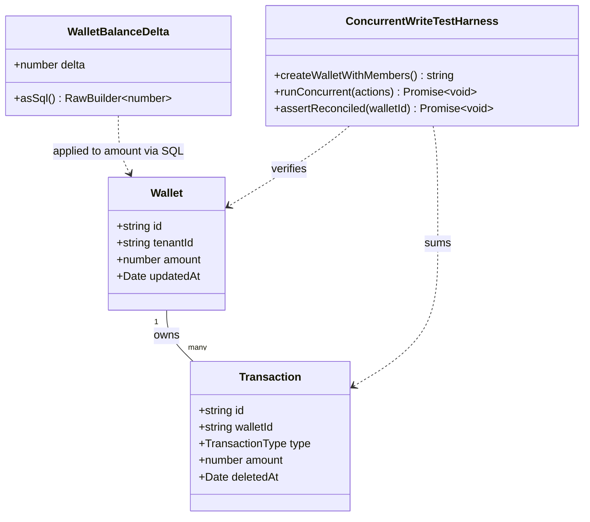

# Fix Wallet Balance Lost-Update Race Under Concurrent Manager Writes

## Requirements

Make every `wallet.amount` mutation atomic and race-free under concurrent writers, so that MR-11's manager write access cannot silently drop a transaction, edit, delete, or transfer when two sessions write to the same wallet at the same time.

## Entities



## Approach

1. Atomic balance mutation:
   - Replace every JS-computed absolute `amount: nextAmount` wallet write with a SQL-relative expression (`sql\`amount + ${delta}\``) evaluated by Postgres inside the existing `db.transaction()`, so the increment is atomic at the row level regardless of isolation level or read timing.
   - Keep the existing `requireWalletWriteAccess` / `requireTransactionWriteAccess` pre-checks for authorization and 404 semantics — they still gate access before the transaction opens. Only the _value_ written to `amount` changes from `wallet.amount ± delta` to a relative SQL expression.
   - No change to `wallet.mts` (PATCH/DELETE never touch `amount`).

2. Technical implementation:
   - Use Kysely's `sql` tagged template (already used elsewhere in this codebase, e.g. `wallet-members.mts`, `user-lookup.ts`) inside `.updateTable('wallet').set({ amount: sql\`amount + ${delta}\` })`.
   - Keep all mutations inside the current `db.transaction().execute(async (trx) => {...})` blocks — no new transaction boundaries needed, since the relative update makes the transaction's isolation level irrelevant to correctness here.
   - No global exception handler changes — existing per-handler `Response` error returns are untouched; this is a pure data-write correctness fix, not an API contract change.

3. Business logic:
   - Core rule: `wallet.amount` must always equal the sum of contributions (`income: +amount`, `expense: -amount`) of that wallet's non-deleted transactions, at every point in time, even under concurrent writers.
   - Transfer's two-leg update (source debit, destination credit) must remain a single DB transaction (already true) but each leg's wallet write becomes its own relative SQL delta rather than an absolute value derived from a separately-fetched wallet row.
   - Add a Vitest regression test that fires concurrent writes at the same wallet and asserts the final `amount` reflects both deltas — proving the fix and guarding against regression.

## Structure

### Inheritance Relationships

None — this fix touches existing handler functions and Kysely query builders directly; no new classes, interfaces, or exception types are introduced.

### Dependencies

1. `wallet-transactions.mts` (POST) calls `db.transaction()` → `trx.updateTable('wallet')` with a `sql` relative expression.
2. `wallet-transaction.mts` (PATCH, DELETE) call the same pattern, using `getTransactionContribution` deltas already computed in each handler.
3. `wallet-transfer.mts` calls the same pattern twice (once per leg) inside its existing single `db.transaction()`.
4. New test file(s) depend on `db` (`#/lib/db/index.ts`) directly, following the existing pattern in `netlify/functions/lib/tenant-access.test.ts`.

### Layered Architecture

1. Handler Layer (Netlify functions): validates input, resolves access via `tenant-access.ts`, computes the numeric delta (income/expense contribution), and issues the SQL-relative wallet update inside the transaction.
2. Data Access Layer (Kysely + Postgres): executes the relative `amount + ?` update atomically per row; no ORM/service layer exists between handler and Kysely in this codebase, so no additional layer is introduced.
3. Test Layer (Vitest, real Postgres): exercises the handler-level mutation logic concurrently against the local DB to prove atomicity.

## Operations

### Update Handler - `wallet-transactions.mts` (POST)

1. Responsibility: Insert a new transaction and atomically adjust `wallet.amount` by the transaction's signed contribution.
2. Change: Replace lines computing `nextWalletAmount = type === 'income' ? wallet.amount + amount : wallet.amount - amount` (used only as the SQL delta now, not the SQL value) and the `.set({ amount: nextWalletAmount, ... })` call.
3. Methods:
   - Inline logic inside the default export's POST branch:
     - Logic:
       - Compute `delta = type === 'income' ? amount : -amount` (keep this in JS — it's derived from validated request input, not from `wallet.amount`).
       - Inside `db.transaction()`, after the `transaction` insert, call:
         ```ts
         await trx
           .updateTable("wallet")
           .set({
             amount: sql`amount + ${delta}`,
             updatedAt: now,
           })
           .where("id", "=", walletId)
           .execute();
         ```
       - Remove the now-unused `nextWalletAmount` JS computation entirely; do not keep it as dead code.
4. Annotations: none (not a decorator-based framework); add `import { sql } from 'kysely';` to the file's import block.
5. Constraints: `delta` must be a finite number derived only from already-validated `amount`/`type`; do not reintroduce any read of `wallet.amount` for the write path.

### Update Handler - `wallet-transaction.mts` (PATCH, DELETE)

1. Responsibility: Update or soft-delete a transaction and atomically adjust `wallet.amount` by the net change in contribution.
2. Methods:
   - DELETE branch:
     - Logic:
       - Keep `walletDelta = -getTransactionContribution(existingTransaction.type, existingTransaction.amount)` computed in JS from the existing transaction snapshot (this is a fixed reversal amount, not derived from `wallet.amount`).
       - Replace `.set({ amount: wallet.amount + walletDelta, updatedAt: now })` with `.set({ amount: sql\`amount + ${walletDelta}\`, updatedAt: now })`.
   - PATCH branch:
     - Logic:
       - Keep `walletDelta = getTransactionContribution(type, amount) - getTransactionContribution(existingTransaction.type, existingTransaction.amount)` computed in JS (derived from request input and the existing transaction row, not from `wallet.amount`).
       - Replace `.set({ amount: wallet.amount + walletDelta, updatedAt: now })` with `.set({ amount: sql\`amount + ${walletDelta}\`, updatedAt: now })`.
3. Annotations: add `import { sql } from 'kysely';`.
4. Constraints: `wallet.amount` (the JS-held value from `requireTransactionWriteAccess`) must no longer be read anywhere when constructing the wallet `.set()` payload — only `walletDelta` may be used, and only as the SQL expression's addend.

### Update Handler - `wallet-transfer.mts`

1. Responsibility: Insert both transaction legs and atomically adjust both wallets' balances by `amount`, all within one DB transaction.
2. Methods:
   - Inside the existing `db.transaction()` block:
     - Logic:
       - Replace `.set({ amount: fromWallet.amount - amount, updatedAt: now })` on the source wallet update with `.set({ amount: sql\`amount - ${amount}\`, updatedAt: now })`.
       - Replace `.set({ amount: toWallet.amount + amount, updatedAt: now })` on the destination wallet update with `.set({ amount: sql\`amount + ${amount}\`, updatedAt: now })`.
       - Leave transaction insert ordering, description-building, and the existing rollback-on-failure behavior (single `db.transaction()` wrapping both legs and both wallet updates) unchanged — it already guarantees all-or-nothing.
3. Annotations: add `import { sql } from 'kysely';`.
4. Constraints: `fromWallet.amount` / `toWallet.amount` (from the two `requireWalletWriteAccess` calls) must no longer be read when constructing either `.set()` payload — only the validated `amount` field from the request body may be used.

### Create Test - Concurrent Wallet Balance Regression Test

1. Responsibility: Prove that two concurrent balance-mutating requests against the same wallet both apply, and act as a regression guard against reintroducing the lost-update bug.
2. Location: `netlify/functions/wallet-transactions.test.ts` (or a shared `wallet-transactions.mts`-adjacent test file), following the existing pattern in `netlify/functions/lib/tenant-access.test.ts` (real `db` against local Postgres, `randomUUID()`-scoped fixtures, `afterEach` cleanup).
3. Test Logic:
   - Create a wallet with `amount: 100` owned by a test tenant.
   - Fire two concurrent "add income transaction" operations (`amount: 10` each) against the same wallet via `Promise.all`, calling the same code path the POST handler uses (either by invoking the exported handler function directly with constructed `Request`/`Context`, or by calling the transaction-insert-plus-balance-update logic if it's extracted).
   - Assert the final `wallet.amount` equals `100 + 10 + 10 = 120` (fails today under the absolute-value write; passes after the SQL-relative fix).
   - Add a second case mixing an income POST and an expense PATCH/DELETE concurrently to cover cross-handler races, asserting the final amount matches the sum of both deltas.
   - Optionally, reuse `buildStatement`'s reconciliation logic (`src/lib/statement.ts`) as a second assertion: recompute the sum of non-deleted transactions for the wallet and assert it equals `wallet.amount` after the concurrent operations settle.
4. Constraints: test must clean up (`afterEach`) all wallets/transactions/members it creates, matching existing test hygiene in `tenant-access.test.ts`.

## Norms

1. Import Standards: use `import { sql } from 'kysely';` exactly as already done in `wallet-members.mts` and `user-lookup.ts` — no new SQL-building utility.
2. Delta Computation: any numeric delta passed into a `sql\`amount ± ${delta}\``expression must be validated/derived JS-side from request input or an already-fetched immutable row (e.g.,`existingTransaction`) — never from a wallet balance that could be stale by the time the write executes.
3. Transaction Boundaries: keep using `db.transaction().execute(async (trx) => {...})` for every insert+balance-update pair; do not split them across separate `db` calls.
4. No New Abstractions: do not introduce a `WalletBalanceDelta` class, repository layer, or service wrapper — the fix is a targeted change to existing `.set({ amount: ... })` calls in the four handler files plus `sql` import additions.
5. Test Conventions: follow `tenant-access.test.ts`'s conventions — `randomUUID()`-suffixed fixture ids, `afterEach` cleanup, `vite-plus/test` imports, real Postgres via `#/lib/db/index.ts`.
6. Documentation: no new comments needed beyond removing/adjusting any comment that references the old absolute-value computation; do not add multi-line explanatory comments for the `sql` expression itself — the pattern is self-evident and already used elsewhere in the codebase.

## Safeguards

1. Functional Constraints: after the fix, two concurrent balance-mutating requests against the same wallet (any combination of POST/PATCH/DELETE/transfer) must both be reflected in the final `wallet.amount` — no lost updates.
2. Performance Constraints: the fix must not add extra round-trips or additional row locking overhead beyond the current single `db.transaction()` per handler; `amount + ?` is a single-statement atomic update with no added latency.
3. Security Constraints: no change to authorization — `requireWalletWriteAccess` / `requireTransactionWriteAccess` continue to gate all mutating paths exactly as before.
4. Integration Constraints: `wallet.mts` (PATCH rename, DELETE soft-delete) must remain untouched — it does not mutate `amount` and is out of scope for this fix.
5. Business Rule Constraints: `wallet.amount` must remain reconcilable against `SUM` of non-deleted transaction contributions at all times, including immediately after concurrent writes settle.
6. Exception Handling Constraints: no new exception types or error responses are introduced; existing `Response` status codes (400/401/403/404/405/201/200) for each handler remain unchanged.
7. Technical Constraints: do not change transaction isolation level (`db.transaction()` stays at Postgres default READ COMMITTED) — the SQL-relative expression makes correctness independent of isolation level, so no `SET TRANSACTION ISOLATION LEVEL` or `FOR UPDATE` locking is required for this fix to be correct.
8. Data Constraints: `sql\`amount + ${delta}\``/`sql\`amount - ${amount}\`` must use parameterized values via the tagged template (never string-concatenated SQL), preserving injection safety.
9. API Constraints: no request/response shape changes to any of the four endpoints (`POST /api/wallets/:walletId/transactions`, `PATCH`/`DELETE /api/wallets/:walletId/transactions/:transactionId`, `POST /api/wallets/transfer`, `PATCH`/`DELETE /api/wallets/:walletId`) — this is an internal correctness fix only.
