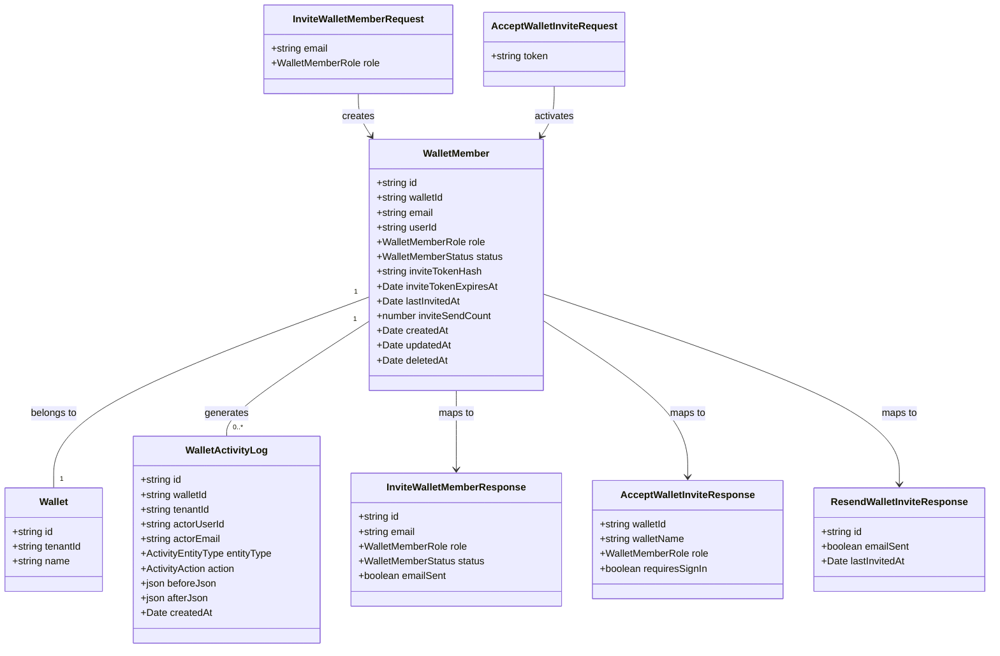

# Member Invitation Emails

## Requirements

Notify an invited wallet member by email when they are invited, resent an invite, and
give the wallet owner control to revoke a pending invite before it is accepted — while
closing the security gap where anyone who simply registers with the invited email address
would otherwise inherit access. Deliver this without weakening tenancy ownership rules,
without letting invite delivery become a vector for spraying mail to arbitrary strangers,
and without ever letting an email-delivery failure silently discard the invite record.

## Entities

Conservative note: `WalletMemberDto` (frontend), `WalletMemberResponse` (backend mapper),
and the existing `WalletMemberTable` shape are extended in place — three new nullable
columns (`inviteTokenHash`, `inviteTokenExpiresAt`, `lastInvitedAt`) plus one counter
(`inviteSendCount`) on the existing `wallet_member` table, not a new table. This mirrors
how `walletStatementShare` already carries its own `tokenHash`/`rateWindowStart`/
`rateWindowCount` columns directly on the row being protected, rather than a side table.
No existing entity is restructured; `WalletMemberRole`, `WalletMemberStatus`, and all
existing API contracts are unchanged and remain backward compatible.

## Approach

1. **Invite email delivery**:
   - Introduce a single provider-agnostic mail-sending helper
     (`apps/ledger-box/netlify/functions/lib/mailer.ts`), following the same shape as
     `lib/activity-log.ts` and `lib/share-token.ts` — one focused module, no framework.
   - Back it with Resend (per the already-reserved `RESEND_API_KEY` in `.env.example`).
     Add `RESEND_API_KEY` (wire it up — currently unused) and `RESEND_EMAIL_FROM_ADDRESS` as new
     required environment variables; document both in `.env.example` and AGENTS.md's
     Environment Variables section.
   - The helper takes a minimal `{ to, subject, html, text }` shape and returns
     `{ ok: true } | { ok: false; error: string }` — never throws, so callers always get a
     result they can persist and act on. Netlify Functions are stateless per-invocation, so
     delivery is synchronous, awaited inside the request handler, not queued.
2. **Security: token-gated acceptance (decision confirmed)**:
   - The invite link carries a per-invite secret token, generated and hashed exactly like
     `generateShareToken`/`hashShareToken` in `lib/share-token.ts` (256-bit CSPRNG, only the
     SHA-256 hash persisted, raw token shown once in the email body/link, never stored).
   - A new **public** endpoint verifies the token and is the only way a pending invite
     transitions to accepted-via-token. This does not remove MR 11's existing
     email/user_id auto-activation (`requireWalletAccess` in `tenant-access.ts`) — that
     mechanism still fires on any authenticated wallet request and is left intentionally
     unchanged, since narrowing it is a larger tenancy-model change out of scope here (per
     AGENTS.md's explicit "known gap" framing). Instead, the token path gives a legitimate
     invitee a way to accept deliberately and, for a no-account recipient, to land on
     sign-up pre-filled and primed to claim the invite — closing the practical gap (owner
     must tell them out-of-band) that this feature exists to solve, while creating a real,
     verifiable acceptance action alongside the pre-existing implicit one.
3. **Business logic**:
   - Invite creation (`POST /api/wallets/:walletId/members`, existing handler) is extended,
     not replaced: after the existing transaction commits the `wallet_member` row, generate
     a token, persist its hash + expiry (7 days, matching the general expectation that
     invites go stale — no existing precedent to match, chosen conservatively in line with
     the `walletStatementShare` 90-day default being for a much longer-lived share), send
     the email, and record the outcome. A failed send never rolls back or blocks the invite
     row — the row is the source of truth for access; email is best-effort notification on
     top of it, per the Requirements section.
   - Resend (new `POST /api/wallets/:walletId/members/:memberId/resend`) re-issues a fresh
     token (invalidating the previous one via overwrite — one active token per invite at a
     time, consistent with "the current link is the only valid link"), re-sends the email,
     and is rate-limited per-owner using a DB-column fixed-window counter, matching the
     `walletStatementShare`/`public-statement.mts` shape but scoped to the acting tenant
     rather than to a single row.
   - Revoke reuses the existing `DELETE /api/wallets/:walletId/members/:memberId` path
     unchanged — soft-deleting a pending invite already makes its token unusable, since the
     accept endpoint's lookup filters on `deletedAt is null`. No new revoke endpoint is
     needed; this is a conservative reuse, not a new operation.
   - Global error handling: existing per-handler `Response` returns are the established
     pattern in this codebase (no `GlobalExceptionHandler`-style middleware exists or is
     idiomatic here — Netlify Functions are one-function-per-file). All new failure paths
     follow the exact `new Response(message, { status })` convention already used
     throughout `wallet-members.mts`/`wallet-member.mts`/`public-statement.mts`.

## Structure

### Inheritance Relationships

1. No new classes, interfaces, or exception hierarchies are introduced — this codebase
   uses plain Netlify Function handlers (`(request, context) => Response`) and Kysely
   query builders, not class-based services or custom exception types. New logic follows
   this existing functional-module convention.

### Dependencies

1. `wallet-members.mts` (`POST` handler) now also calls the new `lib/mailer.ts` helper and
   `lib/share-token.ts` (already exists, reused unmodified) after committing the invite
   transaction.
2. A new `wallet-member-resend.mts` handler depends on `lib/mailer.ts`,
   `lib/share-token.ts`, `lib/tenant-access.ts` (`getTenantId`, `requireOwnedWallet`),
   `lib/activity-log.ts`, and `lib/wallet-member-response.ts`.
3. A new `wallet-invite-accept.mts` public handler depends on `lib/share-token.ts`
   (`hashShareToken`), `lib/db/index.ts`, and `lib/activity-log.ts` — it does **not**
   depend on `lib/tenant-access.ts`'s owner-only helpers, since it is reached
   unauthenticated or by a not-yet-a-member session, mirroring `public-statement.mts`'s
   independence from `tenant-access.ts`.
4. `lib/mailer.ts` depends on the `resend` package (new dependency) and
   `process.env.RESEND_API_KEY` / `process.env.RESEND_EMAIL_FROM_ADDRESS`.
5. Frontend: a new `wallet-invite.api.ts` (resend) function reuses the existing
   `getApiErrorMessage` helper (`#/lib/api-error.ts`), matching every other mutation
   wrapper in `src/queries/wallets/`. A new `invite/$token.tsx` route depends on a new
   `InvitePublicPage` module, mirroring `routes/statement/$token.tsx` →
   `StatementPublicPage`.

### Layered Architecture

1. **Netlify Function Layer** (`netlify/functions/*.mts`): `wallet-members.mts` (extended),
   `wallet-member-resend.mts` (new), `wallet-invite-accept.mts` (new, public) — request
   parsing, auth/ownership checks, response shaping.
2. **Function Lib Layer** (`netlify/functions/lib/*.ts`): `mailer.ts` (new) for delivery;
   `activity-log.ts`, `tenant-access.ts`, `wallet-member-response.ts`, `user-lookup.ts`
   (all existing, reused) for persistence-adjacent concerns.
3. **Shared App Lib Layer** (`src/lib/*.ts`): `share-token.ts` (existing, reused) for
   token generation/hashing — deliberately kept in the app-shared lib since it's already
   consumed by both a Netlify function and (indirectly) frontend types, matching its
   current placement.
4. **Data Access Layer**: Kysely against `wallet_member` (extended with 4 new nullable/
   default columns via a new migration) — no new table.
5. **Frontend Query Layer** (`src/queries/wallets/`): `wallet-member.api.ts` (extended
   with `resendWalletInvite`), `wallet-member.mutations.ts` (extended with
   `useResendWalletInvite`), `wallet-member.dto.ts` (extended with `emailSent`,
   `lastInvitedAt` on the existing DTO — additive, non-breaking).
6. **Frontend Route/Module Layer**: `src/routes/invite/$token.tsx` (new, public route,
   mirrors `routes/statement/$token.tsx`); `src/modules/invite/invite-public-page.tsx`
   (new, mirrors `modules/statement/statement-public-page`); `wallet-member-row.tsx`
   (extended with a Resend action for pending members).
7. **Error Handling**: no centralized handler exists or is introduced; every new failure
   path returns a `Response` with an explicit status directly from the handler, matching
   the codebase-wide convention already used in every existing `*.mts` file read during
   analysis.

## Operations

### Create Migration - `0008_add_wallet_member_invite_token`

1. Responsibility: add token, expiry, last-sent, and send-count columns to `wallet_member`
   so a single row can carry both its membership state and its invite-acceptance state,
   consistent with how `walletStatementShare` carries `tokenHash`/`rateWindowStart`/
   `rateWindowCount` directly on its own row.
2. Up:
   - `alter table wallet_member add column invite_token_hash text`
   - `alter table wallet_member add column invite_token_expires_at timestamptz`
   - `alter table wallet_member add column last_invited_at timestamptz`
   - `alter table wallet_member add column invite_send_count integer not null default 0`
   - `create unique index wallet_member_invite_token_hash_index on wallet_member (invite_token_hash) where invite_token_hash is not null`
     (unique, partial — mirrors the existing `unique()` on `walletStatementShare.tokenHash`,
     partial because most rows will have a null hash after acceptance/expiry)
3. Down: drop the index, then drop all four columns, in reverse order.
4. File: `apps/ledger-box/src/lib/db/migrations/0008_add_wallet_member_invite_token.ts`,
   following the exact `up`/`down` export shape of `0005_create_wallet_statement_share.ts`.

### Update Type - `WalletMemberTable` (`src/lib/db/schema.ts`)

1. Responsibility: reflect the four new columns as camelCase Kysely fields.
2. Attributes to add:
   - `inviteTokenHash: string | null`
   - `inviteTokenExpiresAt: ColumnType<Date | null, Date | string | null, Date | string | null>`
   - `lastInvitedAt: ColumnType<Date | null, Date | string | null, Date | string | null>`
   - `inviteSendCount: Generated<number>`
3. Constraints: no changes to `WalletMemberRole`, `WalletMemberStatus`, or any other table.
4. Also extend `ActivityAction` with two new literal members: `'invite_resend'` and
   `'invite_email_failed'` (both new; `'invite'` and `'revoke'` already exist and remain
   the actions for create and delete respectively — delete already logs action `'delete'`
   in `wallet-member.mts`, which is reused unchanged, not renamed to `'revoke'`).

### Create Lib - `lib/mailer.ts` (`netlify/functions/lib/mailer.ts`)

1. Responsibility: single point of outbound email delivery for the app; provider-specific
   code (Resend) is isolated here so nothing else in the codebase imports `resend`
   directly.
2. Methods:
   - `sendEmail(input: { to: string; subject: string; html: string; text: string }): Promise<{ ok: true } | { ok: false; error: string }>` - Logic: - Read `process.env.RESEND_API_KEY` and `process.env.RESEND_EMAIL_FROM_ADDRESS`; if either
     is missing, return `{ ok: false, error: 'Email delivery is not configured' }`
     immediately without attempting a network call (fail closed, not a thrown
     exception — callers always get a result to persist). - Construct the Resend client lazily inside the function (not at module load), so a
     missing key doesn't crash function cold-start for unrelated routes that happen to
     import this module transitively. - Call the provider's send API with `from: process.env.RESEND_EMAIL_FROM_ADDRESS`, `to`,
     `subject`, `html`, `text`. - Catch any thrown/rejected error from the provider call and return
     `{ ok: false, error: <message, truncated to a safe length, never re-throwing raw
provider internals> }` — never let a mail-provider exception propagate up into the
     Netlify handler as an unhandled 500. - On success, return `{ ok: true }`.
3. Constraints: this module must never be imported by anything in `src/` (frontend) — it
   is server-only, matching the `netlify/functions/lib/` convention already followed by
   `activity-log.ts`, `tenant-access.ts`, `user-lookup.ts`.

### Create Lib - `lib/wallet-invite-email.ts` (`netlify/functions/lib/wallet-invite-email.ts`)

1. Responsibility: build the specific invite-email subject/HTML/text content, kept
   separate from the generic `mailer.ts` so template content changes don't touch delivery
   logic — mirrors the separation already present between `lib/statement.ts` (content) and
   the transport-agnostic parts of `wallet-statement-shares.mts`.
2. Methods:
   - `buildInviteEmail(input: { inviterName: string; inviterEmail: string; walletName: string; role: WalletMemberRole; acceptUrl: string }): { subject: string; html: string; text: string }`
     - Logic:
       - Subject: `"${inviterName} invited you to ${walletName} on Ledger Box"` (fall back
         to `inviterEmail` if `inviterName` is empty, matching the existing
         `mapOwnerMember`/`mapWalletMember` pattern of falling back from `name` to email
         when no display name is set).
       - Body states who invited them (name or email), which wallet, their assigned role
         (Viewer/Manager, using the existing `WALLET_MEMBER_ROLE_DESCRIPTIONS` copy from
         `constants/wallet-member-role-options.ts` so the description text matches what the
         owner already sees in the invite form), and a single clear call-to-action link to
         `acceptUrl`.
       - Plain-text version mirrors the HTML content without markup, since `sendEmail`
         requires both.
     - No conditional disclosure logic needed beyond what's already decided: wallet name
       is included in the body per the Requirements/Approach — this is the accepted
       trade-off, not a new open question, since the existing member list already exposes
       equivalent information to anyone the owner already granted view access to, and the
       email is only ever sent to the address the owner explicitly typed in.

### Update Handler - `wallet-members.mts` (`POST` branch)

1. Responsibility: after committing the existing invite-creation transaction (unchanged),
   generate an invite token, persist it, send the notification email, and reflect the
   outcome in the response and activity log.
2. Logic (inserted after the existing `db.transaction()` block that creates `member`,
   before the final `Response.json(...)` return):
   - Call `generateShareToken()` (reused from `#/lib/share-token.ts`) to get `{ raw, hash }`.
   - Compute `inviteTokenExpiresAt = new Date(Date.now() + 7 * 24 * 60 * 60 * 1000)`
     (7-day expiry constant, named `INVITE_TOKEN_EXPIRY_DAYS = 7` at module scope).
   - `db.updateTable('walletMember').set({ inviteTokenHash: hash, inviteTokenExpiresAt, lastInvitedAt: now, inviteSendCount: (eb) => eb('inviteSendCount', '+', 1) }).where('id', '=', member.id).execute()`
     — run this as its own statement, deliberately **outside** the original insert
     transaction, since it depends on the token generated after the row exists and must
     not roll back the already-committed invite if something downstream fails.
   - Build `acceptUrl = new URL(`/invite/${raw}`, process.env.BETTER_AUTH_URL).toString()`
     (reuses the existing `BETTER_AUTH_URL` env var already required by AGENTS.md, rather
     than introducing a redundant site-URL variable).
   - Call `buildInviteEmail(...)` with `inviterName: session.user.name ?? ''`,
     `inviterEmail: session.user.email`, `walletName: ownerUser` wallet's name (already
     available via `ownership.wallet.name`), `role`, `acceptUrl`.
   - Call `sendEmail(...)`. If `{ ok: false }`, record a `wallet_activity_log` row with
     `action: 'invite_email_failed'`, `after: { email, error }`, in a best-effort call (not
     inside a transaction — this must never throw and block the response). If `{ ok: true }`,
     no additional activity log row is needed beyond the existing `'invite'` entry already
     recorded in the original transaction — email send success is reflected via the
     response's `emailSent` flag, not a duplicate log line.
   - Add `emailSent: boolean` to the JSON response alongside the existing
     `mapWalletMember(member, invitedUser)` fields (spread the mapped object plus
     `emailSent`).
3. Constraints: none of this changes the existing 400/401/404 validation paths already in
   the handler; it only extends the success path after the row is durably created.

### Create Handler - `wallet-member-resend.mts`

1. Responsibility: re-issue a fresh invite token and re-send the notification email for an
   existing pending member, rate-limited per wallet owner.
2. Route: `POST /api/wallets/:walletId/members/:memberId/resend`.
3. Config: `export const config: Config = { path: '/api/wallets/:walletId/members/:memberId/resend' };`
4. Logic:
   - Session check (`auth.api.getSession`), 401 if absent — identical to every other
     member handler.
   - Parse `walletId`/`memberId` via a `getIds` helper (copy the existing pattern from
     `wallet-member.mts:17-36`, adjusted for the extra `/resend` path segment).
   - `getTenantId(session)` + `requireOwnedWallet(tenantId, walletId)` — resend stays
     owner-only, same as invite creation and the other member-management operations.
   - Load the member row (`id`, `email`, `role`, `status`, `deletedAt`); 404
     (`Member not found`) if missing or soft-deleted, matching `wallet-member.mts`'s
     existing lookup.
   - If `status !== 'pending'`, return `400` `"Only pending invites can be resent"` —
     resending an already-active member has no meaning under this design.
   - **Rate limit check** (per-owner, DB-column fixed-window, mirrors
     `public-statement.mts:71-89`): read `rateWindowStart`/`rateWindowCount` from a new
     pair of columns added to `wallet` in the same migration as above — see note below —
     scoped to `tenantId`. If within a 60-second window and count `>= 5` resends, return
     `429` `"Too many invite emails sent. Please try again shortly."`. Otherwise increment/
     reset the window and proceed.
     - **Design note surfaced explicitly**: attaching a per-owner counter requires either a
       new column pair on `wallet` (chosen here, since `wallet` already has exactly one row
       per owner-per-wallet and rename-safe headroom) or a new dedicated table. This
       migration adds `invite_rate_window_start timestamptz` and
       `invite_rate_window_count integer not null default 0` to `wallet` in the **same**
       `0008` migration as the `wallet_member` columns, since both are part of the same
       feature's schema footprint.
   - Generate a new token (`generateShareToken()`), overwrite `inviteTokenHash`/
     `inviteTokenExpiresAt`/`lastInvitedAt`/increment `inviteSendCount` on the member row —
     this invalidates any previously issued link for this invite, consistent with "one
     active token at a time."
   - Build and send the email exactly as in the `POST /members` path (reuse
     `buildInviteEmail` + `sendEmail`).
   - Record activity: `action: 'invite_resend'`, `after: { email, sentAt: now, emailSent }`.
   - Return `Response.json({ id: member.id, emailSent, lastInvitedAt: now })`.
5. Constraints: no soft-delete, no role change — this endpoint mutates only invite-token
   and send-tracking fields.

### Create Handler - `wallet-invite-accept.mts`

1. Responsibility: public (unauthenticated-reachable) endpoint that verifies an invite
   token and reports what the recipient should do next; the actual grant of access still
   happens through the existing MR 11 `requireWalletAccess` auto-activation the next time
   the (now identified) user hits an authenticated wallet route — this endpoint's job is
   token verification and guiding the recipient, not itself flipping `status`.
2. Route: `GET /api/wallets/invites/:token` (public, no auth). Config path:
   `'/api/wallets/invites/:token'`.
3. Logic:
   - Extract `token` from `context.params` or URL match, mirroring
     `public-statement.mts:9-19`'s `getToken` helper exactly.
   - `404` `"This invite link is not valid."` if token missing.
   - `hashShareToken(token)` (reused, unmodified) and look up
     `wallet_member` by `inviteTokenHash = hash`. `404` with the same message if not found
     — never reveal whether a token existed vs. was simply wrong, matching the
     anti-enumeration posture already documented for `requireWalletAccess`.
   - If `status !== 'pending'` (already accepted or removed), return `410`
     `"This invite has already been used."`
   - If `inviteTokenExpiresAt` is in the past, return `410` `"This invite link has expired."`
   - Look up the owning wallet (`deletedAt is null`); `410`
     `"This wallet is no longer available."` if deleted or missing — mirrors
     `public-statement.mts:61-69`'s wallet-deleted handling exactly.
   - Look up whether an account already exists for the invite's email via
     `findUserByEmail` (reused, unmodified from `lib/user-lookup.ts`).
   - Return `Response.json({ walletId, walletName: wallet.name, role: member.role, requiresSignIn: !!existingUser })`
     — the frontend uses `requiresSignIn` to route the recipient to sign-in (existing
     account) vs. sign-up (no account), pre-filling the invited email in both cases.
   - This endpoint does **not** mutate `wallet_member` — it is read-only verification. The
     actual status flip to `'active'` continues to happen exclusively inside
     `requireWalletAccess` (`tenant-access.ts`, unmodified) the first time the now-
     authenticated recipient reaches any wallet route, which already matches by
     `userId`/case-insensitive email. This keeps a single source of truth for "when does
     an invite become active" rather than introducing a second, competing activation path.
4. Constraints: no session check, no `requireOwnedWallet` — reachable by design without
   authentication, exactly like `public-statement.mts`.

### Update Migration - reconsider: (folded into `0008` above)

No separate migration is needed for the `wallet` rate-limit columns; they are included in
`0008_add_wallet_member_invite_token` per the note in the resend handler's Operations
entry, keeping one migration per merged feature consistent with existing single-migration
merges (e.g. `0006` for the member/access index).

### Update Frontend - `wallet-member.api.ts` / `wallet-member.mutations.ts` / `wallet-member.dto.ts`

1. Responsibility: expose resend as a mutation, following the exact existing pattern for
   invite/update-role/remove.
2. `wallet-member.api.ts`: add
   `resendWalletInvite(walletId: string, memberId: string): Promise<{ id: string; emailSent: boolean; lastInvitedAt: string }>`
   using `axios.post` to `/api/wallets/${walletId}/members/${memberId}/resend`, wrapped in
   the same `try/catch` + `getApiErrorMessage(error, 'Failed to resend invite. Please try again.')`
   shape as every other function in this file.
3. `wallet-member.mutations.ts`: add `useResendWalletInvite(walletId: string)` — same
   `useMutation` + dual `invalidateQueries(['wallet-members', walletId])` /
   `invalidateQueries(['activity', walletId])` shape as `useInviteWalletMember`.
4. `wallet-member.dto.ts`: add optional `lastInvitedAt?: string` and `emailSent?: boolean`
   to `WalletMemberDto` — additive, does not break any existing consumer that ignores the
   new fields.

### Update Frontend - `wallet-settings-members.actions.tsx`

1. Responsibility: wire a `handleResendInvite(memberId)` action following the exact
   `handleRoleChange`/`handleRemoveMember` pattern already in this file — call
   `useResendWalletInvite(wallet.id)`, on success `toast.add({ title: 'Invite resent', type: 'success' })`,
   on error `toast.add({ title: 'Failed to resend invite', description: message, type: 'error' })`.
2. Return `handleResendInvite` alongside the existing returned actions.

### Update Frontend - `wallet-member-row.tsx`

1. Responsibility: show a "Resend" affordance next to pending, non-owner members only.
2. Add an `onResend: (memberId: string) => void` prop; render a `Button` (ghost, icon-sm,
   `Icon name="RefreshCwIcon"` or equivalent already available in the icon set) beside the
   existing remove button, gated on `member.status === 'pending' && !member.isOwner` —
   matches the existing `{!member.isOwner && (...)}` conditional-render style already used
   for the remove button in this file.

### Create Frontend Route - `src/routes/invite/$token.tsx`

1. Responsibility: public route rendering the invite-acceptance landing page, mirroring
   `routes/statement/$token.tsx` verbatim in structure.
2. Logic: `createFileRoute('/invite/$token')({ component: RouteComponent })`; extract
   `token` from `Route.useParams()`; render `<InvitePublicPage token={token} />`.

### Create Frontend Module - `src/modules/invite/invite-public-page.tsx`

1. Responsibility: fetch invite-verification data from the new public endpoint and route
   the recipient appropriately.
2. Logic:
   - On mount, `GET /api/wallets/invites/:token` (new query function
     `verifyWalletInvite(token)` in a new `src/queries/wallet-invites/wallet-invite.api.ts`,
     following the existing `axios` + `getApiErrorMessage` convention).
   - Loading state: existing `Spinner` component.
   - Error state (404/410): render the server-provided message with a link back to `/`.
   - Success state: show "You've been invited to `${walletName}` as `${role}`", with a
     single CTA button:
     - If `requiresSignIn` is `true`, link to the existing sign-in route with the invited
       email pre-filled (existing sign-in flow already accepts a query param or similar
       pre-fill mechanism — reuse whatever the current sign-in route already supports; do
       not invent a new pre-fill mechanism if one exists).
     - If `false`, link to the existing sign-up route the same way.
   - After sign-in/sign-up, the recipient lands back on the app; the very next
     authenticated request to any wallet route triggers `requireWalletAccess`'s existing
     auto-activation (unmodified) — no additional client-side "claim" call is needed, since
     that mechanism already runs on every wallet access check.
3. Constraints: this page must not itself call any endpoint that mutates `wallet_member`
   status — verification only, consistent with the backend handler's read-only contract.

## Norms

1. **Handler shape**: every new/modified `.mts` file continues the existing pattern —
   `export default async (request: Request, context: Context) => Response`, explicit
   method checks, explicit status codes, no framework-level routing beyond Netlify's
   file-based `config.path`.
2. **Dependency injection**: none — this codebase imports singletons directly (`db`,
   `auth`) rather than using a DI container; new code follows the same direct-import style.
3. **Error handling**:
   - No custom exception classes or `GlobalExceptionHandler` — every failure path returns
     `new Response(message, { status })` directly from the handler, exactly as in every
     existing member/statement-share handler.
   - The `mailer.ts` helper never throws; it always resolves to a discriminated
     `{ ok: true } | { ok: false; error: string }` result so callers can persist and
     surface the outcome without try/catch ceremony at call sites.
   - Provider error messages are never passed to the client response verbatim; only a
     generic "invite email could not be sent" reaches the owner via toast, while the raw
     provider error is what's recorded in `wallet_activity_log.afterJson` for
     troubleshooting (owner-only visible, since `GET /activity` is owner-only per AGENTS.md).
4. **Data validation**: continue using plain runtime type guards for request bodies in
   Netlify handlers (as `isWalletMemberRole` already does) — no new validation library
   introduced for the two new endpoints, which take no body (`resend`) or a path param only
   (`accept`).
5. **Logging**: all new state-changing actions (`invite_resend`, `invite_email_failed`) go
   through the existing `recordActivity` helper, in the same transaction as the state
   change where one exists (resend's token/count update), or as a best-effort standalone
   call where the action being logged is itself the failure of a side effect (email send
   failure after the row is already durably committed).
6. **Imports**: use `#/lib/...` and `./lib/...` exactly per AGENTS.md's import conventions
   — no `@/` and no long relative paths anywhere in new code.
7. **Toasts**: use `toast.add({ title, description, type })` exclusively; never
   `toast.success(...)` or similar, per AGENTS.md.
8. **Currency/formatting**: not applicable — this feature introduces no monetary values.

## Safeguards

1. **Functional Constraints**:
   - Invite creation must remain durable regardless of email outcome: the `wallet_member`
     insert transaction (existing) must never be rolled back, retried, or blocked by the
     token-generation or email-send steps that follow it.
   - Resend must be rejected with `400` for any member whose `status` is not `'pending'`.
   - The accept-verification endpoint must never mutate `wallet_member.status` — activation
     remains exclusively the responsibility of `requireWalletAccess`, unmodified.
2. **Performance Constraints**:
   - Email send is a single synchronous network call per invite/resend request; no batching
     or fan-out is introduced. Acceptable given wallet invites are low-volume, single-
     recipient actions (no evidence of bulk-invite requirements in scope).
3. **Security Constraints**:
   - Invite tokens are 256-bit CSPRNG values; only their SHA-256 hash is ever persisted
     (`inviteTokenHash`), matching `walletStatementShare.tokenHash`'s existing security
     bar. Raw tokens appear only in the outbound email and the one-time API response to the
     inviting owner is not applicable here — the raw token is never returned in the
     `POST /members` or `resend` JSON response, only embedded in the email's `acceptUrl`,
     since the token's entire purpose is to prove receipt of that specific email.
   - The accept-verification endpoint returns identical `404` messaging whether a token is
     malformed, unknown, or belongs to a non-pending/deleted member — no oracle for
     enumerating valid tokens, matching the anti-enumeration posture already documented for
     `requireWalletAccess`.
   - `requireOwnedWallet` continues to gate invite creation and resend — member management
     stays owner-only, unchanged from MR 06/MR 11.
   - Provider error details (stack traces, raw API error bodies) must never appear in any
     client-facing response — only a generic message; full detail is confined to
     `wallet_activity_log`, which is owner-only readable.
4. **Integration Constraints**:
   - `RESEND_API_KEY` and `RESEND_EMAIL_FROM_ADDRESS` must be added to `.env.example` in the same
     change that introduces `lib/mailer.ts`, per AGENTS.md's "never commit real values...
     when adding a variable, add it to `.env.example`" rule.
   - Local/dev environments without a configured `RESEND_API_KEY` must not crash — invite
     creation and resend must still succeed at the database level, with `emailSent: false`
     surfaced in the response and an `invite_email_failed` activity entry recorded, so the
     feature degrades gracefully in `vp run dev` without mail credentials configured.
5. **Business Rule Constraints**:
   - An invite token expires 7 days after issuance (`INVITE_TOKEN_EXPIRY_DAYS = 7`); an
     expired token yields `410`, requiring a resend (which issues a fresh token and
     expiry) rather than a silent extension.
   - Resend is capped at 5 sends per wallet owner per 60-second window; exceeding it yields
     `429`. This is a fixed, hardcoded constant for v1 (no admin-configurable rate limit
     exists anywhere else in the codebase either).
   - A member row must have at most one live (non-expired, non-consumed-by-deletion)
     invite token at a time; issuing a new one (via resend) always supersedes the prior one.
6. **Exception Handling Constraints**: not applicable in the `GlobalExceptionHandler`
   sense — see Norms §3. Every handler continues to construct and return its own `Response`
   objects with explicit status codes; no shared error-response DTO or centralized handler
   exists or is introduced.
7. **Technical Constraints**:
   - No queueing/background-job infrastructure exists in this stack (Netlify Functions +
     Postgres + R2 only per `compose.yml`); this feature must not introduce one — all email
     sends are synchronous within the triggering request.
   - No new database table is introduced; all new persistence lives in new columns on
     `wallet_member` and `wallet` via a single migration (`0008`), per the migration
     guardrail in AGENTS.md ("never edit one that has been merged").
8. **Data Constraints**:
   - `inviteTokenHash` is unique when non-null (partial unique index), preventing two
     members from ever sharing a live token by construction.
   - `inviteSendCount` and `wallet.inviteRateWindowCount` are non-negative integers with a
     `default 0`, matching the existing `accessCount`/`rateWindowCount` column defaults on
     `walletStatementShare`.
9. **API Constraints**:
   - New routes: `POST /api/wallets/:walletId/members/:memberId/resend` (owner-only,
     authenticated) and `GET /api/wallets/invites/:token` (public, unauthenticated) — both
     added to AGENTS.md's API table in the same change, per its "every merge... records
     what that merge introduced: ... new environment variables" changelog convention.
   - `POST /api/wallets/:walletId/members`'s existing response shape gains one additive
     field (`emailSent: boolean`); no existing field is renamed or removed, so existing
     frontend consumers of `WalletMemberDto` remain valid without changes.
