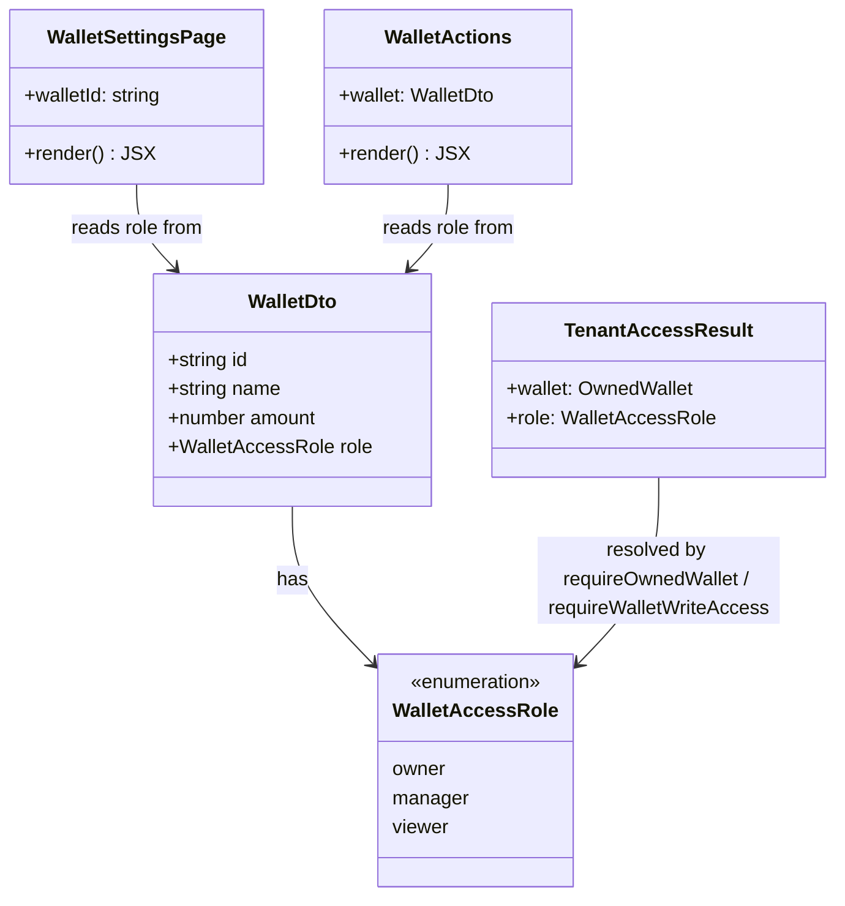

# Close Wallet Settings to Viewer Role

## Requirements

Prevent a `viewer`-role session from reaching the wallet settings surface at all —
route, navigation entry point, and any API path that isn't already owner-gated —
while leaving owner and manager settings access, and all viewer-accessible wallet-page
functionality (transactions, summary, attachments), unchanged.

## Entities

No new entities. `WalletDto.role` (`apps/ledger-box/src/queries/wallets/wallet.dto.ts:1-8`)
and the server-side `WalletAccessRole` resolved by `tenant-access.ts` already carry
everything this fix needs.

## Approach

1. **Client-side gating (route + navigation entry point)**:
   - This repo has no existing pattern for data-driven `beforeLoad` guards — the only
     `beforeLoad` in the tree (`apps/ledger-box/src/routes/_app/route.tsx:6-16`) checks
     session existence via `authClient.getSession()`, not wallet-scoped data, and no
     route puts `queryClient`/`queryOptions` into router context anywhere in the app.
     Introducing that pattern for a single guard would be a new architecture, not an
     extension of an existing one.
   - Instead, extend `WalletSettingsPage` (`wallet-settings-page.tsx`) with the same
     early-return style it already uses for `isPending`/`isError`/`!walletPreview`
     (lines 25-39): once `walletPreview.role === 'viewer'` resolves, redirect via
     `useNavigate`/`<Navigate>` to `/wallets/$walletId` before any section renders. This
     satisfies "the page does not render" in practice — the settings sections are never
     mounted for a viewer — without inventing a loader-level authorization pattern this
     codebase doesn't otherwise use.
   - Hide the settings gear in `wallet-actions.tsx` for `role === 'viewer'`, mirroring
     the existing `walletPreview.role === 'owner'` conditional already used for the
     activity section in `wallet-settings-page.tsx:67`.
   - Do **not** add a redundant `wallet.role` check inside each of the five section
     components (members, statement-shares, danger-zone, general). The page-level guard
     already prevents a viewer from mounting them; duplicating the check five more times
     is the kind of unnecessary abstraction the conservative-entity-design constraint
     rules out. (Activity already has its own conditional for a different reason — it's
     rendered inline alongside sections a manager _can_ see, not gating page entry — so
     it stays as-is.)

2. **API-side verification, not modification**:
   - Direct reads of all five backing handlers (`wallet.mts`, `wallet-members.mts`,
     `wallet-member.mts`, `wallet-statement-shares.mts`, `wallet-activity.mts`) confirm
     every one already rejects a viewer server-side: four via `requireOwnedWallet`
     (owner-only, 404) and rename via `requireWalletWriteAccess` (owner or manager only,
     403 for viewer). Given the "viewer only" scope decision, no handler changes are
     required. This phase adds only test coverage that pins down the existing, correct
     behavior — not new authorization code.

3. **Documentation correction**:
   - `AGENTS.md:75-79` ("Known gap — do not paper over it... An invited user signing in
     will not see the wallet") is stale: `requireWalletAccess`/`findAccessibleWallets`
     already grant real member read access. Correct this note as part of the same change
     so it stops instructing future contributors to treat member access as unbuilt.

## Structure

### Client (`apps/ledger-box/src`)

1. `modules/wallets/wallet-settings-page/wallet-settings-page.tsx` — add a viewer
   early-return redirect, positioned after the existing `isPending`/`isError`/
   `!walletPreview` guards (all of which must resolve `walletPreview` before the role
   check can run).
2. `modules/wallets/wallet-actions/wallet-actions.tsx` — conditionally render the
   settings gear `Button`/`Link` based on `wallet.role !== 'viewer'`.
3. No changes to `wallet-settings-members`, `wallet-settings-statement-shares`,
   `wallet-settings-danger-zone`, `wallet-settings-general` — they remain reachable only
   through the page that now gates entry.

### Server (`apps/ledger-box/netlify/functions`)

No handler changes. `lib/tenant-access.ts`'s `requireOwnedWallet` and
`requireWalletWriteAccess` remain the sole owner/role choke points, used exactly as they
are today by `wallet.mts`, `wallet-members.mts`, `wallet-member.mts`,
`wallet-statement-shares.mts`, `wallet-activity.mts`.

### Tests (`apps/ledger-box`)

New assertions added to the existing integration-style suite at
`netlify/functions/lib/tenant-access.test.ts` (which already exercises `db` directly and
uses `describe`/`it`/`expect`/`afterEach` from `vite-plus/test` — no HTTP-level or
`auth.api.getSession` mocking exists anywhere in the repo, so tests target the shared
helpers directly, consistent with the existing file, rather than introducing new mocking
infrastructure for a single fix).

### Docs

`AGENTS.md` — correct the stale "Known gap" paragraph.
`docs/changelog/mr-<NN>-viewer-settings-access-fix.md` (new) + `CHANGELOG.md` (append
under `## [Unreleased]`).

## Operations

### Update Component — `WalletSettingsPage`

1. Responsibility: gate the entire settings page behind non-viewer roles before
   rendering any section.
2. Location: `apps/ledger-box/src/modules/wallets/wallet-settings-page/wallet-settings-page.tsx`.
3. Logic:
   - After the existing guards (lines 25-39: pending spinner, error message, not-found
     message) and after `walletPreview` is confirmed non-null, add:
     - If `walletPreview.role === 'viewer'`, render `<Navigate to="/wallets/$walletId" params={{ walletId }} replace />` (TanStack Router's `Navigate` component, imported alongside the existing `Link` import) instead of the settings JSX. Do not render `WalletHeader` or any section in this branch.
   - Order matters: this check must come after `walletPreview` is guaranteed defined
     (it already is, past the `!walletPreview` branch), so no additional null-checking
     is introduced.
4. Constraints: no new props, no new hooks beyond what `useWallet`/`useWallets` already
   provide (`role` is already present on `WalletDto`).

### Update Component — `WalletActions` (settings gear)

1. Responsibility: hide the settings entry point for viewers on the wallet page itself.
2. Location: `apps/ledger-box/src/modules/wallets/wallet-actions/wallet-actions.tsx`.
3. Logic:
   - Wrap the existing gear `Button` (currently unconditional, lines 58-68) in a
     `{wallet.role !== 'viewer' ? (...) : null}` check, matching the conditional style
     already used elsewhere in this codebase for role-based rendering
     (`wallet-settings-page.tsx:67`).
4. Constraints: `wallet.role` is already available on the `WalletDto` prop this
   component already receives — no new data fetch.

### Add Tests — `tenant-access.test.ts`

1. Responsibility: pin down that every settings-adjacent authorization path already
   rejects a `viewer` role, so a future change can't silently regress it.
2. Location: `apps/ledger-box/netlify/functions/lib/tenant-access.test.ts`.
3. Test cases to add (following the file's existing pattern of inserting a real
   `wallet`, `walletMember` row, and cleaning up in `afterEach`):
   - `requireOwnedWallet` returns `ok: false` (`WALLET_NOT_FOUND`, 404) when called with
     the `tenantId` of an **active viewer member** on a wallet owned by someone else —
     covers the shared guard used by `wallet-members.mts`, `wallet-member.mts`,
     `wallet-statement-shares.mts`, `wallet-activity.mts`, and the `DELETE`
     branch of `wallet.mts`.
   - `requireOwnedWallet` returns `ok: false` for an **active manager member** on the
     same setup — confirms `requireOwnedWallet` is strict-owner regardless of member
     role (relevant since manager must NOT be excluded from settings via the page guard,
     but the four `requireOwnedWallet`-backed endpoints correctly stay owner-only
     regardless).
   - `requireWalletWriteAccess` returns `ok: false` (`READ_ONLY_ACCESS`, 403) for an
     active viewer member, and `ok: true` with `role: 'manager'` for an active manager
     member — covers the `PATCH /api/wallets/:walletId` (rename) path in `wallet.mts`,
     confirming manager retains write access there while viewer does not.
4. Constraints: reuse the file's existing helper setup/teardown conventions; no new test
   utilities, no mocking of `auth.api.getSession` (these are helper-level tests, not
   HTTP-level tests, consistent with the file's current scope).

### Update Documentation — `AGENTS.md`

1. Responsibility: remove the stale "Known gap" instruction so it stops telling future
   contributors that member access is unbuilt.
2. Location: `AGENTS.md`, "Non-negotiable: tenancy scoping" section, lines 75-79.
3. Logic: replace the "Known gap — do not paper over it" paragraph with a short note
   that member read access is implemented via `requireWalletAccess`/
   `findAccessibleWallets` in `tenant-access.ts`, and that wallet settings specifically
   are gated to non-viewer roles at both the route (`WalletSettingsPage`) and, where
   applicable, the API layer.

### Write Changelog

1. Responsibility: document this fix per the repo's changelog convention.
2. Locations:
   - `docs/changelog/mr-<NN>-viewer-settings-access-fix.md` — new file, following the
     existing per-merge changelog format (see recent files under `docs/changelog/`),
     covering: what changed (route guard, gear visibility, tests), which files, and the
     explicit statement that **no API-level data disclosure was found** — all
     settings-backing endpoints were already owner/role-correct server-side; this is a
     route/UX fix plus regression tests, not a security patch.
   - `CHANGELOG.md` — one delta-only entry appended under `## [Unreleased]`, newest
     first, matching the existing entries' one-line style.

## Norms

1. **Role checks**: always compare against `WalletAccessRole` literals (`'owner'` |
   `'manager'` | `'viewer'`) imported from `wallet.dto.ts` on the client and from
   `tenant-access.ts`'s exported type on the server — never introduce a new role-string
   union or boolean flag.
2. **Guard placement**: client-side role gating happens once, at the highest component
   that owns the data (`WalletSettingsPage` for the page, `WalletActions` for the entry
   point) — never re-derive or re-check role deeper in a component tree that's already
   behind a parent gate.
3. **Server-side authorization**: every wallet-scoped Netlify handler continues to route
   through `tenant-access.ts`'s exported helpers (`requireOwnedWallet`,
   `requireWalletWriteAccess`, `requireWalletAccess`, `requireTransactionAccess`,
   `requireTransactionWriteAccess`) — this fix adds no new helper and no inline
   authorization logic in any handler.
4. **Imports**: use `#/` alias in app/UI source (`import { WalletAccessRole } from
'#/queries/wallets/wallet.dto'`), never `@/` or long relative paths, per `AGENTS.md`.
5. **Test style**: new tests follow `tenant-access.test.ts`'s existing integration
   pattern — real `db` calls, explicit row insert in the test body, cleanup in
   `afterEach` — not a new mocking layer.
6. **Redirects**: use TanStack Router's `<Navigate>` / `router.navigate`, not
   `window.location`, consistent with the router-based navigation already used
   throughout `apps/ledger-box/src/routes` and `src/modules`.

## Safeguards

1. **Functional constraints**:
   - A `viewer` session navigating to `/wallets/$walletId/settings` (via gear click or
     direct URL) must land on `/wallets/$walletId` without any settings section
     mounting, even momentarily with stale/cached data.
   - Owner and manager settings access must be pixel-for-pixel unchanged — no new
     conditionals gate their path through `WalletSettingsPage` or `WalletActions`.
   - Wallet-page functionality for viewers (transactions, summary, attachments) must
     remain fully accessible — no new guard may be added anywhere that touches those
     surfaces.
2. **Business rule constraints**:
   - `manager` must retain full existing settings access (rename via
     `requireWalletWriteAccess`); this fix must not narrow manager's access anywhere,
     per the "viewer only" scope decision.
   - No new role, permission table, or RBAC abstraction may be introduced — reuse
     `owner`/`manager`/`viewer` and the existing `tenant-access.ts` helpers exactly as
     named.
3. **Integration constraints**:
   - Zero changes to any Netlify function handler's authorization logic — this fix is
     additive (tests) and client-only for the actual behavior change.
   - `AGENTS.md` edit must be scoped to the stale paragraph only — no other section of
     that file may be altered as part of this change.
4. **Data constraints**:
   - No new database columns, tables, or migrations — the fix uses `WalletDto.role`
     and the existing `WalletAccessRole` values as-is.
5. **Test constraints**:
   - Every new test must assert against real `requireOwnedWallet`/
     `requireWalletWriteAccess` return values (not mocked), consistent with
     `tenant-access.test.ts`'s existing style, and must clean up any inserted
     `wallet`/`walletMember` rows in `afterEach` to avoid cross-test pollution.
6. **Documentation constraints**:
   - The changelog must explicitly state that no data-disclosure bug was found in the
     API layer — do not default to "security fix" framing where the report does not
     support it; overstating severity is as much a documentation defect as
     understating it.
7. **Verification before completion**: run `vp check && vp test` (per `AGENTS.md`'s
   workflow section) before considering this change done; all three existing test files
   under `netlify/functions/lib/*.test.ts` must continue to pass alongside the new
   assertions.
