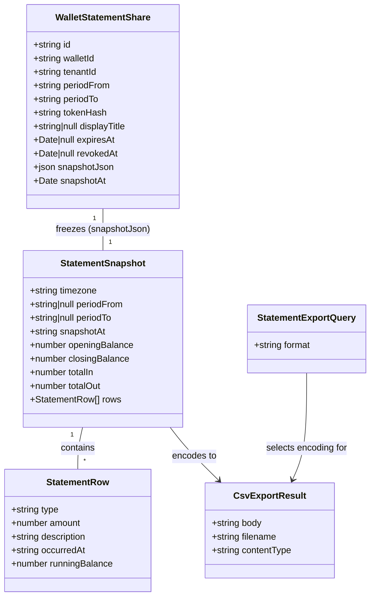

# Statement CSV Export

## Requirements

Let a wallet owner download an archivable, spreadsheet-native copy of a statement — either the frozen snapshot behind an existing share link or a fresh snapshot for a period they pick — and let a statement-share link recipient download the same frozen snapshot they're already viewing, without recomputing balances outside the existing statement builder.

## Entities

## Approach

1. **Encoder as a pure shared function**:
   - Add `encodeStatementCsv(snapshot: StatementSnapshot, displayTitle: string | null): string` to a new file `apps/ledger-box/src/lib/statement-export.ts`, sitting next to `statement.ts` — no DB or HTTP concerns, consumed identically by both the owner-authenticated path and the public token path.
   - This mirrors how `StatementSnapshotView` already consumes the same `StatementSnapshot` shape for on-screen rendering; the encoder is the text/csv counterpart, not a new computation path. `buildStatement` remains the single source of truth for balances.

2. **Three trigger points, two data sources — do not collapse them**:
   - **Public link download** (`GET /api/public/statements/:token?format=csv`): serves the share's already-frozen `snapshotJson` — must match exactly what the recipient sees on-screen. Reuses the existing token lookup, 404/410 checks, and per-share rate limit unchanged; `format` only changes the response encoding of the same authorized read.
   - **Owner download of an existing share** (`GET /api/wallets/:walletId/statement-shares/:shareId/export`, new route): owner does not retain the raw token after creation (only `tokenHash` is stored), so this cannot reuse the public URL — it needs its own tenant-scoped, `shareId`-keyed route. Serves the same frozen `snapshotJson` as the public link for that share, for consistency with what was shared.
   - **Owner download for an arbitrary period** (extends `POST /api/wallets/:walletId/statement-shares` when `?preview=true&format=csv`): computes a **fresh** snapshot via `buildStatement`, same as today's preview, but returns a CSV attachment instead of JSON instead of (or in addition to) persisting a share. Never persists a share row when only downloading.

3. **Format is a query parameter, not a new endpoint per format**: `?format=csv` (default remains `json` — omission changes nothing about current behavior). Chosen over `Accept`-header negotiation because a browser file download is a plain navigation (`<a href>`), which cannot set custom headers; a query string can. No new endpoint is created for the public and preview paths — only the shareId-keyed export route is genuinely new, because it addresses a request shape (owner + existing share, no token) that has no existing route.

4. **CSV structure**: opening/closing balance, period, timezone, and generation timestamp go in a **header block** (key-value lines) before the column header row — never as synthetic transaction rows, so a spreadsheet sum of the data rows can never silently double-count a balance line. Columns mirror `StatementSnapshotView`: date (wallet-timezone, `yyyy-MM-dd`), description, type, amount (signed, plain numeric), running balance (plain numeric). No compact ("1.2tr") notation — spreadsheets need parseable numbers.

5. **Encoding and safety**: UTF-8 with a leading BOM (``) so Excel on Windows renders Vietnamese text correctly without a manual import step. Every free-text field (`description`, `displayTitle`) is passed through a CSV-quoting function that also neutralizes leading `=`, `+`, `-`, `@` characters (prefix with `'`) to prevent formula injection when the file is opened in a spreadsheet application — `description` is unrestricted free text per `AGENTS.md` and must be treated as untrusted for this new sink.

6. **No PDF, no activity log entry**: PDF generation is out of scope for this pass (no new rendering dependency justified when CSV satisfies the archiving/forwarding need). Downloads are read-only and are not recorded in `wallet_activity_log`, consistent with the existing public/preview JSON reads today, which are also unlogged (only `accessCount`/`lastAccessedAt` counters move).

## Structure

### Inheritance Relationships

1. No new classes or interfaces — all new code is plain functions and Netlify Function handlers, matching the existing style (`statement.ts`, `public-statement.mts`, `wallet-statement-share.mts` are function modules, not classes).

### Dependencies

1. `public-statement.mts` calls `encodeStatementCsv` (new) from `#/lib/statement-export.ts`, in addition to its existing calls to `hashShareToken` and `db`.
2. `wallet-statement-shares.mts` calls `encodeStatementCsv` when handling `POST ?preview=true&format=csv`, in addition to its existing call to `buildStatement`.
3. New handler `wallet-statement-share-export.mts` depends on `db`, `auth`, `getTenantId`/`requireOwnedWallet` (`./lib/tenant-access.ts`), and `encodeStatementCsv`.
4. `statement-export.ts` depends only on the `StatementSnapshot`/`StatementRow` types from `#/lib/statement.ts` — no DB, no HTTP.
5. Owner-side UI (`wallet-settings-statement-shares.actions.tsx`, `wallet-statement-share-row.tsx`) triggers downloads via direct navigation/anchor to the new and extended endpoints — no new TanStack Query mutation needed for the file bytes themselves (a mutation may still wrap "create the share" as today; download is a plain link).

### Layered Architecture

1. **Netlify Function (handler) layer**: `public-statement.mts`, `wallet-statement-shares.mts`, `wallet-statement-share-export.mts` (new) — request parsing, auth/tenant/token checks, rate limiting, response headers (`Content-Type`, `Content-Disposition`).
2. **Domain/lib layer**: `statement.ts` (`buildStatement`, unchanged) and `statement-export.ts` (new: `encodeStatementCsv`, CSV field-escaping, filename derivation) — pure, framework-agnostic, unit-testable without a DB.
3. **Data access layer**: Kysely queries against `wallet`, `transaction`, `walletStatementShare` — unchanged, all existing.
4. **UI layer**: `wallet-settings-statement-shares.tsx` and `wallet-statement-share-row.tsx` add a download affordance (plain link/button) per share row and in the create/preview dialog; `statement-public-page.tsx` adds a download button using the same public URL with `?format=csv` appended.

## Operations

### Create Module - `apps/ledger-box/src/lib/statement-export.ts`

1. Responsibility: Encode a `StatementSnapshot` into a CSV file body, and derive a stable, distinguishing filename. Pure functions, no I/O.
2. Functions:
   - `escapeCsvField(value: string): string`
     - Logic:
       - If the value starts with `=`, `+`, `-`, or `@`, prefix it with `'` (neutralizes spreadsheet formula interpretation).
       - Wrap in double quotes and double any internal `"` if the value contains a comma, quote, or newline (standard CSV quoting).
       - Return the value unchanged (no quoting) otherwise.
   - `formatCsvAmount(amount: number): string`
     - Logic:
       - Return `amount.toFixed(0)` — VND has no minor unit in this app's stored values (see `buildStatement`, integer amounts); no thousands separators, no currency symbol, no compact notation.
   - `formatCsvDate(isoValue: string, timezone: string): string`
     - Logic:
       - Format using `Intl.DateTimeFormat` with `timeZone: timezone`, `year/month/day` numeric parts, joined as `yyyy-MM-dd`, matching `packages/utils/src/date` conventions used elsewhere. Handle `null` period bounds by returning an empty string (all-time export has no period date to show in the header, not per-row).
   - `encodeStatementCsv(snapshot: StatementSnapshot, displayTitle: string | null): string`
     - Logic:
       - Build a header block of `key,value` lines: `Statement` / `Period` (formatted range or `All time`) / `Timezone` / `Generated at` (formatted `snapshotAt` in `snapshot.timezone`) / `Opening balance` / `Closing balance` / `Total in` / `Total out`, using `displayTitle` as the `Statement` value when present, else a generic label.
       - Emit a blank separator line.
       - Emit a column header row: `Date,Description,Type,Amount,Running balance`.
       - Emit one row per `snapshot.rows` entry: formatted date, escaped description, `type`, signed `formatCsvAmount` (negative for `expense`), `formatCsvAmount(runningBalance)`.
       - Join all lines with `\r\n` (CSV convention, Excel-safe) and prepend the UTF-8 BOM character (``).
       - Return the complete string.
   - `buildStatementCsvFilename(snapshot: StatementSnapshot, walletName: string): string`
     - Logic:
       - Sanitize `walletName` to filesystem-safe ASCII-ish characters (strip/replace anything outside `[a-zA-Z0-9-_ ]`, collapse whitespace to `-`), since Vietnamese wallet names may contain diacritics that some OSes/browsers mishandle in `Content-Disposition`.
       - Compose `statement-{sanitizedWalletName}-{periodFrom-or-all-time}_{periodTo}-{snapshotAt-as-YYYYMMDDHHmm}.csv`; when `periodFrom`/`periodTo` are `null`, use `all-time` in place of the date range.
       - Return the filename.
3. Constraints: No DB access, no `fetch`, no dependency on Netlify `Request`/`Context` types — must be importable and testable in isolation.

### Update Handler - `apps/ledger-box/netlify/functions/public-statement.mts`

1. Responsibility: Add `format=csv` support to the existing unauthenticated, token-based statement read, without changing its auth, revocation, expiry, or rate-limit behavior.
2. Methods:
   - Extend the existing default handler:
     - Logic:
       - After the existing revoked/expired/wallet-deleted/rate-limit checks all pass (unchanged), read `format` from `new URL(request.url).searchParams.get('format')`.
       - If `format === 'csv'`: call `encodeStatementCsv(share.snapshotJson, share.displayTitle)`, call `buildStatementCsvFilename(share.snapshotJson, share.displayTitle ?? 'statement')`, and return a `Response` with that body, `Content-Type: text/csv; charset=utf-8`, and `Content-Disposition: attachment; filename="<name>"`.
       - Otherwise (unset or any other value): fall through to the existing `Response.json({ displayTitle, snapshot })` behavior unchanged.
       - The rate-limit counter increment and `accessCount`/`lastAccessedAt` update happen exactly once per request regardless of `format` (already the case — this logic sits before the format branch and is untouched).
3. Constraints: Do not duplicate the token/revoked/expired/rate-limit checks — the format branch must be the last step before response construction, not a parallel code path.

### Update Handler - `apps/ledger-box/netlify/functions/wallet-statement-shares.mts`

1. Responsibility: Add `format=csv` support to the `?preview=true` branch of the existing owner-authenticated `POST` handler, for arbitrary-period fresh downloads that do not persist a share.
2. Methods:
   - Extend the existing `POST` branch:
     - Logic:
       - After `buildStatement` computes `snapshot` (unchanged) and the existing `if (url.searchParams.get('preview') === 'true')` check is reached:
       - If additionally `url.searchParams.get('format') === 'csv'`: call `encodeStatementCsv(snapshot, displayTitle)` and `buildStatementCsvFilename(snapshot, wallet.name)`, return a `Response` with `text/csv` body and `Content-Disposition: attachment`, and **do not** fall through to persistence.
       - Otherwise: existing behavior unchanged (`Response.json({ preview: snapshot })` for preview, or persist-and-return-token for a non-preview `POST`).
       - `format=csv` without `preview=true` is not a supported combination for this route (persisting a share and returning a file body in one response is out of scope) — if both are absent/mismatched, existing JSON persistence behavior applies unchanged.
3. Constraints: `format=csv` must only take effect combined with `preview=true`; never persist a `walletStatementShare` row when returning a CSV body from this route.

### Create Handler - `apps/ledger-box/netlify/functions/wallet-statement-share-export.mts` (new)

1. Responsibility: Let the wallet owner download the frozen snapshot of one specific, already-created share by id, authenticated and tenant-scoped — the case the owner cannot reach via the public token URL because the raw token is not retained server-side.
2. Route: `GET /api/wallets/:walletId/statement-shares/:shareId/export`
3. Methods:
   - Default handler(request, context):
     - Logic:
       - Reject non-`GET` with `405`.
       - Resolve `session` via `auth.api.getSession`; `401` if absent (same pattern as `wallet-statement-shares.mts`).
       - Extract `walletId` and `shareId` from `context.params` (fallback to path-regex extraction matching the existing `getWalletId` helper pattern in `wallet-statement-shares.mts`, extended with a second segment).
       - Resolve `tenantId` via `getTenantId(session)`; call `requireOwnedWallet(tenantId, walletId)`; return its `error` if not `ok` (same 404-shaped response as every other owner-scoped wallet route — do not leak share existence to a non-owner).
       - Look up the share: `db.selectFrom('walletStatementShare').select(['id','walletId','displayTitle','snapshotJson']).where('id','=',shareId).where('walletId','=',walletId).executeTakeFirst()`; return `404` (`'Statement share not found'`) if absent — deliberately scoped by both `id` and `walletId` so a shareId from a different wallet the tenant also owns cannot cross wallets.
       - Note: unlike the public route, do **not** gate on `revokedAt`/`expiresAt` — an owner exporting their own revoked/expired share for records is a legitimate "for my own records" use case named in the original requirement's "why", and revocation only needs to stop _external_ access.
       - Call `encodeStatementCsv(share.snapshotJson, share.displayTitle)` and `buildStatementCsvFilename(share.snapshotJson, wallet.name)`.
       - Return `Response` with `text/csv; charset=utf-8` body and `Content-Disposition: attachment; filename="<name>"`.
4. Constraints: Must call `requireOwnedWallet` before any share lookup — no branch may query `walletStatementShare` without a prior tenant-ownership check on `walletId`, per `AGENTS.md`'s tenancy rule. No new DB writes, no activity log entry (read-only export, consistent with existing public/preview reads).

### Update Config - `apps/ledger-box/netlify.toml`

1. No changes required — Netlify Functions auto-register from files under `netlify/functions`; the new handler's `export const config: Config = { path: '/api/wallets/:walletId/statement-shares/:shareId/export' }` is sufficient, matching the existing `config` pattern in sibling files.

### Update UI - `apps/ledger-box/src/modules/wallets/wallet-settings-statement-shares/wallet-statement-share-row.tsx`

1. Responsibility: Add a "Download CSV" action per existing share row, linking to the new export endpoint.
2. Logic:
   - Render an anchor (`<a href="/api/wallets/{walletId}/statement-shares/{share.id}/export" download>`) or equivalent `Button asChild` pattern already used elsewhere in this codebase for navigations, alongside the existing revoke action.
   - No new query/mutation hook required — this is a direct browser navigation to an authenticated, cookie-scoped endpoint (better-auth session cookie is sent automatically), not a `fetch`.

### Update UI - `apps/ledger-box/src/modules/wallets/wallet-settings-statement-shares/wallet-settings-statement-shares.actions.tsx` and `.tsx`

1. Responsibility: Add a "Download CSV" action next to "Preview" in the create-share dialog, for the arbitrary-period fresh-download case.
2. Logic:
   - Add a handler that navigates to `POST`-shaped semantics is not directly linkable (POST cannot be a plain `<a href>`); instead trigger via `fetch` with the same body as `handlePreview` plus `format=csv` in the URL, read the response as a `Blob`, and create a temporary object URL to trigger the download (standard blob-download pattern) — because this specific case is a `POST` (period bounds in the body), not a `GET`, so it cannot use a plain anchor like the other two triggers.
   - Disable the button while `isPreviewing`/`isCreating` are true, mirroring existing disabled-state conventions in this file.

### Update UI - `apps/ledger-box/src/modules/statement/statement-public-page.tsx`

1. Responsibility: Offer the link recipient a "Download CSV" action on the public statement page.
2. Logic:
   - Render an anchor to the current page's token URL with `?format=csv` appended (`GET`, so a plain link works directly, consistent with how the page itself loads via `GET /api/public/statements/:token`).

## Norms

1. **Handler additions extend, never branch-duplicate**: every `format=csv` check must sit _after_ all existing auth/ownership/token/rate-limit/revocation logic in a handler, as a final response-shaping step — never as a parallel code path that re-implements those checks.
2. **CSV encoding lives in one place**: all CSV string construction (header block, field escaping, filename derivation) goes through `statement-export.ts`; no handler inlines its own `join(',')` or manual quoting.
3. **No new DTO/schema layer for `format`**: `format` is read directly via `URLSearchParams` in handlers (`.get('format') === 'csv'`) — do not add it to `statement-share.schema.ts` (Valibot), since it is a response-representation switch, not a validated business input.
4. **Filenames and header blocks always carry `timezone` and `snapshotAt`**, sourced from the snapshot itself (`snapshot.timezone`, `snapshot.snapshotAt`) — never from server wall-clock or request time — so two exports of the same period remain distinguishable and timezone-correct per `AGENTS.md`.
5. **Response headers**: `Content-Type: text/csv; charset=utf-8` and `Content-Disposition: attachment; filename="<sanitized-name>.csv"` on every CSV response, matching standard browser download-trigger conventions.
6. **No activity logging for export/download reads** — consistent with the existing unlogged public/preview JSON reads; do not call `recordActivity` from any of the new/extended handlers.
7. **Imports use `#/` for app code** (`#/lib/statement-export.ts`, `#/lib/statement.ts`), `./lib/...` for co-located Netlify function helpers (`./lib/tenant-access.ts`), per existing convention.

## Safeguards

1. **Functional Constraints**: `format=csv` support is additive — omitting the `format` param must reproduce today's exact JSON response on all three extended/new routes; existing consumers (settings preview dialog, public page JSON fetch) must not observe any behavior change.
2. **Performance Constraints**: CSV generation must not introduce additional DB queries beyond what `buildStatement` (fresh path) or the existing share lookup (frozen path) already perform — encoding is in-memory string building only. No pagination is introduced in this pass; the pre-existing unbounded-row-count behavior of `buildStatement` is inherited as-is and not solved here.
3. **Security Constraints**: All free-text fields (`description`, `displayTitle`) written into the CSV body must pass through `escapeCsvField`'s formula-injection neutralization before being written — no exceptions. The new `shareId`-keyed export route must call `requireOwnedWallet` before any `walletStatementShare` query; a `shareId` belonging to a wallet the tenant does not own must return the same `404 Wallet not found` as any other owner-scoped route, never a `403` that would confirm the share's existence.
4. **Integration Constraints**: The public-route CSV branch must not alter the rate-limit accounting logic — a `format=csv` request consumes from the identical 60-req/min-per-share budget as a JSON request, using the exact same counter-update code path.
5. **Business Rule Constraints**: A CSV response for an existing share (public link or owner `shareId` export) must always reflect the share's frozen `snapshotJson` — never a freshly recomputed statement — so the downloaded file matches what was/is displayed for that share. A CSV response from the `?preview=true&format=csv` branch must always be freshly computed via `buildStatement` and must never be persisted as a `walletStatementShare` row.
6. **Data Constraints**: CSV amount fields are plain integers (no thousands separators, no currency symbol, no compact "tr"/"k" notation) so the file parses as numeric data in spreadsheet software without transformation. Dates are `yyyy-MM-dd` in the snapshot's wallet timezone, never UTC or server-local time.
7. **API Constraints**: New/extended routes are `GET` for all token-based and shareId-based reads (public link download, owner existing-share export) and remain `POST` only for the arbitrary-period fresh-download case (period bounds must be transmitted in a body, consistent with the existing preview/create contract) — no route design should force period bounds into a `GET` query string in this pass.
8. **Filename Constraints**: Filenames must be derived deterministically from wallet name + period + `snapshotAt`, sanitized to strip characters unsafe in `Content-Disposition` (non-ASCII, path separators, control characters) — a wallet with a Vietnamese diacritic name must still produce a valid, non-empty filename.
