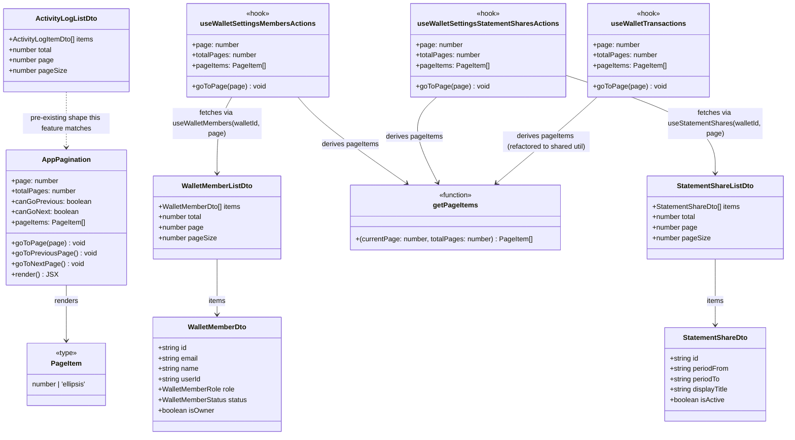

# Server-Side Pagination for Wallet Members and Statement Shares

## Requirements

Add pagination to the Members and Statement Shares settings sections, which previously
fetched their entire list in one request and rendered it all at once (unlike Activity,
which already paginated server-side). Members and Statement Shares must page the same
way Activity does — page/pageSize query params, a `{ items, total, page, pageSize }`
response shape, and Previous/Next + numbered controls in the UI — without changing any
existing list ordering, filtering, or mutation behavior. A reusable pagination UI and
page-number-list utility must be extracted so all three sections (and Transactions,
which already had its own bespoke pagination) share one implementation instead of three
near-duplicates.

## Entities

`ActivityLogListDto` and its route/hook (`wallet-activity.mts`, `useWalletActivity`) were
**not modified** — they already had this exact shape and pagination model; this feature
brings Members and Statement Shares in line with it, and additionally moves Activity's
UI from ad-hoc Previous/Next buttons onto the new shared `AppPagination`.

## Approach

1. **Backend pagination — mirror the existing Activity endpoint's contract exactly**:
   `page`/`pageSize` query params (`page` defaults to 1, clamped to `>= 1`; `pageSize`
   defaults to 20, clamped to `[1, 100]`), `limit`/`offset` on the primary query, a
   parallel `count(id)` query, response body `{ items, total, page, pageSize }`.
2. **Members endpoint has one wrinkle Activity and Statement Shares don't**: the wallet
   owner is a synthetic first entry (`mapOwnerMember(ownerUser)`), never a row in
   `walletMember`. Pagination must treat it as slot 0 of the _combined_ list rather than
   paginating the DB query independently and prepending the owner every page (which
   would duplicate the owner onto every page and under-count `total`). See Operations for
   the exact offset arithmetic.
3. **Frontend query hooks take `page` into the query key** (`['wallet-members', walletId,
page]`, `['wallets', walletId, 'statement-shares', page]`) so each page caches
   independently and mutation `invalidateQueries({ queryKey: ['wallet-members', walletId]
})` (unchanged, prefix-only) still invalidates every cached page — no mutation-side
   changes were needed.
4. **Extract, don't duplicate, pagination UI/logic**: `wallet-transactions` already had a
   full-featured pager (`getPageItems` producing `1 … 4 5 6 … 12`-style windows,
   Previous/Next, a `WalletPagination` presentational component). Rather than write a
   second copy for Members and a third for Statement Shares, `getPageItems`/`PageItem`
   moved to `src/lib/pagination.ts` and `WalletPagination` was generalized and moved to
   `src/components/app-pagination.tsx` as `AppPagination` — a page-count/`Button`-based
   Previous/Next pair was tried first for Members and Statement Shares (simpler, no
   numbered pages) but replaced with `AppPagination` once the reuse opportunity was
   identified, so all four paginated lists (Transactions, Members, Statement Shares,
   Activity) now render identically.
5. **Client-side slicing was the very first iteration** for Members and Statement Shares
   (fetch the full array once, `Array.prototype.slice` per page client-side) since their
   endpoints didn't paginate yet. That was replaced end-to-end by real server-side
   pagination once the endpoints were updated — no client-side slicing remains anywhere
   in the shipped code.

## Structure

### Server (`apps/ledger-box/netlify/functions`)

1. `wallet-members.mts` — `GET` handler rewritten: reads `page`/`pageSize` from the URL,
   runs a `count(id)` query (`walletMember` where `walletId` + `deletedAt is null`) to get
   `memberCount`, computes `total = memberCount + 1` (the synthetic owner), then computes
   `combinedOffset`/`includeOwner`/`dbOffset`/`dbLimit` (see Operations) before querying
   `walletMember` with `.limit(dbLimit).offset(dbOffset)` — skipped entirely
   (`dbLimit === 0` guard) when a page needs zero DB rows. Returns `{ items, total, page,
pageSize }` instead of a bare array.
2. `wallet-statement-shares.mts` — `GET` handler rewritten: reads `page`/`pageSize`, runs
   the existing shares query with `.limit(pageSize).offset(offset)` in parallel
   (`Promise.all`) with a new `count(id)` query, returns `{ items, total, page, pageSize
}` instead of `{ items }`.
3. No changes to either endpoint's `POST`/other methods, to `wallet-activity.mts` (already
   correct), or to `lib/tenant-access.ts`.

### Client (`apps/ledger-box/src`)

1. `src/lib/pagination.ts` (**new**) — `PageItem` type and `getPageItems(currentPage,
totalPages)`, moved verbatim out of `wallet-transactions.actions.tsx`.
2. `src/components/app-pagination.tsx` (**new**) — `AppPagination`, generalized from the
   deleted `src/modules/wallets/wallet-transactions/wallet-pagination.tsx`
   (`WalletPagination`); same props (`page`, `totalPages`, `canGoPrevious`, `canGoNext`,
   `pageItems`, `goToPage`, `goToPreviousPage`, `goToNextPage`), wraps
   `@vhnam/ui/components/pagination`'s `Pagination`/`PaginationContent`/`PaginationItem`/
   `PaginationLink`/`PaginationPrevious`/`PaginationNext`/`PaginationEllipsis` primitives
   (pre-existing in `packages/ui`, previously used only by `WalletPagination`).
3. `src/modules/wallets/wallet-transactions/wallet-pagination.tsx` — **deleted**;
   `wallet-transactions.tsx` now imports `AppPagination` from `#/components/app-pagination`
   instead.
4. `src/modules/wallets/wallet-transactions/wallet-transactions.actions.tsx` — local
   `PageItem` type and `getPageItems` function removed; imports `getPageItems` from
   `#/lib/pagination` instead. Hook's return shape unchanged.
5. `src/queries/wallets/wallet-member.dto.ts` — added `WalletMemberListDto = { items:
WalletMemberDto[], total: number, page: number, pageSize: number }`.
6. `src/queries/wallets/wallet-member.api.ts` — `fetchWalletMembers(walletId, page = 1,
pageSize = 10)` now sends `{ params: { page, pageSize } }` and returns
   `WalletMemberListDto` (was: no params, returned `WalletMemberDto[]` directly).
7. `src/queries/wallets/wallet-member.queries.ts` — `useWalletMembers(walletId, page = 1)`;
   query key becomes `['wallet-members', walletId, page]` (was: `['wallet-members',
walletId]`).
8. `src/queries/statement-shares/statement-share.dto.ts` — added `StatementShareListDto =
{ items: StatementShareDto[], total: number, page: number, pageSize: number }`.
9. `src/queries/statement-shares/statement-share.api.ts` — `fetchStatementShares(walletId,
page = 1, pageSize = 10)` now sends `{ params: { page, pageSize } }` and returns the
   full `StatementShareListDto` (was: returned only `data.items` as `StatementShareDto[]`,
   discarding total/page/pageSize).
10. `src/queries/statement-shares/statement-share.queries.ts` —
    `useStatementShares(walletId, page = 1)`; query key becomes `['wallets', walletId,
'statement-shares', page]`.
11. `wallet-settings-members.actions.tsx` — owns `page` state (`useState(1)`); derives
    `members = data?.items ?? []`, `totalPages`, `pageItems` (via `useMemo` +
    `getPageItems`), `canGoPrevious`/`canGoNext`, and `goToPage`/`goToPreviousPage`/
    `goToNextPage` (clamped `goToPage`, `Previous`/`Next` delegate to it); exposes all of
    these plus `isFetchingMembers` (was: `isLoadingMembers` only) from the hook.
12. `wallet-settings-members.tsx` — renders `AppPagination` (guarded by `totalPages > 1`)
    instead of the two hand-rolled `Button`s it briefly had; no client-side slicing.
13. `wallet-settings-statement-shares.actions.tsx` / `.tsx` — identical shape to Members
    (`page`, `totalPages`, `pageItems`, `canGoPrevious`, `canGoNext`, `goToPage`,
    `goToPreviousPage`, `goToNextPage`, `isFetchingShares`), rendering `AppPagination`.
14. `wallet-settings-activity.tsx` — **not required by this feature** (already paginated
    server-side) but brought along for UI consistency: replaced its own inline
    Previous/Next `Button` pair with `AppPagination`, using the same `getPageItems`
    derivation as the other three.

## Operations

### Update Route Handler — `wallet-members.mts` `GET` (**updated**)

1. Responsibility: return one page of wallet members, with the synthetic owner entry
   correctly represented in `total` and placed only on the page it belongs on.
2. Logic:
   - Parse `page = max(1, parseInt(page) || 1)`, `pageSize = min(100, max(1, parseInt(pageSize) || 20))`.
   - `memberCount = count(walletMember where walletId = :walletId and deletedAt is null)`.
   - `total = memberCount + 1`.
   - `combinedOffset = (page - 1) * pageSize`.
   - `includeOwner = combinedOffset === 0` (true only on page 1, for any pageSize).
   - `dbOffset = includeOwner ? 0 : combinedOffset - 1` (accounts for the owner occupying
     slot 0 on page 1).
   - `dbLimit = includeOwner ? pageSize - 1 : pageSize`.
   - If `dbLimit > 0`, query `walletMember` (`where walletId + deletedAt is null`, `order
by createdAt asc`, `.limit(dbLimit).offset(dbOffset)`); otherwise skip the query
     entirely (empty `pageSize` edge case).
   - Map each row through the existing `mapWalletMember` (unchanged).
   - `items = includeOwner ? [mapOwnerMember(ownerUser), ...memberResponses] :
memberResponses`.
   - Respond `{ items, total, page, pageSize }`.
3. Constraints: the owner must never be duplicated onto more than one page, and `total`
   must count the owner exactly once regardless of `pageSize`.

### Update Route Handler — `wallet-statement-shares.mts` `GET` (**updated**)

1. Responsibility: return one page of statement shares.
2. Logic: parse `page`/`pageSize` identically to Members; run the existing shares
   `select` with `.limit(pageSize).offset((page - 1) * pageSize)` and a `count(id)` query
   in parallel via `Promise.all`; respond `{ items: shares.map(...isActive...), total,
page, pageSize }`.
3. Constraints: `isActive` mapping logic is unchanged; only the query's limit/offset and
   response envelope changed.

### Extract Utility — `src/lib/pagination.ts` (**new**)

1. Responsibility: single source of truth for the numbered-page-with-ellipsis windowing
   algorithm, previously private to `wallet-transactions.actions.tsx`.
2. Logic: `getPageItems(currentPage, totalPages)` — returns `[]` if `totalPages <= 0`;
   returns `[1..totalPages]` if `totalPages <= 7`; otherwise returns `[1, ...maybe
'ellipsis', ...currentPage±1 window clamped to [2, totalPages-1], ...maybe 'ellipsis',
totalPages]`. Unchanged algorithm, moved verbatim.
3. Constraints: pure function, no React/DOM dependency, so it's importable from both hook
   files and any future paginated list.

### Extract Component — `src/components/app-pagination.tsx` (**new**)

1. Responsibility: render a page-count label plus a full `Pagination` control (Previous /
   numbered links with ellipsis / Next), driven entirely by props — no internal state, no
   data fetching.
2. Props: `page`, `totalPages`, `canGoPrevious`, `canGoNext`, `pageItems: PageItem[]`,
   `goToPage(page)`, `goToPreviousPage()`, `goToNextPage()`.
3. Logic: unchanged from the deleted `WalletPagination` — renders `@vhnam/ui`'s
   `Pagination`/`PaginationContent` wrapping a `PaginationPrevious`, one
   `PaginationLink`/`PaginationEllipsis` per `pageItems` entry (active page highlighted via
   `isActive={item === page}`), and a `PaginationNext`; disabled state driven by
   `canGoPrevious`/`canGoNext` via `pointer-events-none opacity-50`.
4. Constraints: must stay presentational/generic — no wallet- or section-specific naming
   or imports, so any future paginated list (not just the current four) can reuse it
   without modification.

### Update Hooks — `useWalletSettingsMembersActions`, `useWalletSettingsStatementSharesActions` (**updated**)

1. Responsibility: own pagination state for their section and expose the full
   `AppPagination`-compatible prop set alongside existing section-specific state/handlers.
2. Logic (identical shape in both hooks):
   - `const [page, setPage] = useState(1)`.
   - Fetch via `useWalletMembers(walletId, page)` / `useStatementShares(walletId, page)`,
     destructuring `data`, `isPending` (renamed to `isLoadingMembers`/`isLoadingShares`),
     and `isFetching` (renamed to `isFetchingMembers`/`isFetchingShares`, newly exposed).
   - `items = data?.items ?? []`; `totalPages = data ? max(1, ceil(data.total /
data.pageSize)) : 1`.
   - `pageItems = useMemo(() => getPageItems(page, totalPages), [page, totalPages])`.
   - `canGoPrevious = page > 1`; `canGoNext = page < totalPages`.
   - `goToPage(nextPage)`: no-op if `nextPage < 1 || nextPage > totalPages`, else
     `setPage(nextPage)`. `goToPreviousPage`/`goToNextPage` delegate to `goToPage(page ∓
1)`.
3. Constraints: no change to any existing mutation call, invite/role/revoke/create/preview
   flow, or the `resetCreateFlow`/dialog logic in Statement Shares' hook — pagination is
   additive state alongside the pre-existing return shape.

### Update Components — `wallet-settings-members.tsx`, `wallet-settings-statement-shares.tsx`, `wallet-settings-activity.tsx` (**updated**)

1. Responsibility: render `AppPagination` when `totalPages > 1`, passing through the
   hook's pagination fields; otherwise unchanged (loading spinner, empty state, list
   rendering, dialogs).
2. Logic: replace any Previous/Next `Button` pair (or, in the initial iteration for
   Members/Statement Shares, client-side `.slice()` pagination) with a single
   `<AppPagination page totalPages canGoPrevious canGoNext pageItems goToPage
goToPreviousPage goToNextPage />`.
3. Constraints: list rendering (`WalletMemberRow`, `WalletStatementShareRow`,
   `ActivityRow`) must map over the _paginated_ `items`/`data.items` returned by the
   query, never over a locally-sliced subset.

## Norms

1. **Pagination contract is uniform across every paginated list**: `page`/`pageSize`
   query params (1-indexed, `pageSize` clamped `[1, 100]`, defaulting to 20 server-side /
   10 client-side-requested), response `{ items, total, page, pageSize }`. Any new
   paginated endpoint must follow this exact shape rather than inventing a new one.
2. **Query key includes `page`** for every paginated TanStack Query hook
   (`['resource', ...scopeIds, page]`), so React Query caches per-page and mutation
   invalidation continues to work via key-prefix matching without any special-casing.
3. **No client-side slicing of a fully-fetched list** to fake pagination — if a list needs
   pagination, the endpoint must paginate; extending a payload's mapping (`.slice()`) in
   the component is not an acceptable substitute, even temporarily, once the endpoint
   supports real pagination.
4. **One shared pagination utility and one shared pagination component** —
   `getPageItems`/`PageItem` (`#/lib/pagination`) and `AppPagination`
   (`#/components/app-pagination`) — for every list-with-pages in this app. Do not write a
   section-local copy of either.
5. **Imports**: unchanged — `#/` alias only, per `AGENTS.md`.

## Safeguards

1. **Functional constraints**:
   - The wallet owner must appear exactly once across all pages of the Members list, on
     page 1 only, at index 0, for every `pageSize`.
   - `total` for Members must equal `memberCount + 1` (never `memberCount`, never counting
     the owner more than once).
   - Every list-consuming component must render `data.items`/`members`/`shares` as
     returned by the current page's query response — never a client-computed subset of a
     larger cached array.
2. **Business rule constraints**:
   - Pagination must not alter ordering: Members stay ordered by `createdAt asc` (owner
     first), Statement Shares by `createdAt desc`, Activity by `createdAt desc` — all
     unchanged from pre-pagination behavior.
   - Invite/role-change/remove/resend (Members) and preview/create/download/revoke
     (Statement Shares) mutations are unaffected by pagination; their `invalidateQueries`
     calls continue to use the unpaginated key prefix (`['wallet-members', walletId]`,
     `['wallets', walletId, 'statement-shares']`) so every cached page is invalidated,
     never just the currently-viewed page.
3. **Integration constraints**:
   - `pageSize` must be clamped server-side to `[1, 100]` regardless of what the client
     requests, to prevent an unbounded `limit`.
   - No change to `requireOwnedWallet`/`tenant-access.ts` authorization on either endpoint.
4. **UI constraints**:
   - `AppPagination`'s Previous/Next must be disabled (not merely visually dimmed) while
     `isFetchingMembers`/`isFetchingShares` is true, to prevent a double page-change
     request mid-fetch.
   - `AppPagination` must only render when `totalPages > 1` — a single-page list must not
     show pagination controls.
5. **Verification before completion**: `vp check`/`tsc --noEmit` and `vp test` (existing
   suite) must pass after every change; both were run and passed clean after the final
   iteration.
