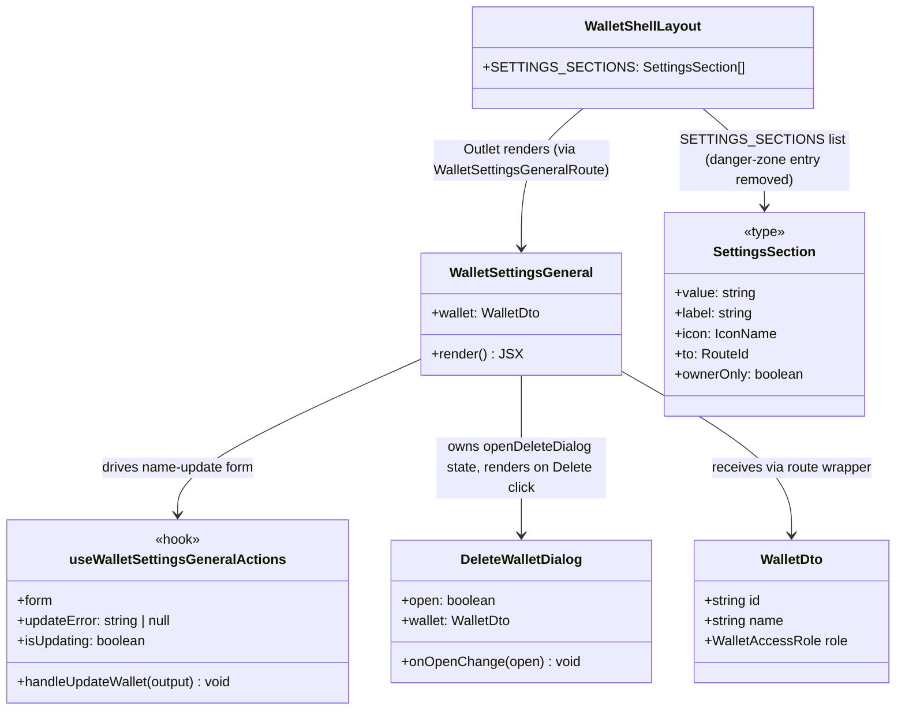

# Merge Danger Zone into General Settings

## Requirements

Fold the standalone "Danger zone" settings section (its own route, nav item, and module)
into "General" as a second section on the same page, following a GitHub-style
settings-page layout (bordered page header, a labeled field section, then a distinct
bordered danger-zone card), and remove the danger-zone route/nav entry entirely — without
changing the delete-wallet flow (`DeleteWalletDialog`), its confirmation behavior, or the
general-info update flow.

## Entities

**Removed entirely**: `WalletSettingsDangerZone` (component), `WalletSettingsDangerZoneRoute`
(route wrapper), the `wallet-settings-danger-zone` module folder and its `index.ts`
barrel, the `/wallets/$walletId/settings/danger-zone` route file, and the `danger-zone`
entry from `WalletShellLayout`'s `SETTINGS_SECTIONS`. `DeleteWalletDialog` (owned by
`src/modules/wallets/delete-wallet-dialog`) is unchanged and now reused as-is from
`WalletSettingsGeneral` instead of from the deleted `WalletSettingsDangerZone`.

## Approach

1. **Merge, don't just relocate**: `WalletSettingsDangerZone`'s JSX (heading, description,
   bordered destructive row, `DeleteWalletDialog` + its `openDeleteDialog` state) was
   moved into `WalletSettingsGeneral` as a second section, not left as a separately
   imported subcomponent — there is now exactly one component/module for General, with no
   `wallet-settings-danger-zone` folder left behind.
2. **Route/nav removal is structural, not cosmetic**: `routes/_app/wallets/$walletId/settings/danger-zone.tsx`
   was deleted (not redirected), and the `danger-zone` entry was removed from
   `WalletShellLayout`'s `SETTINGS_SECTIONS` array — a stale deep link to
   `/settings/danger-zone` now 404s via the router's normal not-found handling rather than
   redirecting to General. `routeTree.gen.ts` was regenerated (`vp build`) so the deleted
   route is fully gone from the router's type-safe route map, not just unreachable from
   the nav.
3. **`destructive` styling on `SettingsSection` was dead code once the entry was removed**
   — the `destructive?: boolean` field and its two conditional `className` branches
   (desktop sidebar item, mobile tab trigger) were removed from `WalletShellLayout`
   rather than left as an unused flag, since no other section needs it.
4. **GitHub-style layout, iterated once from the first merge**: the first pass merged the
   two sections with a plain `<Separator />` between two loosely-styled blocks (matching
   the pre-existing pattern used by other settings sections). Once shown the target
   GitHub Settings screenshot, the layout was revised to: (a) a `border-b` under the page
   `<h1>` title, (b) the Wallet name section as its own `border-b`-terminated subsection
   with an `h2` label and the Save button placed inline next to the input (not
   right-aligned below the field, as the original General form had it), and (c) Danger
   Zone as a single `rounded-lg border border-destructive` card containing its own header
   strip (`border-b border-destructive`) and the delete row below it — not a red-bordered
   row floating under a separate heading, which was the original Danger Zone module's
   style and the first merge attempt's style.

## Structure

### Client (`apps/ledger-box/src`)

1. `src/modules/wallet-settings/wallet-settings-general/wallet-settings-general.tsx`
   (`WalletSettingsGeneral`) — rewritten:
   - Now imports `DeleteWalletDialog` (from `#/modules/wallets/delete-wallet-dialog`) and
     owns `const [openDeleteDialog, setOpenDeleteDialog] = useState(false)`, both moved
     from the deleted `WalletSettingsDangerZone`.
   - Top-level layout: `<h1 className="font-heading border-b pb-4 text-2xl font-semibold">General</h1>`,
     then a `border-b pb-8` wrapper containing an `h2` ("Wallet name") and the existing
     `Form`/`FieldGroup`/`FormField` name-update flow (unchanged `useWalletSettingsGeneralActions`
     logic; only the JSX around it changed — the Save `Button` moved from a right-aligned
     `Field` below the input to inline (`flex items-start gap-2`) beside it, and its label
     text changed from `"Save changes"`/`"Saving..."` to `"Save"`/`"Saving..."`), then a
     `rounded-lg border border-destructive` card (header strip with `h2` "Danger Zone" +
     `border-b border-destructive`, then a row with a description paragraph and a
     `variant="destructive"` "Delete wallet" `Button` that opens `DeleteWalletDialog`).
   - `Card`/`CardHeader`/`CardTitle`/`CardDescription`/`CardContent` (used by an earlier
     version of this component, before the div/`h1`+`Separator` pattern already adopted by
     the other four settings sections) are not reintroduced — the merged component follows
     the same plain-div section pattern as Members/Activity/Statement Shares, just with
     GitHub-style borders instead of `<Separator />`.
2. `src/modules/wallet-settings/wallet-settings-danger-zone/` — **entire folder deleted**
   (`wallet-settings-danger-zone.tsx`, `wallet-settings-danger-zone-route.tsx`,
   `index.ts`).
3. `src/routes/_app/wallets/$walletId/settings/danger-zone.tsx` — **deleted**.
4. `src/modules/wallets/wallet-shell-layout/wallet-shell-layout.tsx` (`WalletShellLayout`):
   - `SettingsSection.to` union loses the `'/wallets/$walletId/settings/danger-zone'`
     member.
   - `SettingsSection.destructive?: boolean` field removed.
   - The `{ value: 'danger-zone', label: 'Danger zone', icon: 'TrashIcon', to:
'/wallets/$walletId/settings/danger-zone', ownerOnly: false, destructive: true }`
     entry removed from `SETTINGS_SECTIONS`.
   - The two `section.destructive && ...` conditional class branches (desktop sidebar
     `Button`, mobile `TabsTrigger`) removed from their respective `cn(...)` calls.
5. `src/routeTree.gen.ts` — regenerated via `vp build` (auto-generated by
   `@tanstack/router-plugin/vite`); no longer contains any `danger-zone` route entry.

### Server

No changes — this is a client-only route/component consolidation; `DeleteWalletDialog`'s
underlying delete-wallet mutation and its API endpoint are untouched.

## Operations

### Merge Component — `WalletSettingsGeneral` (**updated**)

1. Responsibility: render both the wallet name update form and the destructive
   delete-wallet action as two sections of one settings page.
2. Logic:
   - Keep `useWalletSettingsGeneralActions({ wallet })` exactly as-is for the name form
     (`form`, `updateError`, `isUpdating`, `handleUpdateWallet`).
   - Add local `openDeleteDialog` state (moved from the deleted component, unchanged
     semantics: `Button onClick={() => setOpenDeleteDialog(true)}` opens it,
     `DeleteWalletDialog`'s `onOpenChange` closes it).
   - Render order: page header → Wallet name section (bordered subsection) → Danger Zone
     card → `DeleteWalletDialog` (rendered as a sibling via a fragment, matching the
     deleted component's `<>...</>` pattern, since dialogs render outside the visual flow).
3. Constraints: `handleUpdateWallet`/name-form validation, error display, and success/error
   toasts must be byte-for-byte the same as before the merge — only the surrounding JSX
   structure and the Save button's visual placement/label changed. The delete flow
   (confirmation copy, mutation, toasts) inside `DeleteWalletDialog` itself is entirely
   unchanged — this operation only relocates who renders/opens it.

### Delete Module — `wallet-settings-danger-zone` (**removed**)

1. Responsibility (former): standalone Danger Zone section + route wrapper.
2. Logic: folder and all three files deleted; every import of
   `#/modules/wallet-settings/wallet-settings-danger-zone` removed (there was exactly one
   call site, `WalletShellLayout`'s route-to-component mapping is index/route-file driven,
   not a direct import — the direct import lived only in the deleted route file itself).
3. Constraints: `grep -rn "danger-zone|DangerZone"` across `apps/ledger-box/src` must
   return zero matches after this operation — verified.

### Delete Route — `settings/danger-zone.tsx` (**removed**)

1. Responsibility (former): thin `createFileRoute('/_app/wallets/$walletId/settings/danger-zone')`
   wrapper delegating to `WalletSettingsDangerZoneRoute`.
2. Logic: file deleted; `vp build` run afterward to regenerate `routeTree.gen.ts` without
   this route (TanStack Router's file-based codegen, not a manually-edited generated
   file).
3. Constraints: no redirect was added from the old path to `/settings/general` — a stale
   bookmark to `/settings/danger-zone` now resolves as not-found, matching how any other
   deleted route in this app behaves; this was a deliberate choice, not an oversight (see
   Safeguards).

### Update Nav Config — `WalletShellLayout` `SETTINGS_SECTIONS` (**updated**)

1. Responsibility: settings nav (desktop sidebar + mobile tab strip) must no longer offer
   a Danger Zone entry point.
2. Logic: remove the `danger-zone` object from `SETTINGS_SECTIONS`; narrow
   `SettingsSection.to`'s union type to the remaining four route ids; remove the
   `destructive?: boolean` field and both `section.destructive && ...` conditional
   className branches in the desktop/mobile render blocks.
3. Constraints: the remaining four sections' `ownerOnly`/icon/label/route values are
   unchanged; only the fifth entry and the now-dead `destructive` styling path were
   removed.

## Norms

1. **One module per settings section, one section per route** — unchanged norm from the
   original per-section-routes design, now with four sections instead of five. A settings
   concern that doesn't need its own URL (like Danger Zone, which is always reached via
   General, never linked to directly) belongs inside an existing section's component, not
   its own module/route.
2. **Settings section visual pattern**: page `<h1>` with a `border-b`, one or more
   subsections separated by `border-b`, and any destructive action rendered as a
   `rounded-lg border border-destructive` card with its own header strip — not a
   `<Separator />`-divided flat list. Apply this pattern to any future settings page that
   mixes a normal action with a destructive one, rather than reintroducing the
   `Card`/`CardHeader` pattern or a bare bordered row.
3. **Generated files are not hand-edited**: `routeTree.gen.ts` changes only via `vp build`
   (or `vp dev`'s file watcher), never a manual diff — confirmed by regenerating it after
   the route deletion rather than editing it directly.
4. **Imports**: unchanged — `#/` alias only, per `AGENTS.md`.

## Safeguards

1. **Functional constraints**:
   - `DeleteWalletDialog`'s open/close/confirm/mutate behavior must be identical to before
     the merge — only its trigger button's owning component changed.
   - The wallet name update form's validation, error surfacing, and success/error toast
     copy must be unchanged.
2. **Business rule constraints**:
   - No new role gating: Danger Zone (now inside General) remains reachable by the same
     roles as before (`owner`/`manager`; viewers are excluded from all of
     `/settings/*` by the pre-existing `WalletShellLayout` guard, unaffected by this
     change).
3. **Integration constraints**:
   - No server/API changes — the delete-wallet mutation and its endpoint are untouched.
   - `grep -rn "danger-zone|DangerZone"` must return no results in `apps/ledger-box/src`
     after this change (verified) — a leftover reference would indicate an incomplete
     removal.
4. **UI constraints**:
   - A direct navigation to `/wallets/$walletId/settings/danger-zone` after this change
     must not silently succeed or redirect — it must 404 via the router's standard
     not-found handling, signaling the URL no longer exists rather than papering over it.
   - The Danger Zone card must visually read as a single bounded unit (full
     `border-destructive` outline with an internal header divider), not a separate
     heading floating above an unrelated bordered row.
5. **Verification before completion**: `tsc --noEmit` (`pnpm --filter ledger-box exec tsc
--noEmit -p apps/ledger-box/tsconfig.json`) and `vp test` must pass after the merge and
   after the route/nav removal; both were run and passed clean. `vp build` was run once to
   regenerate `routeTree.gen.ts`, and its `dist/` output was removed afterward (not a
   tracked artifact).
