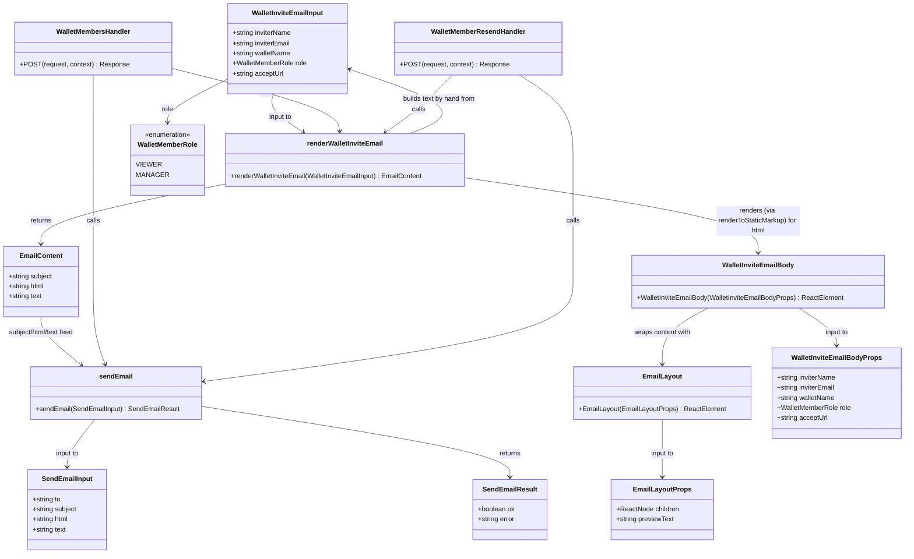

# Extract Email Templates Into Typed, Previewable, Component-Authored Modules

## Requirements

**Phase 1 (shipped, MR 18):** relocate outbound email content into a dedicated, typed
template module structure — decoupled from the Resend send path and from the Netlify
handlers that trigger sends — so that changing an email's copy is a reviewable source-file
edit, a renamed field fails at type-check, and a template can be inspected without sending
mail.

**Phase 2 (this update):** make authoring an email feel like authoring a UI component
instead of hand-assembling HTML strings. Convert the plain-template-literal renderer into
JSX-based React components (a shared, content-free layout component plus one body
component per email), still rendered server-side to a `subject`/`html`/`text` triple via
the same typed `render<Name>Email(props)` call sites the handlers already use — no handler
changes. Templates remain source files under version control; no database-backed content,
no editor UI. Any visual difference introduced by the new shared layout (structural
table-based wrapper, inline styles) must be enumerated explicitly rather than shipped
silently — email _content_ (wording, links, role descriptions) does not change.

## Evaluation: `react-email` vs. plain React components (verified before implementation)

`@react-email/components` (the JSX primitives package: `Html`, `Body`, `Container`,
`Text`, `Button`, etc., latest `1.0.12`) and every other split `@react-email/*` component
package are marked `deprecated: "Package no longer supported"` on npm — confirmed via
`npm view`. This is not incidental: React Email 6.0 folded all components and the render
utility into a single `react-email` package, and the split packages "will not be updated
anymore" per the project's own migration docs. Depending on a deprecated package for new
code is rejected on that basis alone, but the unified `react-email` package (currently
`6.9.1`) makes the substitute worse for this use case, not better: its `dependencies`
include `esbuild`, `chokidar`, `socket.io`, `tailwindcss`, `commander`, `marked`,
`prismjs`, `conf`, `nypm` — the full local dev-server/CLI toolchain for `email dev`
preview, bundled as _runtime_ dependencies of the same package that exports `Html`,
`Body`, and `render`. Importing `react-email` inside a Netlify Function to get its JSX
primitives would drag that entire CLI dependency graph into the function's production
bundle — a serverless cold-start and attack-surface cost with no corresponding benefit,
since none of that tooling runs at request time.

`@react-email/render` (`2.1.0`) is separately maintained, not deprecated, and its peer
range (`react`/`react-dom` `^18 || ^19`) is compatible with this workspace's `react@^19.2.7`
pin — so there is no React-version conflict with either package. But `@react-email/render`
itself depends on `html-to-text`, `html5parser`, `entities`, and `prettier` — `prettier` in
particular is a multi-megabyte formatting tool with no runtime purpose here (this project
never needs pretty-printed HTML in a production response), and its `render(el, {
plainText: true })` auto-derives the plain-text alternative from the rendered HTML via
`html-to-text` rather than accepting a hand-authored text body. That auto-derivation is a
second, independent risk to "no behavior change": the current invite email's plain-text
body has a specific hand-tuned voice (four blank-line-separated paragraphs) that an
HTML-stripping algorithm is not guaranteed to reproduce.

On preview tooling: this repo already runs Storybook (`apps/storybook`, `@vhnam/storybook`)
with `@storybook/addon-vitest` and `@storybook/addon-a11y`, which looks like an obvious
reuse target instead of `react-email`'s own dev-server. It does not fit here for two
independent reasons, both confirmed by reading `AGENTS.md` and the package structure
rather than assumed: (1) **layering** — `apps/storybook` depends only on `@vhnam/ui`, not
on `@vhnam/ledger-box`; per `AGENTS.md`, `packages/ui` is for "reusable, presentational,
no business logic," and an email body carrying wallet names, inviter identity, and role
descriptions is exactly the app-specific business content `AGENTS.md` says must live in
`apps/ledger-box`, not `packages/ui` — so Storybook cannot reach it without inverting the
intended dependency direction or relocating business content into the shared UI package,
both of which contradict this project's stated layering rule. (2) **rendering model** —
`packages/ui` components are styled with Tailwind utility classes compiled into the app's
CSS bundle at build time; email HTML has no equivalent stylesheet at delivery time and
must be self-contained inline styles (plus table-based structure for older mail clients).
Rendering an email component through Storybook's normal (Tailwind-backed) pipeline would
preview something structurally different from what a mail client actually receives, which
defeats the purpose of the preview.

**Recommendation**: plain React function components authored with inline `style` props
(no Tailwind classes, no `packages/ui` imports), rendered server-side with
`renderToStaticMarkup` from `react-dom/server` — already available via the `react-dom`
dependency already pinned in the pnpm catalog (`react-dom@^19.2.7`). **No new package is
added to the catalog**; this is the explicit outcome of the evaluation, not an omission.
Plain-text bodies stay hand-authored per template (unchanged from Phase 1), not derived
from HTML. Preview stays a script (`apps/ledger-box/scripts/preview-email.ts`, evolved
from Phase 1 to render the real components), not a Storybook story — both for the
layering reason above and because a script has no compiled-CSS pipeline to accidentally
leak into the output, matching what a mail client actually sees. This leaves the project
responsible for two things `react-email`/its components would otherwise have automated:
writing inline styles by hand on every element (no CSS class shorthand), and writing
table-based markup for the shared layout wrapper to be robust against mail clients that
ignore modern CSS (e.g. Outlook's Word rendering engine) — both are accepted as the cost
of avoiding a deprecated dependency and an oversized one.

## Entities

## Approach

1. **Relocation, not rewrite (Phase 1, shipped)**:
   - `buildInviteEmail` moved from `netlify/functions/lib/wallet-invite-email.ts` to
     `netlify/functions/lib/email-templates/wallet-invite-email.ts` and was renamed to
     `renderWalletInviteEmail`, with typed input/output renamed to
     `WalletInviteEmailInput`/`EmailContent`. Both call sites
     (`wallet-members.mts`, `wallet-member-resend.mts`) already import from the new
     path and call the renamed function — this update does not touch those handlers
     again, only the internals of the template module itself.
   - `wallet-member.mts` is confirmed to send no email and remains untouched.

2. **Shared layout becomes a real, content-free component**:
   - `netlify/functions/lib/email-templates/email-layout.tsx` replaces the Phase-1
     pass-through `renderEmailLayout` string function with an `EmailLayout` React
     component: a minimal table-based wrapper (`<table role="presentation">` outer
     shell for mail-client compatibility, a single content cell with inline
     `style` props for max-width/padding/font-family) around `children`. It carries no
     wallet branding, logo, or footer copy in this update — only structural/visual
     wrapping — so the only difference from Phase 1's output is styling, per the
     constraint that content must not change silently. `EmailLayout` takes no
     business-specific props; it is reusable by any future template without
     duplicating this markup.
   - Actual visible branding content (a logo, a footer tagline) is explicitly out of
     scope for this update and is listed under Risks below rather than added silently.

3. **Template body becomes a typed component; the render function becomes a thin
   server-side adapter**:
   - `wallet-invite-email.tsx` exports a `WalletInviteEmailBody` component (typed
     `WalletInviteEmailBodyProps`, the same five fields as before) that renders the
     same three logical paragraphs (invite sentence with role, role description,
     accept link, opt-out note) as JSX elements wrapped in `<EmailLayout>`, and a
     `renderWalletInviteEmail(input: WalletInviteEmailInput): EmailContent` function
     — same name and signature as Phase 1 — that computes `subject` and `text`
     exactly as before (hand-authored, unchanged strings) and computes `html` via
     `renderToStaticMarkup(<WalletInviteEmailBody {...input} />)`. Handlers do not
     change: they still call `renderWalletInviteEmail({...})` and get back
     `{ subject, html, text }`.
   - Editing the email's copy or structure going forward means editing JSX in
     `WalletInviteEmailBody`, the same way a developer would edit any other React
     component in this codebase — the authoring-experience goal of this update.

4. **Plain text stays hand-authored, not derived from HTML**:
   - Per the evaluation above, `@react-email/render`'s auto-derived plain-text option
     is rejected — the text body keeps its current hand-written four-paragraph form,
     built directly from `input` fields inside `renderWalletInviteEmail`, independent
     of the JSX tree. This preserves exact byte-for-byte continuity with Phase 1's
     text output (still covered by the existing golden-output test).

5. **`sendEmail` stays the single transport boundary** (unchanged from Phase 1):
   - No changes to `mailer.ts`. No new import of `resend` or any email-rendering
     package outside `email-templates/`. Handlers keep calling
     `renderWalletInviteEmail(...)` → `sendEmail({ to, ...content })`.

6. **Preview via an upgraded script, not Storybook** (see Evaluation section for the
   full justification — layering boundary between `apps/storybook`/`packages/ui` and
   `apps/ledger-box`, plus the Tailwind-vs-inline-style rendering mismatch):
   - `apps/ledger-box/scripts/preview-email.ts` is updated to import
     `WalletInviteEmailBody` and `EmailLayout` directly (not just the string-returning
     `renderWalletInviteEmail`) and render them with `renderToStaticMarkup` using the
     same fixture props as before, so the previewed HTML is produced by the exact same
     component tree and render call the production path uses — not a re-implementation
     that could drift from it.

7. **Behavior-preservation safety net, extended**:
   - The existing `wallet-invite-email.test.ts` golden-output test is updated in place:
     `text` assertions stay byte-identical to Phase 1; `html` assertions are updated to
     the new table-wrapped markup (a deliberate, reviewable diff, not a silent one) and
     pinned so any future edit to `EmailLayout` or `WalletInviteEmailBody` that changes
     rendered output is caught at test time.

### Risks / explicit differences from Phase 1's rendered output

- The `html` body gains a structural `<table>` wrapper with inline `style` attributes
  (width constraint, padding, font-family) that Phase 1's output did not have. This is
  the "styling that follows from the new layout" the task constraint explicitly
  permits — no wording, links, or paragraph content changes.
- No logo, wallet branding graphic, or footer tagline is added in this update, even
  though `EmailLayout` is the natural place for one — deferred as a separate,
  explicitly-scoped visual-design decision rather than introduced as a side effect of
  an authoring-experience refactor.

## Structure

### Inheritance Relationships

1. No class hierarchy is introduced — `EmailLayout` and `WalletInviteEmailBody` are
   plain function components (`(props) => ReactElement`), consistent with every other
   component in this codebase (no class components anywhere in `apps/ledger-box` or
   `packages/ui`).
2. `WalletMemberRole` remains the existing string-literal union from
   `#/constants/wallet-member-role-options.ts` (`'viewer' | 'manager'`) — no change.

### Dependencies

1. `wallet-members.mts` and `wallet-member-resend.mts` each depend on
   `renderWalletInviteEmail` from `./lib/email-templates/wallet-invite-email.tsx`, and
   on `sendEmail` from `./lib/mailer.ts` — unchanged from Phase 1; only the template
   file's extension and internals change, not the import path's meaning or the call
   site shape.
2. `./lib/email-templates/wallet-invite-email.tsx` depends on
   `./lib/email-templates/email-layout.tsx` (`EmailLayout` component, internal-only
   import), `#/constants/wallet-member-role-options.ts` (unchanged), `react` (JSX), and
   `react-dom/server` (`renderToStaticMarkup`) — the latter two are already present via
   the workspace catalog's `react`/`react-dom` pins, no new dependency.
3. `./lib/email-templates/email-layout.tsx` depends only on `react` (JSX) — no business
   constants, no data access.
4. `apps/ledger-box/scripts/preview-email.ts` depends directly on
   `WalletInviteEmailBody` and `EmailLayout` from
   `netlify/functions/lib/email-templates/` and on `react-dom/server` — not on
   `renderWalletInviteEmail`, so the script exercises the same component tree
   production code renders, not a re-implementation.
5. `mailer.ts` (`sendEmail`) has no new dependents; its public exports are unchanged.
6. Neither `EmailLayout` nor `WalletInviteEmailBody` import anything from
   `packages/ui` or reference Tailwind utility classes — confirmed as a deliberate
   boundary (see Evaluation) since email HTML has no compiled stylesheet at delivery
   time.

### Layered Architecture

1. **Handler layer** (`wallet-members.mts`, `wallet-member-resend.mts`): unchanged from
   Phase 1 — resolves domain data, calls the template renderer, then calls `sendEmail`.
2. **Template layer** (`netlify/functions/lib/email-templates/`): now holds React
   components (`.tsx`) instead of string-building functions. Each template file exports
   a typed props type, a body component, and a `render<Name>Email(input): EmailContent`
   adapter function that is the only thing handlers import. No knowledge of Resend,
   `fetch`, or environment variables.
3. **Layout layer** (`email-layout.tsx`): a shared, content-free presentational
   component (table-based structure, inline styles) consumed by every template body
   component. Deliberately not placed in `packages/ui` — see Evaluation.
4. **Transport layer** (`mailer.ts`): unchanged — the only file that imports `resend`.
5. **Preview/tooling layer** (`apps/ledger-box/scripts/preview-email.ts`): unchanged in
   role from Phase 1 (standalone `tsx` entry point, not part of the request path); its
   internals now render real components instead of calling a string-returning function.

## Operations

### Directory — `netlify/functions/lib/email-templates/` (Phase 1, shipped; contents change this phase)

1. Responsibility: house one module per outbound email template plus the shared layout
   component.
2. Contents after this task: `email-layout.tsx` (was `.ts`), `wallet-invite-email.tsx`
   (was `.ts`), `wallet-invite-email.test.ts`.
3. Constraints: no `index.ts` barrel — unchanged from Phase 1.

### Convert Module — `email-templates/email-layout.ts` → `email-layout.tsx` (`EmailLayout` component)

1. Responsibility: replace the Phase-1 pass-through string function with a real,
   content-free, reusable presentational component that every template body wraps
   itself in, so shared structure/styling has exactly one implementation.
2. Attributes/Types:
   - `EmailLayoutProps`: `{ children: ReactNode }` — no other props; the component
     carries no business content or business-specific styling hooks.
3. Methods:
   - `EmailLayout(props: EmailLayoutProps): ReactElement`
     - Logic:
       - Render an outer `<table role="presentation" width="100%">` (email-client
         compatibility shell) containing one `<tr>`/`<td>` with inline `style` for a
         constrained max-width, horizontal centering, base font-family, and padding.
       - Render `children` inside that cell, unmodified.
       - No header row, no footer row, no logo, no branding text in this task (see
         Approach → Risks).
4. Annotations: none — plain function component, default export or named export
   consistent with the file's own single-export convention (no other component in this
   codebase is a default export from a `lib/` file, so use a named export
   `EmailLayout`).
5. Constraints: no import from `packages/ui`, no Tailwind class names, no `className`
   usage of any kind — every visual property is an inline `style` object, since the
   rendered output must survive without any external stylesheet.

### Convert Module — `email-templates/wallet-invite-email.ts` → `wallet-invite-email.tsx` (`WalletInviteEmailBody` component + adapter)

1. Responsibility: render the wallet-invite email's subject, HTML, and plain text from
   typed invite data, now via a JSX body component wrapped in `EmailLayout` for HTML,
   with `subject`/`text` still hand-authored strings — same external contract
   (`renderWalletInviteEmail(input): EmailContent`) as Phase 1, so handlers do not
   change again.
2. Attributes/Types (unchanged from Phase 1):
   - `WalletInviteEmailInput` (used as both the adapter's input and, spread, as
     `WalletInviteEmailBodyProps`): `inviterName`, `inviterEmail`, `walletName`,
     `role: WalletMemberRole`, `acceptUrl`.
   - `EmailContent`: `{ subject: string; html: string; text: string }` (unchanged).
3. Methods:
   - `roleLabel(role: WalletMemberRole): string` (private, unexported, unchanged
     from Phase 1): looks up the label from `WALLET_MEMBER_ROLE_OPTIONS`, falling back
     to the raw `role` string.
   - `WalletInviteEmailBody(props: WalletInviteEmailInput): ReactElement` (new):
     - Logic:
       - Compute `inviterDisplay`, `label`, `description` exactly as the Phase-1
         function did.
       - Render `<EmailLayout>` wrapping four paragraph elements carrying the same
         four logical pieces of content Phase 1 rendered as `
` tags: the invite
         sentence with `label` in a bold/`<strong>`-equivalent inline style, the role
         description, an anchor to `props.acceptUrl` reading "Accept the invite", and
         the opt-out note — same wording as Phase 1, verbatim.
       - Every element carries an inline `style` prop (no bare unstyled `
` — this is
         the "styling that follows from the new layout" the task permits); wording and
         structure (four paragraphs, one link) do not change.
   - `renderWalletInviteEmail(input: WalletInviteEmailInput): EmailContent`:
     - Logic:
       - Compute `subject` exactly as Phase 1 (hand-authored string, unchanged).
       - Compute `html` via `renderToStaticMarkup(<WalletInviteEmailBody {...input} />)`
         from `react-dom/server`.
       - Compute `text` exactly as Phase 1 (hand-authored four-segment join,
         unchanged) — built directly from `input`, independent of the JSX tree, per
         the Approach decision to reject HTML-derived plain text.
       - Return `{ subject, html, text }`.
     - Edge cases (unchanged, must be preserved): empty/whitespace-only `inviterName`
       falls back to `inviterEmail`; unrecognized `role` falls back to the raw role
       string via `roleLabel`.
4. Annotations: none.
5. Constraints: `renderWalletInviteEmail`'s exported name and signature are unchanged
   from Phase 1 — this is an internals-only change; `wallet-members.mts` and
   `wallet-member-resend.mts` require no edits for this phase.

### Update Test — `email-templates/wallet-invite-email.test.ts`

1. Responsibility: prove the `text` output is unchanged and pin the new `html` output
   so future component edits are deliberate and reviewable.
2. Methods:
   - Keep both existing test cases (representative input; blank-`inviterName`
     fallback). `text` assertions are byte-identical to Phase 1's — no change.
   - Update `html` assertions to match the new table-wrapped, inline-styled markup
     produced by `EmailLayout` + `WalletInviteEmailBody` for the same fixed inputs
     (captured from an actual render during implementation, not guessed) — this is
     the one deliberate, reviewable diff in this test file.
3. Constraints: still no network access, no `sendEmail` import — pure render-function
   testing, consistent with `vp test`.

### Update Script — `apps/ledger-box/scripts/preview-email.ts`

1. Responsibility: render the same component tree production code renders, for manual
   inspection, with no Resend call and no required environment variables.
2. Methods:
   - `main(): void`
     - Logic:
       - Import `WalletInviteEmailBody` from
         `../netlify/functions/lib/email-templates/wallet-invite-email.tsx` and
         `renderToStaticMarkup` from `react-dom/server` (replacing the Phase-1 import of
         `renderWalletInviteEmail` for the HTML path).
       - Also import `renderWalletInviteEmail` to obtain `subject`/`text` for the same
         fixture props (kept, since text still needs the adapter's hand-authored
         construction).
       - Use the same fixture `WalletInviteEmailInput` as Phase 1.
       - Print `subject` and `text` to stdout (unchanged from Phase 1).
       - Compute `html` via `renderToStaticMarkup(<WalletInviteEmailBody {...fixture} />)`
         and write it to the same temp-file path as Phase 1, printing the path.
3. Constraints: run via `tsx apps/ledger-box/scripts/preview-email.ts` /
   `pnpm --filter @vhnam/ledger-box preview:email` (script alias unchanged from Phase
   1), no `dotenvx`/env-file requirement.

### Verify — No New Catalog Dependency Required

1. Responsibility: confirm and document that this phase needs zero additions to the
   pnpm workspace catalog, since `react` and `react-dom` (and therefore
   `react-dom/server`) are already pinned (`react@^19.2.7`, `react-dom@^19.2.7`) and
   `@vhnam/ledger-box`'s `tsconfig.json` already sets `"jsx": "react-jsx"` and includes
   `netlify` in its `include` list.
2. Constraints: do not add `@react-email/render`, `@react-email/components`, or
   `react-email` to `pnpm-workspace.yaml`'s `catalog:` — the Evaluation section is the
   recorded justification for their exclusion.

### Update Documentation — Changelog

1. Responsibility: record this phase per repository convention.
2. Files:
   - `docs/changelogs/mr-<NN>-email-template-components.md` (new; `<NN>` is the next
     merge-request number after the Phase-1 changelog) documenting: conversion of
     `email-layout` and `wallet-invite-email` from string-building functions to React
     components, the evaluation and rejection of `react-email`/`@react-email/components`
     (deprecated packages, oversized unified package, Storybook layering/rendering
     mismatch) with the recommendation actually adopted (plain components +
     `renderToStaticMarkup`), the explicit styling-only diff in the rendered HTML
     (table wrapper, inline styles, no new content), the updated preview script, and a
     "No changes" note that `sendEmail`, `mailer.ts`, handler files, and the email's
     `subject`/`text` are untouched.
   - `CHANGELOG.md`: one `## [Unreleased]` entry summarizing the same delta in the
     condensed format matching existing entries, explicitly noting no new catalog
     dependency was added.

## Norms

1. **Export naming**: template render (adapter) functions are named
   `render<TemplateName>Email` (e.g. `renderWalletInviteEmail`); their body component is
   named `<TemplateName>EmailBody` (e.g. `WalletInviteEmailBody`); their props type is
   `<TemplateName>EmailBodyProps` where it needs to differ from the adapter's input
   type, but may reuse the adapter's input type directly (as `WalletInviteEmailInput`
   does) when the body component needs no additional props beyond what the adapter
   receives. The shared output type name `EmailContent` (`subject`/`html`/`text`) is
   reused across templates — do not invent a per-template output type unless a future
   template needs fields beyond that triple.
2. **File naming**: one `.tsx` file per email under `email-templates/`, named for the
   email's purpose in kebab-case (`wallet-invite-email.tsx`); the shared layout is
   `email-layout.tsx`.
3. **Import style**: unchanged from Phase 1 — Netlify functions import co-located
   `lib/` code via relative `./lib/...` paths; template files import app-level code
   (role constants) via `#/constants/...`.
4. **Component authoring rules for email JSX** (new): every styleable element uses an
   inline `style` object — no `className`, no Tailwind utility classes, no import from
   `packages/ui`. Layout-level structure (multi-column, spacing) uses `<table>`/`<tr>`/
   `<td>` rather than flexbox/grid, since flexbox/grid support is unreliable across
   mail clients. `EmailLayout` takes no business-specific props and contains no
   business text — it is purely structural/visual.
5. **No `react-email`/`@react-email/*` dependency**: rendering stays plain React
   components + `renderToStaticMarkup` from `react-dom/server`, both already available
   via the existing `react`/`react-dom` catalog pins — see the Evaluation section for
   why the alternative was rejected. Do not reintroduce it without a new evaluation if
   circumstances change (e.g. `@react-email/render` alone, without the deprecated
   components package, could be revisited if a future template's plain-text needs
   genuinely require HTML-derived text — but that decision must be made explicitly,
   not defaulted into).
6. **Type safety**: unchanged from Phase 1 — every render adapter and body component
   takes exactly one typed props/input object; no untyped `Record<string, unknown>` or
   `any`.
7. **Testing**: unchanged from Phase 1 — one colocated `.test.ts` per template asserting
   exact `subject`/`html`/`text` for a representative input and a fallback-path input.
8. **No inline HTML/text construction in handlers**: unchanged from Phase 1 — `.mts`
   handler files only call a `render*Email` function and pass its output to
   `sendEmail`.
9. **Preview mechanism is a script, not a Storybook story**: do not add email
   components to `apps/storybook` or `packages/ui` — see Evaluation for the layering
   and rendering-model reasons this was rejected for this project.

## Safeguards

1. **Functional constraints**: the set of emails sent by the product does not change —
   exactly one template (`wallet-invite-email.tsx`), two call sites
   (`wallet-members.mts`, `wallet-member-resend.mts`). No new email is introduced for
   `wallet-member.mts`.
2. **Content equivalence, styling exception stated explicitly**: `renderWalletInviteEmail`'s
   `subject` and `text` output for a given input must remain byte-identical to Phase
   1's output — verified by the unchanged `text`/`subject` assertions in the
   golden-output test. `html` output is **not** required to be byte-identical this
   phase: it may change exactly as described in Approach → Risks (table wrapper, inline
   styles) and no further — no new visible text, links, or content beyond what Phase 1
   rendered. The updated `html` assertions in the golden-output test are the recorded,
   reviewable definition of "exactly as much as changed."
3. **Dependency constraints**: no `react-email`, `@react-email/components`, or
   `@react-email/render` package is added to `pnpm-workspace.yaml`'s `catalog:` or any
   `package.json` — confirmed via the Evaluation section's findings (deprecated
   components package; oversized unified package; no version conflict, but no
   justified benefit either). Only `react`/`react-dom` (already pinned) are used.
4. **Security constraints**: no template or component may read `process.env` directly —
   only `mailer.ts` reads `RESEND_API_KEY`/`RESEND_EMAIL_FROM_ADDRESS`. Templates and
   the preview script must not require secrets to run.
5. **Integration constraints**: `sendEmail`'s signature (`SendEmailInput`,
   `SendEmailResult`) is not modified; no second call site for the `resend` package is
   introduced anywhere outside `mailer.ts`.
6. **Business rule constraints**: email-send failure must continue to be non-fatal to
   invite creation/resend — both handlers must still persist their primary database
   changes regardless of `sendEmail`'s result, and continue recording
   `invite_email_failed` / including `error` in the `invite_resend` activity payload
   exactly as today. Neither handler file is touched by this phase, so this is a
   continuity check, not a new implementation task.
7. **Data constraints**: `WalletInviteEmailInput.role` (and, by extension,
   `WalletInviteEmailBodyProps.role`) must remain typed as `WalletMemberRole`, not a
   bare `string`.
8. **Technical constraints**: no template or layout component may import from
   `#/lib/db/...`, `#/lib/auth.ts`, `packages/ui`, or any handler-layer module —
   templates and `EmailLayout` are pure rendering functions/components with no
   data-fetching, session awareness, or Tailwind/compiled-CSS dependency.
9. **Styling constraints**: no `className` attribute and no Tailwind utility class
   appears anywhere under `netlify/functions/lib/email-templates/` — every visual
   property is an inline `style` object, and layout structure uses table markup, not
   flexbox/grid, to remain robust across mail clients that don't support modern CSS.
10. **API constraints**: no HTTP route, request/response shape, or status code in
    `wallet-members.mts` or `wallet-member-resend.mts` changes as part of this phase.
11. **Tooling constraints**: `preview-email.ts` must run standalone via `tsx` with no
    required environment variables, must render the same `WalletInviteEmailBody`/
    `EmailLayout` component tree production code uses (not a re-implementation), and
    must not import `mailer.ts` or trigger any network call.
12. **Preview-location constraint**: no email component or story is added to
    `apps/storybook` or `packages/ui` in this phase — see Evaluation/Norms for why.
13. **Verification gate**: `vp check && vp test` must pass before this change is
    considered complete, per `AGENTS.md`'s workflow requirement, including the updated
    golden-output test's new `html` assertions.
