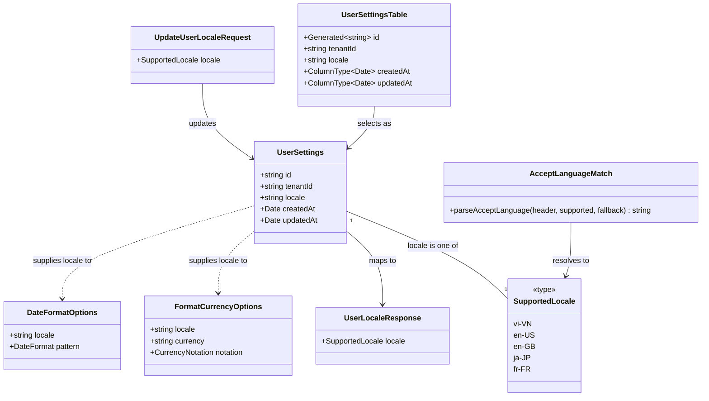

# Internationalization: Locale Selection, Storage, and Formatting

## Requirements

Give every viewer of the app — signed-in users and anonymous public-statement viewers alike
— content and formatting in their own language and regional convention, while keeping
which _currency_ a wallet displays completely independent of that choice. Detect a
sensible default locale automatically (from the browser, at signup and on the public
statement page) so nobody has to configure anything to get correct number/date formatting
and a translated Settings experience, but let signed-in users override it explicitly.
Support five locales end to end: `vi-VN`, `en-US`, `en-GB`, `ja-JP`, `fr-FR`.

**In scope for this pass**: locale storage and detection infrastructure; locale-aware
currency and date/time formatting everywhere `formatCurrency`/date helpers are already
used; `CurrencyInput` locale-correct parsing (the one place a formatting mistake corrupts
stored data); a locale switcher in User Settings; translated strings for the User Settings
module (the initial slice, since that's where the switcher itself lives).

**Explicitly out of scope for this pass** (follow-up work): translating the rest of the
application's UI strings (wallet list, transactions, statements, activity log, etc.) beyond
Settings; email template localization (send-time locale resolution has no viewer request to
detect from — needs the stored user locale as a future dependency, not solved here);
Japanese-text layout verification, which is a manual QA task blocked on translated Japanese
strings existing, not a code change tracked in Operations below.

## Entities

**Conservative note**: `wallet.currency` (existing, from the prior currency migration) is
deliberately **not** modeled as related to `UserSettings` here — the two are read
independently at every call site and must never be merged into one options object that
could accidentally couple them. `FormatCurrencyOptions.currency` continues to come from
`wallet.currency`; `FormatCurrencyOptions.locale` and `DateFormatOptions.locale` come from
`UserSettings.locale` (or the public-statement viewer's detected locale). No existing
entity (`Wallet`, `Transaction`, `WalletStatementShare`) changes shape in this pass.

## Approach

1. **Locale storage and resolution**:
   - New, app-owned `user_settings` table (Kysely migration, mirroring how `wallet` is
     migrated), keyed by `tenantId` (the better-auth user id), holding a single `locale`
     column. This avoids splitting user-scoped app data across better-auth's own
     schema-management flow and this repo's Kysely migrations — the same boundary
     discipline `AGENTS.md` already applies to `wallet.tenantId`.
   - Locale detection is a single shared, pure utility (`resolveLocaleFromAcceptLanguage`)
     used at exactly two call sites: better-auth's `user.create` hook (signup) and the
     public statement Netlify function (per-request, never persisted). One implementation,
     no drift.
   - Existing users (pre-migration) are backfilled to `vi-VN` at the database level (matches
     the product's actual current user base per `AGENTS.md`'s framing), not `en-US` — `en-US`
     is specifically the _detection fallback_ for an unrecognized browser locale, not a
     statement about who already uses this product.

2. **Formatting decoupling**:
   - `formatCurrency`/`formatShortCurrency`/`formatSignedCurrency` already separate
     `currency` and `locale` as independent options — no signature change needed, only
     wiring the resolved viewer locale into the `locale` option at every call site that
     currently omits it (5 call sites identified in codebase exploration).
   - `CurrencyInput` gains an optional `locale` prop (defaulting to the existing
     `DEFAULT_CURRENCY_LOCALE` constant for backward compatibility with any call site that
     doesn't yet have a locale available), threaded into the already locale-correct
     `parseCurrencyInput`/`formatCurrencyInput` functions underneath — this is the fix that
     makes `fr-FR` (space thousands separator, comma decimal) work correctly, since the
     `Intl.NumberFormat`-based separator detection in `packages/utils/src/currency/input.ts`
     already generalizes to any locale once one is actually passed in.
   - `packages/utils/src/date` moves from single hardcoded `date-fns` pattern strings to a
     per-locale pattern table plus a `locale` parameter on every `formatDate*` function, so
     `en-US` (`MM/dd/yyyy`) and `en-GB` (`dd/MM/yyyy`) diverge correctly despite sharing
     translated UI strings. `period-bounds.ts`'s `formatDateInTimezone` gains a `locale`
     parameter, replacing its hardcoded `'en-US'` literal (its _other_ internal `'en-US'`
     usages, for timezone-offset math only, are untouched — they never produce
     user-visible text).

3. **Translation**:
   - Adopt `react-intl` (FormatJS) as the client-side translation library — no existing
     investment either way, and it's a mature, widely-used React solution with straightforward
     `IntlProvider` + `useIntl`/`FormattedMessage` usage, and no server-runtime dependency
     needed since no translated string is rendered inside a Netlify Function in this pass
     (the public statement CSV export renders only numbers/dates, formatted via
     `Intl`-backed `@vhnam/utils`, not translated prose).
   - **Scope boundary (hard constraint)**: `react-intl` handles string translation and
     translated-message-level display formatting only (interpolated values/pluralization
     inside a translated string, via `FormattedMessage`/`useIntl().formatMessage`). It does
     **not** touch `period-bounds.ts`, or `packages/utils/src/date`/`currency` — those keep
     using native `Intl.DateTimeFormat`/`Intl.NumberFormat` and `date-fns` directly, per
     workstream 2 above, regardless of the translation library choice. Do not route
     `formatCurrency`/`formatDate*`/`formatDateInTimezone` output through `react-intl`'s own
     `useIntl().formatDate`/`formatNumber` APIs — `@vhnam/utils` remains the single owner of
     that formatting, per `AGENTS.md`'s "never re-implement formatting locally" rule, and
     introducing a second formatting path through `react-intl` would violate it.
   - Message catalogs: one flat JSON file per **language** (`en`, `vi`, `ja`, `fr` — four
     files, not five) under a new `packages/utils/src/i18n/messages/` directory, since no
     current or anticipated Settings copy differs between `en-US`/`en-GB`. `en-GB` and
     `en-US` share the `en` catalog; date/number formatting still diverges correctly via
     the full locale tag, independently of which message catalog is loaded.
   - Missing-key degradation: `react-intl`'s built-in behavior of rendering the `defaultMessage`
     (always authored in English inline at each `FormattedMessage`/`intl.formatMessage` call
     site) when a key is absent from the active locale's catalog — never a raw translation
     key. A Vitest check asserts every non-English catalog's key set is a subset of the
     English (`en`) catalog's key set, catching typos before merge without needing a
     separate build-time tool.

4. **Exception/error handling**: no new business-exception types are introduced by this
   feature. Locale update validation (must be one of the five supported tags) is enforced
   by a Valibot schema at the API boundary, returning the existing Netlify Function
   error-response convention (`Response.json({ error }, { status: 400 })`, matching the
   pattern already used by other `/api/*` handlers) — not a new global exception framework,
   which this codebase does not use (see Structure: this is a Netlify Functions app, not a
   framework with a `@RestControllerAdvice`-style global handler).

## Structure

### Inheritance / Type Relationships

1. `SupportedLocale` is a union type (`'vi-VN' | 'en-US' | 'en-GB' | 'ja-JP' | 'fr-FR'`)
   defined once in `packages/utils/src/locale/constants.ts` and imported everywhere a
   locale value is validated or typed — no separate enum per layer.
2. `UserSettingsTable` (Kysely table interface) follows the exact shape convention of
   `WalletTable` in `apps/ledger-box/src/lib/db/schema.ts` (`Generated<string> id`,
   `ColumnType<Date, ...>` timestamps), extended into `Database` alongside the existing five
   tables.
3. No new exception classes; validation failures surface as the existing Netlify Function
   `400`-with-JSON-body convention, not a thrown/caught custom error hierarchy.

### Dependencies

1. `apps/ledger-box/src/lib/auth.ts` (`betterAuth(...)` config) depends on the new
   `resolveLocaleFromAcceptLanguage` utility and the new `db.insertInto('userSettings')`
   call, invoked from a `databaseHooks.user.create.after` hook.
2. `netlify/functions/user-locale.mts` (new) depends on `tenant-access.ts`'s `getTenantId`
   (existing pattern for every authenticated handler) and the new `userSettings` Kysely
   table.
3. `netlify/functions/public-statement.mts` (existing, modified) depends on the same
   `resolveLocaleFromAcceptLanguage` utility, applied to the CSV-export branch only.
4. `apps/ledger-box/src/queries/user-settings/` (new, TanStack Query module) depends on the
   `user-locale` API and is consumed by `SettingsLocale` (new component) and by an
   app-wide locale-provider consumed wherever `formatCurrency`/date formatting/translated
   strings are rendered for an authenticated user.
5. `packages/ui/src/components/currency-input.tsx` depends on the (unchanged) exports of
   `packages/utils/src/currency/input.ts`, with one new optional prop threaded through.
6. `packages/utils/src/date/utils.ts` depends on per-locale `date-fns/locale` modules
   (`vi`, `enUS`, `enGB`, `ja`, `fr` — all already available transitively via the existing
   `date-fns` dependency, no new package).
7. New `apps/ledger-box/src/modules/settings/settings-locale/` module depends on
   `react-intl` (new dependency) and the new `packages/utils/src/i18n/messages/*.json`
   catalogs.

### Layered Architecture

1. **Migration layer**: `apps/ledger-box/src/lib/db/migrations/0010_create_user_settings.ts`
   — new table, same pattern as `0009_add_wallet_currency.ts`.
2. **Auth-integration layer**: `apps/ledger-box/src/lib/auth.ts` — `databaseHooks` addition
   only; no change to existing `emailAndPassword`/`socialProviders` config.
3. **Netlify Functions layer**: one new handler (`user-locale.mts`, `GET`/`PATCH`) following
   the existing `requireOwnedWallet`-style tenant-scoping convention (here, scoping by the
   session's own tenant id, no wallet involved); one existing handler
   (`public-statement.mts`) modified to resolve and pass through a per-request locale for
   CSV rendering.
4. **Shared formatting/locale layer** (`packages/utils`): extended, not replaced —
   `currency/`, `date/` gain locale parameters; new `locale/` (Accept-Language matching)
   and `i18n/` (message catalogs, if colocated here rather than in the app — see Operations)
   directories added alongside.
5. **Query layer** (`apps/ledger-box/src/queries/user-settings/`): new TanStack Query
   `queries`/`mutations`/`dto`/`api` files, mirroring the existing
   `queries/statement-shares/` module structure exactly (four-file split: `.api.ts`,
   `.dto.ts`, `.queries.ts`, `.mutations.ts`).
6. **UI/module layer** (`apps/ledger-box/src/modules/settings/`): new `settings-locale/`
   sibling to `settings-appearance/` and `settings-account/`; `settings-dialog.tsx` gains a
   third tab.
7. **No exception-handling layer changes**: this app has no global exception handler
   pattern to extend (Netlify Functions return `Response`/`Response.json` directly); this
   feature does not introduce one.

## Operations

### Create Migration - `0010_create_user_settings`

1. Responsibility: create the `user_settings` table backing per-user locale preference.
2. File: `apps/ledger-box/src/lib/db/migrations/0010_create_user_settings.ts`.
3. `up`: `db.schema.createTable('user_settings')` with columns:
   - `id`: `uuid`, primary key, `defaultTo(sql\`gen_random_uuid()\`)`(match existing id
generation convention used by`wallet`/`transaction`— verify exact default expression
against`0001_create_wallet_and_transaction.ts` and reuse verbatim).
   - `tenant_id`: `text`, `notNull()`, `unique()` — one settings row per tenant.
   - `locale`: `text`, `notNull()`, `defaultTo('vi-VN')` — existing-row/backfill default;
     new rows always insert an explicit resolved value at signup, so this default is only
     ever hit by manual/backfill inserts, never by the app's own write path.
   - `created_at`, `updated_at`: `timestamptz`, `notNull()`, `defaultTo(sql\`now()\`)` —
     match existing timestamp column convention.
4. `down`: `db.schema.dropTable('user_settings').execute()`.
5. Constraints: add a `CHECK` constraint (or application-level Valibot validation only, no
   DB-level enum — match existing convention: `wallet.currency` has no DB-level enum check
   either, per `0009_add_wallet_currency.ts`) — **decision: no DB-level check constraint**,
   consistent with how `currency` was done; validity is enforced at the Valibot/API layer
   only.

### Create Schema Types - extend `Database` interface

1. File: `apps/ledger-box/src/lib/db/schema.ts`.
2. Add `export interface UserSettingsTable { id: Generated<string>; tenantId: string; locale: string; createdAt: ColumnType<Date, Date | string, Date | string>; updatedAt: ColumnType<Date, Date | string, Date | string>; }`.
3. Add `userSettings: UserSettingsTable;` to `Database`.
4. Add `export type UserSettings = Selectable<UserSettingsTable>; export type NewUserSettings = Insertable<UserSettingsTable>; export type UserSettingsUpdate = Updateable<UserSettingsTable>;` following the exact existing pattern for `Wallet`/`NewWallet`/`WalletUpdate`.

### Create Utility - `packages/utils/src/locale/constants.ts`

1. Responsibility: single source of truth for supported locales and fallback.
2. Exports:
   - `SUPPORTED_LOCALES = ['vi-VN', 'en-US', 'en-GB', 'ja-JP', 'fr-FR'] as const`
   - `type SupportedLocale = (typeof SUPPORTED_LOCALES)[number]`
   - `DEFAULT_LOCALE: SupportedLocale = 'en-US'` (detection fallback, distinct from the
     migration's `vi-VN` backfill default — these serve different purposes and must not be
     unified into one constant).

### Create Utility - `packages/utils/src/locale/accept-language.ts`

1. Responsibility: parse a raw `Accept-Language` header value and resolve it to one of the
   five supported locales, or `DEFAULT_LOCALE`.
2. Method: `parseAcceptLanguage(headerValue: string | null | undefined, supported: readonly string[] = SUPPORTED_LOCALES, fallback: string = DEFAULT_LOCALE): string`
   - Logic:
     - If `headerValue` is null/undefined/empty, return `fallback` immediately.
     - Split on `,`, for each entry split on `;q=` to extract `{ tag, quality }`
       (`quality` defaults to `1` when absent); trim whitespace on both.
     - Sort entries descending by `quality` (stable sort — preserve header order for ties).
     - For each entry in sorted order:
       - Exact case-insensitive match against `supported` (e.g. `en-GB` against
         `en-GB`) → return the canonical supported tag immediately.
       - If no exact match, extract the entry's base language (substring before first `-`)
         and check whether **exactly one** supported tag shares that base language; if so,
         return that supported tag (this is the `en → en-US`/`ja → ja-JP` style
         single-candidate match). If the base language matches **more than one** supported
         tag (only possible for `en`, which has two supported regions), do **not**
         resolve on language alone — an ambiguous bare `en` falls through to the next
         header entry rather than guessing between `en-US`/`en-GB`.
     - If nothing in the header matched, return `fallback`.
   - Edge cases: malformed entries (missing quality value, stray whitespace, wildcard `*`)
     are skipped, not thrown on — a malformed entry is treated as absent, never crashes the
     matcher. `en-AU`, `zh-CN`, and any other unsupported/unmatched tag correctly fall
     through to `fallback` (`en-US`) per the explicit product decision resolving the
     open "nearest variant" question from the analysis.
3. Export from `packages/utils/src/locale/index.ts` alongside the constants.
4. This function is pure, synchronous, and framework-agnostic — usable from both the
   better-auth hook (server) and the public-statement Netlify Function (server); it is
   **not** used client-side (`navigator.language` handling for the public statement page's
   client-rendered JSON path is intentionally out of scope for this pass — see Safeguards).

### Create Tests - `packages/utils/src/locale/accept-language.test.ts`

1. Cases: exact match (`en-GB` header → `en-GB`), quality-weighted ordering
   (`fr;q=0.5,ja-JP;q=0.9` → `ja-JP`), unsupported region with single-candidate base
   language (`en-AU` → `en-US`), ambiguous base language with no exact match
   (`en;q=1,vi-VN;q=0.5` → since bare `en` is ambiguous, matcher continues to `vi-VN`
   which _does_ exact-match → `vi-VN`; a header of `en` alone with no other supported entry
   → falls through to `DEFAULT_LOCALE`), fully unsupported (`zh-CN` → `en-US`), empty/null
   header → `en-US`, malformed entries don't throw.

### Modify - `apps/ledger-box/src/lib/auth.ts`

1. Responsibility: persist a resolved locale for every newly created user, at signup.
2. Add `databaseHooks: { user: { create: { after: async (user, ctx) => { ... } } } }` to
   the `betterAuth(...)` config.
3. Logic inside the hook:
   - Read the Accept-Language header from `ctx?.request?.headers.get('accept-language')`
     (verify the exact hook-context shape against the installed `better-auth` version's
     types during implementation — better-auth exposes the originating request on hook
     context; if the hook signature does not expose the request directly, resolve locale
     in the surrounding request handler instead and pass it through hook context/metadata).
   - Call `parseAcceptLanguage(headerValue)` from the new `packages/utils/src/locale`
     module.
   - Insert a row into `userSettings` via the app's existing `db` (Kysely instance from
     `#/lib/db/index.ts`): `tenantId: user.id`, `locale: resolvedLocale`.
   - Wrap the insert in a try/catch that logs and does not throw — a failure to write
     `user_settings` must never block account creation (mirrors the existing pattern in
     `AGENTS.md` for optional email sends: creation succeeds even if a secondary write
     fails, with a recorded signal for follow-up — here, log to console/existing logger
     rather than an activity-log entry, since `user_settings` has no wallet/activity-log
     concept).

### Create Netlify Function - `netlify/functions/user-locale.mts`

1. Responsibility: `GET` returns the caller's current locale; `PATCH` updates it.
2. Route: `/api/users/locale` (add to the `AGENTS.md` API table in the same change).
3. `GET` logic:
   - Resolve `tenantId` via `getTenantId` (existing `tenant-access.ts` helper) — 401 if
     unauthenticated, matching every other authenticated handler's convention.
   - `db.selectFrom('userSettings').select(['locale']).where('tenantId', '=', tenantId).executeTakeFirst()`.
   - If no row exists (pre-migration user who hasn't been backfilled, or the signup hook
     failed silently), return `{ locale: DEFAULT_LOCALE_FALLBACK }` — decision: fall back
     to `vi-VN` (the backfill default) here too, for consistency with the migration's
     backfill choice, **not** `en-US` — a missing-row case should behave identically to a
     backfilled existing user.
   - Return `Response.json({ locale })`.
4. `PATCH` logic:
   - Resolve `tenantId` via `getTenantId`.
   - Parse request body against a new Valibot schema (`apps/ledger-box/src/schemas/user-locale.schema.ts`):
     `locale: picklist(SUPPORTED_LOCALES)` — 400 with `Response.json({ error: '...' }, { status: 400 })`
     on validation failure, matching the existing error-response shape used elsewhere.
   - `db.updateTable('userSettings').set({ locale, updatedAt: new Date() }).where('tenantId', '=', tenantId).execute()`
     — if no row was affected (edge case: signup hook never ran for this user), fall back to
     an `insertInto` instead (upsert semantics), so a `PATCH` always succeeds for any
     authenticated user regardless of whether the signup-time row exists.
   - Return `Response.json({ locale })`.
5. Method guard: reject anything other than `GET`/`PATCH` with `405`, matching the pattern
   in `public-statement.mts`.

### Modify - `apps/ledger-box/netlify/functions/public-statement.mts`

1. Responsibility: resolve a per-request viewer locale for the CSV-export branch only (the
   JSON branch is rendered by client React code, which already has the real browser
   locale available and needs no server resolution).
2. Logic addition inside the `format === 'csv'` branch:
   - `const locale = parseAcceptLanguage(request.headers.get('accept-language'));`
     (import from `@vhnam/utils/locale`).
   - Thread `locale` into `encodeStatementCsv(snapshot, share.displayTitle, { locale })`
     (see next task) so numeric/date cells in the exported CSV render in the viewer's
     detected convention, independent of the wallet owner's own locale or the wallet's
     `currency`.

### Modify - `apps/ledger-box/src/lib/statement-export.ts` — `encodeStatementCsv`

1. Responsibility: accept an optional `locale` and pass it through to every
   `formatCurrency`/date-formatting call currently used to build CSV cell values, defaulting
   to the existing hardcoded behavior if omitted (backward-compatible signature change).
2. Method signature becomes `encodeStatementCsv(snapshot: StatementSnapshot, displayTitle?: string, options?: { locale?: string }): string`.
3. `currency` passed to `formatCurrency` continues to come from `snapshot.currency` (or
   `wallet.currency` equivalent already present in the snapshot) — unchanged; only `locale`
   is newly threaded, sourced from `options.locale`.

### Modify - `packages/ui/src/components/currency-input.tsx`

1. Responsibility: accept a `locale` prop and use it instead of the hardcoded
   `DEFAULT_CURRENCY_LOCALE` constant.
2. Change `CurrencyInputProps` to add `locale?: string`.
3. Change `function CurrencyInput({ className, currency = 'VND', locale = DEFAULT_CURRENCY_LOCALE, onValueChange, ref, value = '', ...props })`.
4. Replace the hardcoded `inputOptions = { locale: DEFAULT_CURRENCY_LOCALE, ... }` with
   `inputOptions = { locale, maximumFractionDigits: getCurrencyFractionDigits(currency) }`.
5. No other logic changes — `formatCurrencyInput`/`parseCurrencyInput`/
   `getCurrencyInputCaretPosition` already work correctly for any locale passed in.
6. Update the existing Storybook story for `CurrencyInput` (find via
   `apps/storybook`) to add one additional story/control demonstrating `locale="fr-FR"`
   with `currency="EUR"`, verifying visually that "1 234,56" formats and parses correctly —
   this is the one new Storybook variant this pass requires (see Safeguards on test scope).

### Modify - `packages/utils/src/currency/*` call sites (app-side, not the package itself)

1. Files: `app-sidebar-wallets.tsx`, `wallet-settings-activity.tsx`,
   `statement-snapshot-view.tsx`, `wallet-summary.tsx`, `wallet-header.tsx`.
2. Logic: each call site adds `locale: viewerLocale` to its existing `formatCurrency(...,
{ currency })` call, where `viewerLocale` comes from the new locale-provider/query hook
   (authenticated app shell) or, for `statement-snapshot-view.tsx` specifically (rendered
   on the public statement page), from a client-side `navigator.language`-derived value run
   through a lightweight client-side matcher — see the dedicated task below for the public
   statement page's client-side resolution, kept separate from the server-side
   `parseAcceptLanguage` utility per the Approach's stated scope boundary.
3. No changes to `currency`'s own value at any of these call sites — it continues to come
   from `wallet.currency`/`snapshot.currency`, never from locale.

### Modify - `packages/utils/src/date/constants.ts` and `utils.ts`

1. Responsibility: make date pattern selection locale-driven instead of fixed.
2. Add a new `LOCALE_DATE_PATTERNS: Record<SupportedLocale, Record<keyof typeof DateFormat, string>>`
   table in `constants.ts` mapping each of the five locales to its own `Numeric`/`Short`/
   `Text`/`Long`/`Month` pattern strings (e.g. `en-US.Numeric = 'MM/dd/yyyy'`,
   `en-GB.Numeric = 'dd/MM/yyyy'`, `en-US.Text = 'MMM d, yyyy'` vs. the existing
   `d MMM yyyy` for `vi-VN`/`en-GB`/`fr-FR`/`ja-JP` — verify each locale's natural
   convention rather than guessing; `ja-JP` numeric convention is `yyyy/MM/dd`).
3. Add a `LOCALE_DATE_FNS_LOCALE: Record<SupportedLocale, Locale>` table importing
   `vi`, `enUS`, `enGB`, `ja`, `fr` from `date-fns/locale`, for month-name translation.
4. Change every `formatDate*`/`formatDateTime*` function signature in `utils.ts` to accept
   a `locale: SupportedLocale = DEFAULT_CURRENCY_LOCALE` parameter (reuse the existing
   currency-locale default for consistency, or introduce a shared `DEFAULT_LOCALE` from the
   new `locale` module — **decision: reuse `packages/utils/src/locale`'s `DEFAULT_LOCALE`
   ('en-US') is wrong here**; date formatting's fallback should match currency's existing
   `vi-VN` default for backward compatibility with any as-yet-unmigrated call site, so use
   `DEFAULT_CURRENCY_LOCALE` explicitly as the default, not the Accept-Language
   `DEFAULT_LOCALE`). Internally, look up the pattern via `LOCALE_DATE_PATTERNS[locale][key]`
   and pass `{ locale: LOCALE_DATE_FNS_LOCALE[locale] }` as `date-fns/format`'s options
   argument.
5. `formatRelative` (uses `formatDistanceToNow`) similarly gains a `locale` parameter passed
   as `{ addSuffix: true, locale: LOCALE_DATE_FNS_LOCALE[locale] }`.
6. Existing call sites (`period-bounds.ts`, `wallet-settings-activity.tsx`,
   `wallet-statement-share-row.tsx`, `wallet-actions.actions.tsx`,
   `wallet-transaction.tsx`) are updated to pass the resolved viewer locale; omitting it
   falls back to today's `vi-VN`-flavored output, so this is a non-breaking, incremental
   rollout — not every call site must be touched in the same commit as the signature
   change, but all five identified call sites are in scope for this pass.

### Modify - `apps/ledger-box/src/lib/period-bounds.ts` — `formatDateInTimezone`

1. Change signature to `formatDateInTimezone(date: Date, timezone: string, locale: string = 'en-US', pattern: Intl.DateTimeFormatOptions = { dateStyle: 'medium' })`.
2. Replace the hardcoded `new Intl.DateTimeFormat('en-US', ...)` with
   `new Intl.DateTimeFormat(locale, ...)`.
3. Leave `getTimeZoneOffsetMs`/`getZonedDateParts`'s internal `'en-US'` usage untouched —
   those extract numeric date parts for timezone arithmetic and are never rendered to a
   user; changing them is unnecessary and out of scope.

### Create - Client-side locale resolution for the public statement page

1. Responsibility: resolve a display locale for the client-rendered
   `statement-public-page.tsx`/`statement-snapshot-view.tsx` from the viewer's own browser,
   independent of any server call, since this route has no authenticated user.
2. File: `apps/ledger-box/src/lib/client-locale.ts` (new, app-local, not in `packages/utils`
   since it depends on `navigator`, a browser global not available in the shared package's
   test/build environment).
3. Method: `resolveClientLocale(): string` — reads `navigator.languages` (preferred, full
   ordered preference list) or falls back to `navigator.language`; for each candidate, apply
   the same matching semantics as `parseAcceptLanguage` (exact match, then unambiguous
   base-language match, else continue) by calling the shared `parseAcceptLanguage` utility
   with a synthesized single-entry-per-candidate header string built from
   `navigator.languages.join(',')` — this reuses the exact same matching logic rather than
   duplicating it, keeping signup/public-statement/client-side behavior consistent.
4. Used by `statement-public-page.tsx` to supply `locale` to `formatCurrency` calls in
   `statement-snapshot-view.tsx` and to whatever date formatting the statement view uses.

### Create - `packages/utils/src/i18n/` message catalogs and provider wiring

1. Responsibility: house the four language catalogs and the app-level `IntlProvider` setup.
2. Files: `packages/utils/src/i18n/messages/en.json`, `vi.json`, `ja.json`, `fr.json` — flat
   `{ "settings.title": "Settings", "settings.appearance.title": "Appearance", ... }`
   key-value maps, keyed by dotted namespace matching the module they belong to.
3. Initial key set (this pass's scope): every string currently hardcoded in
   `settings-dialog.tsx`, `settings-appearance.tsx`, `settings-account.tsx`, plus the new
   `settings-locale.tsx` component's own strings (see next task) — no other module's
   strings are migrated in this pass.
4. Add `react-intl` as a dependency of `apps/ledger-box` (client-only usage).
5. Wire `IntlProvider` (from `react-intl`) into the app's root layout, sourcing `locale` and
   `messages` from the authenticated user's resolved locale (via the new
   `user-settings` query) — falls back to `en` messages / `en-US` formatting before the
   query resolves (matches the existing loading-state convention used elsewhere in the app;
   verify against how `useTheme`/other app-shell providers handle their own loading state
   and follow the same pattern).
6. Add a Vitest test (`packages/utils/src/i18n/messages.test.ts`) asserting
   `Object.keys(vi.json/ja.json/fr.json)` is a subset of `Object.keys(en.json)` — the
   missing-key build-time guard called for in the analysis, implemented as a test rather
   than a separate build tool.

### Create UI Component - `SettingsLocale`

1. Responsibility: render the five-locale switcher in User Settings, modeled directly on
   `SettingsAppearance`'s existing `themeOptions`/`ThemeOption` pattern.
2. File: `apps/ledger-box/src/modules/settings/settings-locale/settings-locale.tsx`.
3. Structure: a `localeOptions` array of `{ value: SupportedLocale, label: string }` (label
   is the locale's own native display name, e.g. "Tiếng Việt", "English (US)",
   "English (UK)", "日本語", "Français" — not translated per viewer locale, since a locale
   name should always read in its own language regardless of the current UI language, a
   common i18n UX convention), rendered as a simple selectable list (reuse `ThemeOption`'s
   button/selected-state visual pattern rather than inventing a new one, per the
   `AGENTS.md` "reusable presentational → packages/ui" guidance — if the selection button
   visual is generalized, promote it to `packages/ui`; if it's simple enough to duplicate
   inline for one list, duplicating the ~15-line pattern is acceptable and matches this
   codebase's stated preference against premature abstraction).
4. Data: reads current locale via the new `useUserLocale` query hook; on selection, calls
   the new `useUpdateUserLocale` mutation, invalidating the locale query on success (TanStack
   Query convention, matching `AGENTS.md`'s "mutations must invalidate ... queries" rule).
5. Add to `settings-dialog.tsx`: a third `SettingsTab.Locale = 'locale'` entry, its
   `TabsTrigger`/`TabsContent` pair, importing `SettingsLocale` — purely additive to the
   existing `Tabs` structure, no layout rework of `Account`/`Appearance`.

### Create Query Module - `apps/ledger-box/src/queries/user-settings/`

1. Files (mirroring `queries/statement-shares/` exactly): `user-settings.api.ts`
   (fetch/patch wrappers around `/api/users/locale`), `user-settings.dto.ts` (`{ locale:
SupportedLocale }` response shape), `user-settings.queries.ts` (`useUserLocale` query
   hook, query key `['user-settings', 'locale']`), `user-settings.mutations.ts`
   (`useUpdateUserLocale` mutation hook).
2. No `.actions.tsx` file needed — this module has no form; the mutation is invoked
   directly from `SettingsLocale`'s selection handler, consistent with how
   `SettingsAppearance` calls `setTheme` directly without an intermediate actions file.

## Norms

1. **Migration style**: every new migration is a plain `up`/`down` pair exporting from
   `apps/ledger-box/src/lib/db/migrations/000N_*.ts`, using `Kysely<unknown>` typed schema
   builder calls only — no raw SQL strings, matching every existing migration in the repo.
2. **Table/type naming**: Kysely table interfaces are named `<Entity>Table`
   (`UserSettingsTable`), with `Selectable`/`Insertable`/`Updateable` aliases exported as
   `<Entity>`/`New<Entity>`/`<Entity>Update`, exactly matching the existing `Wallet`/
   `NewWallet`/`WalletUpdate` triad.
3. **Netlify Function handlers**: default-export an `async (request, context) => Response`
   function, method-gated with an early `405` for unsupported verbs, importing app code via
   `#/lib/...` and co-located helpers via `./lib/...`, exactly matching
   `public-statement.mts`'s existing structure.
4. **Tenant scoping**: every handler touching `userSettings` resolves `tenantId` via the
   existing `getTenantId` helper from `tenant-access.ts` — never trusts a client-supplied
   identifier. This table has no wallet/ownership-role concept (it's a 1:1 user↔settings
   relationship), so `requireOwnedWallet`/`requireWalletAccess` do not apply here; only
   `getTenantId` is needed.
5. **Validation**: request bodies are validated with Valibot schemas under
   `apps/ledger-box/src/schemas/*.schema.ts`, following the existing `*.schema.ts` naming
   and colocation convention — not Zod, not manual type guards.
6. **Query module shape**: every TanStack Query feature module under
   `apps/ledger-box/src/queries/<feature>/` splits into `.api.ts` (fetch calls),
   `.dto.ts` (response types), `.queries.ts` (query hooks), `.mutations.ts` (mutation
   hooks) — matching `queries/statement-shares/` exactly; mutations invalidate the relevant
   query keys on success.
7. **Imports**: `#/` for all in-package source, never `@/` or long relative paths, per
   `AGENTS.md`.
8. **Formatting functions**: never reimplement currency or date formatting inline in a
   component — always go through `@vhnam/utils/currency` and `@vhnam/utils/date`, extended
   with the new `locale` parameter rather than bypassed. `react-intl` is for translated
   strings only; never call its `formatDate`/`formatNumber`/`formatCurrency`-equivalent
   APIs as a substitute for `@vhnam/utils` — `period-bounds.ts` and `packages/utils/src/date`
   `/currency` are unaffected by the `react-intl` adoption and continue to call native
   `Intl`/`date-fns` directly.
9. **Locale/language constants**: defined once (`SUPPORTED_LOCALES`, `DEFAULT_LOCALE` in
   `packages/utils/src/locale/constants.ts`) and imported everywhere — never redeclared as
   a local literal array in a component or handler.
10. **Toasts**: any locale-update success/error feedback uses the imperative `toast.add({
title, type })` API, never `toast.success(...)`, per `AGENTS.md`.
11. **Storybook**: `CurrencyInput`'s existing story file gains the `fr-FR` variant per the
    Operations task above; `SettingsLocale`, being a small new presentational-ish component
    that also has data dependencies (query/mutation hooks), follows whichever existing
    convention `SettingsAppearance` itself follows for Storybook coverage (if
    `SettingsAppearance` has no story today because it's app-layer, not `packages/ui`,
    `SettingsLocale` likewise needs no new story — verify by checking for an existing
    `settings-appearance.stories.tsx` before deciding).

## Safeguards

1. **Functional constraints**: only the five specified locale tags
   (`vi-VN`/`en-US`/`en-GB`/`ja-JP`/`fr-FR`) are ever accepted by the `PATCH
/api/users/locale` endpoint or stored in `user_settings.locale`; any other value is
   rejected with `400` at the Valibot layer before reaching the database.
2. **Currency/locale independence (hard constraint)**: no code path may derive
   `wallet.currency` from a user's locale, or derive a user's locale from `wallet.currency`
   — these two values are read from entirely separate sources (`wallet` row vs.
   `userSettings` row) at every call site touched in this pass. A code review check for
   this pass: grep for any new code that passes `wallet.currency` into a `locale` parameter
   or vice versa — there should be none.
3. **Performance constraints**: the signup-time `user_settings` insert must not add
   perceptible latency to registration — it is a single-row insert with no additional
   round trips beyond the existing better-auth user creation, and its failure (per the
   Operations task's try/catch) must never block or slow the signup response.
4. **Security constraints**: `Accept-Language` header values are attacker-controlled input
   on the unauthenticated public-statement endpoint — `parseAcceptLanguage` must never
   `eval`, use unbounded regex backtracking, or allocate unboundedly on a maliciously long
   header; cap processed header length (e.g. first 200 characters) before parsing, and cap
   the number of comma-separated entries processed (e.g. first 20) to bound worst-case work
   per request, consistent with `public-statement.mts`'s existing rate-limiting posture.
5. **Integration constraints**: the `better-auth` hook mechanism's exact context shape must
   be verified against the installed `better-auth` version during implementation (the
   Operations task flags this as unverified) — if `databaseHooks.user.create.after` does
   not expose the originating request/headers, locale resolution must move to wherever the
   signup request is actually handled (still `auth.handler` internally, but potentially via
   a different better-auth hook point such as `hooks.after` at the plugin/middleware level)
   rather than being silently dropped or defaulted without ever reading the real header.
6. **Business rule constraints**: `wallet.currency` remains locked after creation (existing
   rule, unaffected); `user_settings.locale` is mutable at any time by its owning user, with
   no lock — a locale change takes effect on next render/query-cache-invalidation and does
   not retroactively alter any already-frozen `walletStatementShare.snapshotJson` (confirmed
   in analysis: snapshot content is currency/user-authored text only, never a
   system-translated string, so no retroactive-formatting concern exists there).
7. **Exception handling constraints**: no new business-exception class hierarchy is
   introduced; validation failures return the existing `Response.json({ error }, { status:
400 })` shape; the signup-hook's settings-insert failure is caught and logged, never
   thrown past the hook (would otherwise block account creation, which must never happen
   for a non-critical secondary write, matching the existing precedent for optional invite
   emails).
8. **Technical constraints**: no server-runtime translation rendering in this pass — all
   `react-intl` usage is client-bundled only; if a future pass needs translated strings
   inside a Netlify Function response body, that is new scope requiring a
   server-compatible catalog-loading strategy, not assumed solved by this pass's client-only
   wiring.
9. **Data constraints**: `user_settings.tenantId` is unique — at most one settings row per
   tenant; the `PATCH` handler's upsert-on-missing-row behavior must never create a second
   row for an existing tenant (use `ON CONFLICT (tenant_id) DO UPDATE` via Kysely's
   `onConflict` builder, or an explicit existence check before choosing insert vs. update —
   not two unguarded separate statements that could race).
10. **API constraints**: `GET`/`PATCH /api/users/locale` follow the same authenticated,
    JSON-in/JSON-out, tenant-scoped convention as every other `/api/*` handler in the
    existing route table; the new route must be added to `AGENTS.md`'s API table in the
    same change, per the repo's own documentation convention.
11. **Test-scope constraint (explicit, per analysis recommendation)**: full Storybook/Vitest
    coverage across all five locales for every existing component is explicitly **not**
    required by this pass. Required test coverage is limited to: `accept-language.test.ts`
    (matcher logic), `CurrencyInput`'s `fr-FR` parsing (extend the existing
    `currency-input`/`input.test.ts` suite with `fr-FR` cases, not a new component-level
    test file), date-pattern selection for at least `en-US` vs `en-GB` (extend
    `packages/utils/src/date`'s existing test file, if any — check for one before creating
    a new file), and the message-catalog key-parity check. Broader locale-variant coverage
    is deferred to the follow-up passes that migrate additional UI modules.
12. **Out-of-scope constraint (explicit)**: email template localization and Japanese-text
    manual layout QA are not implementation tasks in this pass's Operations section and must
    not be silently absorbed into it — they are named follow-ups.
