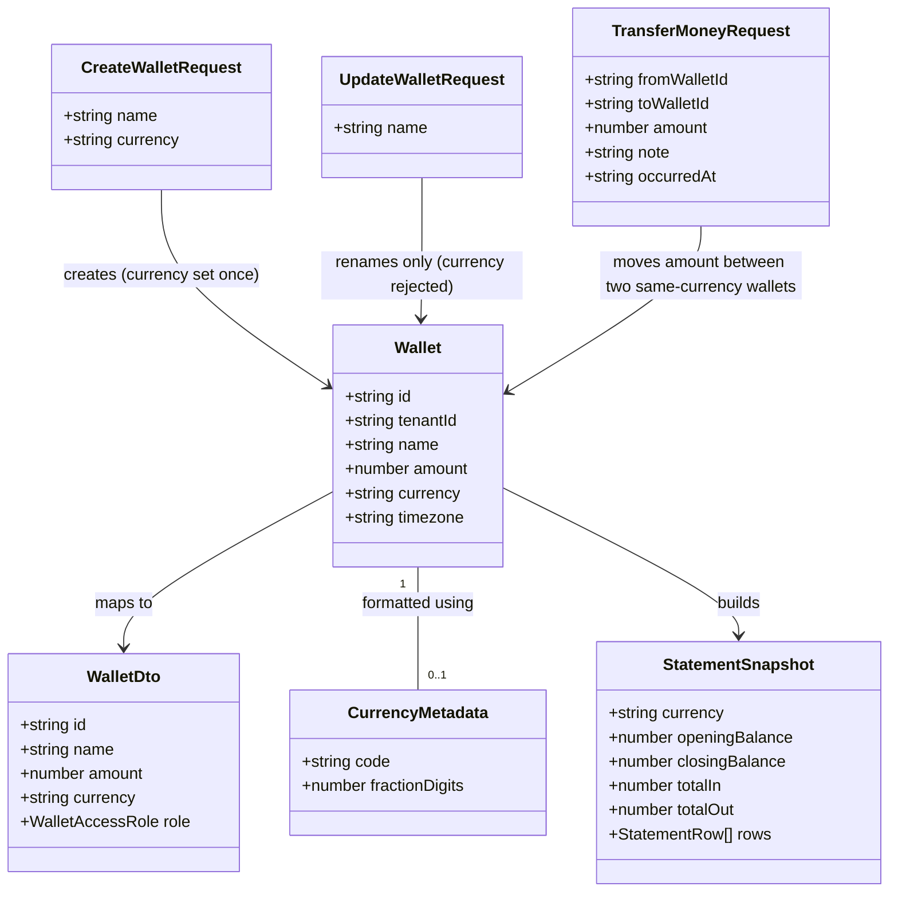

# Per-Wallet Currency, Immutable After Creation

## Requirements

Give every wallet a fixed currency, chosen once at creation, so amounts in that wallet
are always stored, entered, and displayed in the correct unit and precision — enabling
self-hosters outside VND-only usage without disturbing the existing VND-only product,
and without allowing a wallet's currency to drift after creation.

## Entities

**Conservative note**: `currency` is a new scalar column on the existing `Wallet`
entity, not a new table. `CurrencyMetadata` is a static, in-code lookup (constant map),
not a database entity — it never needs to be queried, joined, or persisted. No new
Kysely table, no new DTO class beyond adding one field to the existing `WalletDto`,
`CreateWalletRequest` (`createWalletSchema`), and `StatementSnapshot`.

## Approach

1. **Data model**:
   - Add `wallet.currency` as `text NOT NULL DEFAULT 'VND'` via a single
     `ALTER TABLE ... ADD COLUMN` migration, mirroring the existing
     `0004_add_transaction_occurred_at_and_wallet_timezone` migration's pattern for
     `wallet.timezone` (same table, same "add NOT NULL column with a default" shape).
     Postgres backfills existing rows automatically from the column default — no
     separate `UPDATE` statement needed.
   - Leave `wallet.amount` / `transaction.amount` (`numeric(14,2)`) untouched. Decimal
     precision for USD/EUR is a formatting-and-input concern only, layered on top of
     an already-decimal-capable column.

2. **API surface**:
   - `POST /api/wallets`: accept an optional `currency` field, validated against a
     fixed v1 allow-list (`VND`, `USD`, `EUR`, `JPY`), defaulting to `'VND'` when
     omitted or falsy. This is the only write path for `wallet.currency`.
   - `PATCH /api/wallets/:walletId`: explicitly reject the request with 400 if the
     body contains a `currency` key at all (regardless of value), before touching the
     `name` validation. This makes immutability a hard API contract, not a silent
     drop, and gives self-hosters/API clients an unambiguous signal instead of a
     request that appears to succeed but doesn't apply what was sent.
   - `GET /api/wallets`, wallet PATCH/DELETE responses, and `WalletDto` all gain a
     `currency` field alongside the existing `amount` field, following the exact
     shape already used for `amount`.
   - `POST /api/wallets/transfer`: after resolving `fromWallet`/`toWallet` via
     `requireWalletWriteAccess`, reject with 400 if `fromWallet.currency !==
toWallet.currency`, before calling `transferBetweenWallets`. No conversion
     logic; blocking is enforced at the API boundary, consistent with how
     same-wallet and non-positive-amount cases are already rejected in this handler.

3. **Formatting/UI layer**:
   - Introduce a `CURRENCY_FRACTION_DIGITS: Record<string, number>` constant map in
     `packages/utils/src/currency/constants.ts` covering the v1 allow-list (`VND: 0`,
     `JPY: 0`, `USD: 2`, `EUR: 2`), and a `getCurrencyFractionDigits(code)` helper
     that falls back to `DEFAULT_MAXIMUM_FRACTION_DIGITS` (0) for an unrecognized
     code — preserving current VND-shaped behavior for any caller that doesn't pass
     a currency.
   - `resolveFormatCurrencyOptions` (in `utils.ts`) and `resolveCurrencyInputOptions`
     (in `input.ts`) derive `minimumFractionDigits`/`maximumFractionDigits` from
     `getCurrencyFractionDigits(currency)` instead of the flat `DEFAULT_*` constants,
     when a `currency` is supplied. `formatCurrency`'s existing
     `currency === 'VND' ? 'compact' : 'standard'` notation branch is unaffected —
     it already switches on the resolved currency code.
   - `CurrencyInput` gains an optional `currency` prop (defaulting to `'VND'` to
     preserve existing behavior for any un-migrated caller), threaded into
     `formatCurrencyInput`/`parseCurrencyInput`/`getCurrencyInputCaretPosition` via
     `{ locale, maximumFractionDigits: getCurrencyFractionDigits(currency) }` instead
     of the hardcoded `DEFAULT_CURRENCY_INPUT_OPTIONS`.
   - Every existing `formatCurrency(...)`/`CurrencyInput` call site is updated to pass
     the currency of the specific wallet in scope at that call site (list is
     enumerated in Operations).

4. **Statement snapshots**:
   - `buildStatement` selects `currency` alongside `amount`/`deletedAt` from `wallet`
     and includes it on the returned `StatementSnapshot`.
   - `statement-snapshot-view.tsx` and `statement-export.ts` pass
     `snapshot.currency` into every `formatCurrency`/`formatSignedCurrency` call —
     this alone makes amounts render in the correct currency/precision; no separate
     currency label field is added (per the resolved decision that a distinct
     `display_title`-style field is unnecessary — correct amount formatting already
     communicates the currency).

5. **Out of scope for v1** (explicit, not deferred silently):
   - No DB-level immutability trigger/constraint — handler-level rejection is the
     enforcement boundary, consistent with every other invariant in this codebase.
   - No currency-awareness added to `scripts/import-csv.ts` /
     `scripts/import-bank-csv.ts` — imported/newly-created wallets fall through to
     the `'VND'` column default, matching current real-world usage.
   - No currency-conversion / exchange-rate concept.

## Structure

### Inheritance Relationships

1. No new class hierarchies are introduced. `wallet.currency` is a plain column on
   the existing `WalletTable` Kysely interface (`src/lib/db/schema.ts`), typed as
   `Generated<string>` — the same shape as `timezone: Generated<string>` — because
   `currency` is optional at insert time from several call sites that intentionally
   rely on the column's `'VND'` default (the seed script, both CSV import scripts,
   and existing tests), not just the create-wallet handler which always supplies it
   explicitly.
2. `createWalletSchema` (Valibot, `src/schemas/wallet.schema.ts`) gains a `currency`
   field; `updateWalletSchema` remains `= createWalletSchema` is **no longer
   correct** and must become its own object omitting `currency`, so the client-side
   update form/schema cannot even construct a `currency` key.

### Dependencies

1. `wallets.mts` (POST) → `db.insertInto('wallet')` with `currency`; depends on a new
   currency-allow-list constant/validator (co-located in the handler or a shared
   `netlify/functions/lib/currency.ts` — see Operations).
2. `wallet.mts` (PATCH) → validates body has no `currency` key before calling
   `requireWalletWriteAccess`/the update query; no new dependency, just an added
   guard clause.
3. `wallet-transfer.mts` → depends on `fromAccess.wallet.currency` /
   `toAccess.wallet.currency` (already-selected `OwnedWallet` fields once `currency`
   is added to `OwnedWallet`/`AccessibleWallet` in `tenant-access.ts`).
4. `packages/ui/currency-input.tsx` → depends on new `getCurrencyFractionDigits` from
   `@vhnam/utils/currency`.
5. `statement.ts` (`buildStatement`) → selects `currency` from `wallet`; depends on
   `StatementSnapshot` type gaining the field.
6. All UI call sites (`app-sidebar-wallets.tsx`, `wallet-header.tsx`,
   `wallet-summary.tsx`, `wallet-settings-activity.tsx`,
   `wallet-add-transaction-dialog.tsx`, `wallet-edit-transaction-form.tsx`,
   `wallet-transfer-money-dialog.tsx`, `wallet-transaction.tsx`,
   `wallet-transaction-dialog-header.tsx`, `statement-snapshot-view.tsx`) depend on
   `wallet.currency` (or `snapshot.currency`) being present on the DTO/prop they
   already receive — no new data fetching, just consuming a field that starts
   flowing through existing responses.

### Layered Architecture

1. **Migration layer**: `src/lib/db/migrations/0009_add_wallet_currency.ts` — schema
   change only.
2. **Netlify function layer** (`netlify/functions/*.mts` + `lib/*.ts`): request
   validation (currency allow-list on create, currency-key rejection on update,
   currency-match check on transfer), persistence, and response shaping.
3. **Query/DTO layer** (`src/queries/wallets/*`, `src/schemas/*`): typed request/
   response shapes gain `currency`; `updateWalletSchema` diverges from
   `createWalletSchema` to structurally exclude `currency`.
4. **Shared formatting layer** (`packages/utils/src/currency/*`): currency-aware
   fraction-digit resolution — the layer this whole feature's display correctness
   hinges on.
5. **Shared UI layer** (`packages/ui/src/components/currency-input.tsx`): consumes
   the formatting layer via a new `currency` prop.
6. **App UI layer** (`src/modules/**`, `src/layouts/**`): passes each specific
   wallet's `currency` into the formatting/UI layer at every existing call site.
7. **Statement layer** (`src/lib/statement.ts`, `statement-export.ts`,
   `statement-snapshot-view.tsx`): currency flows from wallet → snapshot → rendered/
   exported output.

## Operations

### Create Migration - `0009_add_wallet_currency`

1. Responsibility: add `wallet.currency` as a NOT NULL, defaulted column; existing
   rows backfilled to `'VND'` via the column default in the same statement.
2. Methods:
   - `up(db)`:
     - Logic:
       - `db.schema.alterTable('wallet').addColumn('currency', 'text', (col) => col.notNull().defaultTo('VND')).execute()`
       - Mirror `0004`'s single-statement `addColumn(...).notNull().defaultTo(...)`
         shape exactly — no separate `UPDATE` needed since Postgres applies the
         default to existing rows for a `NOT NULL DEFAULT` column add.
   - `down(db)`:
     - Logic: `db.schema.alterTable('wallet').dropColumn('currency').execute()`
3. Constraints: file name/number must be the next unused migration number after
   `0008_add_wallet_member_invite_token`; never edit a merged migration.

### Update Table Type - `WalletTable` (`src/lib/db/schema.ts`)

1. Responsibility: reflect the new column in the Kysely schema type.
2. Attributes:
   - `currency: Generated<string>` — added directly under `amount`, matching
     `timezone`'s shape, since several insert paths (seed script, CSV imports,
     tests) intentionally omit it and rely on the column default.

### Update Schema - `createWalletSchema` / `updateWalletSchema` (`src/schemas/wallet.schema.ts`)

1. Responsibility: validate wallet create/update payloads at the client boundary,
   keeping `currency` structurally absent from update payloads.
2. Methods:
   - `createWalletSchema`: `v.object({ name: <existing>, currency: v.picklist(['VND', 'USD', 'EUR', 'JPY']) })`
     - Logic: required field, no default in the schema itself — the create dialog's
       form always supplies a value (see UI task below), so there's no reliance on
       server-side default-filling from the client path; the server-side default
       (`'VND'` when omitted) exists for non-UI API callers only.
   - `updateWalletSchema`: becomes `v.object({ name: <existing> })`, structurally
     independent of `createWalletSchema` (no longer a type alias), so `currency` is
     unrepresentable in a valid `UpdateWalletSchema` value.
3. Constraints: `CreateWalletSchema`/`UpdateWalletSchema` inferred types must stay in
   sync with what `wallet.api.ts`'s `createWallet`/`updateWallet` send.

### Implement Currency Allow-List - `netlify/functions/lib/currency.ts` (new file)

1. Responsibility: single source of truth for the v1 allowed currency codes, shared
   by the wallet-create handler (validation) and nowhere else server-side.
2. Attributes:
   - `ALLOWED_WALLET_CURRENCIES: readonly string[]` — `['VND', 'USD', 'EUR', 'JPY']`.
3. Methods:
   - `isAllowedCurrency(value: unknown): value is string`
     - Logic: `typeof value === 'string' && ALLOWED_WALLET_CURRENCIES.includes(value)`.
4. Constraints: this list must stay in sync with
   `packages/utils/src/currency/constants.ts`'s `CURRENCY_FRACTION_DIGITS` keys — both
   are v1's definition of "known currency," kept in two layers deliberately (Netlify
   function code cannot import from the workspace UI/utils package boundary the same
   way; confirm during implementation whether `@vhnam/utils/currency` is already
   importable from `netlify/functions/lib` — if so, prefer importing the single list
   from there instead of duplicating it).

### Update Handler - `POST /api/wallets` (`wallets.mts`)

1. Responsibility: accept an optional, validated `currency` on wallet creation;
   default to `'VND'`.
2. Methods:
   - Default export handler, `POST` branch:
     - Logic:
       - Parse body as `{ name?: unknown; currency?: unknown }`.
       - Existing `name` validation unchanged.
       - If `body.currency !== undefined`, validate with `isAllowedCurrency`; if
         invalid, return `400` `"Unsupported currency"`.
       - Resolve `currency = isAllowedCurrency(body.currency) ? body.currency : 'VND'`.
       - Insert wallet with `currency` included in the `values(...)` call.
       - Include `currency` in both the `.returning([...])` columns and the
         `Response.json({ ...wallet, amount: 0, currency, role: 'owner' })` payload.
3. Constraints: currency is set exactly once, in this handler's insert — no other
   write path may set it.

### Update Handler - `PATCH /api/wallets/:walletId` (`wallet.mts`)

1. Responsibility: reject any request whose body contains a `currency` key, before
   applying the rename.
2. Methods:
   - Default export handler, PATCH branch (after `requireWalletWriteAccess`, before
     `body.name` validation):
     - Logic:
       - Parse body as `{ name?: unknown; currency?: unknown }`.
       - If `'currency' in body` (key present, any value including `undefined` via
         explicit key), return `new Response('Currency cannot be changed after wallet creation', { status: 400 })`.
       - Existing `name` validation and update logic unchanged otherwise.
       - Include `currency` (unchanged, read from `access.wallet.currency`) in the
         `.returning([...])` columns and response payload, so the client always has
         the current value even though this handler never writes it.
3. Constraints: this is a hard rejection (400), not a silent drop — the whole PATCH
   request fails if `currency` is present in the body, regardless of value.

### Update Handler - `POST /api/wallets/transfer` (`wallet-transfer.mts`)

1. Responsibility: block transfers between wallets of different currencies.
2. Methods:
   - Default export handler, after resolving `fromAccess`/`toAccess` and before
     calling `transferBetweenWallets`:
     - Logic:
       - `if (fromWallet.currency !== toWallet.currency) return new Response('Cannot transfer between wallets with different currencies', { status: 400 })`.
3. Constraints: no conversion attempted; this check runs after the existing
   same-wallet and access checks, before any DB write, so no partial transfer state
   is possible.

### Update Type - `OwnedWallet` / `AccessibleWallet` (`netlify/functions/lib/tenant-access.ts`)

1. Responsibility: carry `currency` through every wallet-access resolution path so
   downstream handlers (transfer, statement) can read it without a second query.
2. Attributes:
   - `OwnedWallet.currency: string` — added to the type and to `findOwnedWallet`'s
     `.select([...])` list.
   - `AccessibleWallet` inherits it automatically (`OwnedWallet & { role }`).
3. Methods:
   - `findAccessibleWallets`: add `'currency'` to the existing `.select([...])` list
     (the one currently selecting `['id', 'tenantId', 'name', 'amount', 'timezone', ...]`).
4. Constraints: every existing `.select([...])` call in this file that lists
   `amount`/`timezone` for `wallet` must be checked and updated in the same pass —
   do not add `currency` to only one of `findOwnedWallet`/`findAccessibleWallets`/
   `requireWalletAccess`-adjacent queries and miss another.

### Update DTO - `WalletDto` (`src/queries/wallets/wallet.dto.ts`)

1. Responsibility: expose `currency` to the frontend.
2. Attributes:
   - `currency: string` — added alongside `amount`.

### Update Component - `CreateWalletDialog` / `createWalletSchema` usage (`wallet-create-dialog.tsx`)

1. Responsibility: let the user pick a currency at creation time; this is the only
   UI surface where currency is ever set.
2. Methods:
   - Add a currency `Field`/`Select` bound to `path: ['currency']`, offering the v1
     allow-list (`VND`, `USD`, `EUR`, `JPY`), defaulting the form's initial value to
     `'VND'`.
     - Logic: reuse the existing `Field`/`FieldLabel`/`FieldError` pattern already
       used for `name` in this file; use whatever `@vhnam/ui` select/combobox
       component is the established pattern elsewhere in the codebase (verify against
       an existing Formisch-bound select field before introducing a new pattern).
3. Constraints: this dialog is the **only** place a `currency` value is ever
   collected from a user.

### Update Component - `WalletSettingsGeneral` (`wallet-settings-general.tsx`)

1. Responsibility: confirm currency is **not** shown as an editable field.
2. Methods: no new editable field added. Optionally display currency as read-only
   text near the wallet name (e.g. a small "Currency: VND" label with no input) —
   confirm with product intent during implementation whether even a read-only display
   is wanted here, or whether currency should only be visible via amount formatting
   elsewhere; default to **not** adding a new UI element if not explicitly required,
   per the conservative-entity-design principle.

### Update Shared Currency Utils - `packages/utils/src/currency/constants.ts` / `utils.ts` / `input.ts`

1. Responsibility: make fraction-digit resolution currency-aware instead of
   hardcoded to VND's zero digits.
2. Attributes:
   - `constants.ts`: add `CURRENCY_FRACTION_DIGITS: Record<string, number> = { VND: 0, JPY: 0, USD: 2, EUR: 2 }`.
3. Methods:
   - `getCurrencyFractionDigits(code?: string): number` (new, in `utils.ts` or a new
     `constants.ts`-adjacent helper):
     - Logic: `code !== undefined && code in CURRENCY_FRACTION_DIGITS ? CURRENCY_FRACTION_DIGITS[code] : DEFAULT_MAXIMUM_FRACTION_DIGITS`.
   - `resolveFormatCurrencyOptions` (`utils.ts`): change
     `minimumFractionDigits`/`maximumFractionDigits` resolution to
     `options.minimumFractionDigits ?? getCurrencyFractionDigits(resolvedCurrency)`
     (same for maximum), where `resolvedCurrency` is the already-resolved
     `options.currency ?? DEFAULT_CURRENCY_CODE`.
   - `resolveCurrencyInputOptions` (`input.ts`): same change, driven by a new
     `currency` field on `CurrencyInputFormatOptions`
     (`Pick<FormatCurrencyOptions, 'locale' | 'maximumFractionDigits' | 'currency'>`).
4. Constraints: explicit `minimumFractionDigits`/`maximumFractionDigits` passed by a
   caller must still win over the currency-derived value (preserve existing
   override behavior — don't regress any caller currently passing explicit digits).

### Update Component - `CurrencyInput` (`packages/ui/src/components/currency-input.tsx`)

1. Responsibility: format/parse input according to the wallet's currency, not a
   fixed default.
2. Attributes:
   - `currency?: string` — new prop on `CurrencyInputProps`, default `'VND'`.
3. Methods:
   - `CurrencyInput({ currency = 'VND', ... })`:
     - Logic: replace every `DEFAULT_CURRENCY_INPUT_OPTIONS` usage
       (`formatCurrencyInput`, `parseCurrencyInput` calls) with
       `{ locale: DEFAULT_CURRENCY_LOCALE, maximumFractionDigits: getCurrencyFractionDigits(currency) }`.
4. Constraints: default value (`'VND'`) preserves current behavior for any call site
   not yet updated to pass `currency` explicitly — but all three known call sites
   (`wallet-add-transaction-dialog.tsx`, `wallet-edit-transaction-form.tsx`,
   `wallet-transfer-money-dialog.tsx`) must be updated in this same change to pass
   the relevant wallet's `currency`.

### Update UI Call Sites - `formatCurrency`/`formatSignedCurrency` consumers

1. Responsibility: pass the specific wallet's `currency` at every existing
   formatting call site instead of relying on the implicit VND default.
2. Files and call sites (each: add `{ currency: wallet.currency }` as the options
   argument, sourcing `wallet` from whatever prop/query already provides `amount` at
   that line):
   - `app-sidebar-wallets.tsx:69` — `formatCurrency(wallet.amount)`
   - `wallet-header.tsx:26` — `formatCurrency(wallet.amount)`
   - `wallet-summary.tsx:74` — `formatCurrency(stat.value)` (verify `wallet` is in
     scope in this component; thread it through as a prop if not already)
   - `wallet-settings-activity.tsx:97` — `formatCurrency(item.walletAmountDelta)`
     (verify `wallet` is in scope; this is the wallet whose activity is displayed)
   - `wallet-transaction.tsx`, `wallet-transaction-dialog-header.tsx` — wherever
     `formatCurrency`/`formatSignedCurrency` is called for a transaction amount, use
     that transaction's owning wallet's currency
   - `wallet-add-transaction-dialog.tsx`, `wallet-edit-transaction-form.tsx`,
     `wallet-transfer-money-dialog.tsx` — pass `currency` to the `CurrencyInput`
     component itself (see previous task), not to a `formatCurrency` call
3. Constraints: every file identified in the analysis's concept-driven search
   (`grep` for `formatCurrency|formatShortCurrency|formatSignedCurrency|CurrencyInput`
   across `apps/ledger-box/src`) must be checked — do not assume the list above is
   exhaustive without re-verifying at implementation time, since new call sites may
   exist that weren't matched by the original search terms.

### Update Domain Logic - `buildStatement` (`src/lib/statement.ts`)

1. Responsibility: carry `currency` from `wallet` into the returned snapshot.
2. Methods:
   - `buildStatement(db, walletId, bounds, timezone)`:
     - Logic: add `'currency'` to the existing
       `.select(['amount', 'deletedAt'])` call on `wallet`; add `currency:
wallet.currency` to the returned `StatementSnapshot` object.
3. Attributes:
   - `StatementSnapshot.currency: string` — new field on the exported type.

### Update Components - `statement-snapshot-view.tsx` / `statement-export.ts`

1. Responsibility: render/export statement amounts in the snapshot's currency.
2. Methods:
   - Every `formatCurrency(...)`/`formatSignedCurrency(...)` call in
     `statement-snapshot-view.tsx` (lines 42, 46, 50, 54, 76 per the current file)
     and in `statement-export.ts` gains `{ currency: snapshot.currency }` as its
     options argument.
3. Constraints: no new "currency label" field or component is introduced — correct
   per-amount formatting is the resolved answer to the `display_title` question in
   the original requirement.

### Update Seed Data - `scripts/seed.ts`

1. Responsibility: replace USD-shaped transaction amounts with VND-shaped whole
   numbers, matching the app's real-world usage and this feature's default.
2. Methods:
   - Update the seed transaction list's `amount` values from decimal, US-magnitude
     figures (e.g. `4500`, `85.5`, `42.3`, `15.99`) to whole-number, VND-magnitude
     figures (e.g. `4_500_000`, `85_000`, `42_000`, `16_000`), preserving relative
     proportions between entries (salary > rent > groceries > coffee, etc.) rather
     than a literal unit conversion.
   - No `currency` field needs to be set explicitly in the wallet insert within this
     script — it will pick up the `'VND'` column default from the migration, which
     is correct for this script's purpose.
3. Constraints: this is a standalone cleanup bundled into the same change per the
   requirement's explicit call-out; it does not block or gate the currency feature
   itself and can be verified independently (run the seed script, confirm amounts
   display as whole-number VND).

## Norms

1. **Migration style**: single `ALTER TABLE ... ADD COLUMN ... NOT NULL DEFAULT ...`
   statement per new nullable-turned-required field, matching `0004`'s `timezone`
   precedent. Never edit a merged migration; add a new one.
2. **Handler validation style**: parse body as a loosely-typed object
   (`{ field?: unknown }`), validate each field with an explicit `typeof`/allow-list
   check, return a `new Response(message, { status: 400 })` with a short, specific
   message — matching the existing style in `wallets.mts`/`wallet.mts`/
   `wallet-transfer.mts`. No shared validation library/framework is introduced.
3. **Tenancy scoping**: every wallet read/write touched by this feature already
   flows through `requireOwnedWallet`/`requireWalletWriteAccess`/
   `findAccessibleWallets` — no new query bypasses these helpers to read or write
   `wallet.currency`.
4. **Formatting layer boundary**: no component or Netlify handler re-implements
   currency formatting or fraction-digit logic locally — all such logic lives in
   `packages/utils/src/currency`, per the existing "never re-implement formatting
   locally" rule in `AGENTS.md`.
5. **Response shape consistency**: `currency` is added to a wallet response payload
   using the exact same field-listing pattern already used for `amount` in that
   handler (same `.returning([...])`/`Response.json({...})` calls), not introduced
   as a differently-shaped nested object.
6. **Type-schema alignment**: `WalletTable` (Kysely), `WalletDto` (frontend),
   `createWalletSchema`/`updateWalletSchema` (Valibot), and `OwnedWallet`/
   `AccessibleWallet` (tenant-access) must all be updated together in the same
   change — a `currency` field added to only one layer will produce a type error or
   a silently-dropped field at another layer.
7. **No new abstractions**: no repository/service class, no currency-conversion
   module, no generic "immutable field" framework is introduced for this single
   field — the immutability rule is expressed as one explicit guard clause in the
   PATCH handler, matching how every other business rule in this codebase (soft
   delete, tenant scoping) is expressed as explicit code, not a generic mechanism.

## Safeguards

1. **Functional Constraints**:
   - `wallet.currency` is set exactly once, at `POST /api/wallets` time, and is
     never modified by any other code path in this change.
   - `PATCH /api/wallets/:walletId` returns HTTP 400 if the request body contains a
     `currency` key, regardless of its value (including `null` or a value matching
     the existing currency) — the presence of the key alone is sufficient to reject.
   - `POST /api/wallets/transfer` returns HTTP 400 if `fromWallet.currency !==
toWallet.currency`, before any balance mutation occurs.
   - `WalletSettingsGeneral` never renders an editable currency input.
2. **Data Constraints**:
   - `wallet.currency` is `NOT NULL` at the database level with a `'VND'` default;
     every pre-existing row is backfilled to `'VND'` via that default, not left
     `NULL` or requiring an application-level fallback.
   - Only `VND`, `USD`, `EUR`, `JPY` are accepted by `POST /api/wallets` in v1; any
     other value (or a non-string value) is rejected with HTTP 400, not silently
     coerced to `'VND'`.
   - `wallet.amount` and `transaction.amount` column types (`numeric(14,2)`) are
     unchanged by this feature — no migration touches these columns.
3. **Business Rule Constraints**:
   - A transfer is never partially applied: the currency-match check in
     `wallet-transfer.mts` runs before `transferBetweenWallets` is invoked, so a
     rejected transfer produces zero writes to either wallet's balance or the
     activity log.
   - Every money amount rendered for a wallet-scoped view (wallet list, wallet
     header, wallet summary, transaction rows, activity log deltas, statement
     snapshots — both in-app and shared/exported) is formatted using that specific
     wallet's `currency`, not the library default, once this change is complete.
   - Seed data (`scripts/seed.ts`) uses VND-shaped whole-number amounts; CSV import
     scripts remain unchanged and continue to produce VND-currency wallets/imports
     in v1 (explicitly out of scope, not a silent gap).
4. **Integration Constraints**:
   - No DB-level trigger or check constraint is added for currency immutability in
     this change — enforcement is handler-only, consistent with the codebase's
     existing pattern for every other business invariant (soft delete, tenant
     scoping). A self-hoster with direct DB access can still bypass this at the SQL
     level; that is an accepted, explicit trade-off for v1, not an oversight.
   - No exchange-rate or currency-conversion integration is introduced; cross-
     currency transfers are blocked outright, not converted.
5. **Technical Constraints**:
   - All currency-fraction-digit logic lives in `packages/utils/src/currency`;
     `packages/ui`'s `CurrencyInput` and every Netlify handler consume it rather than
     reimplementing digit/locale logic.
   - `CurrencyInput`'s `currency` prop defaults to `'VND'` so any call site not
     explicitly updated in this change continues to behave exactly as before
     (zero-decimal, VND-locale formatting) rather than breaking.
6. **API Constraints**:
   - `POST /api/wallets` request body: `{ name: string, currency?: 'VND' | 'USD' | 'EUR' | 'JPY' }` — `currency` optional, defaults server-side to `'VND'`.
   - `PATCH /api/wallets/:walletId` request body: `{ name: string }` only — a
     `currency` key present anywhere in the body is a hard rejection (400), not a
     no-op success.
   - Every wallet response payload (`GET /api/wallets`, `POST /api/wallets`,
     `PATCH /api/wallets/:walletId`) includes `currency` alongside `amount`, `id`,
     and `name`.
   - `POST /api/wallets/transfer` gains no new request fields; the currency-match
     check is derived entirely from the two wallets' existing `currency` values, not
     from anything the client sends.
