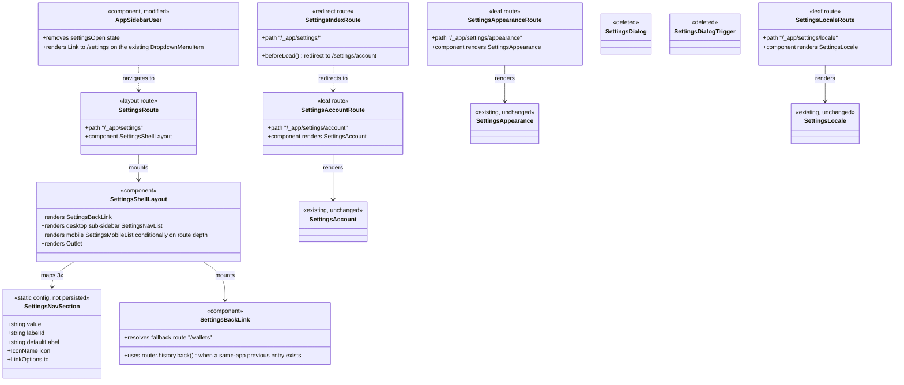

# Move User Settings from Dialog to Standalone `/settings` Route

## Requirements

Convert user settings (Account, Appearance, Language) from a modal dialog opened out of
the sidebar user menu into a standalone, deep-linkable route at `/settings`, mirroring the
existing `_app/wallets/$walletId/settings/` layout-route pattern, so that settings pages
are shareable, bookmarkable, reloadable, and have a mobile-appropriate layout — without
altering any section's existing form, mutation, or query logic.

## Entities

## Approach

1. **Routing strategy**:
   - Add a new top-level authenticated layout route `routes/_app/settings/route.tsx`,
     sibling to `routes/_app/wallets/`, mounting a new `SettingsShellLayout` component —
     not nested under any dynamic param, since user settings has no `walletId`-like
     resource identity.
   - Add `routes/_app/settings/index.tsx` with a `beforeLoad` redirect to
     `/settings/account`, copying the exact mechanism in
     `wallets/$walletId/settings/index.tsx`.
   - Add three leaf routes — `account.tsx`, `appearance.tsx`, `locale.tsx` — each a thin
     `RouteComponent` that imports and renders one existing settings module with zero
     props. Unlike the wallet-settings leaf routes (which need a `*-route.tsx` wrapper to
     fetch wallet-scoped data via `walletId`), these sections take no props today, so no
     extra wrapper-component indirection layer is introduced — render the module
     directly from the file route component.

2. **Shell component design**:
   - New component `SettingsShellLayout` in
     `modules/settings/settings-shell-layout/settings-shell-layout.tsx`, structurally
     modeled on `WalletShellLayout` (`modules/wallets/wallet-shell-layout/`) but
     simplified: no async wallet fetch, no role-based section filtering, no owner-only
     gating — a static three-item section list.
   - Reuses the same layout rhythm as the rest of the app shell: a `header-height`-tall
     header row containing the back link, a `hidden md:flex md:w-64 md:border-r` desktop
     sub-sidebar of `Button`+`Link` items (active state via `useLocation()` pathname
     matching, exactly as `WalletShellLayout` does), and an `<Outlet />` inside a
     `ScrollArea` for the section body.
   - Desktop/mobile split lives in one component via responsive Tailwind classes, per the
     existing `WalletShellLayout` precedent (a single component branching `md:hidden` /
     `hidden md:flex`), rather than two separate components — avoids duplicating the
     `SettingsNavSection` list in two places.

3. **Mobile-specific list (new pattern, not copied from wallet settings)**:
   - Wallet settings' mobile nav is a `DropdownMenu` in a slim sub-header — explicitly
     out of scope to reuse per the task instructions ("Do not attempt to fit the desktop
     sub-sidebar into a mobile-width layout").
   - Build a distinct mobile view: when route depth is exactly `/settings` (no section
     segment matched) **and** viewport is mobile, render a full-width scrollable stacked
     list of the three sections (icon + label + chevron, tap-through `Link`), similar to
     a native iOS/Android settings screen. When a section is active on mobile (e.g.
     `/settings/account`), the stacked list is not shown — only the section content is,
     with the back link returning to `/settings` (not the pre-settings page) — see
     Structure/Operations for the exact two-level back-target logic.
   - This mobile list is implemented as `SettingsMobileList`, a new component colocated
     with the shell (not `packages/ui`, since it embeds route-specific navigation and
     i18n message ids — app-level per `AGENTS.md`'s module boundary).

4. **Back navigation** (replaces the dialog's default `X` `DialogClose`):
   - `SettingsBackLink` renders an `ArrowLeftIcon` + label button (mirrors the existing
     `ArrowLeftIcon` back-affordance pattern in
     `wallet-transaction-dialog-header.tsx`/`wallet-edit-transaction-dialog.tsx`, applied
     for the first time at the route level rather than inside a dialog stepper).
   - Two distinct back semantics, both resolved via TanStack Router's `useRouter()`:
     - **From `/settings` (index redirect target `/settings/account`, or any section, on
       desktop where there's one back level)**: attempt `router.history.back()` if
       `router.history.canGoBack()` (or equivalent — see Operations for exact API); if
       there is no prior in-app entry (direct load/bookmark/refresh), fall back to
       `navigate({ to: '/wallets' })`, matching the existing `/_app/index.tsx` redirect
       target so the fallback is consistent with the rest of the app's "home".
     - **From a mobile section route back to the `/settings` stacked list**: this is a
       normal in-app forward navigation (list → section), so `router.history.back()`
       reliably returns to `/settings` without needing the fallback branch — no special
       casing required beyond the shared `SettingsBackLink` logic already using history
       first.
   - This back-target logic is intentionally centralized in one hook/component
     (`useSettingsBackNavigation` or inlined in `SettingsBackLink`) rather than
     duplicated per route.

5. **Sidebar user menu wiring**:
   - `AppSidebarUser` drops `useState<boolean>` `settingsOpen` and the `<SettingsDialog>`
     mount entirely.
   - The existing `DropdownMenuItem` (currently `SettingsDialogTrigger`, an `onClick`
     handler) becomes a direct `DropdownMenuItem` rendering a `Link to="/settings"`,
     following the same `nativeButton={false}` + `render={<Link .../>}` composition
     already used elsewhere in this codebase (e.g. `WalletShellLayout`'s
     `DropdownMenuItem` with `render={<Link .../>}` for wallet settings sections).

6. **Cleanup**: delete `modules/settings/settings-dialog/` (component, index, and any
   barrel export) once no import references remain — confirmed only consumer is
   `AppSidebarUser`.

## Structure

### Inheritance Relationships

1. No new class hierarchies — this is a composition/routing change only, matching the
   existing TanStack Router file-based route + presentational-component composition
   pattern already used for wallet settings. No interfaces, abstract classes, or
   exceptions are introduced.

### Dependencies

1. `routes/_app/settings/route.tsx` renders `SettingsShellLayout`
   (`modules/settings/settings-shell-layout`).
2. `SettingsShellLayout` depends on `SettingsBackLink`, `SettingsNavSection` config
   (local constant, not a shared module), `SettingsMobileList`, TanStack Router's
   `useLocation`/`useRouter`, and `@vhnam/ui`'s `Button`, `Icon`, `ScrollArea`.
3. `routes/_app/settings/account.tsx` depends on `modules/settings/settings-account`
   (`SettingsAccount`, unchanged).
4. `routes/_app/settings/appearance.tsx` depends on
   `modules/settings/settings-appearance` (`SettingsAppearance`, unchanged).
5. `routes/_app/settings/locale.tsx` depends on `modules/settings/settings-locale`
   (`SettingsLocale`, unchanged).
6. `routes/_app/settings/index.tsx` depends only on `@tanstack/react-router`'s `redirect`.
7. `layouts/app-layout/app-sidebar-user.tsx` (`AppSidebarUser`) depends on
   `@tanstack/react-router`'s `Link` instead of `modules/settings/settings-dialog`.
8. `modules/settings/settings-dialog/` becomes dependency-free (deleted), removing its
   dependency on `@vhnam/ui`'s `Dialog`, `Tabs`.

### Layered Architecture

1. **Route layer** (`routes/_app/settings/*.tsx`): thin file-based route definitions —
   path registration, `beforeLoad` redirect for the index, and prop-less rendering of
   module components. No business logic.
2. **Shell/layout layer** (`modules/settings/settings-shell-layout/`): navigation
   chrome — active-section highlighting, responsive desktop/mobile branching, back-link
   resolution. No data fetching, no mutations.
3. **Section module layer** (`modules/settings/settings-account/`,
   `settings-appearance/`, `settings-locale/`): existing, untouched — form state,
   mutations, and queries stay exactly as they are.
4. **App shell layer** (`layouts/app-layout/app-sidebar-user.tsx`): entry point —
   changes only its navigation trigger, not its own layout responsibilities.
5. No exception-handling layer changes — this is a client-only routing/UI change; no new
   error paths beyond what `SettingsLocale`'s existing `toast.add` error handling already
   covers.

## Operations

### Create Layout Route - `routes/_app/settings/route.tsx`

1. Responsibility: registers the `/_app/settings` layout route and mounts the shell.
2. Attributes: none (route definition file).
3. Methods:
   - `RouteComponent()`: `ReactNode`
     - Logic:
       - Returns `<SettingsShellLayout />` with no props (no route params to thread
         through, unlike `wallets/$walletId/route.tsx` which passes `walletId`).
4. Annotations: `createFileRoute('/_app/settings')({ component: RouteComponent })`.
5. Constraints: must sit under `_app` so the existing session `beforeLoad` guard in
   `routes/_app/route.tsx` applies automatically; no additional auth logic here.

### Create Redirect Route - `routes/_app/settings/index.tsx`

1. Responsibility: redirects `/settings` to `/settings/account`.
2. Methods:
   - `beforeLoad()`: `never`
     - Logic:
       - `throw redirect({ to: '/settings/account' })`, copying
         `wallets/$walletId/settings/index.tsx` verbatim in structure (no params to
         pass).
3. Annotations: `createFileRoute('/_app/settings/')({ beforeLoad: ... })`.
4. Constraints: must not render any component — redirect-only, matching the wallet
   settings precedent exactly.

### Create Leaf Routes - `account.tsx`, `appearance.tsx`, `locale.tsx`

1. Responsibility: each registers one stable, deep-linkable section URL and renders the
   corresponding existing section component with no props.
2. Methods (repeated per file, substituting the section name/component):
   - `RouteComponent()`: `ReactNode`
     - Logic:
       - `account.tsx` → `return <SettingsAccount />;`
       - `appearance.tsx` → `return <SettingsAppearance />;`
       - `locale.tsx` → `return <SettingsLocale />;`
     - No params, no data-loading `beforeLoad` — these components manage their own
       queries/mutations internally already (`SettingsLocale` uses
       `useUserLocale`/`useUpdateUserLocale` internally).
3. Annotations: `createFileRoute('/_app/settings/account')({ component: RouteComponent })`
   (and analogous for the other two paths).
4. Constraints: import the section components exactly as currently exported from
   `modules/settings/settings-account`, `settings-appearance`, `settings-locale` — no
   prop changes, no wrapping in additional layout chrome (the section components already
   render their own heading/description).

### Create Component - `SettingsShellLayout`

1. Responsibility: renders the settings page chrome — back link, desktop sub-sidebar,
   mobile stacked list (only at the `/settings` index-redirected root), and the
   `<Outlet />` for whichever section route is active.
2. Attributes: none (no props — no dynamic resource to fetch, unlike
   `WalletShellLayout`'s `walletId`).
3. Methods:
   - `SettingsShellLayout()`: `ReactNode`
     - Logic:
       - Read `pathname` via `useLocation()`; derive `matchedSection` by comparing the
         last path segment against `SETTINGS_SECTION_VALUES` (`'account' | 'appearance'
| 'locale'`), same technique as `WalletShellLayout`'s
         `matchedSettingsSection`.
       - Render a header row containing `<SettingsBackLink />` and a page title
         (`FormattedMessage id="settings.page.title" defaultMessage="Settings"`) —
         resolves the earlier "does the page need a header" ambiguity: yes, since the
         back link needs a mounting point independent of any single section's own
         `<h2>`.
       - Desktop (`hidden md:flex`): render the `SETTINGS_SECTIONS` list as
         `Button`+`Link` items exactly like `WalletShellLayout`'s
         `visibleSettingsSections.map(...)` block (minus the `ownerOnly`/role
         filtering — none of these three sections are role-gated), each with active-state
         class toggling based on `matchedSection`.
       - Mobile (`md:hidden`), decided design: the account route is the redirect target,
         so the shell tracks one piece of local UI state,
         `mobileSectionOpened: boolean` (`useState(false)`), scoped to
         `SettingsShellLayout`. On mobile, when `matchedSection === 'account'` **and**
         `mobileSectionOpened` is `false`, render `SettingsMobileList` (the tap-through
         stacked list of all three sections) instead of the account form. Every row in
         `SettingsMobileList`, including the "Account" row, sets
         `mobileSectionOpened(true)` in its `Link`'s `onClick` before navigating, so
         tapping any row — including "Account" itself, which re-navigates to the same
         URL — reveals that section's real content. For `'appearance'` and `'locale'`,
         `mobileSectionOpened` is irrelevant (those routes have no list to fall back to)
         and their content renders directly via `<Outlet />`. `SettingsBackLink` on
         mobile resets `mobileSectionOpened` to `false` and stays on `/settings/account`
         when leaving `appearance`/`locale`, and only performs the
         history/`/wallets`-fallback navigation described under `SettingsBackLink` when
         leaving the list itself (`matchedSection === 'account' && !mobileSectionOpened`).
         This keeps a single stable URL per section (satisfying deep-linkability) while
         giving mobile a real "list vs. section" distinction without a second route.
4. Annotations: none (plain function component).
5. Constraints: must not fetch any async data itself (no `useWallet`/`useWallets`
   equivalent needed); must not gate any section behind a role/permission check (all
   three sections are available to every authenticated user).

### Create Component - `SettingsBackLink`

1. Responsibility: renders a back-navigation control replacing the dialog's `X`.
2. Methods:
   - `SettingsBackLink()`: `ReactNode`
     - Logic:
       - Obtain `router` via `useRouter()` from `@tanstack/react-router`.
       - On click: if `window.history.state?.idx > 0` (or the TanStack Router
         equivalent — TanStack Router's `router.history` exposes `back()`; guard with
         a check for whether there is browser history to go back to, e.g.
         `router.history.length` / a same-origin-referrer heuristic is unreliable, so
         prefer checking `window.history.state` depth as the existing common pattern
         for this problem), call `router.history.back()`.
       - Otherwise, call `router.navigate({ to: '/wallets' })` as the fixed fallback
         (matches `/_app/index.tsx`'s own redirect target, keeping the fallback
         consistent with what "home" already means in this app).
3. Annotations: none.
4. Constraints: must render an `ArrowLeftIcon` + `FormattedMessage` label (reuse the
   `ArrowLeftIcon` import already used elsewhere, don't introduce a new equivalent icon).

### Update Component - `AppSidebarUser`

1. Responsibility: remove dialog-open state; navigate to `/settings` instead.
2. Attributes removed: `settingsOpen` (`useState<boolean>`).
3. Methods:
   - Replace the `DropdownMenuItem` currently wrapping `SettingsDialogTrigger`'s
     `onClick={onOpen}` with a `DropdownMenuItem` using `nativeButton={false}` and
     `render={<Link to="/settings"><Icon name="GearIcon" /><FormattedMessage
id="settings.dialog.title" defaultMessage="Settings" /></Link>}`, reusing the same
     `id`/`defaultMessage` pair already used for the entry label (no new translation key
     needed for the trigger label itself).
   - Remove the `<SettingsDialog open={settingsOpen} onOpenChange={setSettingsOpen} />`
     mount entirely.
4. Constraints: no other part of `AppSidebarUser` (avatar, sign-out) changes.

### Delete Module - `modules/settings/settings-dialog/`

1. Responsibility: remove now-unused `SettingsDialog`/`SettingsDialogTrigger` and their
   barrel `index.ts` once `AppSidebarUser` no longer imports them.
2. Constraints: confirm via repo-wide grep that no other file imports from
   `modules/settings/settings-dialog` before deleting.

### Update i18n Message Catalogs (all 7 locales)

1. Responsibility: add any new message ids introduced by the shell (page title, section
   nav labels, back-link label) to every file under
   `packages/utils/src/i18n/messages/{en-US,en-GB,vi-VN,fr-FR,ja-JP,zh-CN,zh-TW}.json`.
2. New ids needed (reuse existing values where an equivalent already exists):
   - `settings.page.title` → "Settings" (new id; distinct from `settings.dialog.title`,
     which may be kept only for the dropdown trigger label or consolidated — see Norms).
   - `settings.nav.account`, `settings.nav.appearance`, `settings.nav.locale` → reuse the
     existing English strings ("Account", "Appearance", "Language") already present as
     `settings.dialog.tabs.*`; either rename `settings.dialog.tabs.*` → `settings.nav.*`
     across all 7 locale files (preferred, avoids duplicate keys with identical values)
     or introduce new ids — Norms section resolves this to a rename.
   - `settings.back` → "Back" (new id for `SettingsBackLink`'s label).
3. Constraints: every locale file must get the same key set — do not add a key to
   `en-US.json` without the matching key (translated) in all six other locale files, per
   existing repo convention (`AGENTS.md`'s i18n section implies parity across locale
   files; confirm by checking each existing `settings.*` key currently appears in all
   seven files before adding new ones).

## Norms

1. **Route file conventions**: file-based routes under `routes/_app/settings/` follow the
   exact shape already used under `routes/_app/wallets/$walletId/settings/` — one file
   per URL segment, `createFileRoute(path)({...})`, `RouteComponent` as the sole export
   pattern for leaf routes, `beforeLoad` + `redirect` for the index route. No inline
   business logic in route files.
2. **Dependency injection / imports**: use `#/` path aliases exclusively
   (`import { SettingsAccount } from '#/modules/settings/settings-account';`), never
   relative paths or `@/`.
3. **Exception handling**: none introduced — no new error states beyond what
   `SettingsLocale`'s existing `toast.add({ type: 'error' })` pattern already covers on
   mutation failure. No `GlobalExceptionHandler`-equivalent applies to this client-only
   change.
4. **Navigation composition pattern**: any clickable row that navigates must use
   `nativeButton={false}` + `render={<Link .../>}` on `Button`/`DropdownMenuItem` from
   `@vhnam/ui`, exactly as `WalletShellLayout` and the wallet settings dropdown already
   do — do not use `onClick={() => navigate(...)}` handlers where a `Link` composition is
   possible, for correct `<a>` semantics (middle-click/open-in-new-tab support).
5. **i18n key naming**: rename `settings.dialog.tabs.*` → `settings.nav.*` across all
   seven locale files (values unchanged) rather than leaving stale `dialog`-scoped ids
   pointing at a page — key names should reflect current usage, not the removed
   component. Keep `settings.dialog.title` only if it remains genuinely reused for the
   dropdown trigger label; otherwise rename that too (e.g. `settings.entry.title`) for
   consistency — resolve exact final key names during implementation by checking every
   current consumer of `settings.dialog.*` ids first.
6. **Formatting/logging**: no currency/date formatting involved; no new logging.
7. **Documentation**: no docstrings/comments needed beyond the codebase's existing
   near-zero-comment convention; only comment the back-link fallback rationale
   (`// no prior in-app history — fall back to the wallets home`) since it is
   non-obvious.

## Safeguards

1. **Functional Constraints**: All three sections (`SettingsAccount`,
   `SettingsAppearance`, `SettingsLocale`) must render with byte-identical internal
   behavior — same form fields, same mutation calls, same query hooks. No prop signature
   changes to any of these three components are permitted.
2. **Performance Constraints**: No additional network requests introduced by the routing
   change itself — `SettingsLocale`'s existing `useUserLocale` query is unaffected;
   `SettingsShellLayout` must not fetch any data (no wallet-style `useWallet` call is
   needed or permitted here).
3. **Security Constraints**: `/settings` inherits the existing `_app` layout route's
   session guard (`beforeLoad` redirect to `/auth/login` when unauthenticated) — no
   additional or duplicated auth check may be added at the `settings` route level.
4. **Integration Constraints**: `SettingsDialog`/`SettingsDialogTrigger` may only be
   deleted after confirming (via a repo-wide import search) that `AppSidebarUser` is
   their sole remaining consumer.
5. **Business Rule Constraints**: No tenancy/wallet-scoping rules apply — user settings
   are user-scoped, not tenant/wallet-scoped, and the existing `/api/users/locale`
   endpoint's server-side scoping is out of scope for this change (unchanged).
6. **Mobile Landing Resolution**: `/settings` redirects to `/settings/account` on every
   breakpoint per the AC, and the account URL is reused as the mobile "home" — on mobile
   it shows `SettingsMobileList` until a section row (including "Account" itself) is
   tapped, tracked via the shell-local `mobileSectionOpened` state described in
   Operations. This is a deliberate trade-off: a single stable URL serves both the list
   and the account form on mobile, avoiding a second, undocumented route while still
   satisfying deep-linkability (refreshing `/settings/account` on mobile always starts at
   the list, which is an acceptable "home" default, not a broken deep link). Any
   direct link shared to `/settings/appearance` or `/settings/locale` still opens that
   section's content directly on mobile, unaffected by this state.
7. **Technical Constraints**: No new dependencies; must use only `@tanstack/react-router`,
   `@vhnam/ui`, and `react-intl`, matching every other module in this codebase.
8. **Data Constraints**: N/A — no new data shapes; `SettingsNavSection` config is a local
   compile-time constant array, not persisted or fetched.
9. **API Constraints**: No backend/API changes — `/api/users/locale` is unaffected;
   Netlify function layer is entirely out of scope for this task.
10. **Verification Constraints**: `vp check && vp test` must pass; manually verify in a
    browser at both desktop and mobile viewport widths that (a) `/settings` redirects to
    `/settings/account`, (b) each of the three section URLs loads directly on refresh,
    (c) the sidebar user menu "Settings" entry navigates instead of opening a dialog, (d)
    back-navigation returns to the pre-settings page when one exists and falls back to
    `/wallets` otherwise, and (e) the mobile stacked list appears and behaves per whichever
    Safeguard-6 option is implemented.
11. **Storybook Constraint**: confirm before finishing that no `packages/ui` component's
    public API changed (current analysis found none); if true, no Storybook story updates
    are required for this change, since none of the touched modules (`settings-account`,
    `settings-appearance`, `settings-locale`, `settings-dialog`, `settings-shell-layout`,
    `app-sidebar-user`) live under `packages/ui` or have existing stories.
12. **Changelog Constraint**: write
    `docs/changelogs/mr-<NN>-user-settings-route.md` describing the route change, deleted
    `settings-dialog` module, new `settings-shell-layout` module, and the i18n key
    renames across all 7 locale files; add the corresponding one-line entry to the root
    `CHANGELOG.md` under `## [Unreleased]`, following the existing entry style (see
    `[Refactor]-route-wallet-settings-per-section.md` as a style precedent for the
    analogous wallet-settings change).
