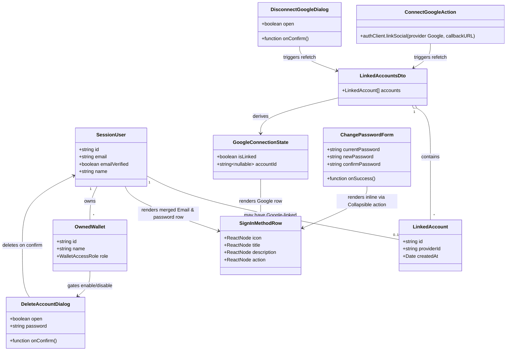

# Account Settings: GitHub-style Sign-in Methods

## Requirements

Restructure the Account settings page from a bare password-change form into a "Sign in methods" list that surfaces every credential actually backing the signed-in user's account — email/password (merged into one row, since this app has a single-email model) and Google — each as a uniform row (icon, title, status, action), so the user can see and manage how they authenticate in one place, mirroring GitHub's Password & Authentication page for only the methods this app truly supports. Extended to also include a GitHub-style "Delete account" section, gated on the user first resolving any wallets they own.

## Entities

**Conservative note**: `SessionUser` and `ChangePasswordForm` are existing concepts (`authClient.getSession()`, `useSettingsAccountActions`) — `ChangePasswordForm` gained an `onSuccess` callback prop during implementation (see Structure/Safeguards deviation notes below). Only `LinkedAccount`/`LinkedAccountsDto`/`GoogleConnectionState`/`OwnedWallet`/`DeleteAccountDialog` are genuinely new. `LinkedAccount` wraps better-auth's built-in `authClient.listAccounts()` response (field is `providerId`, not `provider` — corrected during implementation against the installed better-auth types). `OwnedWallet` is not a new backend concept — it's the existing `WalletDto` from `queries/wallets/wallet.dto.ts` filtered by `role === 'owner'`. `DeleteAccountDialog` wraps better-auth's built-in `authClient.deleteUser({ password })`, which required enabling `user.deleteUser.enabled` in the server's `betterAuth()` config (previously off). No new database tables are introduced; better-auth already persists linked-account rows in its own `account` table and user rows in its `user` table.

## Approach

1. **Row-based Card layout**:
   - Replace the current single "Change password" `Card` in `SettingsAccount` with one "Sign in methods" `Card` containing stacked rows, each built from a shared internal `SignInMethodRow` presentational component (icon + title + status text + right-aligned action).
   - **Deviation from original plan**: Email and Password were originally two separate rows; during implementation they were merged into a single **"Email & password"** row, since this app has a single-email model (unlike GitHub, which manages multiple emails separately) — the merged row shows the email + verified/unverified badge and the "Change password" action together. Final row count: 2 (Email & password, Google), not 3.
   - **Deviation from original plan**: the change-password form was originally planned to open in a `ResponsiveDialog` (like `DeleteWalletDialog`). Per explicit follow-up request, it was changed to expand **inline** via the `Collapsible`/`CollapsibleTrigger`/`CollapsibleContent` primitive (the same one used in `wallet-actions.tsx`'s filter panel) — clicking "Change password" expands the form directly below the row and flips the button label to "Hide", instead of opening a modal.

2. **Technical Implementation**:
   - Add a new `queries/auth/` module (`auth.dto.ts`, `auth.queries.ts`, `auth.mutations.ts`) following the exact conventions of `queries/user-settings/` (TanStack Query, a query-key constant, `useMutation` + `invalidateQueries` on success) — but calling `authClient.listAccounts()` / `authClient.linkSocial()` / `authClient.unlinkAccount()` directly instead of an axios-wrapped REST endpoint, since better-auth's client already exposes these against `/api/auth/*` (the same pattern already used unwrapped for `getSession()` in `routes/_app/route.tsx`).
   - `useLinkedAccounts()` query fetches the linked-provider list once per Account page visit; `useConnectGoogle()` and `useDisconnectGoogle()` mutations wrap `linkSocial`/`unlinkAccount` and invalidate the linked-accounts query key on success.
   - Google's "Connect" action triggers an OAuth redirect (`authClient.linkSocial({ provider: 'google', callbackURL: '/settings/account' })`) — this navigates away and back, so no local pending-state UI is needed beyond the button's own submit-disabled state; on return, the query naturally refetches on mount.
   - Google's brand mark is added as a new standalone SVG component (`GoogleLogoIcon`) in `packages/ui/src/components/icon.tsx`'s file (or a sibling file), passed to the shared `Icon` component via its existing `icon={...}` prop path (not the curated `IconName` registry, since it's a one-off multicolor brand mark, not a general-purpose Phosphor icon) — no changes to the `IconName` union.
   - Add `EnvelopeSimpleIcon` and `KeyIcon` to the existing `IconName` registry in `icon.tsx` (both exist in `@phosphor-icons/react`, consistent with how every other row icon in this app is sourced). **Deviation**: after the Email/Password merge, only `EnvelopeSimpleIcon` ended up used (leading icon of the merged row); `KeyIcon` was still added but is currently unused — left in the registry as a generally useful icon rather than removed.

3. **Business Logic**:
   - **Merged Email & password row**: read-only email display sourced from `session.user.email` (already available via `authClient.getSession()`, already used in `routes/_app/route.tsx`), plus a verified/unverified `Badge`. Description shows the email verification state (`emailVerified`) rather than a fabricated "N verified emails" count, since this app has a single-email model. Action is the "Change password"/"Hide" toggle for the inline `Collapsible` form (this app enables `emailAndPassword` for every account, per `auth.ts`, so a password credential always exists — no "Set password" branch is needed).
   - **Google row**: description and action derived from `useLinkedAccounts()` — if no `account` entry has `providerId === 'google'`, show "Sign in with your Google account" + a "Connect" button; if linked, show "Connected" + a "Disconnect" button.
   - **Unlink-safety guard**: before calling `unlinkAccount`, check that the user has at least one other valid sign-in method remaining (password is always configured per this app's config, so disconnecting Google is always safe today — but the guard is still implemented defensively by disabling the Disconnect button and surfacing an inline message if `linkedAccounts` reports Google as the only entry and no password exists, future-proofing for account types without a password). Disconnect requires confirmation via a small `ResponsiveDialog` (`DisconnectGoogleDialog`), matching `DeleteWalletDialog`'s confirm/cancel pattern.

4. **Delete Account (added, not in original scope)**:
   - A GitHub-style "Delete account" section below the Sign-in methods card, modeled directly on GitHub's Password & Authentication page ownership-gating pattern.
   - Enabled better-auth's `user.deleteUser` server config (previously disabled — the endpoint 404s/400s until `enabled: true` is set).
   - `useWallets()` filtered to `role === 'owner'` determines whether the user currently owns any wallets. If so: the section shows the owned-wallet names (each linking to that wallet's own `/wallets/$walletId/settings/general` page — no new bulk-management page was built) plus explanatory copy, and the "Delete your account" button is `disabled`. If not: the button is enabled and opens `DeleteAccountDialog`.
   - `DeleteAccountDialog` requires the user to re-enter their password (better-auth's `deleteUser` verifies it server-side against the stored credential) before deleting; on success, calls `authClient.signOut()` and navigates to `/auth/login`.
   - The hint copy ("delete these wallets" / "transfer ownership") links to a placeholder `GUIDELINE_URL` constant (`apps/ledger-box/src/constants/urls.ts`, marked `TODO`). **Transfer-ownership is a real, confirmed roadmap item** — the user has stated it will be built later — but it is **not implemented yet** in this app (ownership is currently immutable once a wallet is created). The link is intentionally forward-looking: it points to a guideline page that doesn't exist yet, to be filled in once both the transfer-ownership feature and its documentation ship. Explicit user instruction for _this_ change: do not build wallet-settings changes (leave/transfer flows) now — Wallet Settings was intentionally left untouched; that work is deferred to a future task.

## Structure

### Inheritance Relationships

1. `DisconnectGoogleDialog` and `DeleteAccountDialog` follow the same `ResponsiveDialog`-wrapped confirmation pattern as `DeleteWalletDialog` (composition, not class inheritance — all are function components rendering `ResponsiveDialog`).
2. **Deviation**: `ChangePasswordDialog` was removed. The change-password form now lives in `ChangePasswordForm` (`settings-account-change-password-form.tsx`) with no dialog wrapper — it's rendered directly inside a `Collapsible`'s `CollapsibleContent` in `SettingsAccount`. `ChangePasswordForm` takes an `onSuccess: () => void` prop, called after a successful password change (closes the collapsible).
3. `GoogleLogoIcon` is a standalone `ComponentType<IconBaseProps>`-shaped SVG function component, structurally compatible with the `Icon` component's existing `icon` prop (matches the existing `PhosphorIcon` type shape already defined in `icon.tsx`).
4. `DeleteAccountDialog` hosts a `Form` (formisch) with a single `password` field, following the same `useForm({ schema })` pattern as `useSettingsAccountActions`, via its own `useDeleteAccountDialogActions` hook (mirrors `useDeleteWalletDialogActions`'s `handleX(onSuccess)` callback convention).

### Dependencies

1. `SettingsAccount` (page component) depends on `useSession` (existing), `useLinkedAccounts` (new), `useConnectGoogle` (new), `useDisconnectGoogle` (new), and — added for Delete Account — `useWallets` (existing, from `queries/wallets/wallet.queries.ts`).
2. `useLinkedAccounts` / `useConnectGoogle` / `useDisconnectGoogle` / `useDeleteAccount` depend on `authClient` (`#/lib/auth-client`), calling `listAccounts` / `linkSocial` / `unlinkAccount` / `deleteUser` respectively.
3. `SettingsAccount` renders `SignInMethodRow` twice (merged Email & password, Google), each configured with an `Icon` (`EnvelopeSimpleIcon` name, `GoogleLogoIcon` component) and a row-specific action element (`CollapsibleTrigger`-wrapped `<Button>` toggling the inline `ChangePasswordForm` for Email & password; `<Button>` opening `ConnectGoogle`/`DisconnectGoogleDialog` for Google). `KeyIcon` was added to the icon registry but is currently unused (the merged row keeps the envelope icon) — left in the registry since it's a generally useful icon, not removed.
4. `ChangePasswordForm` depends on the existing `useSettingsAccountActions` hook and `changePasswordSchema`. `settings-account.actions.tsx`'s `handleChangePassword` signature **changed**: it now accepts an optional `onSuccess?: () => void` second parameter (backward-compatible addition), called after `reset(form)` — this deviates from the original Safeguard #7 (see Safeguards deviation note).
5. `DisconnectGoogleDialog` depends on `useDisconnectGoogle` and its own `useDisconnectGoogleDialogActions` hook (mirrors `useDeleteWalletDialogActions`).
6. `DeleteAccountDialog` depends on `useDeleteAccount`, `deleteAccountSchema` (new, in `schemas/auth.schema.ts`), and its own `useDeleteAccountDialogActions` hook, which also calls `authClient.signOut()` and `useNavigate()` (→ `/auth/login`) on success.

### Layered Architecture

1. **Presentation Layer** (`modules/settings/settings-account/`): `settings-account.tsx` (row list + Card + Delete Account section), `settings-account-sign-in-row.tsx` (shared row component), `settings-account-change-password-form.tsx` (no dialog wrapper — deviation from plan), `settings-account-disconnect-google-dialog.tsx`, `settings-account-delete-dialog.tsx` (new).
2. **Actions/Hooks Layer**: `settings-account.actions.tsx` (modified — added optional `onSuccess` param), `settings-account-disconnect-google-dialog.actions.ts` (new, mirrors `wallet-delete-dialog.actions.ts`), `settings-account-delete-dialog.actions.ts` (new, same pattern plus sign-out/navigate). Thin query/mutation wiring stays inline in `settings-account.tsx` for the parts that don't need a dedicated actions hook (Google connect/disconnect trigger, wallet-ownership check) — matches how `settings-appearance.tsx`/`settings-locale.tsx` consume hooks directly.
3. **Query/Mutation Layer** (`queries/auth/`, new): `auth.dto.ts` (`LinkedAccountDto` — field is `providerId`, not `provider`), `auth.queries.ts` (`useLinkedAccounts`), `auth.mutations.ts` (`useConnectGoogle`, `useDisconnectGoogle`, and — added — `useDeleteAccount`).
4. **Client SDK Layer**: `lib/auth-client.ts` (unchanged) — `authClient.listAccounts`/`linkSocial`/`unlinkAccount`/`deleteUser` are called directly from the query/mutation layer; no new backend route needed since better-auth's client already talks to `/api/auth/*`. **Added**: `lib/auth.ts` (server config) now sets `user: { deleteUser: { enabled: true } }` — without this, `deleteUser` 400s regardless of client-side wiring.
5. **Schema Layer** (`schemas/auth.schema.ts`): added `deleteAccountSchema` (single `password` field, `nonEmpty` validation) alongside the existing `changePasswordSchema`.
6. **Icon Layer** (`packages/ui/src/components/icon.tsx`): added `EnvelopeSimpleIcon`, `KeyIcon` to the `icons` registry; added sibling `GoogleLogoIcon` SVG component, exported alongside `Icon`.
7. **Constants Layer** (added, not in original scope): `constants/urls.ts` — `GUIDELINE_URL` placeholder constant for the future landing-page guideline link, referenced by the Delete Account section's "delete these wallets"/"transfer ownership" copy.

## Operations

### Enable Delete User — `lib/auth.ts` (added, not in original Operations)

1. Responsibility: turn on better-auth's built-in account-deletion endpoint, which is disabled by default.
2. Change: add `user: { deleteUser: { enabled: true } }` to the `betterAuth({...})` config, alongside the existing `emailAndPassword`/`socialProviders` options.
3. Constraints: no `sendDeleteAccountVerification` callback configured — deletion is immediate once the password is verified (no email-confirmation step), matching the synchronous confirm-dialog UX built for this feature.

### Create Schema — `deleteAccountSchema` (`apps/ledger-box/src/schemas/auth.schema.ts`, added)

1. Responsibility: validate the Delete Account dialog's password field.
2. Definition: `v.object({ password: v.pipe(v.string(), v.nonEmpty('validation.password.current.required')) })` — reuses the existing `validation.password.current.required` message id already used by `changePasswordSchema`.

### Create DTO — `auth.dto.ts` (`apps/ledger-box/src/queries/auth/auth.dto.ts`)

1. Responsibility: type the shape consumed from `authClient.listAccounts()` for this app's needs.
2. Attributes:
   - `LinkedAccountDto`: `{ id: string; providerId: string; createdAt: Date }` — **field is `providerId`, not `provider`** (corrected from the original spec against better-auth's actual `listAccounts()` response type, verified in the installed package's `.d.mts`).
3. Constraints: no validation needed — this is a pass-through read type, not a form schema.

### Create Query Hook — `useLinkedAccounts` (`apps/ledger-box/src/queries/auth/auth.queries.ts`)

1. Interface Definition: `useLinkedAccounts(): UseQueryResult<LinkedAccountDto[]>`
2. Core Methods:
   - `useLinkedAccounts()`:
     - Input Validation: none (no parameters).
     - Business Logic: `useQuery({ queryKey: linkedAccountsQueryKey, queryFn: fetchLinkedAccounts })` where `fetchLinkedAccounts` calls `authClient.listAccounts()` and unwraps `{ data, error }`, throwing a `getApiErrorMessage`-style error on failure (mirror `fetchUserLocale`'s try/catch-and-rethrow pattern, but source the message from better-auth's error shape rather than an axios error since this isn't an axios call).
     - Exception Handling: on `error` from `listAccounts()`, throw `new Error(error.message ?? 'settings.account.signInMethods.loadErrorFallback')`.
     - Return Value: `LinkedAccountDto[]` (empty array if `data` is null/undefined, never `undefined`).
3. Dependency Injection: `authClient` imported directly (module-level import), same as every other query/mutation file in this codebase imports its API layer.
4. Query key: `export const linkedAccountsQueryKey = ['auth', 'linked-accounts'] as const;`

### Create Mutation Hooks — `useConnectGoogle`, `useDisconnectGoogle` (`apps/ledger-box/src/queries/auth/auth.mutations.ts`)

1. Interface Definition:
   - `useConnectGoogle(): UseMutationResult<void, Error, void>`
   - `useDisconnectGoogle(): UseMutationResult<void, Error, string /* accountId */>`
2. Core Methods:
   - `useConnectGoogle()`:
     - Business Logic: `mutationFn: () => authClient.linkSocial({ provider: 'google', callbackURL: window.location.pathname })`. This triggers a full-page OAuth redirect; there is no local success/error resolution to react to before navigation occurs — the hook exists mainly to give the "Connect" button a consistent `isPending` state while the redirect is in flight.
     - Exception Handling: if `linkSocial` returns an `error` field (SDK returns before redirecting on failure, e.g. blocked popup/misconfiguration), throw and surface via toast (mirror the `toast.add({ type: 'error' })` pattern from `settings-locale.tsx`'s `handleSelect`).
   - `useDisconnectGoogle()`:
     - Business Logic: `mutationFn: (accountId) => authClient.unlinkAccount({ providerId: 'google', accountId })`.
     - Exception Handling: same throw-on-`error` pattern.
     - `onSuccess`: `await queryClient.invalidateQueries({ queryKey: linkedAccountsQueryKey })` (exact pattern from `useUpdateUserLocale`).
3. Dependency Injection: `useQueryClient()` for invalidation (disconnect only; connect never resolves locally on success).

### Create Mutation — `useDeleteAccount` (`apps/ledger-box/src/queries/auth/auth.mutations.ts`, added)

1. Interface Definition: `useDeleteAccount(): UseMutationResult<void, Error, string /* password */>`
2. Core Methods:
   - Business Logic: `mutationFn: (password) => authClient.deleteUser({ password })`.
   - Exception Handling: `if (error) throw new Error(error.message ?? 'settings.account.delete.errorFallback')`.
3. No `onSuccess` invalidation here — the calling dialog's actions hook handles sign-out/navigation, since a deleted account has no more queries to invalidate.

### Update Icon Registry — `packages/ui/src/components/icon.tsx`

1. Responsibility: expose the two new generic icons needed by the sign-in method rows, plus a brand-specific Google mark.
2. Changes:
   - Add `EnvelopeSimpleIcon` and `KeyIcon` to the existing `import { ... } from '@phosphor-icons/react'` block and to the `icons` const object, alphabetically ordered to match the existing list's convention.
   - Add a new exported `GoogleLogoIcon` function component in the same file: a `ComponentType<IconBaseProps>`-compatible SVG (viewBox `0 0 24 24` or similar, using Google's standard four-color "G" mark path data) accepting `className`/`size` props consistent with how `Icon` forwards props to Phosphor icons — spread remaining SVG props onto the root `<svg>` element, apply `className` there.
3. Constraints: `GoogleLogoIcon` must NOT be added to the `IconName` union/registry (it's not a generic name-addressable icon); it's imported and passed via `<Icon icon={GoogleLogoIcon} />` at the call site, matching the `Icon` component's existing `icon` prop branch.

### Create Component — `SignInMethodRow` (`apps/ledger-box/src/modules/settings/settings-account/settings-account-sign-in-row.tsx`)

1. Responsibility: render one uniform row (icon, title, description, action) inside the "Sign in methods" card, shared across the merged Email & password row and the Google row.
2. Props (unchanged from plan):
   - `icon: ReactNode`, `title: ReactNode`, `description: ReactNode`, `action?: ReactNode`.
3. Logic: flex row, icon in a fixed-size leading slot (`size-9` circle, `bg-muted`), title (`text-sm font-medium`) + description (`text-sm text-muted-foreground`) stacked in the middle, `action` right-aligned. No internal state — fully presentational.
4. **Deviation**: the row's own `py-4`/first/last spacing was removed from this component and moved to the parent's `divide-y` container (`[&>*:first-child]:pt-0 [&>*:last-child]:pb-0 [&>*]:py-4`), because the first row is now wrapped in a `Collapsible` — first/last CSS selectors need to apply to the container's direct children (row-or-Collapsible), not hardcoded inside the row itself.

### Update Component — `SettingsAccount` (`apps/ledger-box/src/modules/settings/settings-account/settings-account.tsx`)

1. Responsibility: assemble the "Sign in methods" card (2 rows, not 3) and the Delete Account section.
2. Methods/Logic (final, as implemented):
   - `useSession()` from `#/lib/auth-client` for `session.user.email`/`emailVerified`.
   - `useLinkedAccounts()` for the Google row; `const googleAccount = linkedAccounts?.find((a) => a.providerId === 'google')` (note `providerId`, not `provider`).
   - `useWallets()` for the Delete Account gate; `const ownedWallets = wallets?.filter((w) => w.role === 'owner') ?? []`.
   - Local state: `changePasswordOpen`, `disconnectGoogleDialogOpen`, `deleteAccountDialogOpen` (all `useState(false)`).
   - **Merged row** ("Email & password"): wrapped in `<Collapsible open={changePasswordOpen} onOpenChange={setChangePasswordOpen}>`. `SignInMethodRow`'s `action` is a `<CollapsibleTrigger render={<Button variant="outline" size="sm" />}>` whose label toggles between "Change password" and "Hide". `<CollapsibleContent>` renders `<ChangePasswordForm onSuccess={() => setChangePasswordOpen(false)} />` in a `pt-4 lg:pt-6 lg:pl-12` wrapper.
   - Description for the merged row: `session.user.email` plus a `Badge` — `variant="secondary"` "Verified" if `emailVerified`, `variant="destructive"` "Unverified" otherwise.
   - Google row: unchanged from plan — `icon={<Icon icon={GoogleLogoIcon} />}`, description/action conditional on `googleAccount`, `Spinner` shown while `useLinkedAccounts()` is pending.
   - **Delete Account section** (added, not in original plan): plain-text layout (not an `Alert`) matching GitHub's screenshot — `<h2 className="border-b pb-4 text-lg font-semibold text-destructive">Delete account</h2>`, then (only if `ownedWallets.length > 0`) two paragraphs: owned-wallet names via `FormattedList` (locale-aware conjunction) where each name links to `/wallets/$walletId/settings/general`, and a hint paragraph with `<deleteLink>`/`<transferLink>` rich-text tags both pointing to `GUIDELINE_URL`. The "Delete your account" `<Button variant="outline">` is `disabled={hasOwnedWallets}` and opens `DeleteAccountDialog`.
   - Renders `<DisconnectGoogleDialog>` and `<DeleteAccountDialog>` after the closing `
`.
3. Constraints: while `useLinkedAccounts()` is pending, render the Google row with a `Spinner` in place of the action button instead of flashing "Connect" then "Disconnect" (unchanged from plan).

### Create Component — `ChangePasswordForm` (`apps/ledger-box/src/modules/settings/settings-account/settings-account-change-password-form.tsx`)

**Deviation**: this replaces the originally planned `ChangePasswordDialog` — there is no `ResponsiveDialog` wrapper; the form renders directly inside the parent's `CollapsibleContent`.

1. Responsibility: host the change-password form (moved verbatim from the original `SettingsAccount` body), calling `onSuccess` after a successful submit.
2. Props: `{ onSuccess: () => void }` (no `open`/`onOpenChange` — visibility is owned by the parent's `Collapsible`).
3. Logic:
   - Reuse `useSettingsAccountActions()` unchanged internally, but `settings-account.actions.tsx`'s `handleChangePassword` signature was extended to `handleChangePassword(output, onSuccess?: () => void)` — called as `void handleChangePassword(output, onSuccess)`. This is a deviation from the original plan's stated preference (wrap at the call site without touching the hook); the codebase's established convention (`handleDeleteWallet(onSuccess)` in `wallet-delete-dialog.actions.ts`) was followed instead once discovered, since it's backward-compatible (`onSuccess` is optional).
4. Constraints: no dialog-close/reset-on-close logic needed here — the parent `Collapsible`'s `onOpenChange` in `SettingsAccount` doesn't currently reset the form on manual collapse (only on successful submit); form fields may persist if the user manually clicks "Hide" without submitting. Not treated as a bug — acceptable given the low-friction nature of a settings-page password form.

### Create Component — `DisconnectGoogleDialog` (`apps/ledger-box/src/modules/settings/settings-account/settings-account-disconnect-google-dialog.tsx`) + `settings-account-disconnect-google-dialog.actions.ts`

1. Responsibility: confirm before unlinking Google, following `DeleteWalletDialog`'s confirm/cancel structure — implemented as planned, with one structural addition: logic split into a dedicated `useDisconnectGoogleDialogActions({ accountId })` hook (mirrors `useDeleteWalletDialogActions`) rather than inlined in the dialog component.
2. Props: `{ open: boolean; onOpenChange: (open: boolean) => void; accountId: string | undefined }`.
3. Logic: `handleDisconnectGoogle(onSuccess)` in the actions hook guards `if (!accountId) return;`, calls `disconnectGoogle(accountId, { onSuccess, onError })`, manages local `error` state, and fires success/failure toasts (`toast.settings.googleDisconnected` / `toast.settings.googleDisconnectFailed`).
4. Constraints: confirm button shows `Spinner` + disabled while `isPending` (unchanged from plan).

### Create Component — `DeleteAccountDialog` (`apps/ledger-box/src/modules/settings/settings-account/settings-account-delete-dialog.tsx`) + `settings-account-delete-dialog.actions.ts` (added, not in original Operations)

1. Responsibility: require password re-entry, then delete the account via `useDeleteAccount()`.
2. Props: `{ open: boolean; onOpenChange: (open: boolean) => void }`.
3. Logic:
   - `useDeleteAccountDialogActions()` owns a `useForm({ schema: deleteAccountSchema })`, `useDeleteAccount()`, local `error` state, and `handleDeleteAccount(output, onSuccess)`.
   - On success: fires `toast.settings.accountDeleted`, calls `onSuccess()` (closes dialog), then `await authClient.signOut()` and `await navigate({ to: '/auth/login' })` — mirrors `app-sidebar-user.tsx`'s sign-out flow.
   - On error: sets local `error`, fires `toast.settings.accountDeleteFailed` with `formatErrorMessage(intl, message)` as the description.
   - Dialog resets the password field (`reset(form)`) on close without submitting, same pattern as the original `ChangePasswordDialog` plan.
4. Constraints: confirm button (`variant="destructive"`) shows `Spinner` + disabled while `isPending`; the password `Field`'s `FieldLabel` is visually hidden (`sr-only`) since the dialog's icon+heading+body already establishes context, matching `DeleteWalletDialog`'s `hideTitle`/`hideDescription` treatment.

## Norms

1. **Component Naming**: files under `modules/settings/settings-account/` follow the existing `settings-account-<suffix>.tsx` naming already established by other modules — actual files created: `settings-account-sign-in-row.tsx`, `settings-account-change-password-form.tsx` (not `-dialog.tsx` — deviation, see Structure), `settings-account-disconnect-google-dialog.tsx` + `.actions.ts`, `settings-account-delete-dialog.tsx` + `.actions.ts` (added). **Deviation**: unlike `wallet-delete-dialog/` (its own subfolder with an `index.ts` barrel), these new files stay flat inside the existing `settings-account/` folder alongside `settings-account.tsx`/`settings-account.actions.tsx`, matching that folder's pre-existing flat convention — no new `index.ts` barrels were added for the sub-components (only the existing `settings-account/index.ts` re-exporting `SettingsAccount` remains).
2. **Query/Mutation Module Shape**: `queries/auth/` must mirror `queries/user-settings/` file-for-file: `auth.dto.ts`, `auth.queries.ts` (query key constants + `useQuery` hooks), `auth.mutations.ts` (`useMutation` hooks with `invalidateQueries` in `onSuccess`) — no `auth.api.ts` is needed since calls go through `authClient` directly rather than axios, unlike `user-settings.api.ts`.
3. **i18n**: every new user-facing string uses `FormattedMessage`/`intl.formatMessage` with an `id` under the `settings.account.*` namespace and an explicit `defaultMessage`, matching every existing string in `settings-account.tsx`/`settings-appearance.tsx`/`settings-locale.tsx`. All new message ids were added to all 7 locale catalogs (`packages/utils/src/i18n/messages/{en-US,en-GB,vi-VN,ja-JP,fr-FR,zh-CN,zh-TW}.json`) with real per-locale translations, not English copies. Rich-text links (the Delete Account hint's "delete these wallets"/"transfer ownership") use react-intl's `<tag>` embedding syntax in the ICU message string, resolved via a `values` map of tag-name → render function — this is a new pattern for this codebase (no prior usage), introduced because the hint sentence needed inline links mid-sentence rather than a standalone linked phrase.
4. **Error Messages**: mutation/query errors use `formatErrorMessage(intl, error)` where the error is a translation-id-shaped string (existing pattern from `useSettingsAccountActions`), or `getApiErrorMessage`-equivalent fallback ids (`settings.account.signInMethods.loadErrorFallback`, etc.) — never surface a raw better-auth/network error string directly to the user.
5. **Styling**: reuse existing Tailwind utility patterns already present in this file tree — `Card`/`CardHeader`/`CardTitle`/`CardContent` for the outer container (per the recent Settings-vs-Wallet-Settings consistency pass), `Button variant="outline" size="sm"` for row actions, `Badge` for the email verification indicator, `divide-y` for row separation — do not introduce new one-off utility classes where an existing pattern already covers the need.
6. **Icon Sourcing**: any new Phosphor icon must be added to the `icons` registry object in `packages/ui/src/components/icon.tsx` before use (never import `@phosphor-icons/react` directly in app code); brand/non-Phosphor icons are exported as standalone components from the same `icon.tsx` module and consumed via `<Icon icon={...} />`.
7. **List formatting**: locale-aware "A, B, and C" lists (used for the Delete Account section's owned-wallet names) use react-intl's `<FormattedList type="conjunction" value={ReactNode[]} />`, not hand-rolled string joining — this is a new pattern for this codebase, introduced for this feature.

## Safeguards

1. **Functional Constraints**: only a merged Email & password row and a Google row are implemented (not 3 separate rows — see Approach deviation). Do not add Passkeys, Apple, or any Two-Factor Authentication UI — none of these have backing capability in `apps/ledger-box/src/lib/auth.ts` (no passkey/2FA plugin, no Apple provider configured); adding their UI would be a broken affordance shipping ahead of any backend support. **Extended scope**: Delete Account was added on explicit request. Transfer-ownership is a **confirmed future feature** (user-stated roadmap item) but is explicitly **out of scope for this change** — no wallet-settings code was touched. The Delete Account section's copy references transfer-ownership via a placeholder guideline link in anticipation of that future work; do not treat its presence in the copy as evidence the feature was built now, and do not build the transfer-ownership/leave-wallet flow as a side effect of touching this file later — it should be its own tracked task.
2. **Performance Constraints**: `useLinkedAccounts()` must be a single request per Account page mount (standard TanStack Query caching, no polling); no more than 2 network calls total on initial page load (session read + linked-accounts read), consistent with the page's current single-request footprint.
3. **Security Constraints**: never render better-auth's raw `accountId` or any provider access-token-adjacent field in the UI — only `providerId` and a stable `id` for the disconnect mutation's parameter. The Google connect flow must use better-auth's own `linkSocial` redirect handling — do not hand-roll OAuth redirect URL construction.
4. **Integration Constraints**: no backend route changes are required — `authClient.listAccounts`/`linkSocial`/`unlinkAccount` all resolve against better-auth's existing `/api/auth/*` handler already mounted for this app; do not add a new Netlify/API route for this feature.
5. **Business Rule Constraints**: the Disconnect action must be blocked (button disabled, with an inline explanatory message) whenever disconnecting Google would leave the account with zero sign-in methods — for this app's current config (password always enabled), this condition can never actually trigger, but the check must still be implemented so it fails safe if `emailAndPassword` is ever disabled for a user cohort in the future.
6. **Exception Handling Constraints**: every new query/mutation must throw an `Error` with a translation-id-shaped message on failure (never let a raw better-auth `{ error }` object or unhandled promise rejection reach a component); `ChangePasswordForm`, `DisconnectGoogleDialog`, and `DeleteAccountDialog` must surface mutation errors via the existing `toast`/`FieldError` patterns already used elsewhere in this module, not `console.error` or silent failure.
7. **Technical Constraints — deviation accepted**: the original safeguard said not to modify `settings-account.actions.tsx`'s exported function signature. In practice, `useSettingsAccountActions()`'s `handleChangePassword` gained an optional `onSuccess?: () => void` second parameter once the change-password form moved into a `Collapsible` (no dialog wrapper left to own the close-on-success call). This is accepted as backward-compatible (existing callers passing one argument are unaffected) and matches the codebase's pre-existing `handleDeleteWallet(onSuccess)` convention — future syncs should not re-flag this as a violation.
8. **Data Constraints**: `LinkedAccountDto` must only declare fields actually consumed by the UI (`id`, `providerId`, `createdAt` — note `providerId`, not `provider`) — do not pass through or type better-auth's full account record (which may include provider-internal fields not meant for client display).
9. **API Constraints**: all new query/mutation hooks must live under `apps/ledger-box/src/queries/auth/` and be consumed only from `modules/settings/settings-account/` for this task's scope — do not wire them into unrelated routes/components as part of this change.
10. **Delete Account Constraints** (added): `authClient.deleteUser` requires `user.deleteUser.enabled: true` in `lib/auth.ts` — without it the endpoint fails regardless of client wiring. The dialog must always require password re-entry (not rely on "session freshness" as an alternative), since this app has no UI concept of session freshness elsewhere. The "Delete your account" trigger must stay `disabled` whenever the current user owns any wallet (`role === 'owner'`) — this check runs client-side via `useWallets()`; there is no corresponding server-side block, so this is a UX safeguard, not a security boundary.
11. **Wallet Settings Boundary** (added): this feature must not modify `modules/wallet-settings/` or any wallet-settings routes/components — the Delete Account section only _links_ to the existing `/wallets/$walletId/settings/general` route and a placeholder external guideline URL; it does not add new capability there. Explicit user instruction.
