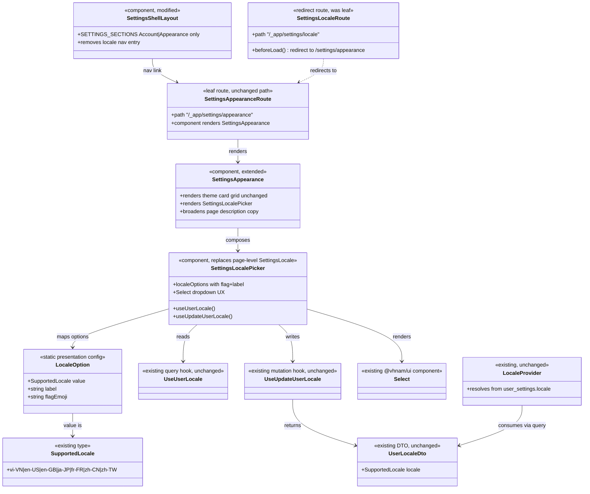

# Combine Locale into Appearance Settings with Flag Dropdown

## Requirements

Merge Language into the Appearance settings surface so users manage theme and UI
language in one place — replacing the standalone Language nav/section and the locale
card grid with a flag-labeled Select dropdown — without changing locale persistence,
theme storage, or effective-locale resolution.

## Entities

## Approach

1. Information architecture:
   - Collapse settings nav from Account / Appearance / Language → Account / Appearance.
   - Appearance becomes the combined “look and read” surface: theme card grid (unchanged)
     plus a Language card containing a Select.
   - Convert `/settings/locale` from a leaf that rendered `SettingsLocale` into a redirect
     to `/settings/appearance` so bookmarks and old links keep working.
   - Mobile settings list follows the same two-section nav (no separate Language row).

2. Presentation / control choice:
   - Implement “Dropdown” as `@vhnam/ui` `Select` (same pattern as currency and member
     role pickers), not `DropdownMenu`.
   - Represent country/region flags as Unicode regional-indicator emoji co-located with
     each locale option — no new icon package.
   - Explicit flag mapping (product decision locked for v1):
     - `vi-VN` → 🇻🇳
     - `en-US` → 🇺🇸
     - `en-GB` → 🇬🇧
     - `ja-JP` → 🇯🇵
     - `fr-FR` → 🇫🇷
     - `zh-CN` → 🇨🇳
     - `zh-TW` → 🇹🇼
   - Keep native-language labels (Tiếng Việt, English (US), …) as today — never translate
     option labels through the active catalog.

3. Composition:
   - Refactor `modules/settings/settings-locale` from a full page (`SettingsLocale` with
     its own h1/description) into a section block `SettingsLocalePicker` (Card + Select)
     that Appearance composes.
   - Do not change `user_settings`, `/api/users/locale`, query keys, mutation, or
     `LocaleProvider`.
   - Theme remains client-only via `useTheme`; locale remains server-persisted.

4. Copy / i18n:
   - Broaden `settings.appearance.description` so Appearance covers theme and language.
   - Reuse `settings.locale.title` (or add `settings.appearance.language.title`) as the
     Language card title; keep `settings.locale.loadErrorFallback` /
     `settings.locale.updateErrorFallback` for API errors.
   - Remove unused `settings.nav.locale` from all 7 catalogs after nav drops Language.
   - Remove or stop using standalone page-only keys that no longer have a surface
     (`settings.locale.description` as page subtitle) if unused after the merge.

5. Interaction rules:
   - Selecting the current locale is a no-op (no mutation).
   - Disable the Select while `useUpdateUserLocale().isPending`.
   - While `useUserLocale()` is pending, show a compact Spinner in the Language card
     (theme grid stays interactive).
   - On mutation error, `toast.add({ title: error.message, type: 'error' })` as today.

## Structure

### Inheritance Relationships

1. No new class hierarchies — React function components and existing TanStack hooks only.
2. `SettingsLocaleRoute` changes role from leaf component route to redirect route
   (same file path, different route options), matching how `/settings/` redirects to
   `/settings/account`.

### Dependencies

1. `SettingsShellLayout` depends on a two-entry `SETTINGS_SECTIONS` config (Account,
   Appearance).
2. `SettingsAppearance` depends on existing theme helpers (`useTheme`, theme option
   config) and newly composed `SettingsLocalePicker`.
3. `SettingsLocalePicker` depends on `useUserLocale`, `useUpdateUserLocale`,
   `@vhnam/ui` Select primitives, and a local `LOCALE_OPTIONS` constant
   (`value` / `label` / `flagEmoji`).
4. `SettingsLocaleRoute` depends on TanStack Router `redirect` to
   `/settings/appearance`.
5. No new dependencies on Netlify handlers, Kysely, or `@vhnam/utils/locale` beyond the
   existing `SupportedLocale` type already imported by the locale module.

### Layered Architecture

1. Route layer (`routes/_app/settings/*`): appearance leaf unchanged; locale becomes
   redirect; shell layout nav trimmed.
2. Feature UI layer (`modules/settings/*`): Appearance page chrome + theme; locale
   picker as composable section; shell nav config.
3. Query layer (`queries/user-settings/*`): untouched.
4. API / DB layer: untouched.
5. i18n catalogs (`packages/utils/src/i18n/messages/*`): copy updates for Appearance
   description, Language card title if needed, remove obsolete nav key.

## Operations

### Update Component - SettingsShellLayout

1. Responsibility: Settings IA without a Language section.
2. Changes:
   - Narrow `SettingsSection['value']` and `to` unions to `'account' | 'appearance'` and
     `'/settings/account' | '/settings/appearance'`.
   - Remove the `locale` entry (GlobeIcon / `settings.nav.locale` /
     `/settings/locale`) from `SETTINGS_SECTIONS`.
   - Leave mobile list/detail behavior unchanged (still rooted on `account`).
3. Constraints: Do not alter back-navigation or scroll-restoration IDs beyond what the
   removed section implies (`matchedSection` simply never equals `locale`).

### Update Route - `/_app/settings/locale`

1. Responsibility: Preserve deep links without a standalone Language page.
2. Implementation:
   - Replace the leaf that rendered `SettingsLocale` with a redirect, e.g.
     `beforeLoad: () => { throw redirect({ to: '/settings/appearance' }) }` (same pattern
     as `settings/index.tsx` → account).
   - Do not keep a dual-rendered Language page.
3. Constraints: After save, regenerate/verify `routeTree.gen.ts` still includes the
   locale path as a redirect route (file remains so the path exists).

### Refactor Module - settings-locale → SettingsLocalePicker

1. Responsibility: Language preference control as an embeddable Appearance section.
2. Attributes / constants:
   - `LOCALE_OPTIONS: { value: SupportedLocale; label: string; flagEmoji: string }[]`
     with the seven supported locales and flag mapping from Approach.
3. UI:
   - Render a `Card` with title using FormattedMessage for Language
     (`settings.locale.title` default “Language”, or
     `settings.appearance.language.title` if a distinct key is preferred — pick one and
     use it consistently in all 7 catalogs).
   - Optional short muted description under the card title may reuse
     `settings.locale.description`.
   - Pending locale query → centered `Spinner` inside `CardContent`.
   - Loaded → `Select` with:
     - `items={LOCALE_OPTIONS.map(({ value, label, flagEmoji }) => ({ value, label: \`${flagEmoji} ${label}\` }))}`so`SelectValue` shows flag + label.
     - `value={data.locale}`
     - `disabled={updateLocale.isPending}`
     - `onValueChange` → cast to `SupportedLocale`, no-op if same as current or pending,
       else `updateLocale.mutate(locale, { onError: … toast.add error })`.
     - Each `SelectItem` children: `{flagEmoji}` + `{label}`
       (or equivalent inline) so list matches trigger.
   - `SelectTrigger` full width (`className="w-full"`), consistent with currency Select.
4. Export:
   - Replace page export: `index.ts` exports `SettingsLocalePicker` (remove
     `SettingsLocale` page export once unused).
5. Constraints:
   - Do not invent new API calls.
   - Do not translate `label` via react-intl.
   - Do not add SVG flag packages.

### Update Component - SettingsAppearance

1. Responsibility: Combined Appearance surface.
2. Changes:
   - Keep existing page header title (`settings.appearance.title`).
   - Update description FormattedMessage default and all catalog values for
     `settings.appearance.description` to cover theme and language, e.g.
     “Choose your preferred color theme and language.”
   - After the Theme card, render `<SettingsLocalePicker />`.
   - Do not change theme option grid behavior.
3. Constraints: Theme and locale remain visually separate cards/sections; do not merge
   into one control.

### Update i18n Catalogs - all 7 SupportedLocale files

1. Responsibility: Copy and key hygiene for the merged surface.
2. Changes:
   - Update `settings.appearance.description` in `en-US`, `en-GB`, `vi-VN`, `fr-FR`,
     `ja-JP`, `zh-CN`, `zh-TW`.
   - Ensure Language card title key exists in all catalogs.
   - Remove `settings.nav.locale` from all catalogs.
   - Leave `settings.locale.loadErrorFallback` and
     `settings.locale.updateErrorFallback` in place.
   - Drop unused standalone-only keys only if nothing references them after the
     refactor (verify with search before deleting `settings.locale.description` if the
     picker still uses it).
3. Constraints: Brand name “Ledger Box” stays untranslated; do not put react-intl inside
   `@vhnam/ui`.

### Cleanup - dead SettingsLocale page usage

1. Responsibility: No orphan imports or dual UIs.
2. Steps:
   - Confirm no remaining imports of `SettingsLocale` after route redirect and Appearance
     composition.
   - Delete obsolete page-only markup (h1 Language page chrome) that lived only on the
     standalone route.
3. Constraints: Do not delete the `settings-locale` module folder if it still owns the
   picker; only retire the page-shaped API.

### Verify

1. Run `vp check` and `vp test`.
2. Manually confirm:
   - `/settings` nav shows Account + Appearance only (desktop + mobile).
   - `/settings/appearance` shows Theme cards + Language Select with flags.
   - Changing locale updates UI language and persists across reload.
   - `/settings/locale` redirects to `/settings/appearance`.
   - Theme switching still works independently of locale.

## Norms

1. Imports: use `#/` in app source; import UI from `@vhnam/ui/components/...`.
2. Toasts: imperative `toast.add({ title, type })` only — never Sonner APIs.
3. i18n: `FormattedMessage` / `useIntl().formatMessage` for UI chrome; locale option
   labels stay hardcoded native names; API errors via existing message-id fallbacks.
4. Forms/selects: prefer shared `Select` for single-value preferences; match existing
   `items` + `SelectItem` pattern from wallet currency / member role.
5. Routing: file-based TanStack Router; redirects via `redirect` in `beforeLoad` /
   route options like `settings/index.tsx`.
6. Persistence boundary: never persist theme to `user_settings`; never move locale to
   local-only storage.
7. Money/currency rules untouched — locale switch must not alter wallet currency.
8. Soft-delete / tenancy / API error codes: out of scope; do not modify Netlify handlers.
9. After UI changes in app modules: run `vp check` and `vp test` before calling done.
10. Changelog: when shipping, add `docs/changelogs/mr-<NN>-…` and a `CHANGELOG.md`
    Unreleased entry (implementation phase / merge, not required to invent MR number in
    this prompt alone).

## Safeguards

1. Functional Constraints:
   - Must not introduce a third settings nav item for Language after the merge.
   - Must not leave `/settings/locale` as a broken 404 — redirect required.
   - Must show flag + native label for every `SUPPORTED_LOCALES` entry.
   - Must no-op when selecting the already-active locale.
   - Theme card grid behavior and `useTheme` wiring must remain functionally unchanged.
2. Performance Constraints:
   - No new network endpoints; locale read/write stays on existing GET/PATCH
     `/api/users/locale`.
   - No new heavy icon assets or flag SVG packs.
3. Security Constraints:
   - Do not weaken tenant scoping or auth on locale endpoints (do not touch them).
   - Do not trust client-only locale as source of truth for signed-in users.
4. Integration Constraints:
   - `LocaleProvider` / message loading behavior must keep working when locale changes
     from Appearance.
   - Invite-email locale resolution (`getUserLocale`) remains based on stored
     `user_settings.locale` — unaffected.
5. Business Rule Constraints:
   - Currency and UI locale stay decoupled.
   - Locale labels remain in each language’s own name regardless of active UI locale.
6. Exception Handling Constraints:
   - Locale mutation failures surface via `toast.add` with `type: 'error'` and the
     thrown Error message (already mapped through `getApiErrorMessage`).
   - Do not introduce new plain-text API error shapes.
7. Technical Constraints:
   - Unicode emoji flags only for v1; do not add `flag-icons` / similar dependencies.
   - Do not edit merged migrations; no new migration for this UI change.
   - Do not modify `@vhnam/ui` Select public API unless SelectItem cannot render
     flag+text without a bug — prefer app-level composition first.
   - Do not hard-delete `user_settings` or locale rows.
8. Data Constraints:
   - Select values must be members of `SUPPORTED_LOCALES` only.
9. API Constraints:
   - No new routes under `/api/*` for this feature; UI-only + client redirect.
10. Accessibility Constraints:

- Select must have an accessible name (label association or `aria-label` via
  FormattedMessage string) — flag emoji alone is not sufficient.
- Decorative flag glyphs in items may be `aria-hidden` when the visible text label
  is present.
