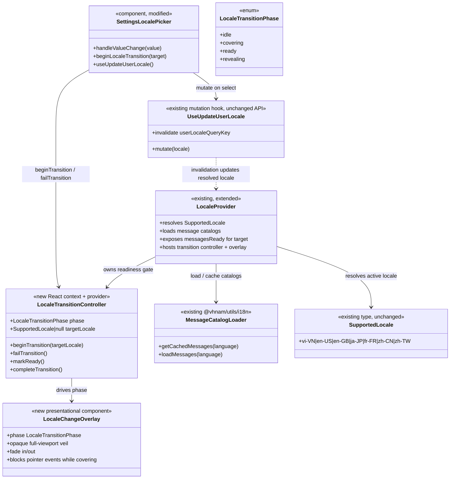

# Locale Change Full-Screen Fade Transition

## Requirements

Make intentional UI language changes feel like a brief soft reload — a full-screen
fade overlay that masks the mid-switch UI and reveals the app already running in the
new language — without a hard page refresh, without changing locale persistence or
resolution, and without leaving users stuck under the veil on failure.

## Entities



## Approach

1. Client-only soft reload (no navigation):
   - Do **not** call `window.location.reload()`, remount the React root, or reset the
     router. Preserve route, scroll restoration behavior, and TanStack Query cache.
   - Simulate reload with an opaque full-viewport fade veil that covers chrome while
     locale + messages settle, then fades out to reveal the updated UI.
   - Theme changes remain instant and out of scope.

2. App-level transition ownership:
   - Own lifecycle in a `LocaleTransitionController` co-located with `LocaleProvider`
     (new React context — first app-local context is acceptable; do not invent a global
     event bus).
   - `SettingsLocalePicker` only signals intent: `beginTransition(target)` before
     `mutate`, and `failTransition()` on mutation error (existing error toast stays).
   - Overlay renders once at the app root (inside `LocaleProvider`) so it covers the
     full authenticated/unauthenticated shell, not just the settings card.
   - Do not reuse Dialog/Sheet — no focus trap, no dismiss-on-outside-click, no modal
     semantics. Dedicated fixed inset layer with `pointer-events: auto` while covering.

3. Lifecycle and readiness gate:
   - **Start**: on committed locale Select change (different from current, mutation not
     already pending) → phase `covering` immediately (fade in) while PATCH runs.
   - **Warm catalogs**: kick off `loadMessages(target)` in parallel with the mutation so
     cold locales are ready sooner.
   - **Ready**: when resolved locale === target **and** the message catalog for that
     locale is applied to `IntlProvider` (cached hit or async load completed). Then
     enforce a **minimum cover hold** (~350ms from cover start) so warm switches still
     feel intentional.
   - **Reveal**: phase `revealing` (fade out ~180ms), then `idle`.
   - **Fail**: any mutation error → `failTransition()` clears overlay immediately
     (skip exit animation or use a short fade-out ≤100ms); show existing error toast.
   - **Timeout**: if ready is not reached within ~5s (slow network / hung catalog),
     force `failTransition()`-style teardown without claiming success; if the mutation
     already succeeded, leave the new locale applied and just remove the veil (do not
     roll back locale). Log no sensitive data; optional `console.warn` in dev only is
     fine — no new toast required for timeout if UI already shows the new language.
   - **Same-locale / pending**: keep existing picker no-ops; never begin a transition.
   - **Single flight**: while phase ≠ `idle`, ignore further `beginTransition` calls.

4. Visual and a11y defaults (locked for v1):
   - Overlay: `fixed inset-0`, `bg-background` (opaque — hides text swap; avoids pure
     black/white theme-flash look), `z-[200]` (above dialogs/sheets at `z-50`, **below**
     toasts at ~`z-[1000]` so error toasts remain visible).
   - Centered `Spinner` on the opaque veil so the cover reads as loading, not a freeze.
     No logo / branded splash.
   - No success toast — the transition is the feedback.
   - `aria-hidden="true"` on the veil (decorative). Announce language change with a
     polite `aria-live="polite"` region updated to a short message when reveal starts
     (message id e.g. `settings.locale.changed`, default “Language updated”) — keep
     copy in message catalogs.
   - `prefers-reduced-motion: reduce`: skip fade animations (instant cover / instant
     reveal) but still apply the readiness gate and a shortened minimum hold (~100ms)
     so catalog integrity is preserved without motion theatre.

5. LocaleProvider message integrity:
   - Today `locale` can update before lazy `messages` land. Under the veil this is
     acceptable only if reveal waits until `messages` match the target language
     (via `getCachedMessages` / applied state). Prefer applying messages as soon as
     loaded; do not fade out while still showing `DEFAULT_MESSAGES` for a non-en-US
     target.
   - Do not change unauthenticated browser-locale resolution or initial signed-in
     bootstrap — those must not trigger the transition.

## Structure

### Inheritance Relationships

1. No class inheritance — React function components and a context provider.
2. `LocaleTransitionController` is a React context value + provider, not a subclass of
   `LocaleProvider`; `LocaleProvider` composes the controller and overlay as children
   wrappers around the existing `IntlProvider` tree.
3. `LocaleChangeOverlay` is presentational only; it does not own mutation or catalog
   loading.

### Dependencies

1. `SettingsLocalePicker` calls `useLocaleTransition().beginTransition` /
   `failTransition` and existing `useUpdateUserLocale`.
2. `LocaleTransitionProvider` (inside or beside `LocaleProvider`) depends on resolved
   locale + applied messages readiness from `LocaleProvider` internals /
   `@vhnam/utils/i18n` helpers.
3. `LocaleChangeOverlay` depends only on transition phase + reduced-motion preference.
4. `useUpdateUserLocale` remains unchanged (still invalidates `userLocaleQueryKey`).
5. No new Netlify handlers, migrations, or `@vhnam/ui` package APIs required for v1
   (overlay lives in `apps/ledger-box`; reuse Tailwind tokens/`cn` patterns).

### Layered Architecture

1. Settings UI layer: `SettingsLocalePicker` — user intent + mutation + error toast.
2. Locale runtime layer: `LocaleProvider` — resolve locale, load catalogs, feed
   `IntlProvider`, evaluate “target ready”.
3. Transition layer: `LocaleTransitionController` + `LocaleChangeOverlay` — phase
   machine, timing (min hold, fade, timeout), full-screen veil.
4. Persistence layer: existing user-locale API/query/mutation — untouched contracts.
5. Shared i18n utils: `loadMessages` / `getCachedMessages` — reused for preload and
   readiness; no schema change.

## Operations

### Create Context Module - `locale-transition.tsx` (under `apps/ledger-box/src/lib/`)

1. Responsibility: Hold locale-change transition phase state and the public API used by
   settings and the overlay.
2. Attributes / state:
   - `phase`: `'idle' | 'covering' | 'ready' | 'revealing'`
   - `targetLocale`: `SupportedLocale | null`
   - `coverStartedAt`: `number | null` (performance.now() when covering began)
3. API:
   - `beginTransition(targetLocale: SupportedLocale): void`
     - Logic:
       - If `phase !== 'idle'`, return.
       - Set `targetLocale`, `coverStartedAt = performance.now()`, `phase = 'covering'`.
       - Fire-and-forget `loadMessages(targetLocale)` to warm the catalog cache.
   - `failTransition(): void`
     - Logic:
       - Clear `targetLocale` / `coverStartedAt`.
       - Set `phase = 'idle'` (optionally brief revealing if already painted; prefer
         immediate clear on error so toasts are not blocked perceptually).
   - `notifyLocaleReady(activeLocale: SupportedLocale, messagesReady: boolean): void`
     - Logic:
       - If `phase !== 'covering'` or `!targetLocale`, return.
       - If `activeLocale !== targetLocale` or `!messagesReady`, return.
       - If `performance.now() - coverStartedAt < MIN_COVER_MS` (350, or 100 when
         reduced motion), schedule a timer for the remainder then set `phase = 'ready'`;
         else set `phase = 'ready'` immediately.
   - `beginReveal(): void` / overlay-driven: when `phase === 'ready'`, move to
     `revealing`, after `FADE_OUT_MS` (180, or 0 reduced motion) call `completeTransition()`.
   - `completeTransition(): void` → reset to idle.
4. Constraints:
   - Export `useLocaleTransition()` that throws if used outside the provider (dev-time
     guard) **or** returns a no-op-safe object only if tests require it — prefer throw
     outside provider for real UI callers.
   - Export timing constants as named module constants for tests.
   - Mount a single safety timeout (5s) when entering `covering`; on fire, force idle
     teardown without rolling back locale.

### Extend - `LocaleProvider` (`locale-context.tsx`)

1. Responsibility: Compose transition provider, compute messages-ready for the active
   locale, notify the controller, and render the overlay beside children.
2. Changes:
   - Track applied `messages` language explicitly (e.g. state `messagesLanguage` set
     whenever `setMessages` runs from cache or `loadMessages` resolve).
   - `messagesReady = toMessageLanguage(locale) === messagesLanguage` (and for the
     transition target, ready means target’s catalog is the one applied).
   - On each render/effect while a transition is active, call
     `notifyLocaleReady(locale, messagesReady)`.
   - Wrap children:

     ```tsx
     <IntlProvider ...>
       <LocaleTransitionProvider>
         {children}
         <LocaleChangeOverlay />
         <LocaleChangeAnnouncer />
       </LocaleTransitionProvider>
     </IntlProvider>
     ```

     (Announcer may be inline in the overlay file.)
3. Constraints:
   - Do not trigger transitions on initial mount, session bootstrap, or browser-locale
     resolution for signed-out viewers.
   - Keep `useAppLocale()` behavior unchanged.
   - Preserve existing flash-avoidance fallbacks (`DEFAULT_LOCALE` while signed-in
     locale query pending).

### Create Component - `LocaleChangeOverlay`

1. Responsibility: Render the full-screen fade veil driven by transition phase.
2. Presentation:
   - When `phase` is `covering` | `ready` | `revealing`, mount a
     `fixed inset-0 z-[200] bg-background` layer with `pointer-events-auto`.
   - Fade in on enter covering (~150ms opacity 0→1); stay opaque through `ready`;
     fade out on `revealing` (~180ms); unmount at idle.
   - Prefer CSS transitions / existing Tailwind opacity utilities; respect
     `prefers-reduced-motion` (instant opacity flips).
   - `aria-hidden="true"`; decorative only.
3. Lifecycle hooks:
   - When phase becomes `ready`, start reveal (set revealing) after paint so the new
     language is committed under the opaque veil before fade-out.
   - On `transitionend` / timeout fallback matching `FADE_OUT_MS`, call
     `completeTransition()`.
4. Constraints:
   - Must not use Dialog portal/focus trap.
   - Must sit below toast z-index (~1000).
   - Centered `@vhnam/ui` `Spinner` on the veil; no logo.

### Create Component - `LocaleChangeAnnouncer` (can share file with overlay)

1. Responsibility: Screen-reader feedback when language finishes updating.
2. Logic:
   - Visually hidden `aria-live="polite"` region.
   - When phase enters `revealing` (or completes), set text via
     `intl.formatMessage({ id: 'settings.locale.changed', defaultMessage: 'Language updated' })`.
   - Clear or leave message; avoid announcing on fail/teardown.

### Update - `SettingsLocalePicker`

1. Responsibility: Wire begin/fail around the existing mutation without changing Select UX.
2. Logic in `handleValueChange`:
   - Keep guards: null value, `updateLocale.isPending`, same as `data?.locale`.
   - Call `beginTransition(locale)`.
   - `updateLocale.mutate(locale, { onError: (error) => { failTransition(); toast.add({ title: error.message, type: 'error' }); } })`.
   - Do not add success toast.
3. Constraints:
   - Select remains disabled while `updateLocale.isPending` (existing).
   - Optionally also disable while `phase !== 'idle'` if the mutation settles before
     reveal completes (recommended: disable Select when transition active so users
     cannot open the menu under the veil if overlay somehow doesn’t cover the portaled
     select — overlay should cover portals at z-200 > select z-50).

### Update - i18n message catalogs

1. Add `settings.locale.changed` with appropriate translations to all locale JSON files
   under `packages/utils/src/i18n/messages/` (`en-US`, `en-GB`, `vi-VN`, `fr-FR`,
   `ja-JP`, `zh-CN`, `zh-TW`).
2. Keep defaultMessage in code for react-intl fallback.

### Tests

1. Unit / component tests (Vitest + existing Testing Library patterns):
   - `beginTransition` → phase covering; second begin ignored.
   - Ready + min hold → revealing → idle.
   - `failTransition` during covering → idle immediately; no stuck overlay.
   - Messages not ready → stays covering even if locale string already matches.
   - Picker: selecting new locale calls begin + mutate; onError calls fail + toast.
2. No E2E required for v1 unless the repo already has a settings locale Playwright path
   — prefer unit coverage of the phase machine.

### Out of scope (do not implement)

1. Hard reload / full React remount.
2. View Transitions API.
3. Overlay for theme changes.
4. Success toasts.
5. Branded splash / logo (spinner on the veil is in scope).
6. API, DB, or Netlify changes.
7. Moving overlay into `@vhnam/ui` (keep app-local unless reuse appears later).

## Norms

1. Imports: use `#/` in `apps/ledger-box` source; `@vhnam/utils/i18n` and
   `@vhnam/utils/locale` for shared helpers — no deep relative imports across packages.
2. UI strings: `react-intl` + catalog keys; brand name “Ledger Box” untranslated; do not
   put `react-intl` inside `@vhnam/ui`.
3. Toasts: imperative `toast.add({ title, type })` only — never Sonner-style APIs.
4. State: React context + `useState`/`useEffect` for this feature; do not add Redux,
   Zustand, or URL state for the veil.
5. Styling: Tailwind utility classes and design tokens (`bg-background`, existing
   duration scales). Prefer opacity transitions over new animation libraries
   (no framer-motion).
6. Motion a11y: honor `prefers-reduced-motion` via `matchMedia` or CSS media query;
   do not ship motion-only feedback without the readiness gate.
7. Error handling: reuse picker’s existing mutation error → toast path; coded API
   errors already flow through `getApiErrorMessage` where applicable — do not invent
   new error codes for a pure client transition.
8. Comments: only explain non-obvious timing/readiness invariants (why min hold, why
   z-index below toasts, why reveal waits on catalog).
9. File placement:
   - `apps/ledger-box/src/lib/locale-transition.tsx` — context + hook + constants
   - `apps/ledger-box/src/lib/locale-change-overlay.tsx` — overlay + announcer
   - extend `apps/ledger-box/src/lib/locale-context.tsx`
   - touch `settings-locale-picker.tsx` and message JSON files
10. Changelog: when implementing as a merge, add `docs/changelogs/mr-*-…` and a
    `CHANGELOG.md` Unreleased bullet — client UX only, no env vars.

## Safeguards

1. Functional constraints:
   - Transition runs only for intentional signed-in locale Select changes.
   - Overlay must not appear on first paint, login bootstrap, or public/unauth locale.
   - Reveal only when target locale is resolved **and** matching catalog is applied.
   - Mutation failure always clears the overlay; previous language remains if PATCH
     failed.
   - Theme switching never triggers this overlay.
2. Performance constraints:
   - Min cover ~350ms (100ms reduced motion); fade in ~150ms; fade out ~180ms
     (0 reduced motion).
   - Max cover before forced teardown: 5s.
   - Preload target catalog on begin; rely on existing in-memory catalog cache for
     subsequent switches.
3. Security constraints:
   - No new endpoints; no secrets; overlay must not capture or log PII.
4. Integration constraints:
   - Do not change `GET`/`PATCH` `/api/users/locale` contracts.
   - Do not change `SupportedLocale` set or `user_settings` schema.
   - Preserve `LocaleProvider` / `useAppLocale` public export surface (may add
     `useLocaleTransition` export).
5. Business rule constraints:
   - Soft simulate reload — never hard-navigate.
   - Opaque veil (not translucent dim) so mixed-language UI is never visible.
   - Error toast remains the failure signal; no success toast.
6. Exception / failure constraints:
   - Stuck-veil is a P0 defect — timeout + failTransition are mandatory.
   - Catalog load rejection: treat as not-ready until timeout teardown; do not infinite
     spin.
7. Technical constraints:
   - Overlay z-index above app dialogs (`z-50`) and below toasts (~`z-1000`).
   - Block pointer events while covering/ready/revealing.
   - Single in-flight transition; ignore re-entrant begins.
   - StrictMode-safe: timers/effects must clean up; double-invoke must not leave dual
     overlays or stuck phases.
8. Data constraints:
   - Target locale must be a `SupportedLocale`; picker already narrows the Select.
9. A11y constraints:
   - Decorative veil is `aria-hidden`.
   - Language change announced via polite live region when reveal begins.
   - Reduced motion short-circuits animation durations but keeps readiness gating.
10. API constraints:
    - None new — client-only feature.
