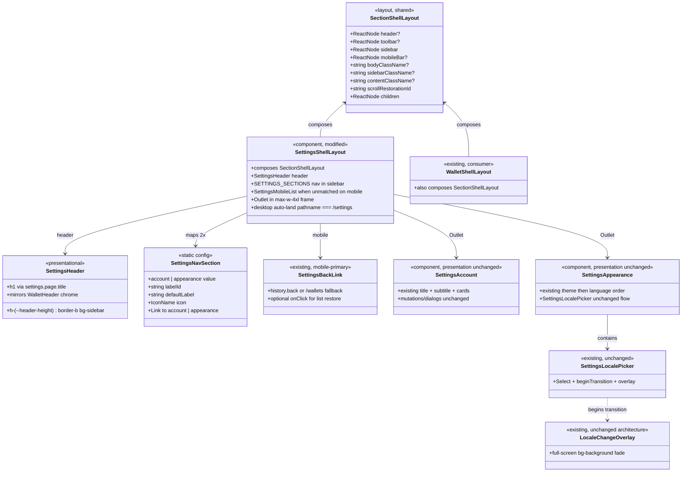

# Restructure App Settings Page Layout

## Requirements

Restructure the `/settings` page chrome so Account and Appearance sit in a two-panel section shell aligned with the wallet shell (desktop header + sub-sidebar + centered content; mobile list → drill → back), without changing auth capabilities, locale/theme persistence, or account-deletion business rules.

**Shipped scope (this prompt’s delivered DoD):** shell/layout only — shared `SectionShellLayout`, `SettingsHeader`, mobile list landing, desktop auto-land to Account, `UserCircleIcon`, and `settings.page.navLabel`.

**Deferred (not shipped):** Account/Appearance card restyles, subtitle/copy rewrites, danger-card redesign, Language-above-Theme reorder, and LocalePicker Select restyle. Those remain optional follow-ups; do not treat them as done for this ticket.

## Entities

## Approach

1. **Shared section chrome first**:
   - Extract `SectionShellLayout` under `layouts/section-shell-layout/` with slots for `header`, optional `toolbar`, desktop `sidebar`, `mobileBar`, and scrollable `children`.
   - Both `SettingsShellLayout` and `WalletShellLayout` compose it so settings and wallet read as the same two-panel family (sub-sidebar tone `color-mix` between sidebar and background, `w-64` rail, `max-w-4xl` content padding).

2. **Settings shell composition**:
   - `SettingsHeader` (dedicated module, mirrors `WalletHeader`): title-only “Settings”, no desktop Back, no `SidebarTrigger` in the page header.
   - Desktop nav: uppercase `settings.page.navLabel` strip + ghost `Button`/`Link` rows; active `bg-accent text-accent-foreground`; icons Account `UserCircleIcon`, Appearance `DesktopIcon` (no trailing caret on desktop).
   - Content: `mx-auto max-w-4xl p-4 lg:p-6` hosting `<Outlet />`.
   - Body height: `h-[calc(100vh-var(--header-height))]`.

3. **Mobile list hardening**:
   - `/settings/` index has no `beforeLoad` redirect; `RouteComponent` renders `null` (shell owns landing).
   - Unmatched section → mobile list; matched section → outlet; section Back → `navigate({ to: '/settings' })`; list Back → history or `/wallets`.
   - Desktop auto-land: only when `pathname === '/settings'` (not merely `matchedSection === undefined`), plus `md`/`matchMedia` guard — avoids clobbering in-flight navigations to `/wallets/$walletId`.

4. **Adjacent app-shell fixes (landed with this work)**:
   - `AppLayout`: `SidebarProvider defaultOpen={false}`; `SidebarInset` `relative z-0` so fixed icon rail stays above content hit-testing.
   - `AppSidebar`: collapsed logo + `SidebarTrigger` hidden when icon-collapsed; expand via `SidebarRail` fully outside the icon column.
   - `@vhnam/ui` `SidebarMenuButton`: `TooltipTrigger closeOnClick={false}` so collapsed wallet `Link`s navigate while tooltips show.

5. **Explicitly deferred presentation work** (see Operations marked Deferred):
   - Account/Appearance typography and card chrome, danger-card reshape, Language-above-Theme, LocalePicker muted Select trigger, related catalog copy.

6. **Validation**:
   - `vp check && vp test` after changes.
   - Write per-merge changelog + root `CHANGELOG.md` when the feature lands.

## Structure

### Inheritance Relationships

1. No new class hierarchies — composition-only React/TanStack Router changes.
2. No new API DTOs, migrations, or auth providers.
3. `SettingsShellLayout` and `WalletShellLayout` both compose `SectionShellLayout` (shared layout primitive, not inheritance).

### Dependencies

1. `routes/_app/settings/route.tsx` continues to mount `SettingsShellLayout`.
2. `SettingsShellLayout` depends on `SectionShellLayout`, `SettingsHeader`, TanStack Router (`Link`, `Outlet`, `useLocation`, `useNavigate`, `useRouter`), `@vhnam/ui` Button/Icon, `useIsMobile`, and `react-intl`.
3. `WalletShellLayout` depends on `SectionShellLayout` and `WalletHeader` (same chrome family).
4. `SettingsAccount` / `SettingsAppearance` / `SettingsLocalePicker` remain on existing queries/mutations; **no presentation edits shipped** for this prompt.
5. Icon registry in `packages/ui/src/components/icon.tsx` includes `UserCircleIcon`.
6. Message catalogs include `settings.page.navLabel` (and existing settings keys); deferred copy keys not required for shipped DoD.
7. `AppLayout` / `AppSidebar` / `@vhnam/ui` `sidebar.tsx` updated for collapsed-default rail UX and clickable wallet links from Settings.

### Layered Architecture

1. **Route layer** (`routes/_app/settings/`): thin file routes; index is mobile list landing; desktop default section via shell effect.
2. **Shared layout layer** (`layouts/section-shell-layout/`): header/sidebar/mobile/content slots + ScrollArea.
3. **Shell layer** (`modules/settings/settings-shell-layout/`, `settings-header/`): settings-specific nav, mobile list, auto-land.
4. **Section layer** (`settings-account`, `settings-appearance`, `settings-locale`): unchanged for shipped scope.
5. **App chrome layer** (`layouts/app-layout/`, `@vhnam/ui` sidebar): collapsed icon rail coexists with section shells.
6. **Locale transition layer** (`lib/locale/`): overlay unchanged.

## Operations

### Update Route - `/_app/settings/` index

1. Responsibility: Provide a stable `/settings` URL that acts as the mobile section list landing, while desktop still lands on Account.
2. Changes:
   - Remove unconditional `beforeLoad` redirect to `/settings/account`.
   - Index `RouteComponent` renders `null` (shell owns empty-state / list).
3. Desktop default:
   - In `SettingsShellLayout`, when `pathname === '/settings'`, viewport is `md+` (and `matchMedia` confirms), `navigate({ to: '/settings/account', replace: true })`.
4. Constraints:
   - `/settings/locale` redirect to appearance remains unchanged.
   - Bookmarks to `/settings/account` and `/settings/appearance` continue to work.
   - Do not auto-land solely on `matchedSection === undefined` — that also matches non-settings pathnames during navigation and can cancel wallet navigations.

### Create Layout - `SectionShellLayout`

1. Responsibility: Shared two-panel section chrome for settings and wallet.
2. Package: `apps/ledger-box/src/layouts/section-shell-layout/`.
3. Props: `header?`, `toolbar?`, `sidebar`, `mobileBar?`, `bodyClassName?`, `sidebarClassName?`, `contentClassName?`, `scrollRestorationId`, `children`.
4. Structure:
   - Optional `header` above body.
   - Body column with optional `toolbar`, then `md:flex-row`: desktop `aside` (`hidden md:flex`, border-r, `bg-[color-mix(in_oklch,var(--sidebar),var(--background)_50%)]`) + content column with optional mobile bar and `ScrollArea`.
5. Constraints: domain nav and copy stay in callers; no wallet/settings business logic inside the layout.

### Create Component - `SettingsHeader`

1. Responsibility: Desktop/page title chrome for settings, aligned with `WalletHeader`.
2. Package: `apps/ledger-box/src/modules/settings/settings-header/`.
3. Render: `h-(--header-height) border-b bg-sidebar` with `settings.page.title` as `h1` (`font-heading text-base font-medium`). No Back, no `SidebarTrigger`.
4. Constraints: presentational only.

### Update Component - `SettingsShellLayout`

1. Responsibility: Settings-specific chrome on top of `SectionShellLayout`.
2. Desktop:
   - `header={<SettingsHeader />}`.
   - `bodyClassName="h-[calc(100vh-var(--header-height))]"`.
   - `sidebarClassName="w-64 gap-4 p-2"`.
   - Sidebar: uppercase `settings.page.navLabel` + map `SETTINGS_SECTIONS` to ghost `Button` + `Link`; active `bg-accent text-accent-foreground`; icons `UserCircleIcon` / `DesktopIcon`.
   - Children content wrapper: `mx-auto max-w-4xl p-4 lg:p-6` with `<Outlet />` (hidden on mobile when list visible).
3. Mobile:
   - `mobileBar`: `SettingsBackLink` + “Settings” title.
   - Unmatched (`/settings`): `SettingsMobileList` only (`md:hidden`).
   - Matched: outlet; Back uses `navigate({ to: '/settings' })`.
   - List Back: history-back-or-`/wallets`.
4. Remove:
   - Desktop Back from sub-sidebar.
   - `mobileSectionOpened` local state and `matchedSection === 'account'` special-case.
5. Constraints:
   - Single shell with responsive Tailwind.
   - Prefer wallet-matching tokens (`w-64`, `max-w-4xl`, accent active) over the earlier spec’s `w-52` / `max-w-2xl` / trailing caret.

### Update Package - `@vhnam/ui` icon registry

1. Responsibility: Support Account nav icon.
2. Add Phosphor `UserCircleIcon` to `packages/ui/src/components/icon.tsx` allowlist and exports.
3. Appearance nav uses existing `DesktopIcon`.
4. Constraints: curated allowlist only — no `import *` from Phosphor.

### Update i18n catalogs (shipped)

1. Responsibility: Add nav strip label used by the shell.
2. Keys shipped:
   - `settings.page.navLabel` (default `"Settings"`) in all SupportedLocale catalogs.
3. Constraints: keep catalogs in key parity.

### Adjacent - App sidebar clickability (shipped with layout work)

1. Responsibility: Collapsed global rail remains usable from Settings (and elsewhere).
2. Changes:
   - `AppLayout`: `defaultOpen={false}`; inset `relative z-0`.
   - `AppSidebar` / `SidebarRail`: rail outside icon column; trigger hidden when collapsed.
   - `SidebarMenuButton`: `TooltipTrigger closeOnClick={false}` when `tooltip` is set so `Link` navigation is not cancelled on pointerdown.
3. Constraints: do not reinvent the workspace rail as a second settings nav; keep wallet list + user menu.

### Deferred - `SettingsAccount` presentation

1. Status: **Deferred — not shipped.**
2. Original intent (for a follow-up prompt): tighter `h2` title/subtitle; `rounded-2xl` sign-in card; danger delete card with irreversible copy; Email/Password + Google only; owned-wallet gate preserved.
3. Current code: existing `text-2xl` header, existing cards/sections, description still “Manage your account settings.”

### Deferred - `SettingsAppearance` presentation

1. Status: **Deferred — not shipped.**
2. Original intent: Language card above Theme; updated subtitle; `rounded-2xl` chrome.
3. Current code: existing composition and copy (“Choose your preferred color theme and language.”).

### Deferred - `SettingsLocalePicker` restyle

1. Status: **Deferred — not shipped.**
2. Original intent: full-width muted `SelectTrigger` (`bg-muted rounded-xl`) without changing mutation/overlay flow.
3. Current code: existing Select styling and `beginTransition` / overlay behavior.

### Verification

1. Desktop: Settings header + `w-64` nav; Account/Appearance open in `max-w-4xl` frame; active nav uses accent.
2. Mobile: `/settings` list → drill → Back to list → Back leaves settings.
3. Deep-link `/settings/appearance` on mobile opens Appearance (not list).
4. From Settings, collapsed wallet icon links navigate to the wallet (tooltip may show; click must not be swallowed).
5. Locale overlay, theme toggle, Google connect/disconnect, delete gate still work.
6. Run `vp check && vp test`.
7. On merge: add `docs/changelogs/mr-<NN>-…` and update root `CHANGELOG.md`.

## Norms

1. **Imports**: use `#/` in app sources; UI package uses its own `#/` — never `@/` or deep relatives for app modules.
2. **i18n**: `FormattedMessage` / `useIntl().formatMessage` in app modules only; pass translated strings into UI primitives; keep “Ledger Box” untranslated.
3. **Toasts**: imperative `toast.add({ title, type })` only if touching toast call sites.
4. **Forms / validation**: leave Formisch + Valibot password/delete forms untouched unless a className wrapper is required.
5. **Icons**: only via curated `Icon` registry; add Phosphor icons to the allowlist when needed.
6. **Shared section chrome**: settings and wallet section pages compose `SectionShellLayout` rather than duplicating two-panel markup.
7. **Select**: prefer shared Select over native `<select>` for accessibility consistency (when restyling LocalePicker in a follow-up).
8. **Routing**: TanStack file routes stay thin; business UI stays in `modules/settings/*`.
9. **No money/tenancy changes**: this work must not touch wallet balance mutations, tenant scoping, or Netlify handlers (JSON import-attribute fixes in `@vhnam/utils/i18n` for Node vs Vite are orthogonal and out of this prompt’s design scope).
10. **Documentation**: follow repo changelog conventions when shipping.

## Safeguards

1. **Functional**: Do not add GitHub/Apple (or other) OAuth providers or fake Connect buttons.
2. **Functional**: Do not replace or fork `LocaleChangeOverlay` with Motion/`motion.div`; keep reduced-motion behavior.
3. **Functional**: Owned-wallet gate on account deletion must remain enforced in UI (disabled CTA + guidance).
4. **Functional**: Locale remains server-persisted; theme remains client-local — do not merge persistence.
5. **Functional**: Mobile deep links to section routes must open section content; Back from section must restore list at `/settings`.
6. **Layout**: Do not replace the global wallet/user rail with a second full settings IA; limited AppSidebar/AppLayout changes for collapsed-default + clickable icons are allowed.
7. **Layout**: Avoid double scrollbars — header + sub-sidebar + content height math must leave a single primary scroll region for content (sub-sidebar may independently overflow).
8. **Navigation**: Desktop `/settings` auto-land must not run for non-`/settings` pathnames (use `pathname === '/settings'`).
9. **API / DB**: No new migrations, endpoints, or schema changes for this feature.
10. **Security / tenancy**: No change to session, tenant_id scoping, or R2 key rules.
11. **i18n**: Every new/changed message id for shipped work must land in all SupportedLocale catalogs.
12. **Scope**: Shipped DoD is shell/layout; deferred Account/Appearance presentation must not be required to close this ticket.
13. **Quality**: `vp check && vp test` must pass before considering the work done.
