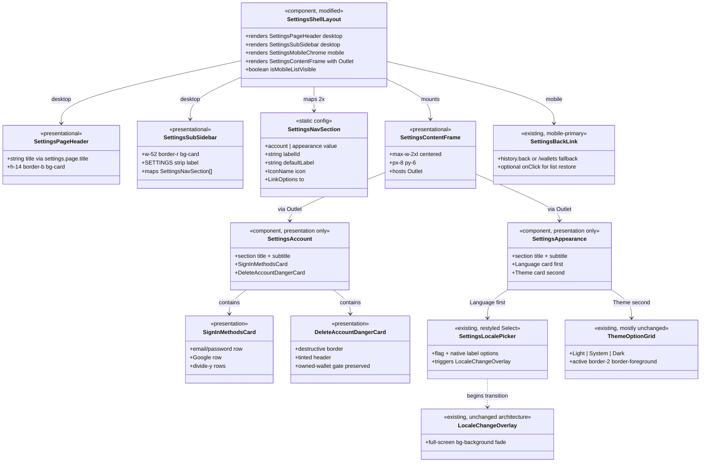

# Restructure App Settings Page Layout

## Requirements

Restructure the existing `/settings` two-panel page chrome and section card presentation so Account and Appearance read as a centered, documentation-style settings surface (desktop header + sub-sidebar + max-w-2xl content; mobile list → drill → back), matching the attached layout spec and screenshots — without changing auth capabilities, locale/theme persistence, or account-deletion business rules.

## Entities

## Approach

1. **Shell-first layout restructure**:
   - Concentrate chrome changes in `SettingsShellLayout`: add a desktop page header (“Settings”), restyle the sub-sidebar to `w-52` with a “SETTINGS” strip and active-row trailing caret, and center section content in a `max-w-2xl` frame.
   - Keep the existing `/settings` route tree (`route.tsx`, `account`, `appearance`, locale→appearance redirect). Do not redesign the global app sidebar from the reference screenshots.
   - Desktop Back moves out of the sub-sidebar (title-only header per spec). Mobile keeps Back as exit-from-settings and restore-list control.

2. **Mobile list hardening**:
   - Replace the fragile `matchedSection === 'account' && !mobileSectionOpened` rule.
   - Stop unconditional index redirect as the sole entry UX: `/settings/` becomes the mobile list landing (no section matched); desktop shell auto-navigates unmatched `/settings` to `/settings/account` via a `md` media-query effect (or equivalent client check after mount). Deep links to `/settings/appearance` (and `/settings/account`) still open section content directly; mobile Back from a section navigates to `/settings` (list), not browser-history guessing.
   - Preserve deep-linkability and reload behavior for each section URL.

3. **Section presentation alignment (no capability expansion)**:
   - Account: tighten title/subtitle; restyle Sign-in methods card (`rounded-2xl`, divided rows); reshape Delete account into a bordered danger card. Keep Email/Password + Google only — do not add GitHub/Apple Connect rows.
   - Appearance: put Language card above Theme; restyle Language trigger toward muted full-width rounded control using existing `@vhnam/ui` Select (not a raw `<select>`); keep Theme preview grid behavior.
   - Leave locale fade overlay architecture as-is (no Motion dependency). Do not treat “400ms / motion.div” as a hard rewrite; existing overlay remains the product behavior.

4. **Icons & copy**:
   - Map Account → `UserCircleIcon` (add to Phosphor allowlist in `@vhnam/ui`); Appearance → `DesktopIcon` (monitor). Active caret uses existing `CaretRightIcon`.
   - Update section subtitle catalog strings to match the screenshots; update delete-card warning copy to include irreversible-data emphasis while retaining owned-wallet gate messaging.

5. **Validation**:
   - `vp check && vp test` after changes.
   - Write per-merge changelog + root `CHANGELOG.md` entry when the feature lands (implementation phase).

## Structure

### Inheritance Relationships

1. No new class hierarchies — composition-only React/TanStack Router changes, consistent with existing settings modules.
2. No new API DTOs, migrations, or auth providers.

### Dependencies

1. `routes/_app/settings/route.tsx` continues to mount `SettingsShellLayout`.
2. `SettingsShellLayout` depends on TanStack Router (`Link`, `Outlet`, `useLocation`, `useNavigate`, `useRouter`), `@vhnam/ui` Button/Icon/ScrollArea, and `react-intl`.
3. `SettingsAccount` depends on existing auth/session/linked-accounts/wallets queries and dialogs; presentation-only edits.
4. `SettingsAppearance` composes `SettingsLocalePicker` then theme grid; `SettingsLocalePicker` continues to use `useUserLocale` / `useUpdateUserLocale` / `useLocaleTransition`.
5. Icon registry in `packages/ui/src/components/icon.tsx` gains `UserCircleIcon` if not already present.
6. Message catalogs under `packages/utils/src/i18n/messages/{locale}.json` updated for new/changed copy keys.

### Layered Architecture

1. **Route layer** (`routes/_app/settings/`): thin file routes; index behavior adjusted for mobile list landing vs desktop default section.
2. **Shell layer** (`modules/settings/settings-shell-layout/`): page header, sub-sidebar, mobile list/drill chrome, content frame.
3. **Section layer** (`settings-account`, `settings-appearance`, `settings-locale`): presentational restyle; mutations/queries unchanged.
4. **Shared UI layer** (`@vhnam/ui`): Card/Select/Icon primitives only; no business intl inside UI package.
5. **Locale transition layer** (`lib/locale/`): overlay unchanged unless a trivial timing tweak is explicitly required later — out of default scope for this prompt.

## Operations

### Update Route - `/_app/settings/` index

1. Responsibility: Provide a stable `/settings` URL that acts as the mobile section list landing, while desktop still lands on Account.
2. Changes:
   - Remove unconditional `beforeLoad` redirect to `/settings/account`.
   - Index `RouteComponent` renders `null` (shell owns empty-state / list).
3. Desktop default:
   - In `SettingsShellLayout`, when viewport is `md+` and no section segment is matched, `navigate({ to: '/settings/account', replace: true })`.
4. Constraints:
   - `/settings/locale` redirect to appearance remains unchanged.
   - Bookmarks to `/settings/account` and `/settings/appearance` continue to work.

### Update Component - `SettingsShellLayout`

1. Responsibility: Implement the layout spec chrome inside the existing app shell.
2. Desktop structure:
   - Outer column: full remaining height under the app shell (`h-[calc(100vh-var(--header-height))]` or equivalent that accounts for the new internal header without double scrollbars).
   - `SettingsPageHeader`: `h-14` (`h-14` or token-aligned 56px), `border-b`, `bg-card`, left `text-base font-semibold` “Settings” via `settings.page.title`. No subtitle. No Back on desktop.
   - Below header: horizontal flex row filling remaining height.
     - Left: sub-sidebar `w-52 shrink-0 border-r bg-card overflow-y-auto`.
       - Strip: `h-14 flex items-center px-4 border-b` with uppercase “SETTINGS” — use a dedicated message id (e.g. `settings.page.navLabel` default `"Settings"`) rendered with `text-[10px] font-semibold uppercase tracking-widest text-muted-foreground`.
       - Nav items: `flex items-center gap-2.5 px-4 py-2.5 text-sm font-medium w-full`.
         - Active: `bg-secondary text-foreground` + trailing `CaretRightIcon` (`ml-auto opacity-40`).
         - Inactive: `text-muted-foreground hover:bg-muted hover:text-foreground`.
       - Icons: Account `UserCircleIcon`, Appearance `DesktopIcon`.
     - Right: content panel `min-w-0 flex-1 overflow-y-auto` (or ScrollArea) with inner wrapper `w-full flex justify-center px-8 py-6` and child `w-full max-w-2xl` hosting `<Outlet />`.
3. Mobile structure:
   - Slim top bar (`md:hidden`) with `SettingsBackLink` + “Settings” title.
   - When pathname has no matched section (`/settings`): show `SettingsMobileList` only (hide outlet).
   - When matched section: show outlet only; Back calls `navigate({ to: '/settings' })` to restore list (not `history.back()` for this case).
   - Exit-from-settings Back (on list view): existing history-back-or-`/wallets` behavior.
4. Remove:
   - Desktop Back from sub-sidebar.
   - `mobileSectionOpened` local state and `matchedSection === 'account'` special-case.
   - `max-w-4xl` content wrapper.
5. Constraints:
   - Single component with responsive Tailwind (`hidden md:flex` / `md:hidden`), matching prior shell style.
   - Do not change global `AppSidebar` / `AppLayout`.

### Update Component - `SettingsAccount`

1. Responsibility: Align Account section presentation with the layout spec; keep mutation/dialog behavior.
2. Header:
   - Section title as `h2` `text-lg font-semibold` (drop heavy `border-b` + `text-2xl` treatment).
   - Subtitle: update `settings.account.description` default/catalog to “Manage your sign-in methods and account lifecycle.”
3. Sign-in methods card:
   - Keep `Card` primitive; apply `rounded-2xl` / overflow-hidden / border treatment to approximate spec.
   - Include card description if present in screenshots (“You can use your email address and password, or a third-party account to sign in.”) via new/updated message id.
   - Row layout: tighten to `gap-4 px-5 py-3.5` with `divide-y divide-border` (adjust `SignInMethodRow` spacing if needed).
   - Rows remain Email/Password + Google only.
4. Delete account danger card:
   - Replace the flat delete section with a `Card` using `border-destructive/30`, header area `bg-destructive/5`, destructive title, hint/warning body, and CTA.
   - Add stronger irreversible copy (new message id, e.g. `settings.account.delete.warning`) stating wallets/transactions/data are permanently erased and the action cannot be undone — shown when delete is allowed; keep owned-wallets blocking UI when gated.
   - Preserve: disabled CTA when `hasOwnedWallets`, owned-wallet list links, `DeleteAccountDialog` wiring.
5. Constraints:
   - Do not add GitHub/Apple rows.
   - Do not change `changePassword` / linkSocial / unlink / deleteAccount action modules beyond what presentation requires.

### Update Component - `SettingsAppearance`

1. Responsibility: Match Appearance composition order and title rhythm.
2. Header: `h2 text-lg font-semibold` + subtitle updated to “Customize language and visual preferences.” (`settings.appearance.description`).
3. Card order: render `SettingsLocalePicker` first, then Theme card.
4. Theme card: keep three-column Light/System/Dark preview buttons with `border-2 border-foreground` when active and checkmark; apply same `rounded-2xl` card chrome as Account for consistency.
5. Constraints: theme still via `useTheme`; no server persistence for theme.

### Update Component - `SettingsLocalePicker`

1. Responsibility: Visual restyle of Language card control without changing mutation/transition flow.
2. Keep `@vhnam/ui` `Select` (do not switch to native `<select>`).
3. Style `SelectTrigger` toward full-width muted rounded control (`bg-muted rounded-xl`, comfortable padding) approximating the screenshot.
4. Preserve flag emoji + native-language labels, pending/disabled guards, `beginTransition` + `useUpdateUserLocale`, and error toasts.
5. Constraints: do not bypass `LocaleChangeOverlay`; do not add Motion.

### Update Package - `@vhnam/ui` icon registry

1. Responsibility: Support Account nav icon from the layout spec.
2. Add Phosphor `UserCircleIcon` to `packages/ui/src/components/icon.tsx` allowlist and exports.
3. Appearance nav uses existing `DesktopIcon`.
4. Constraints: curated allowlist only — no `import *` from Phosphor.

### Update i18n catalogs

1. Responsibility: Keep all SupportedLocale catalogs in sync for changed copy.
2. Keys to update/add (exact ids may follow existing naming):
   - `settings.account.description`
   - `settings.appearance.description`
   - `settings.page.navLabel` (or equivalent for SETTINGS strip)
   - Sign-in methods card description (if added)
   - `settings.account.delete.warning` (irreversible-data body)
3. Update every file under `packages/utils/src/i18n/messages/{en-US,en-GB,vi-VN,fr-FR,ja-JP,zh-CN,zh-TW}.json`.

### Verification

1. Manually verify desktop: header + w-52 nav with active chevron; centered max-w-2xl Account and Appearance.
2. Manually verify mobile: `/settings` list → drill into section → Back returns to list → Back from list leaves settings.
3. Deep-link `/settings/appearance` on mobile opens Appearance content (not list).
4. Locale change still shows full-screen fade overlay; theme toggles still work; Google connect/disconnect and delete gate still work.
5. Run `vp check && vp test`.
6. On merge: add `docs/changelogs/mr-<NN>-…` and update root `CHANGELOG.md`.

## Norms

1. **Imports**: use `#/` in app sources; UI package uses its own `#/` — never `@/` or deep relatives for app modules.
2. **i18n**: `FormattedMessage` / `useIntl().formatMessage` in app modules only; pass translated strings into UI primitives; keep “Ledger Box” untranslated.
3. **Toasts**: imperative `toast.add({ title, type })` only if touching toast call sites.
4. **Forms / validation**: leave Formisch + Valibot password/delete forms untouched unless a className wrapper is required.
5. **Icons**: only via curated `Icon` registry; add Phosphor icons to the allowlist when needed.
6. **Cards**: prefer `@vhnam/ui` `Card*` with className overrides over one-off panel divs.
7. **Select**: prefer shared Select over native `<select>` for accessibility consistency.
8. **Routing**: TanStack file routes stay thin; business UI stays in `modules/settings/*`.
9. **No money/tenancy changes**: this work must not touch wallet balance mutations, tenant scoping, or Netlify handlers.
10. **Documentation**: follow repo changelog conventions when shipping.

## Safeguards

1. **Functional**: Do not add GitHub/Apple (or other) OAuth providers or fake Connect buttons.
2. **Functional**: Do not replace or fork `LocaleChangeOverlay` with Motion/`motion.div`; keep reduced-motion behavior.
3. **Functional**: Owned-wallet gate on account deletion must remain enforced in UI (disabled CTA + guidance).
4. **Functional**: Locale remains server-persisted; theme remains client-local — do not merge persistence.
5. **Functional**: Mobile deep links to section routes must open section content; Back from section must restore list at `/settings`.
6. **Layout**: Do not redesign global app sidebar / workspace rail from the reference screenshots.
7. **Layout**: Avoid double scrollbars — header + sub-sidebar + content height math must leave a single primary scroll region for content (sub-sidebar may independently overflow).
8. **API / DB**: No new migrations, endpoints, or schema changes.
9. **Security / tenancy**: No change to session, tenant_id scoping, or R2 key rules.
10. **i18n**: Every new/changed message id must land in all SupportedLocale catalogs.
11. **Scope**: Presentation/layout only — no refactor of auth query modules unless required for compile.
12. **Quality**: `vp check && vp test` must pass before considering the work done.
