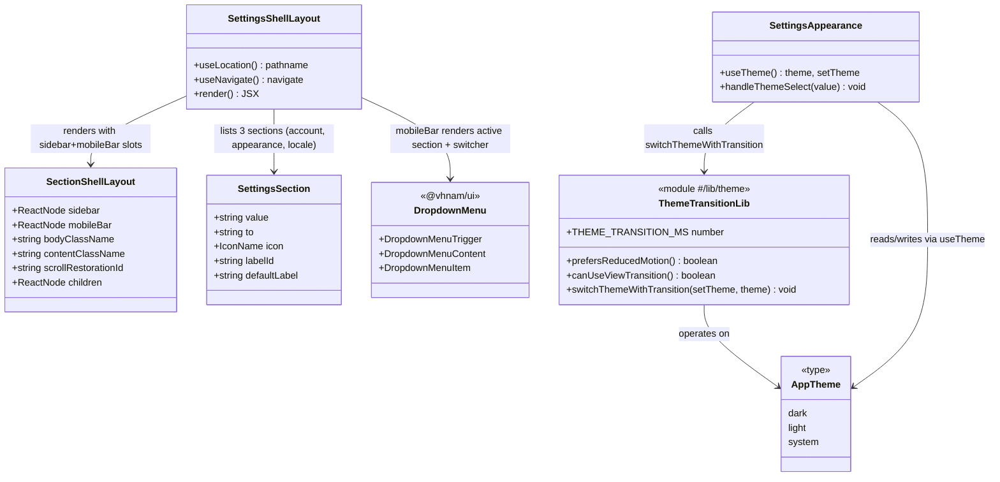

# Settings Mobile Navigation Dropdown and Animated Theme Switching

## Requirements

Replace the Settings section's two-state mobile navigation (back-link + full section list) with a single persistent dropdown selector, and give theme switching a native, accessibility-respecting crossfade — so users always land in a section and see visual continuity when changing appearance, on both mobile and desktop.

## Entities

## Approach

1. **Mobile Navigation Simplification**:
   - Collapse the previous two-state mobile shell (`isMobileListVisible` list view vs. section view) into a single-state shell where `Outlet` is always mounted.
   - Expose section switching on mobile through a `DropdownMenu` rendered in the `mobileBar` slot of `SectionShellLayout`, showing the active section's icon/label as the trigger and the other sections as menu items (`Link`-rendered `DropdownMenuItem`s).
   - Remove the mobile-specific `matchMedia('(max-width: 767px)')` guard on the `/settings` → `/settings/account` redirect; the redirect now applies unconditionally whenever `pathname === '/settings'`, regardless of viewport.

2. **Technical Implementation**:
   - Introduce an app-owned module `#/lib/theme` (barrel re-export of `#/lib/theme/theme-transition`) so `AppTheme` has one canonical definition instead of being locally redeclared per consumer.
   - `switchThemeWithTransition` wraps the shared `useTheme().setTheme` call: when `document.startViewTransition` exists and `prefers-reduced-motion: reduce` is not set, invoke `setTheme` inside `document.startViewTransition(() => flushSync(() => setTheme(theme)))`; otherwise call `setTheme(theme)` directly.
   - Pair the JS transition trigger with CSS in `apps/ledger-box/src/style.css`: a `@supports (view-transition-name: none)` block sets `animation-duration: 350ms` (matching `THEME_TRANSITION_MS`) on `::view-transition-old(root)` / `::view-transition-new(root)`, with an explicit `@media (prefers-reduced-motion: reduce)` override disabling the animation as defense-in-depth alongside the JS gate.
   - No global exception handling layer applies — this is a client-side, non-networked UI change; errors are not expected to be thrown by these code paths (DOM API existence checks are the only guards needed).

3. **Business Logic**:
   - `handleThemeSelect` in `SettingsAppearance` is a no-op guard: if the selected value equals the current `theme`, return early without calling `switchThemeWithTransition`, preventing a redundant/visible transition on re-clicking the active option.
   - `SettingsShellLayout`'s active-section resolution derives `matchedSection` from the last non-empty pathname segment matched against `SETTINGS_SECTIONS`, and falls back to `SETTINGS_SECTIONS[0]` (`account`) for `activeSection` display when nothing matches (e.g. transient states during navigation).
   - Validation/error handling strategy: none required beyond existing TanStack Router navigation guarantees and the DOM feature-detection already covered above.

## Structure

### Inheritance Relationships

1. No new class hierarchies are introduced — this feature is composed of function components and plain utility functions, consistent with the existing codebase's functional-React style.
2. `AppTheme` is a type alias (`'dark' | 'light' | 'system'`), not a class; `SettingsAppearance`'s previously-local `Theme` type now aliases `AppTheme` from `#/lib/theme`.

### Dependencies

1. `SettingsShellLayout` depends on `SectionShellLayout` (layout primitive), `SettingsHeader`, `SETTINGS_SECTIONS` (local constant), and `@vhnam/ui/components/dropdown-menu`.
2. `SettingsAppearance` depends on `@vhnam/ui/hooks/use-theme` (state) and `#/lib/theme` (transition behavior) — it no longer defines its own `Theme` type.
3. `#/lib/theme/theme-transition.ts` depends on `react-dom`'s `flushSync` and browser globals (`document.startViewTransition`, `window.matchMedia`); it has no dependency on `@vhnam/ui`.
4. `style.css` depends on the browser's View Transitions CSS pseudo-elements (`::view-transition-old(root)`, `::view-transition-new(root)`); purely additive, no dependency on JS beyond the class the API itself manages.

### Layered Architecture

1. **Route/Layout Layer**: `SettingsShellLayout` — owns navigation state (active section, redirect-on-bare-`/settings`) and composes the mobile/desktop chrome around `Outlet`.
2. **Presentation Layer**: `SettingsAppearance` and its `ThemeOption` children — render theme choices and locale picker, translate user clicks into theme-change calls.
3. **App Utility Layer**: `#/lib/theme` — houses `switchThemeWithTransition`, `canUseViewTransition`, `prefersReducedMotion`; the single place that knows about View Transitions.
4. **Shared UI Layer**: `@vhnam/ui`'s `useTheme` hook and `DropdownMenu` primitives — reused, unmodified.
5. **Styling Layer**: `style.css` — defines the crossfade animation triggered by the View Transitions API, with its own independent reduced-motion guard.

## Operations

### Create Module - `#/lib/theme/theme-transition.ts`

1. Responsibility: Provide a single, testable utility for applying theme changes with an optional native crossfade, respecting reduced-motion preference and browser support.
2. Attributes:
   - `THEME_TRANSITION_MS`: `number` - exported constant `350`, kept in sync with the CSS `animation-duration` in `style.css`.
   - `AppTheme`: `type` - `'dark' | 'light' | 'system'`, the canonical theme union used app-wide.
3. Methods:
   - `prefersReducedMotion(): boolean`
     - Logic:
       - Return `false` if `window` is `undefined` or `window.matchMedia` is not a function (SSR/test safety).
       - Otherwise return `window.matchMedia('(prefers-reduced-motion: reduce)').matches`.
   - `canUseViewTransition(): boolean`
     - Logic:
       - Return `true` only if `document` is defined, `'startViewTransition' in document`, `document.startViewTransition` is a function, AND `prefersReducedMotion()` is `false`.
   - `switchThemeWithTransition(setTheme: (theme: AppTheme) => void, theme: AppTheme): void`
     - Logic:
       - If `canUseViewTransition()` is `false`: call `setTheme(theme)` directly and return.
       - Else: call `document.startViewTransition(() => flushSync(() => setTheme(theme)))`, letting the browser drive the crossfade against the CSS pseudo-elements.
     - Edge cases: no explicit handling for overlapping/rapid calls — relies on the browser's own View Transition queuing; not a functional defect for this scope but flagged as a known limitation (see Safeguards).
4. Annotations: None (plain TypeScript module, no framework decorators in this codebase).
5. Constraints: Must not throw when `window`/`document`/`matchMedia`/`startViewTransition` are unavailable (covered by existence checks) — this module is exercised directly by unit tests in `theme-transition.test.ts` using `vi.stubGlobal`.

### Create Barrel - `#/lib/theme/index.ts`

1. Responsibility: Re-export the public surface of `theme-transition.ts` (`canUseViewTransition`, `prefersReducedMotion`, `switchThemeWithTransition`, `THEME_TRANSITION_MS`, `AppTheme`) as the module's single import path (`#/lib/theme`).
2. Constraints: Must not re-export anything not part of the intended public API (internal helpers stay module-private unless explicitly needed elsewhere).

### Update Component - `SettingsAppearance`

1. Responsibility: Render theme and locale pickers; translate user selection into a (possibly animated) theme change.
2. Attributes: `Theme` type now aliases `AppTheme` from `#/lib/theme` instead of a locally-declared union.
3. Methods:
   - `handleThemeSelect(value: Theme): void`
     - Logic:
       - If `value === theme` (current theme from `useTheme()`), return immediately (no-op).
       - Else call `switchThemeWithTransition(setTheme, value)`.
4. Constraints:
   - `SettingsLocalePicker` must render above the theme `Card` in the JSX order (locale picker first, then Appearance's theme-selection card).
   - The theme options grid uses `grid md:grid-cols-3` (single column on mobile, 3 columns from `md` breakpoint up) rather than a fixed 3-column grid.

### Update Component - `SettingsShellLayout`

1. Responsibility: Own the Settings section's routing/redirect behavior and mobile section-switching UI; compose `SectionShellLayout` with sidebar (desktop) and dropdown (mobile) navigation.
2. Attributes:
   - `SETTINGS_SECTIONS`: existing constant array of `{ value, to, icon, labelId, defaultLabel }` — unchanged shape.
   - `activeSection`: derived value — `SETTINGS_SECTIONS.find(s => s.value === matchedSection) ?? SETTINGS_SECTIONS[0]`.
3. Methods:
   - Redirect `useEffect(() => { ... }, [pathname, navigate])`
     - Logic:
       - If `pathname !== '/settings'`, return (no-op) — this also naturally skips mid-navigation pathnames.
       - Else `navigate({ to: '/settings/account', replace: true })`.
     - Removed: the prior `isMobile` dependency and the nested `window.matchMedia('(max-width: 767px)')` check — the redirect is now unconditional on viewport.
4. Structure (JSX):
   - `mobileBar` slot: a right-aligned (`justify-end`) `DropdownMenu` whose `DropdownMenuTrigger` shows `activeSection.icon` + translated `activeSection.labelId`/`defaultLabel` + a caret-down icon; `DropdownMenuContent` (`align="end"`) lists all `SETTINGS_SECTIONS` as `DropdownMenuItem`s rendering a `Link` (`nativeButton={false}`), each showing its icon, translated label, and — for the item matching `matchedSection` — a small filled dot (`size-1.5 rounded-full bg-primary`) as the active indicator.
   - `bodyClassName`: `"h-[calc(100vh-var(--header-height)-var(--sub-header-height))] md:h-[calc(100vh-var(--header-height))]"` (accounts for the mobile sub-header's height, which no desktop `mobileBar` needs).
   - `contentClassName`: `"mx-auto max-w-4xl p-4 lg:p-6"` — moved onto `SectionShellLayout` itself instead of being manually wrapped in `SettingsShellLayout`'s children.
   - `scrollRestorationId`: `` `settings-${matchedSection ?? 'account'}` `` — default changed from `'list'` to `'account'` since there is no more list state.
   - Children: just `<Outlet />` — no more conditional `SettingsMobileList` / `hidden md:block` wrapper branching.
5. Deletions: Remove `SettingsBackLink`, `SettingsMobileList`, `isMobileListVisible`, `handleMobileSectionBack`, and the `useIsMobile` import — all superseded by the dropdown pattern.
6. Constraints: `matchedSection` computation (last non-empty pathname segment) must continue to correctly resolve for all three current routes (`account`, `appearance`, `locale`); any future nested route under a settings section must be verified against this matching logic before shipping (see Safeguards).

### Update Layout - `SectionShellLayout`

1. Responsibility: Generic sidebar/content/mobile-bar shell, reused by Settings and Wallet Settings.
2. Methods (JSX changes only, no new methods):
   - `mobileBar` wrapper: `"flex h-(--sub-header-height) shrink-0 items-center border-b px-4 md:hidden"` (added `shrink-0`, padding changed from `px-2` to `px-4`).
   - `ScrollArea` className: `"size-full"` (replacing `"h-full w-full"` — equivalent Tailwind shorthand, no behavior change).
3. Constraints: Must remain a generic, feature-agnostic layout primitive — no Settings-specific logic belongs here; the dropdown itself lives in `SettingsShellLayout`'s `mobileBar` prop value, not in `SectionShellLayout`.

### Update Layout - `AppSidebar`

1. Responsibility: Application-level sidebar (distinct from Settings' own sidebar).
2. Methods: No behavioral method changes.
3. Constraints: `SidebarTrigger` className updated to `"group-data-[collapsible=icon]:hidden hidden md:block"` — the trigger is now hidden on mobile viewports entirely (previously only hidden when the sidebar was icon-collapsed), consistent with mobile navigation now living in the section-level `mobileBar` dropdowns rather than the app sidebar trigger.

### Add CSS Rule - `apps/ledger-box/src/style.css`

1. Responsibility: Define the visual crossfade for the View Transitions API theme switch, independently guarding against reduced motion at the CSS layer.
2. Rules:
   - `@supports (view-transition-name: none) { ::view-transition-old(root), ::view-transition-new(root) { animation-duration: 350ms; animation-timing-function: ease-in-out; } }`
   - Nested `@media (prefers-reduced-motion: reduce) { ::view-transition-old(root), ::view-transition-new(root) { animation: none; } }`.
3. Constraints: `animation-duration` (350ms) must stay numerically in sync with `THEME_TRANSITION_MS` in `theme-transition.ts` — if one changes, update the other.

## Norms

1. **Type Ownership**: Shared cross-component types (like `AppTheme`) must be defined once in the module that owns the concept's behavior (`#/lib/theme`) and imported everywhere else — do not redeclare local unions that duplicate an existing app-level type.
2. **Feature Detection Before Browser APIs**: Any use of a non-universally-supported browser API (View Transitions, etc.) must be guarded by an explicit capability check function (`canUseViewTransition`) rather than inline `typeof` checks scattered at call sites, so the guard is unit-testable in isolation.
3. **Reduced Motion Is a Hard Requirement, Checked Twice**: Any animation gated by `prefers-reduced-motion` must be disabled both at the trigger (JS `canUseViewTransition`/`prefersReducedMotion`) and in the CSS itself (`@media (prefers-reduced-motion: reduce)`), so the animation is suppressed even if one layer is bypassed or extended later.
4. **No-op Guards on User-Triggered State Changes**: Handlers that respond to a user re-selecting the already-active value should short-circuit before invoking side-effecting utilities (see `handleThemeSelect`).
5. **Styling**: Use Tailwind's built-in numeric utilities (`ring-3`) rather than arbitrary-value equivalents (`ring-[3px]`) wherever an exact built-in utility exists, per `AGENTS.md`'s design-system rules.
6. **Testing**: New app-local utilities that wrap browser globals must ship with unit tests that stub those globals via `vi.stubGlobal`, covering both the "capability available" and "capability unavailable / reduced motion" branches (see `theme-transition.test.ts`).
7. **Documentation**: `AGENTS.md` is the source of truth for design-system conventions; developers introducing a new convention (e.g. a preferred utility class) should add it there in the same change.

## Safeguards

1. **Functional Constraints**: `/settings` must always redirect to `/settings/account` regardless of viewport size; there must be no reachable state where a user is on `/settings` (bare) and see a blank or list-only screen.
2. **Performance Constraints**: The theme crossfade animation must complete within `THEME_TRANSITION_MS` (350ms) and must not block the main thread beyond the `flushSync` call already required by the View Transitions contract.
3. **Accessibility Constraints**: Theme switching must be instantaneous (no animation) whenever `prefers-reduced-motion: reduce` is set, verified at both the JS gate (`canUseViewTransition`) and the CSS `@media` rule — a passing test suite for `theme-transition.ts` covering the reduced-motion branch is required before merge.
4. **Integration Constraints**: `switchThemeWithTransition` must remain compatible with the existing `useTheme` hook's `setTheme` signature from `@vhnam/ui` — do not fork or wrap the hook itself, only the call site.
5. **Business Rule Constraints**: Re-selecting the currently active theme option must not trigger `switchThemeWithTransition` (verified by `handleThemeSelect`'s equality guard).
6. **Concurrency Constraint**: Rapid repeated theme selections before a prior `document.startViewTransition` resolves are not explicitly debounced in this scope; if this proves visually jarring in manual testing, a follow-up guard (e.g. ignoring calls while a transition is in flight) should be scoped separately rather than silently added here.
7. **Technical Constraints**: No new runtime dependencies may be introduced for the crossfade — it must rely solely on the native View Transitions API and existing `react-dom` (`flushSync`); no transition/animation library additions.
8. **Data Constraints**: `AppTheme` remains a 3-value union (`'dark' | 'light' | 'system'`) — do not widen it without updating both `theme-transition.ts` consumers and the shared `useTheme` hook's type in the same change.
9. **Component-Removal Constraint**: Before merging any change that deletes a shared `@vhnam/ui` component (e.g. `alert`, `tabs`), grep the full workspace (not just this branch's diff) for remaining imports of that component's path to avoid breaking other in-flight branches.
