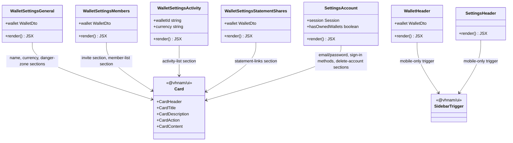

# Wallet Settings and Account Screens: Card-Based Layout Polish

## Requirements

Restructure the Wallet Settings screens (General, Members, Activity, Statement Shares) and the top-level Account settings screen onto a consistent `Card`-based visual layout — so every settings section reads as a distinct, scannable block instead of ad-hoc stacked divs — while exposing the sidebar trigger on mobile headers where it was previously unreachable.

## Entities

## Approach

1. **Layout Restructuring**:
   - Convert each wallet-settings screen's ad-hoc `
` section groupings into one `Card` per logical section (e.g. General splits into "Wallet name", "Currency", "Danger Zone" cards; Members splits into "Invite by email" and "Members" cards; Activity and Statement Shares each get a single card wrapping their list/empty/loading states).
   - Standardize each screen's top-level heading block to `flex flex-col gap-1 border-b pb-4` with a `text-2xl` (up from `text-xl`) `h1`, and the outer content wrapper to `flex flex-col gap-8` (up from `gap-6`), matching the pattern already established in `SettingsAppearance`.
   - Retire ad-hoc `Separator` and `Alert` usage inside these screens in favor of `Card` boundaries and plain `
` copy — consistent with the `alert.tsx`/`Separator`-avoidance direction taken elsewhere in this branch.

2. **Technical Implementation**:
   - Reuse the existing `@vhnam/ui` `Card`/`CardHeader`/`CardTitle`/`CardDescription`/`CardAction`/`CardContent` primitives already used by `SettingsAppearance` and `SettingsAccount`'s upper section — no new shared components are introduced.
   - Add `SidebarTrigger` (`@vhnam/ui/components/sidebar`) to both `WalletHeader` and `SettingsHeader`, rendered with `className="mr-2 md:hidden"` so the app sidebar becomes reachable from mobile headers that previously had no trigger at all (distinct from the Settings-section mobile-nav dropdown, which switches between settings _sections_, not the app sidebar).
   - No API/data-layer changes — this is presentation-only; existing hooks (`useWalletSettingsGeneralActions`, `useWalletSettingsMembersActions`, activity/statement-shares query hooks) are consumed unchanged.

3. **Business Logic**:
   - Preserve all existing conditional states (pending/error/empty/populated) per screen; only the DOM wrapper around each state changes (from bare fragments to `CardContent` children).
   - `WalletSettingsGeneral`'s Danger Zone card removes the `Alert`/`AlertAction` pattern (`alert.tsx`, being deleted repo-wide) in favor of a plain `CardContent` with descriptive text and an outlined destructive-styled button — behavior (confirmation dialog trigger) is unchanged, only presentation.
   - `SettingsAccount`'s email/password row drops the "Verified"/"Unverified" `Badge` and now always renders the email as plain text — a scope reduction that should be confirmed with the author (see Risks in the source analysis) since it removes previously user-visible verification status.

## Structure

### Inheritance Relationships

None — all changes are to existing function components' JSX composition; no new component hierarchies.

### Dependencies

1. `WalletSettingsGeneral`, `WalletSettingsMembers`, `WalletSettingsActivity`, `WalletSettingsStatementShares` newly depend on `@vhnam/ui/components/card` (`Card`, `CardHeader`, `CardTitle`, `CardDescription`, `CardAction`, `CardContent` as needed per screen).
2. `WalletSettingsGeneral` drops its dependency on `@vhnam/ui/components/alert`.
3. `WalletSettingsMembers` and `WalletSettingsStatementShares` drop their dependency on `@vhnam/ui/components/separator`.
4. `WalletHeader` and `SettingsHeader` newly depend on `@vhnam/ui/components/sidebar` (`SidebarTrigger`).
5. `WalletMembersInviteForm` no longer renders its own `FieldLabel` — the label is now supplied by the enclosing `CardTitle` in `WalletSettingsMembers`, so `FieldLabel` is dropped from its imports.

### Layered Architecture

1. **Route Layer**: `wallet-settings-*-route.tsx` files — unchanged, continue to fetch data and pass props into the view components below.
2. **View/Presentation Layer**: `WalletSettingsGeneral`, `WalletSettingsMembers`, `WalletSettingsActivity`, `WalletSettingsStatementShares`, `SettingsAccount` — restructured to compose `Card` sections; own no new state beyond what already existed.
3. **Shared UI Layer**: `@vhnam/ui`'s `Card` family and `SidebarTrigger` — reused, unmodified.
4. **Header Layer**: `WalletHeader`, `SettingsHeader` — gain a mobile-only `SidebarTrigger`, otherwise unchanged.

## Operations

### Update Component - `WalletSettingsGeneral`

1. Responsibility: Wallet name edit, currency display, and wallet deletion, each as a distinct card.
2. Structure:
   - Card 1 ("Wallet name"): `CardHeader` with `CardTitle` + `CardDescription` ("This is the display name for this wallet."), `CardContent` wrapping the existing `Form`/`FieldGroup` name-edit flow (unchanged field logic).
   - Card 2 ("Currency"): `CardHeader` with `CardTitle` + `CardDescription` ("This is the currency of this wallet."), `CardContent` with a disabled, read-only `Input` showing `wallet.currency`.
   - Card 3 ("Danger Zone"): `CardHeader` with `CardTitle` styled `text-destructive`, `CardContent` (`flex flex-col gap-4`) containing the existing deletion copy (`wallet.settings.general.delete.body`) as a plain `
` and a `Button` (`variant="outline"`, `className="text-destructive hover:text-destructive"`) that opens `DeleteWalletDialog` via `setOpenDeleteDialog(true)`.
3. Deletions: Remove `Alert`, `AlertAction`, `AlertDescription`, `AlertTitle` imports and usage entirely.
4. Constraints: The delete button's `onClick` must continue to call `setOpenDeleteDialog(true)` unchanged; `DeleteWalletDialog` itself is untouched.

### Update Component - `WalletSettingsMembers`

1. Responsibility: Invite-by-email form and member list, each as a distinct card.
2. Structure:
   - Card 1: `CardHeader`/`CardTitle` using the existing `wallet.settings.members.invite.label` message (moved from `WalletMembersInviteForm`'s internal `FieldLabel` to this card's title), `CardContent` wrapping `WalletMembersInviteForm` unchanged (props/behavior untouched).
   - Card 2: `CardHeader`/`CardTitle` using `wallet.settings.members.title`, `CardContent` with the pending spinner / member list (`ul.divide-y`) / pagination states, wrapped in `flex flex-col gap-4` when populated.
3. Deletions: Remove `Separator` import and usage (previously rendered between the invite form and the member list); the two-card boundary now provides that separation visually.
4. Constraints: `WalletMembersInviteForm` must not render a duplicate label — remove its internal `FieldLabel` now that the card supplies the section title.

### Update Component - `WalletSettingsActivity`

1. Responsibility: Wrap the activity list/pagination in a single card, replacing the bare heading + list.
2. Structure: One `Card` with `CardHeader`/`CardTitle` (`wallet.settings.activity.title`), `CardContent` containing the existing pending/error/empty/populated branches unchanged, with the populated branch's list+pagination wrapped in `flex flex-col gap-4`.
3. Constraints: Loading/error/empty message IDs and copy remain unchanged — only the wrapping markup changes.

### Update Component - `WalletSettingsStatementShares`

1. Responsibility: Wrap the statement-share list/pagination in a single card, with the "Share statement" action moved into the card header.
2. Structure: One `Card` with `CardHeader` containing `CardTitle` (`wallet.settings.shares.title`) and a `CardAction` holding the existing "Share statement" `Button` (now `size="sm"`, previously a standalone `w-fit` button above the list); `CardContent` containing the existing pending/populated/empty branches, populated branch wrapped in `flex flex-col gap-4`.
3. Deletions: Remove `Separator` import and usage.
4. Constraints: `ResponsiveDialog` for creating a new share remains a sibling of the `Card` (outside it, in the enclosing fragment) — unchanged.

### Update Component - `SettingsAccount`

1. Responsibility: Account-level settings — email/password, sign-in methods, delete-account — restructure the Delete Account section into a `Card` matching the pattern of the other cards on this screen (which already used `Card` prior to this branch).
2. Structure: "Delete account" section becomes a `Card` with `CardTitle` (`text-destructive`) in `CardHeader`, and `CardContent` (`flex flex-col gap-4`) containing the existing owned-wallets/hint copy branch and the delete-trigger `Button` (logic unchanged: `disabled={hasOwnedWallets}`, opens `setDeleteAccountDialogOpen(true)`).
3. Scope note requiring confirmation: The email/password row's verification `Badge` (`Verified`/`Unverified`, driven by `session.user.emailVerified`) is removed — the row now always renders plain email text. This is a behavior change (loss of visible verification status), not purely presentational; confirm with the author whether this was intentional before treating it as final. If not intentional, restore the `Badge` conditioned on `session?.user.emailVerified` as part of this task.
4. Constraints: `Badge` import removal must be reverted if the verification-status decision above is reversed.

### Update Component - `WalletHeader`

1. Responsibility: Add a mobile-reachable sidebar trigger to the per-wallet header.
2. Structure: Insert `<SidebarTrigger className="mr-2 md:hidden" />` as the first child inside the header's inner flex container, before the wallet name/amount block.
3. Constraints: Must only render/be interactive below the `md` breakpoint, matching `SettingsHeader`'s equivalent trigger and the app-wide convention that the desktop `AppSidebar`'s own trigger (`hidden md:block`, see the companion Settings/theme-transition prompt) is the desktop-only counterpart.

### Update Component - `SettingsHeader`

1. Responsibility: Add a mobile-reachable sidebar trigger to the settings header, symmetric with `WalletHeader`.
2. Structure: Insert `<SidebarTrigger className="mr-2 md:hidden" />` as the first child inside the header's inner flex container, before the "Settings" title block.

## Norms

1. **Section-as-Card**: Any settings screen (account-level or wallet-level) that groups related fields/actions under a heading must express that grouping as a `Card` (`CardHeader`/`CardTitle`/optional `CardDescription`/optional `CardAction` + `CardContent`), not a bare `div` with a manual `h1`/`h2` and `border-b`.
2. **Heading Scale**: Each settings screen's top-level page heading uses `border-b pb-4` wrapper with a `text-2xl font-semibold` `h1`; the outer section wrapper uses `flex flex-col gap-8`. Do not reintroduce `text-xl` page headings or `gap-6` wrappers in settings screens.
3. **No Ad-Hoc Separators Between Cards**: Visual separation between sibling sections comes from distinct `Card` boundaries, not `Separator` components — remove `Separator` usage when converting a screen to cards.
4. **Danger-Zone Styling**: Destructive sections use a `Card` with `CardTitle` styled `text-destructive` and an outline-variant `Button` styled `text-destructive hover:text-destructive` for the destructive action — not the (now-removed) `Alert` component.
5. **Mobile Sidebar Reachability**: Every top-level app header (wallet, settings, and any future section) must render a mobile-only (`md:hidden`) `SidebarTrigger` so the app sidebar is always reachable on small viewports, regardless of that section's own internal mobile navigation pattern.
6. **List/Loading/Empty States Stay Inside `CardContent`**: Pending spinners, error text, and empty-state copy for a card's list content render inside that card's `CardContent`, not as siblings of the `Card`.

## Safeguards

1. **Functional Constraints**: All existing data-loading states (pending, error, empty, populated) for Activity, Members, and Statement Shares must remain reachable and visually distinguishable after the card conversion — no state may be dropped.
2. **Behavioral Constraint (flagged)**: The removal of the email verification `Badge` in `SettingsAccount` must be explicitly confirmed as intentional before this task is considered complete; if unconfirmed or found unintentional, restore it using the existing `session?.user.emailVerified` condition.
3. **Integration Constraints**: No changes to `useWalletSettingsGeneralActions`, `useWalletSettingsMembersActions`, or any query/mutation hook signatures — this task is strictly presentational.
4. **Business Rule Constraints**: `WalletSettingsGeneral`'s delete button must remain `disabled` exactly when `hasOwnedWallets` is true for the account-level flow, and the wallet-level delete flow must continue to open `DeleteWalletDialog` unchanged.
5. **Component-Removal Constraint**: Confirm no other in-flight branch still imports `@vhnam/ui/components/alert` or `@vhnam/ui/components/separator` from these specific call sites before merging, since this task removes the last usages of `Alert` in wallet-settings (coordinate with the companion Settings/theme-transition prompt, which also tracks the repo-wide `alert`/`tabs` removal).
6. **Accessibility Constraints**: `SidebarTrigger` additions to `WalletHeader`/`SettingsHeader` must remain keyboard-focusable and carry the same accessible name/role as the existing `AppSidebar`-internal trigger; do not duplicate an active trigger on desktop (`md:hidden` must be preserved on both).
7. **API Constraints**: None — no network-facing contracts are touched by this task.
8. **Technical Constraints**: No new dependencies; only existing `@vhnam/ui` components (`Card` family, `SidebarTrigger`) may be introduced into these files.
