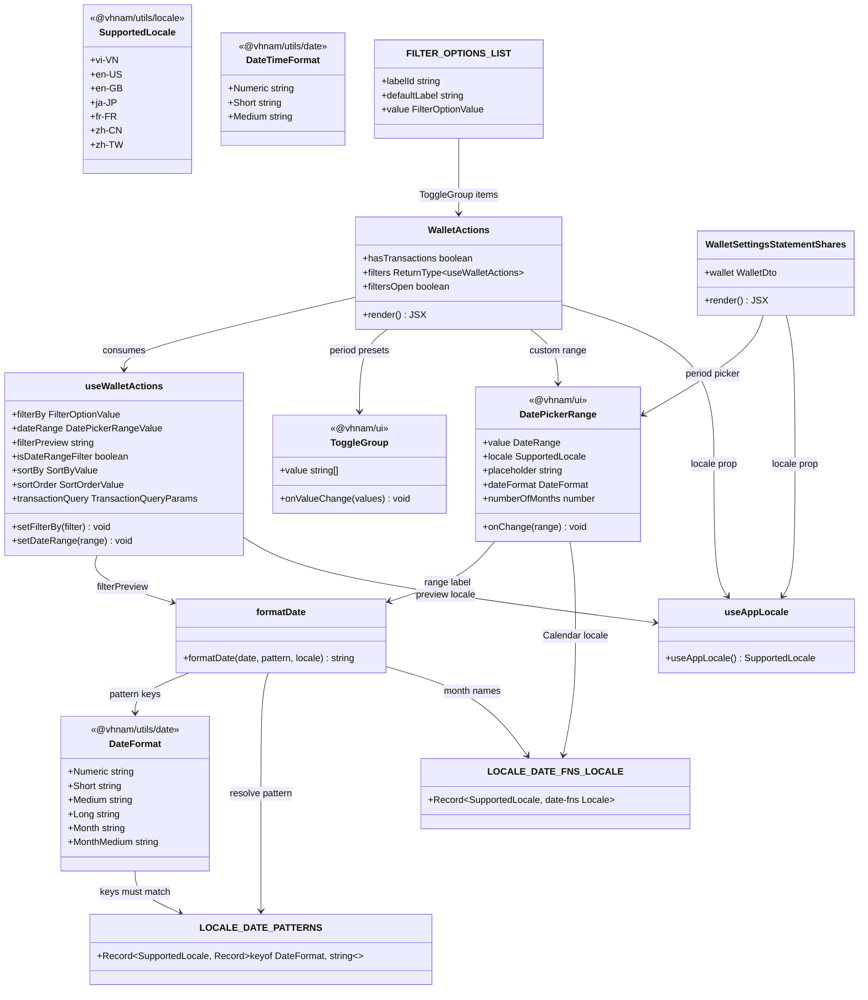

# Wallet Actions Filter UX & Locale-Aware Date Display

## Requirements

Polish the wallet-page filter experience so users can see and switch the active period at a glance, and ensure period previews and date-range calendars follow the signed-in user's locale — without changing transaction query contracts, wallet timezone resolution, or backend APIs.

## Entities

## Approach

1. **Filter UX restructuring**:
   - Replace the period `Select` with a single-select `ToggleGroup` over `FILTER_OPTIONS_LIST`, keeping sort-by / sort-order as `Select`s below a `Separator`.
   - Make the filter `Collapsible` controlled (`filtersOpen`) so the trigger can show caret rotation, active-period label, optional preview `Badge`, and a mild primary-tinted "filtered" style when `filterBy !== all-time`.
   - Keep URL search (`filter`, `from`, `to`, `sortBy`, `sortOrder`) as the source of truth via existing `useWalletActions` setters — UI only composes presentation.

2. **Locale-aware date display**:
   - Rename shared token `Text` → `Medium` on `DateFormat` / `DateTimeFormat` and add `MonthMedium` with a complete row in every `LOCALE_DATE_PATTERNS` entry.
   - Drive filter preview with `DateFormat.Medium` (Today) and `DateFormat.MonthMedium` (This/Last month) through `formatDate(..., locale)` using `useAppLocale()`.
   - Extend `DatePickerRange` with optional `locale?: SupportedLocale`: format the trigger label via `formatDate(..., locale)` and pass `LOCALE_DATE_FNS_LOCALE[locale]` into `Calendar`. App call sites (wallet actions + statement shares) thread `useAppLocale()`; Storybook may omit locale and keep prior defaults.

3. **Business logic**:
   - ToggleGroup must not allow an empty selection: take `values.at(-1)` and no-op if missing.
   - Locale changes reformat previews only; they must not rewrite search params or transaction queries.
   - Date-range still sends calendar `yyyy-MM-dd` strings; server timezone bounds (`resolvePeriodBounds`) stay untouched.
   - New copy (`wallet.actions.period`, `wallet.actions.dateRangePlaceholder`) lives in all seven message catalogs; `@vhnam/ui` receives already-translated placeholder strings from the app.

## Structure

### Inheritance Relationships

None — function components and pure utilities only; no new class hierarchies.

### Dependencies

1. `packages/utils/src/date/constants.ts` — owns `DateFormat`, `DateTimeFormat`, `LOCALE_DATE_PATTERNS`, `LOCALE_DATE_TIME_PATTERNS`, `LOCALE_DATE_FNS_LOCALE`.
2. `packages/utils/src/date/utils.ts` — `formatDate` / `formatDateTime` resolve pattern keys and apply date-fns locales (unchanged API shape aside from new/renamed tokens).
3. `packages/ui/src/components/date-picker-range.tsx` — depends on `@vhnam/utils/date` (`formatDate`, `DateFormat`, `LOCALE_DATE_FNS_LOCALE`) and `@vhnam/utils/locale` (`SupportedLocale` type only).
4. `wallet-actions.actions.tsx` — depends on `useAppLocale`, `formatDate`, `DateFormat`, filter/sort constants, route search helpers.
5. `wallet-actions.tsx` — depends on `useWalletActions` result, `ToggleGroup`, `Badge`, `Separator`, `DatePickerRange`, `useAppLocale`, react-intl.
6. `wallet-settings-statement-shares.tsx` — depends on `useAppLocale` + `DatePickerRange` locale prop.
7. Message catalogs under `packages/utils/src/i18n/messages/*.json` — receive new `wallet.actions.*` keys.

### Layered Architecture

1. **Shared utils layer** (`@vhnam/utils`): date format vocabulary and locale pattern tables.
2. **Shared UI layer** (`@vhnam/ui`): presentational `DatePickerRange` / `ToggleGroup` / `Badge` / `Separator` — no react-intl.
3. **App actions layer** (`useWalletActions`): URL search ↔ filter/sort state + locale-aware `filterPreview`.
4. **App view layer** (`WalletActions`, statement shares): compose controls, pass translated strings and locale.
5. **Route / query layer**: unchanged — search schema and transaction query params keep existing contracts.

## Operations

### Update Constants - `packages/utils/src/date/constants.ts`

1. Responsibility: Shared date/datetime format vocabulary and per-locale pattern tables.
2. Changes:
   - Rename `DateFormat.Text` → `DateFormat.Medium` (default pattern comment e.g. `d MMM yyyy`).
   - Add `DateFormat.MonthMedium` (default pattern e.g. `MMM yyyy`).
   - Rename `DateTimeFormat.Text` → `DateTimeFormat.Medium`.
   - Update every locale row in `LOCALE_DATE_PATTERNS` to use `Medium` instead of `Text` and add `MonthMedium` with locale-appropriate patterns (including CJK `yyyy'年'M'月'` style where already used for Medium).
   - Update every locale row in `LOCALE_DATE_TIME_PATTERNS` to use `Medium` instead of `Text`.
3. Constraints:
   - Every `SupportedLocale` must define every `keyof typeof DateFormat` / `DateTimeFormat` key.
   - Do not change numeric `Month` (`MM/yyyy`) patterns.
   - Leave `LOCALE_DATE_FNS_LOCALE` mapping intact.

### Update Tests - `packages/utils/src/date/utils.test.ts`

1. Responsibility: Lock Medium / MonthMedium locale formatting behavior.
2. Changes:
   - Replace any `DateTimeFormat.Text` assertion with `DateTimeFormat.Medium`.
   - Add coverage that `formatDate(..., DateFormat.Medium, 'en-US'|'en-GB')` and `formatDate(..., DateFormat.MonthMedium, 'en-US'|'ja-JP')` produce expected localized strings for a fixed sample date.
3. Constraints: Keep existing Numeric/Short/Long tests; do not weaken defaults.

### Update Component - `packages/ui/src/components/date-picker-range.tsx`

1. Responsibility: Locale-aware range label and calendar chrome without owning translations.
2. Attributes / props:
   - Add optional `locale?: SupportedLocale`.
3. Logic:
   - `formatRangeLabel(range, dateFormat, locale)` calls `formatDate(..., locale)` for `from` / `from–to`.
   - When `locale` is set, resolve `dayPickerLocale = LOCALE_DATE_FNS_LOCALE[locale]` and pass `locale={dayPickerLocale}` to `Calendar`.
   - When `locale` is omitted, preserve prior behavior (default `formatDate` locale; Calendar without explicit locale).
4. Constraints:
   - Do not import react-intl or app locale context.
   - Default `dateFormat` remains `DateFormat.Numeric`.
   - `#/` imports for UI internals; `@vhnam/utils/*` for utils.

### Update Hook - `useWalletActions` (`wallet-actions.actions.tsx`)

1. Responsibility: Derive locale-aware filter preview; keep search mutation behavior unchanged.
2. Logic for `filterPreview`:
   - `TODAY` → `formatDate(new Date(), DateFormat.Medium, locale)`
   - `THIS_MONTH` → `formatDate(new Date(), DateFormat.MonthMedium, locale)`
   - `LAST_MONTH` → `formatDate(subMonths(new Date(), 1), DateFormat.MonthMedium, locale)`
   - else → `null`
3. Dependencies: `useAppLocale()` already present; ensure `useMemo` deps include `locale`.
4. Constraints:
   - Do not change `setFilterBy` / `setDateRange` / `toTransactionQuery` / calendar-date ISO date encoding.
   - Do not pre-convert date-range bounds to timezone instants on the client.

### Update Component - `WalletActions` (`wallet-actions.tsx`)

1. Responsibility: Filter/sort toolbar UX on the wallet page.
2. State:
   - `filtersOpen: boolean` controlling `Collapsible`.
   - Derive `isFiltered = filterBy !== DEFAULT_FILTER_VALUE` and `activeFilter` from `FILTER_OPTIONS_LIST`.
3. Trigger:
   - Show active filter label when filtered; otherwise `wallet.actions.filter`.
   - Show `Badge` with `filterPreview` on `sm+` when preview exists.
   - Apply primary-tinted outline styles when `isFiltered`.
   - Rotate caret when `filtersOpen`.
4. Panel layout:
   - Card-like panel (`rounded-xl border bg-card`) with Period section (`wallet.actions.period`) + `ToggleGroup` of `FILTER_OPTIONS_LIST`.
   - ToggleGroup `value={[filterBy]}`; `onValueChange` takes last value and ignores empty.
   - When `isDateRangeFilter`, render `DatePickerRange` with `locale={locale}` and translated `wallet.actions.dateRangePlaceholder`.
   - Show muted `filterPreview` text under period controls when present.
   - `Separator`, then sort-by / order `Select`s (existing options).
5. Other:
   - Soften Transfer / Add transaction label visibility from `lg:block` to `sm:inline`.
6. Constraints:
   - Continue disabling filter trigger when `!hasTransactions`.
   - Do not move filter state out of URL search.
   - Pass translated placeholder into UI; do not hardcode English in `@vhnam/ui`.

### Update Component - `WalletSettingsStatementShares`

1. Responsibility: Keep statement-share period picker locale-consistent with wallet actions.
2. Changes:
   - `const locale = useAppLocale()`.
   - Pass `locale={locale}` to the create-dialog `DatePickerRange`.
3. Constraints: Do not change share create/revoke API payloads or period `yyyy-MM-dd` encoding.

### Update Catalogs - i18n message files

1. Responsibility: Catalog parity for new wallet action strings.
2. Add to all seven files (`en-US`, `en-GB`, `vi-VN`, `fr-FR`, `ja-JP`, `zh-CN`, `zh-TW`):
   - `wallet.actions.period`
   - `wallet.actions.dateRangePlaceholder`
3. Constraints: Keep existing `wallet.actions.*` and `filter.*` keys; brand name "Ledger Box" stays untranslated (not involved here).

### Verification

1. Grep the monorepo for residual `DateFormat.Text` / `DateTimeFormat.Text` — must be zero.
2. Run `vp check` and `vp test` (at least `@vhnam/utils` date tests).
3. Manually smoke: switch locale with Today/This month selected and confirm preview + calendar month names update without clearing the filter.

## Norms

1. **Imports**: App and UI source use `#/` for package-local imports; utils cross-package via `@vhnam/utils/...`. Never `@/` or deep relative climbs for those packages.
2. **i18n**: JSX copy via `FormattedMessage` / `useIntl().formatMessage`; message ids in all seven catalogs. Do not put `react-intl` inside `@vhnam/ui` — pass translated props.
3. **Locale plumbing**: App reads `useAppLocale()`; shared UI accepts optional `SupportedLocale` and maps through `@vhnam/utils/date` helpers only.
4. **Date formatting**: Always use `DateFormat` / `DateTimeFormat` tokens + `formatDate` / `formatDateTime`; never invent one-off pattern strings in feature UI for locale-sensitive display.
5. **Design system**: Prefer existing `@vhnam/ui` primitives (`ToggleGroup`, `Badge`, `Separator`, `Button`, `Icon`, `Field`). Stay on Tailwind spacing scale; no new arbitrary bracket values; no static `style={{...}}` for layout cosmetics (ToggleGroup's existing CSS variable gap wiring is upstream and untouched).
6. **State ownership**: URL search remains canonical for filters/sort; local React state is only for ephemeral UI (`filtersOpen`, dialogs).
7. **Money / tenancy**: Out of scope — do not touch balance mutations, tenancy scoping, or transaction write paths.
8. **Validation**: No new Valibot schemas; reuse `resolveWalletTransactionSearch`.

## Safeguards

1. **Functional constraints**:
   - No API route, migration, or transaction-query contract changes.
   - Filter ToggleGroup cannot clear to an empty/undefined period.
   - Date-range picker visible only when `filter === date-range`.
   - Leaving date-range still clears `from`/`to` via existing `setFilterBy` behavior.
2. **Locale constraints**:
   - Filter preview and DatePickerRange labels/calendar must use the same `SupportedLocale` when provided.
   - Changing locale must not reset or mutate filter/sort search params.
3. **Data constraints**:
   - Client date-range values remain calendar `yyyy-MM-dd`; server resolves wallet-timezone bounds.
   - Incomplete ranges (only `from`) continue to follow existing `toDateRange` rules (both required to hydrate controlled value).
4. **Compatibility constraints**:
   - Omitting `DatePickerRange.locale` preserves previous default formatting/calendar behavior (Storybook, any unmigrated callers).
   - `DateFormat.Month` numeric patterns remain available and unchanged.
5. **i18n constraints**:
   - New keys present in all seven catalogs before merge.
   - UI package must not embed translated string literals for Period / Choose dates.
6. **UX constraints**:
   - Filter trigger disabled when `hasTransactions` is false.
   - Active-filter affordance applies only when filter ≠ `all-time`.
   - Long labels truncate on the trigger (`max-w-64`) / badge (`max-w-28`) rather than blowing the toolbar layout.
7. **Quality constraints**:
   - Zero remaining `Text` format-token references.
   - `vp check` and date util tests pass.
8. **Out of scope (do not implement in this change)**:
   - Auto-expanding the filter panel when a non-default filter is active.
   - Showing a closed-trigger badge for custom date-range `from–to`.
   - Storybook locale variant stories for `DatePickerRange` (optional follow-up).
   - Backend or public-statement locale behavior changes.
