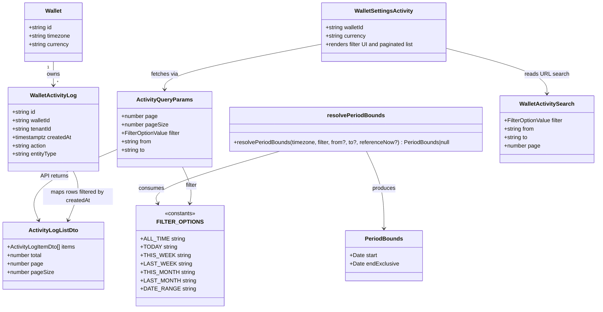

# Activity Log Date Filter

## Requirements

Enable wallet owners to narrow the activity audit trail to a calendar period so they can answer “what changed in this window?” without paging through all history — filtering by when actions were logged, with server-side pagination and totals that match the selected window.

## Entities

## Approach

1. Period resolution (shared calendar truth):
   - Extend shared `FILTER_OPTIONS` with `this-week` and `last-week` (Monday-start ISO weeks in the wallet timezone).
   - Extend `resolvePeriodBounds` to compute half-open `[start, endExclusive)` week windows using the same zoned wall-time helpers as day/month presets.
   - Keep `last-month` as the value for “previous month”; UI label stays `filter.lastMonth` (“Last month”). Week labels: “This week” / “Last week”.
   - Do **not** add week presets to the transaction-page `FILTER_OPTIONS_LIST` in this change — only Activity exposes the full preset set via an activity-specific list that includes all-time + the six required windows.

2. API / query path:
   - Extend `GET /api/wallets/:walletId/activity` to accept `filter`, `from`, `to` (same semantics as transactions/summary).
   - Resolve bounds with `ownership.wallet.timezone`; when bounds are non-null, apply `createdAt >= start AND createdAt < endExclusive` on both items and count queries.
   - Keep `requireOwnedWallet`; default missing/unknown filter to all-time (null bounds). Incomplete date-range (`from`/`to` missing) keeps null bounds (all-time) for parity with transactions.
   - Client: pass filter params from `fetchWalletActivity`; include filter identity in React Query key; reset page to 1 on filter change.

3. UI / product rules:
   - Activity settings page: period control (ToggleGroup or Select consistent with wallet-actions density) + conditional `DatePickerRange` for date-range; show result count for the filtered set; empty state when no rows match.
   - Persist filter in activity route URL search (`filter`, `from`, `to`, `page`) so refresh restores the window.
   - Filter applies to log `created_at` only — never nested transaction `occurredAt` in before/after JSON.

## Structure

### Inheritance Relationships

1. No new class hierarchy — extend existing constants, pure functions, Netlify handler, TanStack Query helpers, and React modules.
2. Activity search schema mirrors `walletTransactionSearchSchema` shape (filter/from/to/page) without sort fields.

### Dependencies

1. `wallet-activity.mts` calls `resolvePeriodBounds` and applies bounds to Kysely queries on `walletActivityLog.createdAt`.
2. `fetchWalletActivity` / `useWalletActivity` accept `ActivityQueryParams` and key the query by wallet + page + filter + from + to.
3. Activity route `validateSearch` uses a Valibot activity search schema; `WalletSettingsActivity` reads search via route API and updates navigate search on filter/page changes.
4. `WalletSettingsActivity` renders filter controls using `@vhnam/ui` (`ToggleGroup` / `DatePickerRange`) and existing `AppPagination` / `WalletEmpty`.
5. i18n catalogs under `packages/utils/src/i18n/messages/*.json` gain `filter.thisWeek` and `filter.lastWeek` (and any activity-specific copy if needed).

### Layered Architecture

1. Constants / utils: `filter-options.ts`, `period-bounds.ts` (+ tests) — shared period vocabulary and bound math.
2. API layer: `wallet-activity.mts` — auth, owner check, param parse, filtered list/count.
3. Client data layer: `activity.api.ts`, `activity.queries.ts`, optional `activity.params.ts`.
4. Route / search: `settings/activity.tsx` (+ schema) — URL search validation.
5. UI module: `wallet-settings-activity*.tsx` — filter chrome + list.

## Operations

### Update Constants - `FILTER_OPTIONS` / activity filter list

1. Responsibility: Add week presets to the shared vocabulary; expose an activity-facing option list with the required presets plus all-time.
2. File: `apps/ledger-box/src/constants/filter-options.ts`
3. Changes:
   - Add `THIS_WEEK: 'this-week'` and `LAST_WEEK: 'last-week'` to `FILTER_OPTIONS`.
   - Keep existing `FILTER_OPTIONS_LIST` for the transaction wallet page **unchanged** (no week chips there in this task).
   - Add `ACTIVITY_FILTER_OPTIONS_LIST` ordered: all-time, today, this-week, last-week, this-month, last-month, date-range — each with `labelId` / `defaultLabel` / `value`.
4. Constraints: Values must be stable query-param strings; types `FilterOptionValue` must include the new keys.

### Update Utility - `resolvePeriodBounds` week windows

1. Responsibility: Resolve Monday-start week presets to half-open UTC bounds in `timezone`.
2. File: `apps/ledger-box/src/utils/wallet/period-bounds.ts`
3. Logic for `THIS_WEEK`:
   - Get zoned Y-M-D of `referenceNow`.
   - Compute Monday of that week (ISO: Monday = start; Sunday belongs to the week that started the prior Monday).
   - `start` = start-of-day Monday; `endExclusive` = start-of-day Monday + 7 days.
4. Logic for `LAST_WEEK`:
   - Same Monday as this week, then subtract 7 days for start; `endExclusive` = this week’s Monday start.
5. Reuse existing `startOfDayUtc` / `addDaysToParts` / `getZonedDateParts` helpers; do not introduce a second timezone engine.
6. Tests in `period-bounds.test.ts`:
   - Mid-week reference (e.g. Wednesday) → this-week Mon–next Mon.
   - Sunday reference still belongs to the week that started the previous Monday.
   - Last-week is the immediately preceding 7-day window.
   - Non-UTC timezone (e.g. `Asia/Ho_Chi_Minh`) produces correct UTC instants at local midnight.
7. Constraints: Bounds remain half-open; never use `<= end`.

### Update Netlify Handler - `wallet-activity.mts`

1. Responsibility: Accept period query params and filter list/count by `createdAt`.
2. File: `apps/ledger-box/netlify/functions/wallet-activity.mts`
3. Logic:
   - After `requireOwnedWallet`, parse `filter` (default `FILTER_OPTIONS.ALL_TIME`), `from`, `to`.
   - `bounds = resolvePeriodBounds(ownership.wallet.timezone, filter, from ?? undefined, to ?? undefined)`.
   - If `bounds`, add `.where('createdAt', '>=', bounds.start).where('createdAt', '<', bounds.endExclusive)` to both item and count queries.
   - Preserve order `createdAt desc`, pagination, statement-share overlap enrichment, and JSON response shape.
4. Constraints: Keep `requireOwnedWallet` (do not switch to `requireWalletAccess`). Do not mutate log rows. No new migration.

### Update Client Query Layer - activity fetch / hooks

1. Responsibility: Forward filter params and cache by full filter identity.
2. Files: `activity.api.ts`, `activity.queries.ts`; add `activity.params.ts` if helpful (mirror `transaction.params.ts`).
3. `fetchWalletActivity(walletId, params: { page, pageSize?, filter?, from?, to? })`:
   - Axios `params` include only defined filter fields; for `DATE_RANGE` send `from`/`to` as `yyyy-MM-dd` calendar dates (no client-side timezone conversion).
4. `useWalletActivity(walletId, params, enabled)`:
   - `queryKey: ['activity', walletId, page, filter, from, to]` (or equivalent stable object).
   - `queryFn` calls `fetchWalletActivity` with those params.
5. Constraints: Default filter when omitted is all-time behavior compatible with today’s callers.

### Create Schema + Route Search - activity settings URL state

1. Responsibility: Persist activity filter/page in the URL.
2. Files:
   - New `apps/ledger-box/src/schemas/wallet-activity-search.schema.ts` (Valibot: optional `filter` picklist of `FILTER_OPTIONS` values, optional `from`/`to` isoDate, optional `page`).
   - `resolveWalletActivitySearch` defaults: `filter = ALL_TIME`, `page = 1`, clear `from`/`to` unless filter is date-range.
   - Update `apps/ledger-box/src/routes/_app/wallets/$walletId/settings/activity.tsx` with `validateSearch` using the schema (same pattern as wallet index transaction search).
3. Constraints: Invalid/unknown filter values fall back to all-time; page min 1.

### Update UI Module - `WalletSettingsActivity` filter chrome

1. Responsibility: Let owners pick a period and load the filtered paginated list.
2. Files: `wallet-settings-activity.tsx` (+ thin actions hook if useful, e.g. `wallet-settings-activity.actions.tsx` mirroring `useWalletActions`).
3. Behavior:
   - Read/write search via activity route API (`filter`, `from`, `to`, `page`).
   - Render period control above the list using `ACTIVITY_FILTER_OPTIONS_LIST` + `DatePickerRange` when date-range selected (`locale` from `useAppLocale`).
   - Optional short `filterPreview` for today/this-month/last-month/weeks (locale-aware `formatDate`), matching wallet-actions polish patterns.
   - On filter or date-range change: set search, clear opposite params when leaving date-range, reset `page` to undefined/1.
   - Pass resolved query params into `useWalletActivity`; keep existing row rendering, pagination, skeletons, error, and `WalletEmpty` for zero items.
4. Pass `timezone` only if needed for display — bounds stay server-side; client sends calendar dates only.
5. Constraints: Presentational strings via `react-intl`; do not put intl inside `@vhnam/ui`.

### Update i18n Catalogs

1. Responsibility: Add week preset labels in all supported locales.
2. Files: `packages/utils/src/i18n/messages/{en-US,en-GB,vi-VN,fr-FR,ja-JP,zh-CN,zh-TW}.json`
3. Keys:
   - `filter.thisWeek` — default “This week”
   - `filter.lastWeek` — default “Last week”
4. Constraints: Keep brand name “Ledger Box” untranslated; reuse existing `filter.today` / `filter.thisMonth` / `filter.lastMonth` / `filter.dateRange` / `filter.allTime`.

### Verify

1. Run `vp check` and `vp test` (at least `period-bounds` tests and any new activity handler tests if added).
2. Manually sanity-check: all-time default; each preset returns plausible windows; date-range with both ends; empty period; page resets on filter change; non-owner still redirected away from activity.

## Norms

1. Imports: use `#/` in app/UI source; Netlify handlers import app utils via `#/utils/...` / `#/constants/...` as existing activity/transaction handlers do.
2. Period math: only via `resolvePeriodBounds` — no ad-hoc `Date` local-timezone filtering in the UI or handler.
3. API errors: keep coded JSON via existing `ApiErrors` / `apiError`; no new plain-text error bodies.
4. Forms/search: Valibot schemas in `apps/ledger-box/src/schemas/`; TanStack Router `validateSearch` for URL state.
5. UI strings: `react-intl` + catalogs in `packages/utils`; pass translated props into UI primitives.
6. Query invalidation: activity list is read-only for this feature; ensure query keys include filter so cache does not cross-contaminate periods.
7. Money/tenancy: no balance writes; keep owner-only activity read; do not soft-delete or edit log rows.
8. Styling: reuse existing settings/wallet-actions density (ToggleGroup, border card optional); no new arbitrary color tokens.

## Safeguards

1. Functional Constraints:
   - Filters supported: today, this week, last week, this month, last month, date range, plus all-time default.
   - Predicate column is `wallet_activity_log.created_at` only.
   - Weeks are Monday-start (ISO) in the wallet timezone.
   - Transaction wallet-page filter chips do not gain week options in this change.
2. Performance Constraints:
   - Rely on existing `(wallet_id, created_at desc)` index; no new migration required for filtering.
   - Page size remains capped (existing max 100).
3. Security Constraints:
   - Activity endpoint remains `requireOwnedWallet`; filtering must not broaden access to managers/viewers.
   - Do not trust client-supplied timezone; use wallet row timezone from ownership check.
4. Integration Constraints:
   - Response DTO shape (`items`, `total`, `page`, `pageSize`) unchanged aside from filtered contents/totals.
   - Incomplete date-range without both `from` and `to` behaves as all-time (null bounds), matching transactions.
5. Business Rule Constraints:
   - Append-only log integrity unchanged (read-path only).
   - Changing filter resets pagination to page 1.
   - Empty filtered results use existing empty/error UI paths, not a hard failure.
6. Exception Handling Constraints:
   - Unauthorized / not-owner / method errors stay on existing API error helpers.
   - Invalid filter strings degrade to all-time rather than 500.
7. Technical Constraints:
   - Half-open intervals only (`>= start`, `< endExclusive`).
   - Calendar `from`/`to` are `yyyy-MM-dd`; server resolves instants.
   - No client-side filtering of paginated pages as a substitute for API bounds.
8. Data Constraints:
   - `from`/`to` optional iso dates; when present with date-range, both required for a non-null bound.
   - DatePickerRange should not allow inverted ranges (follow existing picker behavior).
9. API Constraints:
   - Query params: `filter`, `from`, `to`, `page`, `pageSize`.
   - Default `filter=all-time` when omitted.
   - Path remains `GET /api/wallets/:walletId/activity`.
