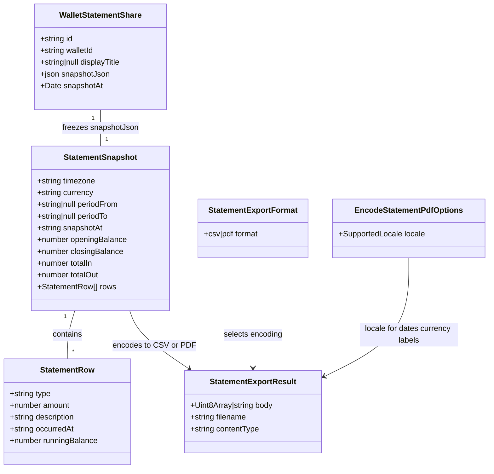

# Statement PDF Export

## Requirements

Let a wallet owner and a statement-share link recipient download a human-readable, printable PDF of the same statement snapshot already available as CSV and on-screen view — without recomputing balances outside the existing statement builder, and without removing or regressing CSV export.

## Entities

## Approach

1. **Second encoder, same snapshot pipeline**:
   - Add `encodeStatementPdf` beside the existing `encodeStatementCsv` in `apps/ledger-box/src/utils/wallet/statement-export.ts` (or a sibling `statement-export-pdf.ts` if the PDF dependency should not load on CSV-only unit paths — prefer one module unless bundle splitting requires a split).
   - PDF must consume `StatementSnapshot` (+ optional `displayTitle` + locale) only. Never call `buildStatement` from the encoder. Frozen vs fresh remains a handler concern, identical to CSV.

2. **Extend `format` across all three existing surfaces** (mirror CSV coverage; do not narrow):
   - Public: `GET /api/public/statements/:token?format=pdf` — frozen `snapshotJson`, after existing token / revoke / expiry / rate-limit checks.
   - Owner fresh period: `POST /api/wallets/:walletId/statement-shares?preview=true&format=pdf` — fresh `buildStatement`, never persist a share.
   - Owner existing share: `GET /api/wallets/:walletId/statement-shares/:shareId/export?format=pdf` — make this route format-aware; **default omitted `format` to `csv`** so existing “Download” links keep working.

3. **Programmatic PDF via `pdfkit` + embedded Unicode font** (not Chromium, not client-only):
   - Add `pdfkit` (and `@types/pdfkit` as needed) to `@vhnam/ledger-box`, catalog-pinned in `pnpm-workspace.yaml` like other deps.
   - Vendor a **Noto Sans** TTF (Regular + Bold) under e.g. `apps/ledger-box/assets/fonts/` that covers Latin Extended (Vietnamese, French). Register those fonts with pdfkit; do not rely on Helvetica (breaks diacritics in descriptions and titles).
   - **CJK label limitation (explicit v1 trade-off)**: for `ja-JP` / `zh-CN` / `zh-TW`, format dates and amounts in the viewer locale, but render PDF chrome labels (column headers, “Opening”, etc.) via `en-US` message strings so missing CJK glyphs are not shipped as multi‑MB fonts in the Function bundle. Revisit CJK font packaging as a follow-up if needed. `vi-VN` / `fr-FR` / `en-*` use full localized chrome via `createServerIntl`.

4. **Layout intent — mirror `StatementSnapshotView`, not CSV**:
   - Title (`displayTitle` or “Account statement”), period + timezone, generated-at.
   - Summary block: opening, closing, total in, total out — summary metadata, never synthetic transaction rows.
   - Table / row list: date, description, signed amount, running balance (type may be implied by sign or shown as a small label).
   - Multi-page: repeat a compact header or column headers on subsequent pages; empty periods still produce a valid PDF with the empty-state message.
   - Amounts: `formatCurrency` / `formatSignedCurrency` from `@vhnam/utils/currency` with `{ currency: snapshot.currency, locale, notation: 'standard' }` — **never** VND compact (“1.2tr”) in the PDF.
   - Dates: `Intl.DateTimeFormat(locale, { dateStyle: 'medium', timeZone: snapshot.timezone })` for row/period dates; generated-at may include short time, matching the on-screen view.

5. **Locale resolution**:
   - All three handlers resolve locale with `parseAcceptLanguage(request.headers.get('accept-language'))` (already used on the public CSV path). Pass into `encodeStatementPdf`.
   - Document chrome strings: `createServerIntl(effectiveLabelLocale)` where `effectiveLabelLocale` is `en-US` for CJK locales (per trade-off above) and the parsed locale otherwise.
   - Add message ids under `statement.export.pdf.*` (and reuse existing `statement.snapshot.*` ids where the English default already matches) in all seven catalogs.

6. **UI — labeled download chooser on every CSV surface**:
   - Replace single CSV-only controls with a `DropdownMenu` (“Download”) containing **Download CSV** and **Download PDF**, using `@vhnam/ui` `DropdownMenu*` (same pattern as `app-sidebar-user.tsx`).
   - Surfaces: public statement page, create/preview dialog, share list row.
   - Public + share-row PDF: plain `<a href="...?format=pdf">` (GET).
   - Preview-dialog PDF: blob download via axios POST (`preview=true&format=pdf`), parallel to existing `downloadStatementPreviewCsv` — generalize to `downloadStatementPreviewExport(walletId, payload, format)`.

7. **No activity log, no R2 storage, no new DB columns** — on-demand generation from the same snapshot source as CSV; reads stay unlogged except existing public `accessCount` / rate-window updates.

## Structure

### Inheritance Relationships

1. No new classes — plain functions and Netlify handlers, matching `statement-export.ts` and existing share handlers.
2. No new Valibot schema for `format` — remains a response-representation query param read via `URLSearchParams`.

### Dependencies

1. `encodeStatementPdf` depends on `pdfkit`, vendored Noto Sans fonts, `StatementSnapshot`, `@vhnam/utils/currency` formatters, and `createServerIntl` (or an equivalent label helper that handlers pass pre-built label strings — prefer encoder accepting `locale` and calling `createServerIntl` internally only if that import stays server-safe; if bundling `react-intl` into a shared util is undesirable, pass a `labels: StatementPdfLabels` object built in the handler via `createServerIntl`).
2. `public-statement.mts`, `wallet-statement-shares.mts`, and `wallet-statement-share-export.mts` call the PDF encoder when `format === 'pdf'`, after existing auth/access checks.
3. UI modules depend on existing statement-share API helpers extended for PDF blob download; share-row and public page use anchors with `?format=pdf`.
4. CSV encoder and CSV behavior remain untouched except shared filename-helper generalization if extracted.

### Layered Architecture

1. **Handler layer**: format branch after auth/token/tenancy; set `Content-Type: application/pdf` and `Content-Disposition: attachment`.
2. **Export util layer**: CSV + PDF encoders; shared filename sanitization.
3. **Domain layer**: `buildStatement` unchanged.
4. **UI layer**: download dropdowns + preview blob helper for PDF.
5. **i18n layer**: message catalogs + server intl for PDF chrome (with CJK→en-US chrome rule).

## Operations

### Add Dependency - `pdfkit` (+ types) and vendor fonts

1. Responsibility: Make programmatic PDF generation available inside Netlify Functions without Chromium.
2. Steps:
   - Catalog-pin `pdfkit` (and `@types/pdfkit` if required) in `pnpm-workspace.yaml`; add to `apps/ledger-box/package.json` dependencies / devDependencies.
   - Vendor `NotoSans-Regular.ttf` and `NotoSans-Bold.ttf` (OFL) under `apps/ledger-box/assets/fonts/` (or `netlify/functions/assets/fonts/` if Function bundling cannot resolve outside `netlify/` — choose the path that the Netlify bundler actually includes; verify with a smoke download in local `netlify dev`).
   - Document font license attribution in the MR changelog if required by OFL redistribution norms used elsewhere in the repo (if none exist, a one-line note in the MR changelog is enough).
3. Constraints: Do not add Puppeteer, Playwright-as-PDF, or `@react-pdf/renderer` for this feature.

### Update Module - `apps/ledger-box/src/utils/wallet/statement-export.ts` (and tests)

1. Responsibility: Add PDF encoding and format-aware filenames; keep CSV behavior identical.
2. Functions:
   - `buildStatementExportFilename(snapshot, walletName, format: 'csv' | 'pdf'): string`
     - Logic: reuse existing sanitize + period + `snapshotAt` timestamp rules from `buildStatementCsvFilename`; change only the extension (`.csv` / `.pdf`). Keep `buildStatementCsvFilename` as a thin wrapper calling this with `'csv'` for backward compatibility, or update all call sites to the generalized helper.
   - `encodeStatementPdf(snapshot, displayTitle, options: { locale: SupportedLocale }): Promise<Uint8Array>` (or sync `Buffer` if pdfkit buffers synchronously end-to-end)
     - Logic:
       - Resolve `labelLocale`: if `locale` is `ja-JP` | `zh-CN` | `zh-TW`, use `en-US` for chrome labels; otherwise use `locale`.
       - Build labels via `createServerIntl(labelLocale)` / catalog ids (`statement.export.pdf.titleFallback`, column headers, summary labels, empty state) — or accept prebuilt labels from the handler if intl must stay out of the util.
       - Create a pdfkit document (A4), register Noto Sans Regular/Bold from the vendored files via `fs.readFileSync` / `path` relative to a stable module URL (`import.meta.url`) so it works in the Function bundle.
       - Draw title, period line (`periodFrom`–`periodTo` in `snapshot.timezone` + timezone id, or all-time label), generated-at line.
       - Draw summary amounts with `formatCurrency(..., { notation: 'standard', currency: snapshot.currency, locale })`.
       - Draw rows with wrapped description text; paginate when `y` exceeds bottom margin; on new pages redraw column header row.
       - On empty `rows`, draw the empty-state sentence instead of a table body.
       - Collect PDF bytes (`doc.pipe` to buffers / `getBuffer` pattern) and return `Uint8Array`.
   - Do **not** change `encodeStatementCsv` semantics.
3. Constraints: Encoder performs no DB/HTTP; unit tests cover BOM-free PDF magic (`%PDF`), presence of title/period for a fixture snapshot, empty-period PDF still starts with `%PDF`, and filename `.pdf` suffix. Vietnamese diacritics in `displayTitle` / `description` must not throw (font path smoke-tested).

### Update Handler - `apps/ledger-box/netlify/functions/public-statement.mts`

1. Responsibility: Add `format=pdf` beside existing `format=csv` without changing auth/rate-limit order.
2. Logic:
   - After access counters / rate window update (unchanged), branch:
     - `format === 'csv'`: existing CSV response.
     - `format === 'pdf'`: `encodeStatementPdf(snapshot, share.displayTitle, { locale: parseAcceptLanguage(...) })`, filename via `buildStatementExportFilename(..., 'pdf')`, respond with `Content-Type: application/pdf` and `Content-Disposition: attachment; filename="..."`.
     - else: existing JSON.
3. Constraints: PDF branch must not skip revoke/expiry/429 checks; same shared rate budget as JSON/CSV.

### Update Handler - `apps/ledger-box/netlify/functions/wallet-statement-shares.mts`

1. Responsibility: Add `preview=true&format=pdf` parallel to CSV.
2. Logic:
   - Inside existing `preview === 'true'` block: if `format === 'pdf'`, return PDF attachment from the fresh `snapshot` and `wallet.name` for filename; do not persist.
   - `format=pdf` without `preview=true` is unsupported (fall through to existing create-share JSON behavior).
3. Constraints: Never insert a `walletStatementShare` row when returning a PDF body.

### Update Handler - `apps/ledger-box/netlify/functions/wallet-statement-share-export.mts`

1. Responsibility: Make export format-aware while preserving CSV as the default.
2. Logic:
   - Read `format` from query (`csv` | `pdf`); treat `null`/unknown as `csv`.
   - Keep existing session + `requireOwnedWallet` + share lookup (still allow revoked/expired for owner archive).
   - Branch encoder + Content-Type / filename extension accordingly.
3. Constraints: Existing clients hitting `/export` without a query string must still receive CSV.

### Update API client - `statement-share.api.ts` / `statement-share.mutations.ts`

1. Responsibility: Support preview PDF blob download.
2. Logic:
   - Generalize `downloadStatementPreviewCsv` into `downloadStatementPreviewExport(walletId, payload, format: 'csv' | 'pdf')` posting to `?preview=true&format=${format}` with `responseType: 'blob'`, parsing `Content-Disposition` filename (fallback `statement.csv` / `statement.pdf`).
   - Keep a `downloadStatementPreviewCsv` wrapper or update the single mutation hook to accept format.
   - Add `useDownloadStatementPreviewExport` (or extend the existing hook) used by the dialog actions.

### Update UI - public page, share row, create/preview dialog

1. Responsibility: Offer PDF wherever CSV download exists today.
2. Logic:
   - `statement-public-page.tsx`: replace lone CSV anchor with `DropdownMenu` — items link to `?format=csv` and `?format=pdf`.
   - `wallet-statement-share-row.tsx`: replace single Download anchor with dropdown — CSV → `/export` or `/export?format=csv`; PDF → `/export?format=pdf`.
   - `wallet-settings-statement-shares.tsx` + `.actions.tsx`: replace “Download CSV” button with a Download dropdown; CSV keeps current blob flow; PDF calls the generalized preview export with `'pdf'`. Disable while download pending.
3. Constraints: Use `FormattedMessage` / `formatMessage` for all new strings; add keys to all seven locale JSON files. Do not put `react-intl` inside `@vhnam/ui`.

### Update i18n catalogs

1. Add UI ids e.g. `statement.public.download`, `statement.public.downloadPdf`, `wallet.settings.shares.dialog.download`, `wallet.settings.shares.dialog.downloadPdf`, `wallet.settings.shares.row.downloadPdf` (keep existing CSV ids).
2. Add PDF chrome ids under `statement.export.pdf.*` as needed (title fallback, column headers if not reusing `statement.snapshot.*`).
3. Translate all seven catalogs (`en-US`, `en-GB`, `vi-VN`, `fr-FR`, `ja-JP`, `zh-CN`, `zh-TW`).

### Tests

1. Extend `statement-export.test.ts` (or add `statement-export-pdf.test.ts`) for PDF encoder + filename.
2. No new DB migration tests — schema unchanged.
3. Run `vp check` and `vp test` before considering done.

## Norms

1. **Format branch last**: `format=pdf` / `format=csv` only after auth, ownership, token, revoke, expiry, and rate-limit logic — never a parallel insecure path.
2. **One snapshot source of truth**: PDF and CSV for the same share must encode the same `snapshotJson`; preview PDF must use the same `buildStatement` result as preview JSON.
3. **No Helvetica for user text**: always register the vendored Noto Sans fonts before writing title, description, or localized labels that may include Vietnamese.
4. **Standard currency notation in PDF**: always pass `notation: 'standard'` into `formatCurrency` / `formatSignedCurrency` for PDF cells.
5. **CSV regression bar**: existing CSV responses, filenames, and UI CSV paths must keep working; owner `/export` without `format` remains CSV.
6. **Imports**: `#/` for app modules; `./lib/...` for Netlify co-located helpers; catalog messages only in `packages/utils/src/i18n/messages/`.
7. **No activity logging** for PDF downloads (same as CSV).
8. **DropdownMenu** from `@vhnam/ui` for multi-format download affordances — do not invent a one-off menu.

## Safeguards

1. **Functional Constraints**: PDF support is additive. Omitting `format` on public/preview routes keeps today’s JSON behavior; omitting `format` on owner `/export` keeps CSV. CSV encoding and formula-injection guards remain unchanged.
2. **Performance Constraints**: PDF generation is in-memory from an already-loaded snapshot — no extra statement queries. Multi-page layout must work for large row counts inherited from unpaginated `buildStatement`; do not introduce a new hard row cap in this pass. Prefer streaming/buffer collection that stays within Netlify’s synchronous response limits for typical monthly statements; if generation throws, return a coded `apiError` rather than a partial body.
3. **Security Constraints**: Owner PDF export requires `requireOwnedWallet` before share lookup. Public PDF uses the same token hash + 404/410/429 semantics as JSON/CSV. Do not log or return the raw share token in PDF metadata.
4. **Integration Constraints**: Public PDF consumes the same per-share 60/min rate budget. Do not store PDFs in R2.
5. **Business Rule Constraints**: Existing-share / public PDF = frozen snapshot only. Preview PDF = fresh `buildStatement` only and never persists a share. Summary balances are header/summary content, not fake ledger rows.
6. **i18n / Font Constraints**: Latin-script locales get localized PDF chrome; CJK locales get locale-correct numbers/dates with `en-US` chrome labels in v1. Free-text descriptions still render when glyphs exist in Noto Sans; uncovered glyphs must not crash generation.
7. **API Constraints**: `format` values recognized for file export are `csv` and `pdf` only. Preview file export requires `preview=true`. Content types: `text/csv; charset=utf-8` vs `application/pdf`.
8. **Filename Constraints**: PDF filenames follow the same sanitize + period + `snapshotAt` rules as CSV, with `.pdf` extension.
9. **Dependency Constraints**: No headless browser PDF path in v1. Fonts must be bundled with the Function so generation works offline in the Function runtime without outbound font downloads.
