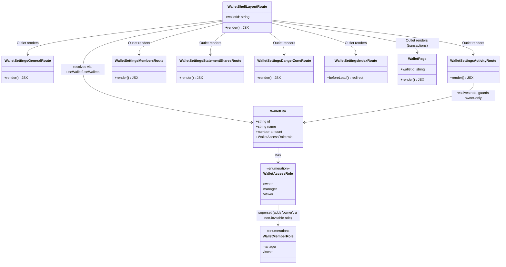

# Split Wallet Settings into Per-Section Routes

## Requirements

Convert the single scrollable wallet settings page into five independently
deep-linkable, tab-navigated routes — general, activity, members, statement shares,
danger zone — without changing any section's data, mutations, or the server-side access
rules that already govern them, so each settings area can be linked to, bookmarked, and
reloaded directly.

## Entities

No changes to `WalletSettingsGeneral`, `WalletSettingsActivity`,
`WalletSettingsMembers`, `WalletSettingsStatementShares`, `WalletSettingsDangerZone`, or
`WalletDto` — all entities above the dashed boundary are route-layer only. Each route
component is a thin wrapper that resolves `wallet`/`walletId` via the existing
`useWallet`/`useWallets` hooks and renders the corresponding unchanged section
component.

**Scope grew since this prompt was first written**: what shipped is not a
settings-only layout. `WalletShellLayoutRoute` (originally `WalletSettingsLayoutRoute`)
now owns navigation for the wallet as a whole — Transactions (`WalletPage`) is a nav
item alongside the five settings sections, not a separate, differently-chromed page.

**`WalletAccessRole` vs. `WalletMemberRole` — these are deliberately different types,
not a naming inconsistency.** `WalletMemberRole` (`WALLET_MEMBER_ROLES` in
`#/constants/wallet-member-role-options.ts`) is the `wallet_member` row's role and is
only ever `'manager' | 'viewer'` — a `wallet_member` row can never literally be
`'owner'` (ownership is `wallet.tenantId`, not a member row). `WalletAccessRole`
(`#/queries/wallets/wallet.dto.ts`) is the _effective_ role for the current session
(`'owner' | 'manager' | 'viewer'`) and is what the shell's nav-visibility and
owner-only checks must compare against. Adding `'owner'` to `WalletMemberRole` to reuse
it for the shell's owner check was tried during implementation and reverted — it
type-broke `wallet-settings-members.actions.tsx`'s member-update payload, which
correctly rejects `'owner'` as a value. See Norms/Safeguards below.

## Approach

1. **Route composition**:
   - Follow the existing file-based routing convention already used for `_app`
     (`routes/_app/route.tsx` = pathless layout + `routes/_app/index.tsx` = index child)
     and for `wallets` (`routes/_app/wallets/index.tsx`).
   - **As shipped**, the layout route lives one level higher than originally planned:
     `routes/_app/wallets/$walletId/route.tsx` (not `.../settings/route.tsx`) is the
     shell, so it wraps _both_ `routes/_app/wallets/$walletId/index.tsx` (Transactions)
     and every `routes/_app/wallets/$walletId/settings/*` leaf. `settings/route.tsx` does
     not exist — settings leaves nest directly under the `$walletId` shell.
     `settings/index.tsx` still exists, doing one job: an unconditional `beforeLoad`
     redirect to `/settings/general`.
   - The shell's component (`WalletShellLayout`, replacing `WalletSettingsLayout`) owns
     the pending/error/not-found guards, `WalletHeader` (hoisted out of `WalletPage`,
     which no longer renders its own), the nav (desktop: grouped vertical sidebar;
     mobile: flat horizontal tab strip — see §3), and `<Outlet />`.
   - Every route-level component (the five settings wrappers, plus `WalletPage`)
     independently calls `useWallet(walletId)`/`useWallets()` to obtain `wallet`/`role`,
     matching the existing hook-based pattern — no loader-level or router-context data
     fetching, confirmed absent from this codebase across three separate analyses now.

2. **Access guard placement**:
   - **Viewer exclusion applies to settings only, not the whole shell**: a viewer keeps
     full Transactions access (this was not true of the original settings-only design,
     where the equivalent guard blocked the whole settings page). The shell checks
     `isSettingsPath && role === 'viewer'` — scoped by path, not by "is this route at
     all reachable."
   - **Activity's owner-only rule**, `!section.ownerOnly || role === 'owner'`, filters
     which nav items render _and_ backs a route-level `<Navigate>` guard in
     `WalletSettingsActivityRoute` for direct URL access — both must agree, and both
     must compare against the literal `'owner'` (or `WalletAccessRole`), never a
     `WalletMemberRole` constant. **This exact comparison shipped with the wrong
     constant twice** during implementation (`WALLET_MEMBER_ROLES.MANAGER`, then an
     attempted `WALLET_MEMBER_ROLES.OWNER` that required widening the shared type and
     broke a member-update call site) before landing on the literal string comparison.
     See Safeguards.
   - No server-side change: `requireOwnedWallet` on
     `GET /api/wallets/:walletId/activity` already rejects non-owners with 404,
     unaffected by any of the client-side iteration above.

3. **Navigation UI and mobile behavior — iterated twice, landed close to the original plan**:
   - **Desktop**: a persistent vertical sidebar, grouped under "Wallet" (Transactions)
     and "Settings" (the five sections) labels — this is new relative to the original
     plan, which only covered a settings-only sidebar.
   - **Mobile**: after two intermediate designs (a list/detail master-detail split, then
     a hidden-nav-plus-gear-icon approach), mobile settled on the same idea the original
     Approach proposed — `@vhnam/ui`'s `Tabs` (`variant="line"`) as a horizontally
     scrollable strip — but now flat (no "Wallet"/"Settings" grouping, unlike desktop)
     and covering Transactions + Settings together, not settings alone. The
     `WalletActions` gear icon that briefly served as the mobile settings entry point
     during the intermediate design was removed once the tab strip covered every
     breakpoint; its `role` prop went with it since nothing else used it.
   - The "Activity" nav item (both desktop and mobile) is hidden entirely for non-owner,
     matching the pre-existing conditional-render precedent, backed by the route guard
     in §2.

4. **Scroll behavior across route switches**:
   - A single `ScrollArea` in the shell wraps `<Outlet />`, given a route-specific
     `scrollRestorationId` (`wallet-main` for Transactions,
     `wallet-settings-<section>` for each settings section).
   - **`key={scrollRestorationId}` was added, then removed as a bug fix.** `main.tsx`
     already sets `scrollRestoration: true` on the router, which restores scroll
     position per `scrollRestorationId` natively. Forcing a `key` change on every
     navigation unmounted and remounted the entire `ScrollArea` subtree, which is what
     caused a visible layout shift/flash on every tab switch. The fix was to delete the
     `key` and let the router's built-in restoration do the job it already does —
     `scrollRestorationId` alone is sufficient, no manual remount needed.

## Structure

### Client (`apps/ledger-box/src`)

1. `routes/_app/wallets/$walletId/route.tsx` — the shell layout route (parent of both
   Transactions and Settings). `path: '/_app/wallets/$walletId'`,
   `component: WalletShellLayout`.
2. `routes/_app/wallets/$walletId/index.tsx` — unchanged path/shape, renders
   `WalletPage` (Transactions). No longer renders its own `WalletHeader`/height
   wrapper/`ScrollArea` — the shell provides all three.
3. `routes/_app/wallets/$walletId/settings/index.tsx` — unconditional `beforeLoad`
   redirect to `general`. (An earlier iteration made this conditional on viewport width
   to support the now-abandoned mobile list/detail design; that conditional was removed
   along with that design.)
4. `routes/_app/wallets/$walletId/settings/{general,activity,members,statement-shares,danger-zone}.tsx`
   — unchanged from the original plan: thin `createFileRoute` wrappers delegating to
   their `*Route` component.
5. `src/modules/wallets/wallet-shell-layout/wallet-shell-layout.tsx`
   (`WalletShellLayout`) — replaces both the originally-planned `WalletSettingsLayout`
   _and_ effectively absorbs `WalletPage`'s header/scroll ownership. Contains the
   `SETTINGS_SECTIONS` config (value/label/icon/route/ownerOnly/destructive), the
   pending/error/not-found guards, the viewer-exclusion guard (scoped to
   `isSettingsPath`), the desktop sidebar, the mobile tab strip, and the shared
   `ScrollArea` + `Outlet`.
6. `src/modules/wallets/wallet-page/wallet-page.tsx` (`WalletPage`) — trimmed: no
   `WalletHeader`, no own height/`ScrollArea` wrapper. Still owns its own
   pending/error/not-found guards independently (accepted minor duplication with the
   shell's guards rather than threading guard state down, to avoid a riskier refactor of
   working transaction-list code).
7. `src/modules/wallets/wallet-actions/wallet-actions.tsx` (`WalletActions`) — the
   settings gear icon and the `role` prop that gated it were both removed; the shell's
   nav/tab strip fully supersede that entry point on every breakpoint.
8. **Module relocation** (not in the original plan): all five section modules moved
   from `src/modules/wallets/wallet-settings-*/` to
   `src/modules/wallet-settings/wallet-settings-*/`, mirroring the existing
   `src/modules/settings/settings-*/` convention (account/appearance/dialog settings).
   Every import of the form `#/modules/wallets/wallet-settings-*` was rewritten to
   `#/modules/wallet-settings/wallet-settings-*`. The five `*-route.tsx` wrapper
   components (`WalletSettingsGeneralRoute`, etc.) and their exporting `index.ts`
   barrels moved with their parent folders, unchanged internally.
9. No changes to `wallet-settings-general.tsx`, `wallet-settings-activity.tsx`,
   `wallet-settings-members.tsx`, `wallet-settings-statement-shares.tsx`,
   `wallet-settings-danger-zone.tsx`, or any `.actions.tsx` file — still true, unaffected
   by the relocation or the shell rewrite.

### Server (`apps/ledger-box/netlify/functions`)

No changes. All authorization remains in `lib/tenant-access.ts`, unchanged throughout
every iteration of this task.

### Docs

`docs/changelogs/mr-18-wallet-settings-per-section-routes.md` (rewritten across
iterations to describe the final shipped shape, not the intermediate designs) +
`CHANGELOG.md` (`## [Unreleased]` entry, kept in sync with the same rewrites).

## Operations

Operations below are grouped as **(unchanged)**, **(updated)**, or **(new)** relative to
the original plan, since most of the original per-file specifications turned out to be
accurate for the five settings leaf routes and only the layout/shell layer changed
shape.

### Create Route + Component — Wallet shell (**updated**, replaces the original "settings/route.tsx" + "WalletSettingsLayout" operations)

1. Responsibility: own the shell for the whole wallet — guards, header, nav (desktop
   sidebar / mobile tab strip), and the `<Outlet />` that renders whichever route is
   active, spanning Transactions and all five settings sections.
2. Locations: `routes/_app/wallets/$walletId/route.tsx` (route file, thin — reads
   `walletId` via `Route.useParams()`, delegates to `WalletShellLayout`) and
   `src/modules/wallets/wallet-shell-layout/wallet-shell-layout.tsx` (component).
3. Logic:
   - Resolve `wallet`/`role` via `useWallet`/`useWallets`, same fallback pattern used
     throughout (`wallet ?? wallets?.find(...)`).
   - Guards, in order: pending → error → not-found → (`isSettingsPath && role ===
'viewer'`) → `<Navigate to="/wallets/$walletId" />`.
   - Compute `isSettingsPath` from `pathname.includes('/settings')` and
     `matchedSettingsSection` from the last path segment matched against
     `SETTINGS_SECTIONS`' values.
   - Filter nav items: hide the whole Settings group when `role === 'viewer'`; within
     Settings, hide any `ownerOnly` item (only Activity today) unless `role === 'owner'`
     — **compare against the literal `'owner'` string** (see Safeguards).
   - Render desktop sidebar (`hidden md:flex`, grouped "Wallet"/"Settings" labels) and
     mobile tab strip (`md:hidden`, `@vhnam/ui` `Tabs` `variant="line"`, flat, no
     grouping) from the same filtered nav-item list, so the two never drift apart.
   - Render one `ScrollArea` (no `key` — see Approach §4) wrapping `<Outlet />`, with
     `scrollRestorationId` derived from the active route (`wallet-main` vs.
     `wallet-settings-<section>`).
4. Constraints: no data fetching beyond `useWallet`/`useWallets`; no relocated Save/action
   buttons from section components into this shell (each section keeps its own).

### Update Route — `settings/index.tsx` (**updated**)

1. Responsibility: redirect `/settings` to `/settings/general`, unconditionally.
2. Logic: `beforeLoad: ({ params }) => { throw redirect({ to:
'/wallets/$walletId/settings/general', params: { walletId: params.walletId } }); }`.
3. Note: an intermediate design made this conditional on `window.innerWidth` to support
   a mobile list-only screen; that design was abandoned in favor of the tab strip
   (Approach §3), so the conditional was removed. Nothing viewport-aware belongs in this
   file.

### Update Component — `WalletPage` (**new**, not covered by the original plan since `WalletPage` wasn't originally expected to change)

1. Responsibility: unchanged (Transactions content) minus header/scroll ownership.
2. Logic: remove the `<WalletHeader wallet={walletPreview} />` render, the outer
   `h-[calc(100vh-var(--header-height))]` div, and the component's own `<ScrollArea
scrollRestorationId="wallet-main">` wrapper — the shell now provides all three.
   Everything else (guards, `WalletActions`, `WalletSummary`, `WalletTransactions`,
   `WalletEmpty`) is unchanged.
3. Constraints: keep the component's own pending/error/not-found guards even though the
   shell has equivalent guards — accepted duplication, not a bug, to avoid threading
   guard state through props for a component that already works.

### Update Component — `WalletActions` (**new**)

1. Responsibility: unchanged (transfer/add-transaction/filter toolbar) minus the
   settings entry point.
2. Logic: remove the gear-icon `Button`/`Link` to `/wallets/$walletId/settings` and the
   `role: WalletAccessRole` prop that gated it (and its import). Update the one call
   site (`WalletPage`) to drop the now-removed prop.
3. Constraints: this icon briefly existed with `className="md:hidden"` during the
   intermediate mobile design (visible only on mobile, since desktop's nav made it
   redundant there); once the tab strip replaced it on mobile too, it became fully dead
   and was deleted rather than left conditionally rendered nowhere.

### Relocate Modules — `wallet-settings-*` (**new**)

1. Responsibility: move all five section module folders under a dedicated grouping
   folder, matching the `modules/settings/settings-*` convention already established
   for account/appearance settings.
2. Logic: `src/modules/wallets/wallet-settings-{general,activity,members,statement-shares,danger-zone}/`
   → `src/modules/wallet-settings/wallet-settings-{general,activity,members,statement-shares,danger-zone}/`
   (folder move, no file renames within). Every `#/modules/wallets/wallet-settings-*`
   import across route files and component files rewritten to
   `#/modules/wallet-settings/wallet-settings-*`.
3. Constraints: zero content changes inside the moved files — this is purely a path
   move, verified by full-repo `grep` for stale `modules/wallets/wallet-settings-`
   references after the move (none found) and a clean `vp check`/`vp test` pass.

### The five settings route-wrapper operations (**unchanged from the original plan**)

`WalletSettingsGeneralRoute`, `WalletSettingsMembersRoute`,
`WalletSettingsStatementSharesRoute`, `WalletSettingsDangerZoneRoute` — each resolves
`wallet` via `useWallet`/`useWallets` and renders its corresponding unchanged section
component. `WalletSettingsActivityRoute` additionally redirects a non-owner to
`/wallets/$walletId/settings/general` via `<Navigate>`. Only their file location
changed (see Relocate Modules above); their internal logic is exactly as originally
specified.

### Write Changelog (**unchanged responsibility, rewritten content across iterations**)

Per-merge changelog (`docs/changelogs/mr-18-*.md`) and `CHANGELOG.md` entry, kept
up to date with the _final_ shipped shape rather than any intermediate design — each
redesign during implementation was accompanied by rewriting these, not layering a new
entry per iteration, since nothing had shipped/merged yet.

## Norms

1. **Route file shape**: unchanged — every leaf route file is `export const Route =
createFileRoute(path)({ component: RouteComponent })` + a `RouteComponent` that reads
   params and delegates immediately to a module component. No business logic in route
   files.
2. **Guard placement**: unchanged principle — uniform guards live once at the highest
   shared layout; single-route guards live in that route's own wrapper. Now explicitly
   includes: viewer-exclusion is _not_ uniform across the whole shell (Transactions
   stays open), so it's scoped by `isSettingsPath`, not hoisted unconditionally.
3. **Data resolution**: unchanged — every route-level component resolves wallet data via
   `useWallet`/`useWallets`; no loader-level fetching, no router-context data. Now true
   for `WalletPage` as well as the five settings wrappers.
4. **Navigation**: unchanged — TanStack Router `Link` only, never `window.location` or a
   bare `<a>`.
5. **Imports**: unchanged — `#/` alias only, per `AGENTS.md`.
6. **Redirects**: unchanged split — unconditional structural redirects use
   `beforeLoad` + `redirect()`; data-dependent redirects use component-level
   `<Navigate>`. Explicitly: a redirect must never be made conditional on viewport size
   inside `beforeLoad` — that was tried (§ Operations, `settings/index.tsx`) and reverted
   in favor of doing responsive layout entirely in the component layer.
7. **Module placement**: **superseded** — the original norm placed route-wrapper
   components "inside their existing section's module folder, not a new shared folder."
   That's still true for the wrapper components themselves, but the section module
   folders as a whole now live under `modules/wallet-settings/`, not `modules/wallets/`,
   matching the `modules/settings/settings-*` convention. Any new wallet-settings-domain
   module belongs under `modules/wallet-settings/`, not `modules/wallets/`.
8. **New — role-type boundaries are not interchangeable**: `WalletMemberRole`
   (`viewer | manager`, from `wallet-member-role-options.ts`) models a `wallet_member`
   row's role and is consumed by member invite/update payloads that must reject
   `'owner'`. `WalletAccessRole` (`owner | manager | viewer`, from `wallet.dto.ts`)
   models the current session's effective access and is what any UI-only owner/viewer
   check must compare against. Never widen `WalletMemberRole` (or its `WALLET_MEMBER_ROLES`
   constant) to include `'owner'` to make a UI check convenient — compare against the
   literal `'owner'` string (or introduce a distinct `WalletAccessRole`-scoped constant
   if a third comparison site appears) instead. This was tried and reverted once
   already; it broke `wallet-settings-members.actions.tsx`'s type-checked rejection of
   `'owner'` as an invite role.

## Safeguards

1. **Functional constraints**:
   - A `viewer` session must retain full Transactions access at `/wallets/$walletId`;
     only `/wallets/$walletId/settings/*` is closed to them.
   - `/wallets/$walletId/settings` must redirect to `/wallets/$walletId/settings/general`
     unconditionally — not conditioned on viewport, session, or role (the redirect
     itself is unconditional; the viewer-exclusion guard runs at the shell level before
     the redirect would even be reached in practice for a viewer).
   - `/wallets/$walletId/settings/activity` must redirect a non-owner (including
     `manager`) to `/wallets/$walletId/settings/general`.
   - The "Activity" nav item, in both the desktop sidebar and the mobile tab strip, must
     be hidden for any non-owner role — both surfaces derive from the same filtered
     list, so they cannot silently diverge.
2. **Business rule constraints**:
   - No section component's internals, props, `.actions.tsx`, or API handler may change
     as a result of any layout iteration — verified true across all three redesigns.
   - Manager and owner retain identical access to general/members/statement-shares/danger-zone;
     only Activity distinguishes them.
   - **Any `ownerOnly` or role-gated filter must be exercised against all three roles in
     a test, not just the "happy path" role** — `role: 'owner'` must see/reach the gated
     item, `role: 'manager'` and `role: 'viewer'` must not. This is now a required check
     specifically because the inverse (owner excluded, manager included) shipped twice
     during implementation before being caught by manual review, not by an automated
     test — there is currently no client-side test covering this, which is a real gap
     (see Technical Risks in the originating analysis).
3. **Integration constraints**:
   - Zero changes to any Netlify function handler or `tenant-access.ts` across every
     iteration of this task.
   - `WalletMemberRole`/`WALLET_MEMBER_ROLES` must stay `viewer | manager` only — do not
     reintroduce `'owner'` into that type (Norms §8).
4. **UI constraints**:
   - Desktop and mobile nav must be generated from the same filtered section list (no
     separate hidden/visible logic per breakpoint) to prevent the two surfaces from
     drifting apart, as they nearly did across iterations.
   - No `key` prop on the shared `ScrollArea` that changes per navigation — rely on
     `scrollRestorationId` alone; the router's built-in `scrollRestoration: true`
     (`main.tsx`) already handles per-id restoration, and forcing a remount via `key`
     is what caused a shipped, user-visible layout-shift bug.
5. **Data constraints**: no new database columns, tables, or migrations — true across
   every iteration.
6. **Documentation constraints**: the per-merge changelog and `CHANGELOG.md` entry must
   describe the _final_ shipped design, not an abandoned intermediate one — rewritten
   accordingly each time the design changed before merge.
7. **Verification before completion**: `vp check && vp test` after every change,
   including layout iterations that touched no server code — the type system alone
   caught the `WalletMemberRole` widening regression; there is still no automated
   coverage for the role-based nav-visibility/redirect behavior described in Safeguards
   §2, which remains a manual-verification-only gap worth closing in a follow-up.
